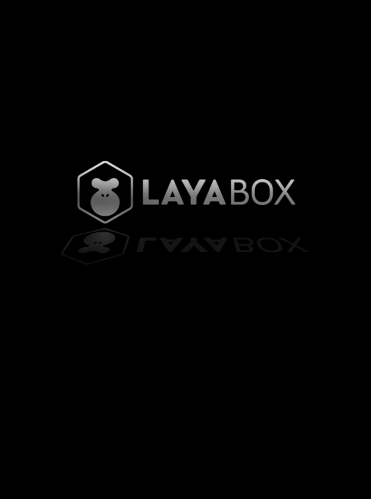

# Loading interface
In order to facilitate developers to customize LoadingView, LayaNative uses native functions to implement a new LoadingView.

When the application starts, it needs to load the necessary html, js, and images. At this time, the progress needs to be displayed through the loading interface. When LayaNative runs the project, there is a LoadingView interface by default. After a period of time, you can enter the game, such as Figure 1 shows:

​ <br/>

figure 1

## 1. Progress bar control

Developers can control the background color, font color, Tips, etc. of LoadingView in config.js.

The location of config.js:
```
Android: assets/scripts/config.js in the project directory
IOS: resources/scripts/config.js in the project directory
```

The content in config.js is as follows, developers can modify it according to their own needs:

```javascript
window.loadingView = new loadingView();
if(window.loadingView)
{
	window.loadingView.loadingAutoClose=true;//true means the engine controls the closing time. false for manual control by developers
	window.loadingView.bgColor("#FFFFFF");//Set the background color
	window.loadingView.setFontColor("#000000");//Set the font color
	window.loadingView.setTips(["The door to the new world is about to open", "The enemy has 30 seconds to arrive on the battlefield", "Mom said, I can't eat hot tofu in a hurry"]); //Set the tips array, which will appear randomly
}
```

## 2. Progress bar control example

In the actual development process, developers usually want to accurately control the hiding and display of LoadingView, then developers can set the value of loadingView.loadingAutoClose to false in config.js like this
Then in the project, according to the loading completion status, set the display progress of the progress bar, and call the function as follows:

```javascript
window.loadingView.loading(nPercent);//The parameter is an integer value from 0 to 100. When the value is 100, LoadingView automatically closes
```  

The specific steps are as follows:

**Step 1:** Set the value of `loadingView.loadingAutoClose` to `false` in `config.js`

```javascript
window.loadingView = new loadingView();
if(window.loadingView)
{
	window.loadingView.loadingAutoClose=false; //Set the value to false, and the developer manually controls the closing of the loading interface.
	...
}

```

**Step 2:** Call `loadingView.loading(nPercent)` to update the progress bar

The pseudocode is as follows:

```javascript
where nPercent=0;
var image1 = document.createElement('img');
image1.onload=function()
{
	if(window.loadingView){
    	nPercent+=33;
    	window.loadingView.loading(nPercent);
	}
}
image1.src = "a.png";

var image2 = document.createElement('img');
image2.onload=function()
{
	if(window.loadingView){
    	nPercent+=33;
    	window.loadingView.loading(nPercent);
	}
}
image2.src = "b.png";

var image3 = document.createElement('img');
image3.onload=function()
{
	if(window.loadingView){
    	nPercent+=33;
    	window.loadingView.loading(nPercent);
	}
}
image3.src = "c.png";
```

**Tips：**

When the value passed in by the `loadingView.loading(nPercent)` function is equal to 100, the loading interface will automatically close. You can also close the loading interface by calling `loadingView.hideLoadingView()`.

## 3. Remove all text display

You can remove the display of all text, including tips and loading percentage, modify config.js and set the value of `showTextInfo` to `false`. The code is as follows:

```javascript
window.loadingView = new loadingView();
if(window.loadingView)
{
	...
	window.loadingView.setTips(["The door to the new world is about to open", "The enemy has 30 seconds to arrive on the battlefield", "Mom said, I can't eat hot tofu in a hurry"]); //Set the tips array, which will appear randomly

	window.loadingView.showTextInfo=false; // Set value to false

}
```

## 4. Customized interface and functions
All code is public, so developers can modify the code as needed to implement any desired custom functionality.

## 5.Special instructions
For the splash screen, the Android version is developed using native Java, and the iOS version is developed using Object-C. The codes are all open source. If developers need to customize the interface, they can modify it themselves. If you don’t know how to write interfaces for Android and iOS, then learn it. Bar.

LayaBox will have a whitelist mechanism in the future. If the developer purchases the authorization, the LayaBox logo can be removed. If not, the LayaBox logo needs to be forcibly added. There will be a detection mechanism inside the engine. Random detection will occur. If the detection fails, it will Force Crash application.

LayaNative is not an open source engine, but it is free for developers to use. If you want to remove the LayaBox logo, you need to pay. Developers can contact LayaBox Business through LayaBox official account, official website, etc. to purchase.

