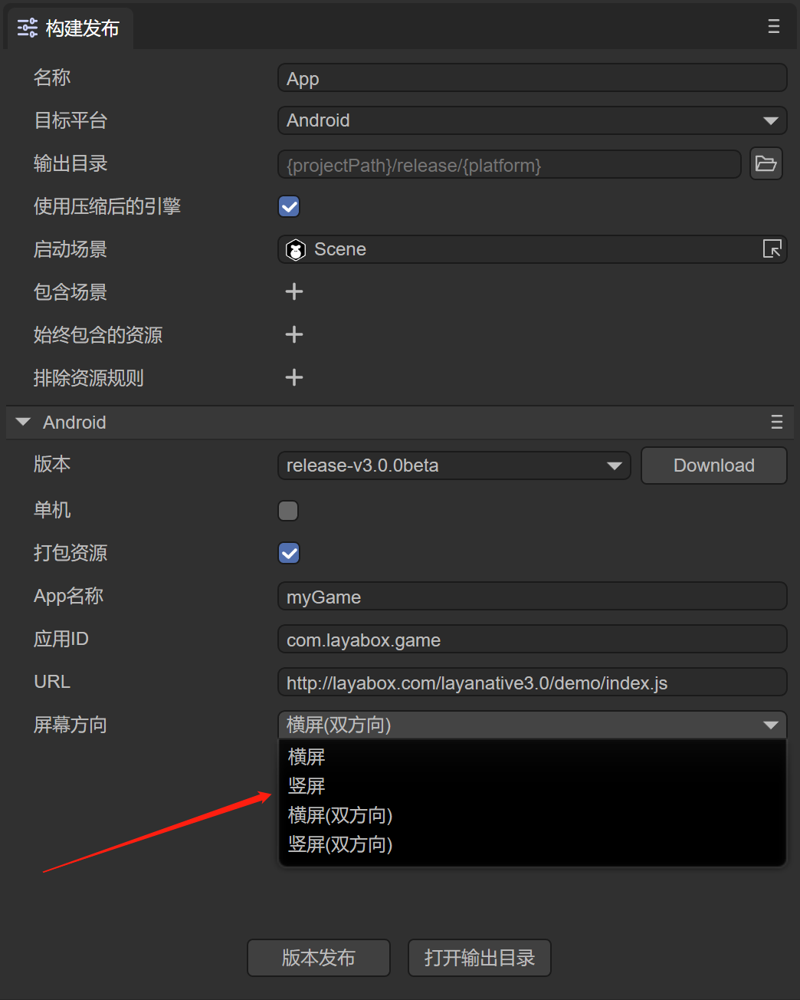
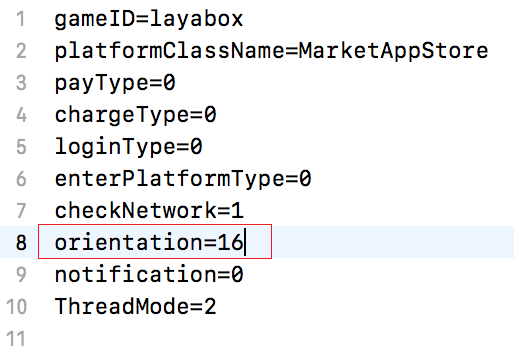
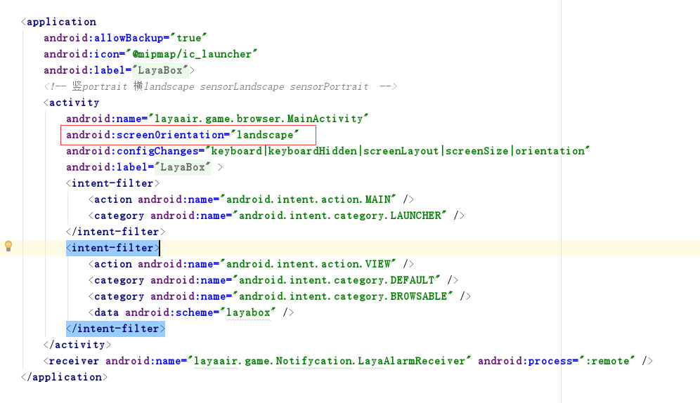

# Horizontal and vertical screen settings

This document further comprehensively introduces the horizontal and vertical screen settings of LayaNative.

## 1. Horizontal and vertical screen settings before project construction

If you want to set up horizontal and vertical screens, go to `Tools`--> `app build` in the menu bar of LayaAirIDE. In the open build project window, just configure the screen orientation. The configuration method is as shown in the figure below.



After setting the screen orientation, click Release and the screenOrientation attribute will be added to index.js:

```javascript
/**
 * Set the LayaNative screen orientation, you can set the following values
 * landscape       	Horizontal screen
 * portrait        	Vertical screen
 * sensor_landscape	Landscape (both directions)
 * sensor_portrait 	Portrait screen (both orientations)
 */
window.screenOrientation = "portrait"; // Set the screen to vertical screen
//-----Engine library starts-----
loadLib("libs/laya.core.js")
loadLib("libs/laya.ui.js")
loadLib("libs/laya.d3.js")
//-----End of engine library-------
loadLib("js/bundle.js");//project code js
```

## 2. Horizontal and vertical screen settings after project construction

### 2.1 iOS

After the iOS project is successfully built, open the resource/config.ini file and modify the value of `orientation=16`, as shown in the following figure:



The meaning of the parameters is as follows:
```
orientation=2 //Vertical screen: IOS home button is down
orientation=4 //Vertical screen: IOS home button is on top
orientation=8 //Horizontal screen: IOS home button is on the left
orientation=16 //Horizontal screen: IOS home button is on the right
```
The value of orientation can be set using bitwise OR, for example:
```   
Orientation=6 //Indicates that the vertical screen can be rotated arbitrarily
orientation=24 //Indicates that the horizontal screen can be rotated arbitrarily
```

**Note:** The horizontal and vertical screen settings in the iOS project are best consistent with the config.ini settings. Inconsistent settings may cause unknown situations to occur. The settings are as shown below:


### 2.2 Android

The android project is built successfully. Open the AndroidManifest.xml file. There is a screenOrientation parameter in the activity tag. Developers can modify it according to their own needs, as shown in the following figure:


The configurable parameters are Android standards and will not be explained too much here, as shown below:

```
"landscape","portrait","full_sensor","sensor_landscape","sensor_portrait","reverse_landscape","reverse_portrait"
```

## 3. Execution sequence

When the application starts, it will first read the screen orientation set in config.ini of iOS or the screen orientation set in AndroidManifest.xml of android. When index.js is parsed, the value of the horizontal and vertical screen settings is read and the screen orientation is reset.

For example: Android's AndroidManifest.xml is set to portrait, and the label in index.js is set to landscape. During operation, you will find that on the Android device, the screen will rotate from portrait to landscape.

**Tips: It is recommended that developers set the two values ​​​​consistently to avoid screen rotation during program execution. **

