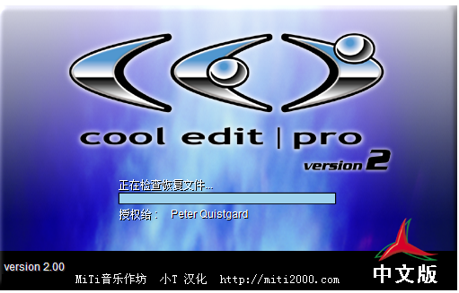
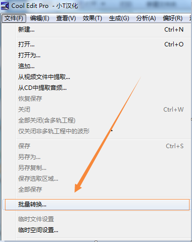
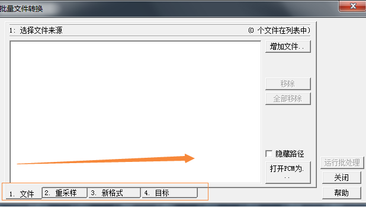
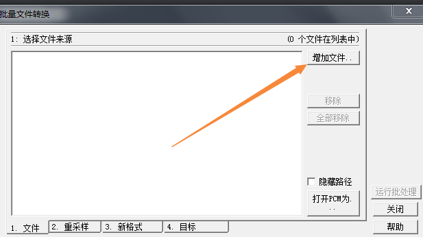
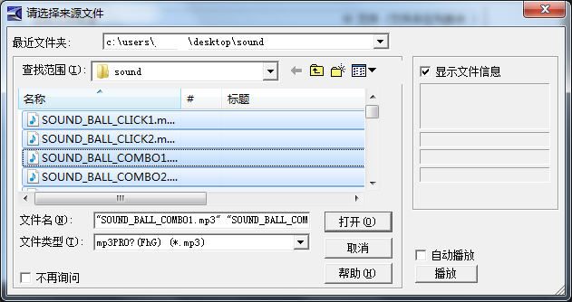
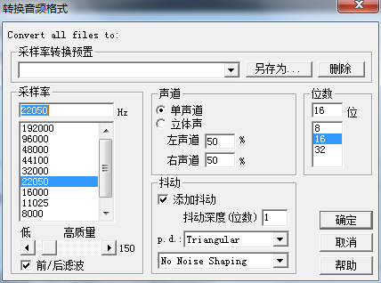
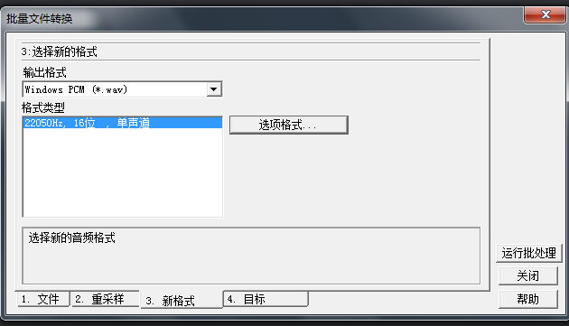
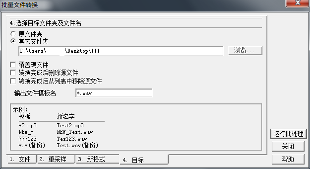
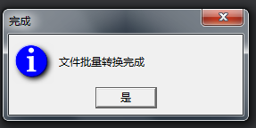
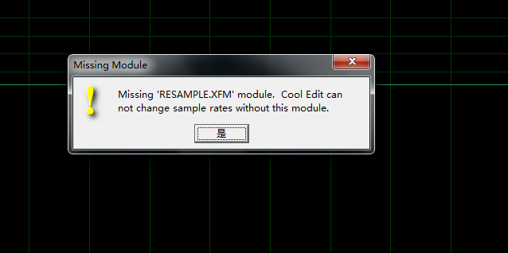

# About Sound

In LayaNative, sounds are divided into two modes: background music and sound effects.

## 1.Background music

Background music in LayaNative only supports mp3 format, and only one background music can be played at the same time.

## 2.Sound effects

In the project, sound effects are high-frequency events. In order to ensure operating efficiency, LayaNative uses openAL to play sound effects, because mp3 is a streaming media format and cannot be parsed currently.
**Tips：**  
**1. The sound effects in LayaNative only support wav and ogg formats. **
**2. Wav and ogg only support 8-bit and 16-bit, and do not yet support 32-bit. **

**Tips:** It is recommended to use 22050 sampling rate, 16bit, and mono for wav and ogg.

## 3. Prompt information

If you call `SoundManager.playSound()`, but the incoming file format is mp3, a prompt message will pop up as follows:
`The sound only supports wav or ogg format,for optimal performance reason,please refer to the official website document.`  
At this time, you need to convert mp3 to wav or ogg format.


## 4. Solve compatibility

If your project uses mp3 format for sound effects in the web version, but uses wav format in LayaNative. It is recommended that the project be loaded using a configuration file, so that it is only used where the configuration file is loaded, and is added once to determine whether it is a LayaNative operating environment. The pseudo code is as follows:

```javascript
if(window.conch)
{
	...load "soundConfig-LayaPlayer.json"
}
else
{
	...load "soundConfig-json"
}
SoundManager.playSound(soundJson[0].url,1);
....
SoundManager.playSound(soundJson[1].url,1);
```

**Tips**  
*1. Conch can only be called in the LayaNative environment. There is no definition of conch in the web version, so you need to check whether it exists. *
*2. If you use the as language to develop, you can obtain the conch object through `Browser.window['conch'] `. *
*3. Or you can use `if(Render.isConchApp)` to make a judgment. *

## 5. Use Cool Edit Pro tool to convert sound formats
Nowadays, there are many tools that can convert MP3 to wav. Here is a brief introduction to Cool Edit Pro tool. Here is a brief introduction to the specific steps of using this tool to convert mp3 to wav:
1. First download and install the Cool Edit Pro tool by yourself, and then open the Cool Edit Pro program;



2. Click "Batch Conversion" under "File" in the upper left corner to enter the "Batch Conversion" submenu.





**Note: It is recommended to follow steps 1, 2, 3, and 4 below for batch file conversion step by step**

3. Select the file source: click on the right to add files. Here we select all files under the sound file for batch processing, and then click Open;




4. Convert the sampling type: Click to change the target format in the resampling directory, select the sampling rate we need 22050Hz, mono, 16 bits here, and then click OK;


5. Select a new format: Select the Windows PCM (*.wav) we need as the output format, format type 22050Hz, 16-bit, mono;


8. Select the target folder and file name: Here you simply select the output directory, and then click "Run Batch Processing" to output the required files. When the "File Batch Conversion Completed" prompt appears, it means that you have successfully completed it. MP3 to wav batch conversion



9. If the following pop-up window appears when running the Cool Edit Pro tool for batch processing, just replace the Resample.xfm file and run Cool Edit Pro again.



**When this happens, you can search cool edit resample.xfm on Baidu, or buy genuine cool edit, or. . . (You know)**

**10. If the cool edit pro downloaded online does not have batch conversion, you can convert it first and then batch conversion will happen**


