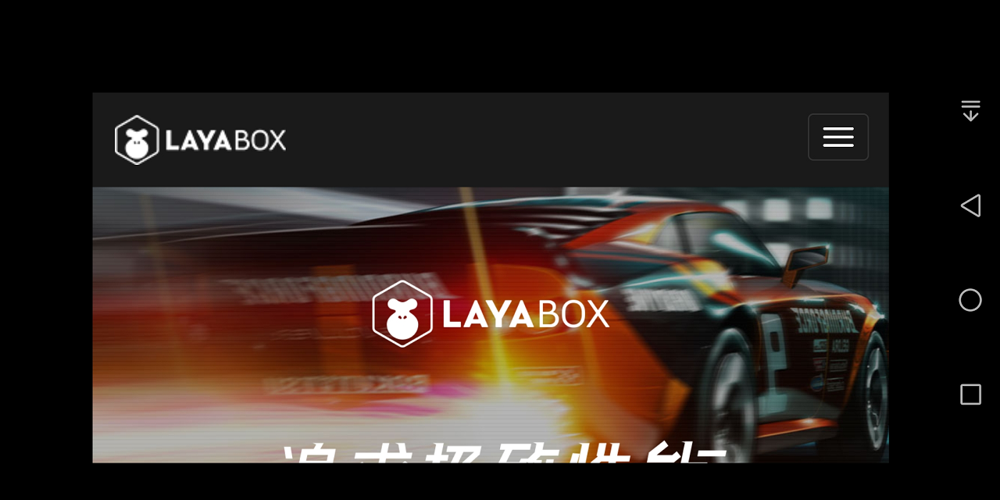

# webview

## 1. Introduction

Since LayaNative does not support standard html, sometimes the project needs to display a complete html page. This can be achieved through an interface provided by LayaNative that displays the webview interface.
### 1. Interface definition

```typescript
	/**
 	* Display a webview
 	* @param url {string} The url address to be displayed.
 	* @param posx {number} The upper left corner position of weview
 	* @param posy {number} The upper left corner position of welivew
 	* @param width {number} The width of the webview
 	* @param height {number} The height of the webview
 	* @param canclose {boolean} Whether the webview can be closed.
 	*/
	setExternalLinkEx(url:string,posx:number,posy:number,width:number,height:number,canclose:boolean):void;
```

This function will display a new view on the top layer of the canvas, where the content of the URL will be displayed.

The `canclose` parameter is used to control whether this webview can be closed:
* When set to `false`:

	code show as below:

	```typescript
	document.addEventListener('touchstart',()=>{
    	if(conch){
        	var l = 50;
        	where t = 50;
        	var w = window.innerWidth - l * 2;
        	var h = window.innerHeight - t * 2;
        	conch.setExternalLinkEx('http://www.layabox.com',l,t,w,h,false); // canclose is set to false
        	//conch.setExternalLink('http://www.baidu.com');
    	}
	});
	```

	After the webview is displayed, it cannot be closed. The effect is as follows:

	

	figure 1

* When set to `true`:

	code show as below:

	```typescript
	document.addEventListener('touchstart',()=>{
    	if(conch){
        	var l = 50;
        	where t = 50;
        	var w = window.innerWidth - l * 2;
        	var h = window.innerHeight - t * 2;
        	conch.setExternalLinkEx('http://www.layabox.com',l,t,w,h,true); // canclose is set to true
        	//conch.setExternalLink('http://www.baidu.com');
    	}
	});
	```

 Under iOS, there will be a small close button. Click this button to close the webview. The effect is as follows:


    
figure 2

 Because the close button will cover part of the page content, and the back key is provided on Android devices, there is no close button after the webview is displayed on the Android device. You can close the webview through the **back key**. As shown below:


    
image 3  

At this point you can click the back button to close the webview

### 2. Restrictions
1. Currently webview cannot interact with app.
2. The implementation of webview depends on the system, and lower versions of Android may not be able to display it.

**Tips**  
*1. Conch can only be called in the LayaNative environment. There is no definition of conch in the web version, so you need to check whether it exists.*


## 2. How to dynamically close the webview page in code

Call the following code to dynamically close the webview page:

```javascript
conch.closeExternalLink();
```

