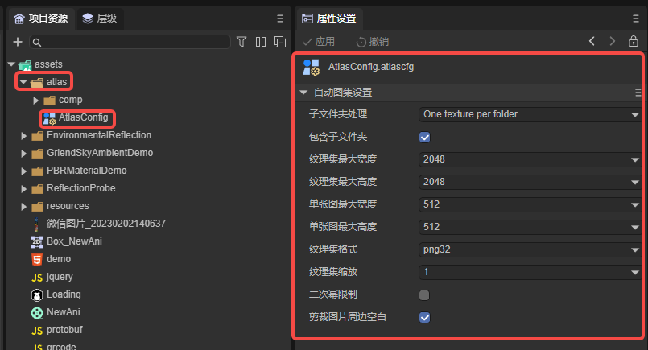
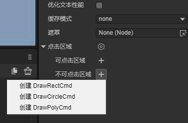

# 2.x engine project upgrade guide

> Author： Charley

The update of a major engine version will inevitably bring about some reconstruction and adjustments. Of course, many APIs will be continued and inherited.

For developers of older versions of the engine before 3.0, the advantage is that there are a large number of familiar APIs and engine styles, so they can quickly get started with the 3.0 engine. But faced with unknown differences, you may also step into pitfalls.

Therefore, the launch of this document has two main goals:

- Let developers who have used the old version of the engine become familiar with the differences of the old version of the engine, mainly which APIs have been changed and which ones have been abandoned.

  > If it is a new API in 3.0, it will not be mentioned here. You also need to check the 3.0 engine documentation for the corresponding function.

- A reference guide for developers who need to upgrade old engine projects to use them for project upgrades and adjustments.

## 1. 2D project resource adjustment

Due to major changes in the project structure created by the old version of the engine IDE, the 3.0 IDE cannot read the old version of the project. Therefore, we must understand the differences and make corresponding adjustments.

### 1.1 Adjustment of resource directory

#### 1.1.1 LayaAir2.x resource directory description

The resource directory of the old version of the engine consists of three directories, namely, `/laya/pages`, `/laya/assets`, and `/bin`.

> The directory paths in this article refer to the path relative to the project root directory

Scenes, prefabs, animations, and other page files are located under `/laya/pages`.

The resources (Assets) used in the page file, that is, image and audio resources, are located in `/laya/assets`.

As shown in Figure 1:


(figure 1)

If it is a resource that is not used by the IDE, such as dynamically loaded or 3D resources, put them directly in the `/bin` directory.

In addition, the bin directory is also the local web version preview running directory of the project.

Therefore, pages under `/laya/pages` will generate corresponding json to the `/bin` directory.

The resources under `/laya/assets` that comply with the atlas generation rules will be packaged into atlas resources and created in the `/bin/res/atlas` directory. Those that do not comply with the atlas rules will be directly copied to the `/bin` directory. .

Before calling up the browser to run, in addition to the above resource publishing process, the script under `/src` will also be compiled into bundle.js and generated into the `bin/js` directory.

#### 1.1.2 LayaAir3.0 resource directory description

In the 3.0 engine IDE, whether it is scene files, prefabs, picture resources, 3D resources, etc., all resources are under `/assets`, and developers can plan the directory structure by themselves.

**However, there are two issues that need to be noted:**

First, for the scenes in the `/assets` directory of the 3.0 engine project, when the project is released, you need to specify which scenes need to be used. Unspecified scenes will not be output to the release directory, and the included scenes (startup scenes Resources used in (included by default) will be automatically output to the release directory. In addition, only files and subdirectory files located under the resources directory will be automatically imported into the release directory. Therefore, the resources dynamically loaded in the code must be placed in the directory named resources**, whether it is the root directory under `/assets` or any subdirectory under `/assets`, as long as the directory Files named resources will be output to the release directory.

In order to facilitate management, we recommend that dynamically loaded resources not used in the scene be placed in the `/assets/resources` directory, as shown in Figure 2:


(figure 2)

Second, in order to speed up the preview running efficiency and achieve the purpose of real-time preview and debugging, when the local Web preview is running, the contents under `/assets` will not be copied to the `/bin` directory. `/ of the 3.0 engine project The bin` directory is only used as the entry point for running the local project Web preview. The resources under `/assets` are located in the project root directory whether during preview running or after publishing. Therefore, when using resources in assets in the code, the assets directory must be used as the root path of the relative path. **

The sample code is as follows:

```typescript
//Example of correct path usage
Laya.loader.load("resources/layaAir.png",Laya.Loader.IMAGE);
//Incorrect path usage example
Laya.loader.load("assets/resources/layaAir.png",Laya.Loader.IMAGE);
```

### 1.2 Adjustment of image resource types

There are only 2D resources in the 2.x IDE, so there is no resource type setting.

However, there are not only 2D resources in the 3.0 IDE, but also 3D resources. When resources with the same image suffix are imported into the IDE, they are recognized as ordinary sprite textures or baked map textures with baked lighting and shadow information.

There are import rules here.

In the old version of the engine, LayaAir's UI components all have prefix identifiers. As long as the image resources are named according to the identifier, they will be recognized as UI components by the IDE. The document is *[UI Component Detailed Explanation](../../IDE/ uiEditor/uiComponent/readme.md)*.

This rule is still continued in 3.0, so as long as it is named according to the UI component, the IDE will consider it as a picture for 2D UI, and identify it as a sprite texture (SpriteTexture) by default. Otherwise, it will identify it as a light map for 3D by default. (Lightmap) texture.

Therefore, for image resources in 2D projects, it is recommended to use UI component naming rules for resource file names, otherwise you need to manually change them to sprite textures.

In order to facilitate developers to modify the texture types of images in batches, the IDE can select multiple images to uniformly set the texture types of images. The operation is shown in Figure 3-1:


(Figure 3-1)

When the directory structure of the project is complex, you can also filter and display only image resources for the above settings. The filtering operation is shown in Figure 3-2:


(Figure 3-2)

> [!Tip]
>
> When the 2D picture displays abnormally, first check whether the texture type is not set or is set incorrectly.

### 1.3 Deprecated resource formats

#### 1.3.1 The old animation format file has been abandoned in the IDE, but the engine is still compatible

Because the timeline animation of LayaAir3.0 has been reconstructed (rich in functions and supports 3D animation). Therefore, the timeline animation (`.ani` suffix) and dynamic effects (`.efc` suffix) of the old version of the engine are abandoned. These two resources cannot be opened and edited within the IDE.

However, since compatibility is maintained within the engine, animation files of the old version of the engine can still be used dynamically through code.

New version of timeline animation usage document *[Animation Editing Module](../../IDE/animationEditor/readme.md)*

#### 1.3.2 The old prefab file has been obsolete

The LayaAir 3.0 engine has reconstructed the prefabs. The prefab files (`.prefab` suffix) of the 2.x engine have been abandoned. The prefabs of the old version need to be remade using the 3.0 IDE.

New version of prefab usage documentation: *[Prefab module](../../IDE/prefab/readme.md)*

## 2. Modification in IDE of 2D project

When copying the old version of resources to the assets directory of the 3.0 engine IDE and copying the code to the src directory, in addition to the discarded ones that need to be remade, some other adjustments need to be made in the IDE.

### 2.1 Incompatibility of 2D scenes

For scenes, the first is a conceptual change.

Since the old version of the engine only supports 2D editing, the scene (`.scene` suffix) only refers to the 2D scene.

But the scene of the 3.0 engine refers to the scene file (`.ls` suffix) that can include 2D scenes and 3D scenes.

#### 2.1.1 Delete scene nesting

Therefore, the scene nesting of the old version of the engine can no longer be supported by version 3.0.

If the scenes in the old project are edited in the 3.0 IDE, the nested scene nodes need to be deleted. Remade using prefabs.

#### 2.1.2 Delete page animation

Due to the reconstruction of timeline animation, if you directly edit and use the old version of animation in the scene page, you also need to delete the animation in the page in the old version of IDE first.

> Except for animations created using animation nodes, the new version still supports animation nodes.

#### 2.1.3 Adjustment of scene view type

Older versions of the IDE can directly set the view type (Scene, View, Dialog) for the scene.

The 2D root node Scene in the new version of the scene does not support setting the type. If you want to set it, you can do it by converting the type for the child node or the root node of the prefab.

> Among the conversion types, there are only relative layout scene view View and pop-up view Dialog.

Old version scene files that do not have the above incompatibility factors can be directly converted to the new version scene format for editing and maintenance.

### 2.2 Start scene settings

In the old version of the engine, you can freely specify the project entry in the entry class. In version 3.0 of the IDE, the concept of entry class no longer exists. Based on the component-based development model, the script must be executed based on the startup of the scenario.

Therefore, we need to set up the startup scene as the entry point in the IDE's build release, as shown in Figure 4.


(Figure 4)

### 2.3 Initial configuration of the project

The initial configuration of the old version of the engine is configured using the engine API before the init of the code.

However, due to the disappearance of the 3.0 entry class, if there is an engine initialization configuration before init, you need to change it to the `Engine Options` of the IDE's `Project Settings' to configure it. The effect is shown in Figure 5:


(Figure 5)

### 2.4 Album settings

The atlas of the old version of the engine IDE is set globally. Since the atlas is only for 2D requirements, the atlas of the 3.0 engine IDE is no longer a global setting. Developers need to select the right-click menu of the resource directory to manually add the atlas configuration. There is an atlas configuration. The directory will be published as an atlas by the IDE only when it is published by the IDE.

The automatic atlas setting is shown in Figure 6:



(Figure 6)

### 2.5 Modify obsolete functions

Since 3.0 is not fully compatible with 2.x, obsolete functions need to be modified and replaced one by one in the new version of the IDE.

#### 2.5.1 Deprecated attributes of elf nodes

The renderType attribute on the sprite node of the old engine has been deprecated.

The value redner of renderType is used for the rendering unit of the list component. The 3.0 engine uses the first child node of the list as the rendering unit by default. There is no need to set other settings, which will be easier to use.

The value mask of renderType is used to set the mask. The 3.0 engine directly adds a new mask (Mask) attribute setting, which is more clear and easy to use.

#### 2.5.2 Abandon drawing graphics on UI components

The old version of the engine supports setting special-shaped click areas for the UI by drawing graphics.

3.0 separates the function of drawing graphics from the function of clicking area drawing.

UI components no longer support the function of drawing graphics. If you need to draw graphics, you need to draw them on the sprite node.

The operation is shown in Figure 7-1:


(Figure 7-1)

If you need to draw a click area in a UI component, create the click area directly on the properties panel (supports rectangle, circle, polygon),

The operation is shown in Figure 7-2:



(Figure 7-2)

## 2. Instructions on dynamically loading resources in the IDE

No matter what resource is loaded, whatever the file name is in the editor, fill in the path. No need to put it in the bin directory, put it directly in the assets directory, with assets as the root path.

For example:

1. After dragging in FBX or GLTF, use load("xxx.FBX", Laya.Loader.HIERARCHY)

Load fbx or gltf in the editor. No need to manually create lh yourself. The editor automatically uses the converted results.

2. To load the blueprint shader, use load("xxxx.lbp") instead of "xxx.shader".

####

2. 2D projects

## 2. Modification of general engine modules

### 1.2 Adjustment of resource loading

2.x engine resource loading,

### 1.1 Load a resource

Example:

```TypeScript
var url = "xxx.png";
var type = Laya.Loader.IMAGE;
Laya.loader.load(url).then((res)=> {
	//Without type, used for regular resources
});

Laya.loader.load(url, type).then((res)=> {
	//With type, used to distinguish resources with different functions of the same suffix.
	//For example, the picture xxx.png is defined as TextureCube, use load("xxx.png", Laya.Loader.TEXTURECUBE). What you get is a TextureCube.
});
```

### 1.2 Load multiple resources (use array)

```TypeScript
var url1 = "xxx.png";
var url2 = "xxxxx.png";
var type1 = Laya.Loader.IMAGE;
var type2 = Laya.Loader.TEXTURE2D;
Laya.loader.load([url1, url2]).then((res:Array<any>)=> {
	//Load multiple, without type
});                 	 
Laya.loader.load([url1, url2], type).then((res:Array<any>)=> {
  //Load multiple and set the type uniformly
});                       	 
Laya.loader.load([{ url:url1, type: type1 }, { url:url2, type: type2 }]).then((res:Array<any>)=> {
    //Load multiple and set types separately
});
```

### 1.3 Load multiple files (combination)

```TypeScript
let tasks:Array<Promise<any>> = [];
tasks.push(Laya.loader.load(url));
tasks.push(Laya.loader.load(url2));

Promise.all(tasks).then((res:Array<any>)=> {
	//for asynchronous loading
});
```

#### 1.4 Problems with Texture and Texture2D

The same resource address, whether loading Texture or Texture2D, has only one copy in the memory, but different types can be obtained.

```TypeScript
Laya.loader.load("1.png").then((res)=> { /* res是Texture */ });
Laya.loader.load("1.png", Loader.Texture2D).then((res)=> { /* res是Texture2D */ });

Laya.loader.getRes("1.png"); //res是Texture
Laya.loader.getRes("1.png", Loader.Texture2D); //res是Texture2D
Laya.Loader.getTexture2D("1.png"); //res是Texture2D
```

### 1.5 Load HTMLImage

```TypeScript
Laya.loader.fetch("1.png", Laya.Loader.IMAGE).then((res)=> { /* res是HTMLImage */ });
```

> [!Type|label:Tips]
>
> Cannot use Loader.getRes to obtain fetch results because the fetch method does not cache

### 1.6 Using Options

```TypeScript
Laya.loader.load(url, { group:xx, priority:1 }); //priority is not limited to 0-5. It is any integer. The larger the number, the higher the priority.
```

### 1.7 Prefab/scene issues

Loading these three files `lh/ls/gltf` will download and load all dependent resources.

But the node will not be created automatically. The cache is not a node either.

```TypeScript
Laya.loader.load("1.lh").then(res=> {
	/* Note that res is not a node type! You don't need to care about the type, you just need to know that it has a create method to instantiate the node tree. */
    	let node = res.create();
   });
   
   let node1 = Laya.loader.getRes("1.lh").createNodes();
   let node2 = Laya.Loader.createNodes("1.lh"); //The function is the same as above, but the writing method is shorter
```

### 1.8 Compatibility issues between load and create in old versions of engines

Engines before 3.0 had two methods: Laya.loader.load() and Laya.loader.create(), which were used to load 2D and 3D resources respectively.

The 3.0 engine version can use the load() method uniformly.

For resources such as lh/ls/gltf, the create method of the old version is equivalent to the load+createNodes of the 3.0 engine.

For other resources, there is no difference between the create method and the load method. The create method of the old engine has been canceled in the 3.0 engine. Improper use of this method will cause memory leaks, so a compilation error needs to be reported to force developers to modify it.

### 1.9 Extend Loader capabilities

The original parseMap and createMap have been cancelled.

Write a class to implement the IResourceLoader interface, for example the simplest implementation:

```TypeScript
class MyLoader {
	load(task:ILoadTask) {
    	return task.loader.fetch(task.url, "json", task.createCallback()).then(data=> {
        	let obj = /*parse data*/;
        	return obj;
    	});
	}
}
```

There is no need to consider whether to load individually or batch load one of the links in the loading class, because task.createCallback can normalize the overall progress to 0~1.

For complex examples, please refer to TextureLoader/MaterialLoader/MeshLoader in the engine.

Then use Loader.registerLoader to register this class. For example

```TypeScript
Loader.registerLoader(["xyz"], YourLoader);
```


## 2. Instructions on dynamically loading resources in the IDE

No matter what resource is loaded, whatever the file name is in the editor, fill in the path. No need to put it in the bin directory, put it directly in the assets directory, with assets as the root path.

For example:

1. After dragging in FBX or GLTF, use load("xxx.FBX", Laya.Loader.HIERARCHY)

Load fbx or gltf in the editor. No need to manually create lh yourself. The editor automatically uses the converted results.

2. To load the blueprint shader, use load("xxxx.lbp") instead of "xxx.shader".


## 3. LayaAir3.0 input processing module modification

The original MouseManager and KeyboardManager were merged into InputManager. MouseManager was rarely used directly in games before, so it has little impact. KeyboardManager originally had only one interface, hasKeyDown, but now it can be changed to call InputManager.hasKeyDown.

Features of the new input processing system are:

### 3.1 2D and 3D unified interface,

Input can be processed through event listening and Laya.Script named functions. For example:

```typescript
this.aNode.on(Laya.Event.CLICK, ()=> {
console.log("clicked");
});

class MyScript extends Laya.Script {
	//Script incident
	onMouseClick(e:Event) {
    	console.log("clicked");
	}
}
aNode.addComponent(MyScript);
```

The above two methods are equivalent and can be used normally in both pure 2D or 2D/3D hybrid situations.


### 3.2 2D can correctly block 3D

During input processing, 2D can correctly block 3D.

### 3.3 Added MOUSE_DRAG and MOUSE_DRAG_END

Two new events have been added: MOUSE_DRAG and MOUSE_DRAG_END.

When the mouse is pressed and moved on an object (whether it is above the object or not), MOUSE_DRAG will continue to be dispatched to the object.

Dispatches MOUSE_DRAG_END to this object when the mouse is released (whether over it or not).

### 3.4 Removed RIGHT_MOUSE_DOWN and RIGHT_MOUSE_UP

 RIGHT_MOUSE_DOWN and RIGHT_MOUSE_UP were deleted and MOUSE_DOWN and MOUSE_UP were dispatched instead. The left, middle and right mouse buttons can be distinguished through Event.button.

### 3.5 Event Summary

The relevant input processing functions in Laya.Script are:

```undefined
/**
 	* Executed when mouse is pressed
 	*/
	onMouseDown?(evt: Event): void;

	/**
 	* Executed when the mouse is raised
 	*/
	onMouseUp?(evt: Event): void;

	/**
 	* Executed when the mouse moves on the node
 	*/
	onMouseMove?(evt: Event): void;

	/**
 	* Executed when the mouse enters the node
 	*/
	onMouseOver?(evt: Event): void;

	/**
 	* Executed when the mouse leaves the node
 	*/
	onMouseOut?(evt: Event): void;

	/**
 	* After the mouse is pressed on an object, it is executed when dragging
 	*/
	onMouseDrag?(evt: Event): void;

	/**
 	* Press and hold an object with the mouse, drag it a certain distance, and execute after releasing the mouse button.
 	*/
	onMouseDragEnd?(evt: Event): void;

	/**
 	* Executed when mouse clicks
 	*/
	onMouseClick?(evt: Event): void;

	/**
 	* Executed when double-clicking the mouse
 	*/
	onMouseDoubleClick?(evt: Event): void;

	/**
 	* Executed when right-clicking the mouse
 	*/
	onMouseRightClick?(evt: Event): void;

	/**
 	* Executed when the keyboard is pressed
 	*/
	onKeyDown?(evt: Event): void;

	/**
 	* Executed when the keyboard generates a character
 	*/
	onKeyPress?(evt: Event): void;

	/**
 	* Executed when the keyboard is raised
 	*/
	onKeyUp?(evt: Event): void;
```

Compared with the old version, there are the following changes

1) onClick name changed to onMouseClick

2) onDoubleClick name changed to onMouseDoubleClick

3) Removed onStageMouseDown, onStageMouseUp, onStageClick, onStageMouseMove

4) Removed onMouseEnter, which is duplicated with onMouseOver.


## 4. LayaAir3.0 component system modification

4.1 There are three component base classes in the component system of LayaAir2, Component, Script and Script3D.

1. LayaAir3.0 merges Scirpt and Script3D, that is, only Script can be used. Script3D can still be used, but it is just an alias for Script. Script can be mounted to 2D objects or 3D objects.

4.2 In LayaAir2, the difference between Component and Script is that Component mainly writes logic through inheritance, while Script is a relatively pure component mechanism.

1. In LayaAir3.0, Component has a complete life cycle, that is, onAwake, onStart, onEnable, onUpdate, onLateUpdate, onDisable, onDestroy, and underscore functions such as _onEnable, _onDisable are no longer used. _onEnable, _onDisable and other offline functions are still for internal use

2. Compared with Component, Script adds interactive behaviors, namely onTriggerEnter, onCollisionEnter, onMouseClick, onKeyDown and other callbacks related to input and output. Apart from this, there is no essential difference between Script and Component. Developers generally use Script.

4.3 Whether the Update/LateUpdate method of Component or Script runs in the IDE editing mode is determined by their runInEditor attribute. Developers generally implement this by attaching the @runInEditor decoration to the Script. Not running by default.

Regarding the use of modifiers, refer to the following example:

```typescript
const { regClass, property } = Laya;
//With @regClass(), it will be recognized as a script script class
@regClass()
export class Script extends Laya.Script {
	//Only if there is @property() on the property will it be recognized as an exposeable property in the IDE. As long as each property needs to be exposed, @property() needs to be added to it.
	@property()
	public text: string = "";

	constructor() {
    	super();
	}
}
```


## 5. Differences in the use of Runtime

The 3.0 scenario is completely different from the 2.0 concept.

The runtime of 3.0 can only be set on the 2D root node Scene2D on the scene or the root node of the prefab. Other child nodes no longer support runtime. If there is a need for code, a script must be used to implement it.

The UI of 3.0 does not have the var attribute. Name and var are merged. By default, only name is required. If you need to access the runtime through this.xxx on the scene inheritance class, check the Declare Var after name to export the attribute to the scene. in the base class.

3.0 no longer generates scene classes uniformly into one file, but generates them into the same-level directory of the Runtime class. When a scene class is specified for the runtime, the same-level directory of the scene class will automatically generate a file with the same name but the suffix Different base classes. The suffix name of the scene class base class is xxx.generated.ts

If the developer does not want to see the .generated.ts file, he can add the .generated.ts suffix to the vscode configuration file to block the generated base class.


## 1.4 LayaAir2.x 2D project upgrade steps

After understanding the above differences, you can start to manually remake the resources, pages, and codes in the old engine project to the new one.

##### (1) Copy resources to the Assets directory

First, we first copy the pages in the `/laya/pages` directory and the resources in the `/laya/assets` directory directly to the Assets directory.

**1. Initialization method of Config parameters when upgrading from 2.0 to 3.0: **

How to write 2.0:

Config.preserveDrawingBuffer =true;

Laya.init(Browser.clientWidth, Browser.clientHeight);

How to write 3.0:

Laya.LayaEnv.beforeInit = function(config: Laya.IStageConfig) {

​	//This method will be called before Laya.init

​	console.log("before init");

​	//Here you can make customized modifications to config, Laya.Config, and Laya.Config3D.

​	Laya.Config.preserveDrawingBuffer =true;    

}


**2, Laya.stage.drawToTexture method revised**

How to write 2.0:

var text:Texture = Laya.stage.drawToTexture(Browser.clientWidth,Browser.clientHeight,0,0) as Texture;

How to write 3.0:

var ddrt = new RenderTexture2D(Browser.clientWidth*Browser.pixelRatio, Browser.clientHeight*Browser.pixelRatio, RenderTargetFormat.R8G8B8A8, RenderTargetFormat.None);

Laya.stage.drawToTexture(Browser.clientWidth*Browser.pixelRatio, Browser.clientHeight*Browser.pixelRatio, 0, 0, ddrt, true);

var text:Texture = new Texture(ddrt);

