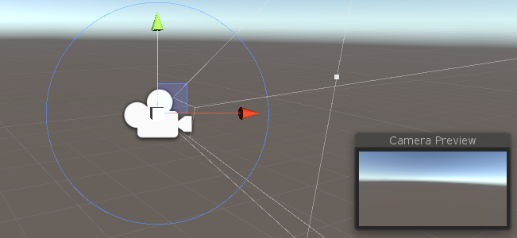
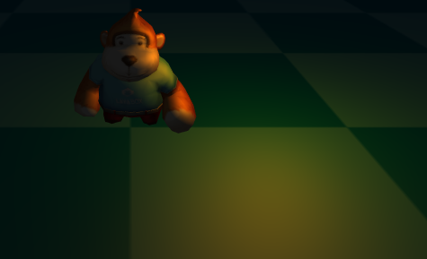
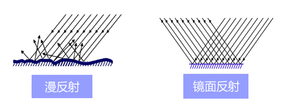
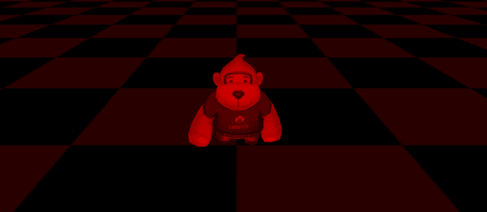

# Introduction to 3D Concepts

> Author ：charley

The biggest obstacle to learning is the unknown. For example, if you can't recognize the eighteen weapons in front of you, how can you fight on the battlefield? What's more, 3D game development is a job with high threshold. This article puts aside the structure of the engine and is based on the logic of understanding the 3D game world for the first time, so that developers without 3D foundation can have an overview of the basic functions of the LayaAir 3D engine and the basic concepts of 3D through this article.

At least, we need to understand the basics of the 3D world, and then learn and master them one by one based on the official documents.

## 1. Scene and camera

### 1.1 Camera

The scene is the 3D world in the game. Only with the scene can you add all objects to the scene, including cameras.

The camera is equivalent to the eyes of the 3D game world. Through the camera, players can see the three-dimensional world in the game and see various objects in the scene.

Therefore, there must be at least one camera in the scene.

(Picture 1-1)

When we write the code for a 3D game, we must first add a 3D scene to the stage and a 3D camera. Then write other code.

The camera can be the only one in the 3D scene, or multiple cameras can be placed. For example, it is used in the pop-up window dressing panel that appears in the 3D scene in Figure 1-2, or in the same-screen requirements of some battle games. Multiple cameras.

(Figure 1-2)

### 1.2 Perspective projection and orthogonal projection

The camera's imaging effects are divided into two types: perspective and orthogonal. The 3D camera of the LayaAir engine is in perspective mode by default, which is a visual effect that simulates the human eye, as shown in Figure 1-3, near is large and far is small.

(Figure 1-3)

Orthogonal has no sense of perspective and is often used in some 2D and 3D mixed games or model viewers.

(Figure 1-4)

## 2. Coordinate system and coordinates

Coordinates are one of the foundations of the 3D space world. You cannot do anything without coordinates, move the camera, position, draw graphics, etc.

When learning LayaAir 3D, we need to understand two coordinates, one is the position coordinate and the other is the UV coordinate.

Before understanding these two coordinates, we first introduce the spatial Cartesian rectangular coordinate system.

### 2.1 Coordinate system

The spatial Cartesian rectangular coordinate system is formed by the intersection of three mutually perpendicular coordinate axes xyz passing through the same origin.

(Figure 2-1)

When the positive directions of the two axes of the coordinate system are the same, the positive direction of the third axis is opposite, so the coordinate system is divided into a left-handed coordinate system and a right-handed coordinate system.

These two coordinate systems are not good or bad, and they are both widely used. For example, engines such as Unity use a left-handed coordinate system, and engines such as LayaAir use a right-handed coordinate system. So it is necessary for us to understand what the left-handed coordinate system and the right-handed coordinate system are, and the difference between the two.

The reason why the two 3D coordinate systems are named after the left and right hands is to facilitate memory. The directions of the three fingers of the left and right hands are used to represent the positive directions of the three coordinate axes. These three fingers are the thumb, index finger, and middle finger respectively.

Whether it is the left hand or the right hand, we must remember that the direction of the thumb is the positive direction of the x-axis, the direction of the index finger is the positive direction of the y-axis, and the direction of the middle finger is the positive direction of the z-axis.

Now we face the screen and have our hands ready to pose. First point the index fingers (y-axis) of the left and right hands toward the sky (pointing to the ceiling in the room), and then point the middle fingers (z-axis) forward (the direction where the eyes are looking straight when standing upright). At this time, the middle fingers of the two hands They should all be 90 degrees perpendicular to the index finger. Then, extend your thumb (x-axis) and keep it 90 degrees perpendicular to both your index and middle fingers. You can refer to the gestures in Figure 2-2.

(Figure 2-2)

> There are different explanations and introductions of left- and right-hand coordinate systems on the Internet. If the picture and axis orientation are different from those introduced in this article, it is generally due to the difference in camera angle. Don’t worry about anything else. When learning LayaAir, this article shall prevail to understand and remember. That’s it.

After arranging it, we will find that while keeping the positive directions of the z-axis and y-axis in the same direction, the positive direction of the x-axis is opposite. This is the difference between the left-handed coordinate system and the right-handed coordinate system.

The LayaAir engine unity export plug-in automatically adapts to the LayaAir engine by inverting the x-axis. Therefore, if you edit and export directly in Unity and then use it in the LayaAir engine, you do not need to manually convert the coordinates. If developers must manually adjust coordinates in the LayaAir engine project, they need to pay attention to the difference between the left-hand coordinate system and the right-hand coordinate system in the positive x-axis direction.

### 2.2 Vertex coordinates and UV coordinates

After understanding the coordinate system, let’s learn about the vertices. A vertex can be understood as any position point with xyz coordinates in 3D space, but a vertex not only contains coordinate position information, but also UV, normal, color and other information. Let’s not talk about anything else first, let’s continue to understand UV.

UV is actually a coordinate. To be complete, it should be UVW (because xyz has been occupied by the vertex coordinate axis, so choose three letters to represent it). These three axes U are the horizontal direction of the screen, V is the vertical direction of the screen, and the direction of W is Perpendicular to the surface of the monitor, so far, it is not used in general game development, so we usually call it UV for short.

If W is removed, as shown in Figure 2-3, the UV coordinate is a 2D plane coordinate. The UV coordinate can be used for model texture mapping, etc. (I will mention it later when I introduce textures).

(Figure 2-3)

The UV coordinate map texture's right and downward directions are the positive directions of U and V coordinates respectively. The value range is 0-1, regardless of the pixels of the texture image. As shown in Figure 2-4, the model vertex data exported by the 3D art production software will correspond to the UV coordinates of the texture to ensure correct sampling during rendering.

(Figure 2-4)

Relative to UV coordinates, which will eventually correspond to pixels on the texture, vertex coordinates do not have a constant unit of measurement. The smallest unit is a point. Whether it is the real world or the 3D world, a point is a basic abstract concept, and it represents a A single individual can be infinitely large or infinitely small. Therefore, a point can be a pixel, or a basic unit of any unit such as 1 millimeter, 1 nanometer, 1 kilometer, etc. The measurement unit used between the final vertices is usually set by 3D art combined with game design. The unit used more often by 3D game art is meters. Therefore, the program settings must be consistent with the units set by the art. Otherwise, the visual effect will be too large or too small, resulting in effects that are inconsistent with the design.

## 3. Triangle, Grid, model

Models are the basis of visible objects in 3D games, such as characters, houses, trees, mountains, rivers, etc. Almost most visible objects are based on models.

### 3.1 Triangular surface

To further understand the model, we first start with the triangular plane (referred to as the triangular plane). The triangular plane is composed of three vertices and is the only basic polygon that the graphics card can handle. One of the important reasons why triangles are regarded as the most basic polygons is that triangles composed of three points must be on the same plane, while polygons composed of four or more points are not in three-dimensional space. It must be on the same plane.

### 3.2 Grid

Mesh is formed by splicing one triangular surface or multiple triangular surfaces and is the basis for constructing the shape of the model. In the LayaAir engine, the triangular surface vertex data and the triangular surface index data collection that constitute various graphic shapes are grids, so the grid is invisible when the game is running. Figure 3-1 uses pixel line sprites to represent the model. grid composition.

(Figure 3-1)

### 3.3 Model

The model is composed of mesh (Mesh) and material (Material). There is too much material content, and I will explain it in the next section. From the perspective of forming a three-dimensional graphic shape, we can clarify the following relationships. The basis of the model is the grid, and the basis of the grid is the triangular surface. The more triangles there are, the richer the details that the model can express. Figure 3-2 shows the difference in model detail performance between 40,000 faces, 4,000 faces, and 400 faces. Those with richer details are usually called fine models, while those with relatively weak details are called simple models.

(Figure 3-2)

Whether to use a precise model or a simple model requires R&D technology to put forward demands on the art based on the overall effect and the pressure that the game hardware performance can withstand. At this point, mobile H5 and mini-games can maintain the same standards as mobile game APP standards.

## 4. Material

As mentioned before, the grid is only three-dimensional shape data, and the grid shape itself is invisible. How can it be seen, then a material is needed.

As the name suggests, material is the texture of the material. For example, wood and metal, glass and hair, different material textures will be significantly different in terms of roughness, gloss, reflection, transparency, color, texture, etc.

Based on the differences between these objects, we can divide materials into many types. The materials supported by the LayaAir engine are classified into model materials, sky materials, particle materials, and trailing materials.

### 4.1 Model material

The model materials of the LayaAir engine can be further divided into lighting materials (BlinnPhongMaterial), unlit materials (UnlitMaterial), and PBR materials (PBRMaterial).

The BlinnPhong material is the standard photosensitive material used by default, while the UnlitMaterial material is just the opposite. It is not affected by light and only displays the appearance image effect of the original texture.

In Figure 4-1, the left side of the picture shows the effect of the lighting material (BlinnPhongMaterial) after being illuminated by light, and the right side of the picture shows the effect of the unlit material (UnlitMaterial) after it is also illuminated by light.

(Pic 4-1)

PBR material is a material based on Physical Rendering (Physically Based Rendering). By simulating the physical laws of nature, it can make the texture of 3D models more realistic and approach or restore the texture of the real world. For example, the barrel in Figure 4-2 is made of PBR material.

(Figure 4-2)

Based on the concept of a model composed of meshes and materials, theoretically all visible objects of shape are models. However, based on the ease of development, the engine will further encapsulate some common functions, such as the sky, particle system, and tailing system introduced below.

### 4.2 Sky material

The 3D sky simulated by LayaAir provides two ready-made meshes, one is a cube mesh (SkyBox). This kind of sky is called a sky box and uses the cube mapping method. The other is the spherical mesh (SkyDome), which can be called a sky sphere or a spherical sky and uses the sphere mapping method. Of course, developers can also customize other sky grids to create skies.

The sky created by the spherical mesh (SkyDome) can show more realistic sky effects, such as curved clouds and a more realistic horizon. Compared with the cubic mesh (SkyBox), this technical solution has more vertices and naturally consumes more performance. Developers need to create the sky based on their needs.

After creating the sky, LayaAir also provides three ready-made sky materials: skybox material (SkyBoxMaterial), panoramic sky material (SkyPanoramicMaterial), and procedural sky material (SkyProceduralMaterial).

**SkyBoxMaterial** is formed from 6 seamlessly connected material texture maps, which is similar to a box being opened and tiled. For example, the texture shown in Figure 4-3,

(Figure 4-3)

**Panorama Sky Material (SkyPanoramicMaterial)** is a technical solution with only one map texture, such as the texture shown in Figure 4-4.

(Figure 4-4)

**Procedural Sky Material (SkyProceduralMaterial)** does not require a texture, as shown in Figure 4-5, just set the sun type and other parameters. However, only the sky created by the spherical mesh (SkyDome) can use the procedural sky material, because the vertex shading used by this material requires more detailed vertex information.

(Figure 4-5)

### 4.3 Particles

Particles are a collection of dispersed tiny objects. By making these tiny objects move according to a certain algorithm, more flexible effects such as flames, smoke, explosions, and flowing water can be achieved. The particle system is not a form of drawing, but an animation method. The role of the particle system is to control particles during their life cycle of generation, movement, change, and disappearance. The particle system of the LayaAir engine includes multiple parts such as particle emitters, particle animators, and particle renderers.

(Figure 4-6)

### 4.4 Trailing

Trailing, as the name suggests, is the effect of trailing behind a tail. It is often used for strip-shaped 3D special effects, such as knife-light trailing, action trajectory trailing in parkour ball games, etc. The LayaAir engine has a built-in trailing system and trailing material to facilitate developers to quickly use 3D trailing.

(Figure 4-7)

## 5. Texture, map, patch

**Texture** refers to the appearance effect of the surface of an object, which is expressed in the form of a 2D bitmap. Figure 5-1 shows the texture of the 3D globe surface.

(Figure 5-1)

**Mapping** A simple and popular understanding is the process of pasting 2D textures to 3D model meshes. This process of mapping the 3D vertex coordinates to the UV coordinates of the 2D texture is completed by the engine. The developer can directly call the API and set the corresponding texture for the material. The left side of Figure 5-2 shows the effect of only adding materials without setting textures. The right side of Figure 5-2 is the mapped effect of adding texture to the material.

(Figure 5-2)

It can be seen from the rendering 5-2 that although the mesh and material can already make the model visible in the 3D game scene, without material mapping and texture, all you see is a solid color model with different textures. Texture gives you a real, rich look. Therefore, texture is also a relatively important knowledge point. If we expand the discussion, texture can introduce a lot. This article will not go into details.

At this point in the introduction, we have a preliminary understanding of the difference between textures and maps. However, many times, when documenting or oral communication, many people will refer to the textures used for mapping, also referred to as textures. So we should be able to understand that textures refer to textures in some application scenarios.

The reason why **patch** is introduced together with texture is because many people have a misunderstanding when they have little knowledge of 3D, thinking that a patch is just a 2D texture bitmap placed in 3D space. In fact, in three-dimensional space, even if there is only one triangular plane, a grid can be formed and materials can be set. Then this is a model. So patches are essentially the same as other polyhedral models. As shown in Figure 5-3, the grass image seen in the 3D space is actually the texture of the grass patch material.

(Figure 5-3)

## 6. Lights, shadows, reflected light

Light sources are an indispensable and important part of 3D scenes. Grids and textures determine the shape and appearance of objects. Light sources can illuminate, produce shadows, and can also affect the scene environment and the color, brightness, atmosphere, etc. of the 3D model.

### 6.1 Lighting

The light source in 3D is light. Others such as floodlight and ambient light are light effects rather than light sources. There are four types of 3D lights: DirectionLight, PointLight, SpotLight, and AreaLight. The LayaAir engine not only supports any type of these light sources, but also supports the addition of multiple different types of light sources in the same scene.

**Direction Light** is a light that simulates natural sunlight. The light from the light source is always parallel and has no attenuation. The direction of the light source can be set in LayaAir to illuminate the entire scene.

(Figure 6-1)

**PointLight** is a light source that is centered on the light source point and emits in all directions. The light source point is located at a certain position in the 3D space. Similar to the way candle light, bonfires, household lights, etc. emit light in reality, this light has an irradiation range and an attenuation radius. Places outside the light range are in lightless darkness.

(Figure 6-2)

**SpotLight** is similar to point light. It is a positional light. It is also located at a certain position in the 3D space. It also has an irradiation range and attenuation radius. However, unlike the directionless point light that radiates around, spot light It has a light source direction and is a light source with a tapered angle, similar to the light source effects such as flashlight holes and stage spotlights in reality.

(Figure 6-3)

**AreaLight** An area light can be defined by one of two shapes in space: a rectangle or a disk. An area light emits light from one side of the shape. The emitted light spreads evenly in all directions over the surface area of ​​the shape. Because this lighting calculation is very processor intensive, area lights are baked into lightmaps.

### 6.2 Shadow

Shadows are generated when light illuminates the model. Real-time shadows change with changes in light angle, light intensity, model position, etc. It can produce a stronger sense of three-dimensionality and reality.

(Figure 6-4)

### 6.3 Reflected light

Reflected light refers to the light effect produced by the reflection of the light source when it shines on the 3D model. In order to simulate the natural reflection phenomenon, the engine uses different lighting models for reflected light according to different materials. For example, the BlinnPhong material uses diffuse reflection and specular reflection models. Let’s briefly understand the difference between the two.

(Figure 6-5)

The **diffuse reflection** in the engine mainly simulates the optical reflection effect of rough and uneven material surfaces. The ideal diffuse reflection material surface is completely smooth and lackluster. When the light source shines on this material, it will show divergent reflections. Effect.

The **specular reflection** in the engine is used to simulate the optical reflection effect of a smooth horizontal surface. It is a directional reflection. The reflection direction is centered on the normal of the reflection plane and is equal to the angle between the incident direction. The ideal specular material has a completely smooth surface, like a mirror. Specular reflection is often used for sparkling visual effects and produces bright spot-like spots, so specular reflection is sometimes called specular highlight. Some material-related documents mention highlight color or highlight map. We must understand that this refers to the highlight color and highlight map for specular reflection effects.

Based on the optical phenomena of diffuse reflection and specular reflection, multiple lighting models are used in the engine to simulate reflection phenomena in natural light. This article will reveal a little bit first. Let’s have a preliminary understanding first. Let's move on to learn about some other light-related concepts.

## 7. Additive color light effects, ambient light, floodlight, light map

The previous section introduced 3D lighting and the light effects closely related to lighting. This section still introduces light, but these lights are not illumination lights, they just look more like some effects of light. We'll take a look at some of the other light effects in the LayaAir engine one by one.

**Additive color light effect** can make the material itself have a glowing effect. This is a light feeling simulated by the additive color method and is not produced by light, such as the engine's special effects material (EffectMaterial). This self-illumination effect will not affect the surrounding environment and other models, but will be affected by the background color.

(Figure 7-1)

**Ambient Light** is similar to the Global Color Filter. Set a bright color such as white to make the scene brighter even if there is no light source. If you want to express the feeling of a cloudy day, you can also add some dark ambient light colors. Or to express the effect of night vision goggles, etc., you can set it through ambient light.

(Figure 7-2)

**Bloom** is a post-effect in the LayaAir engine. Even if there is no light source, an effect similar to a halo superposition can be produced.

(Figure 7-3)

**Lightmap** is a method of simulating light and shadow effects in game scenes through mapping. It is also a commonly used method of producing pseudo-lighting visual effects in games to save performance. The light effects in Figure 7-4 are not achieved through lights, but are the effects of light maps.

(Figure 7-4)

## 8. Shader

Shader is called shader in Chinese. Shader is essentially a program written in GLSL shading language (there are several shading languages, only GLSL language can be used based on webGL) and runs on the GPU. It is used to tell the graphics software how to calculate and output images. Shaders are mainly divided into two categories: vertex shaders and fragment shaders (also called fragment shaders).

A vertex shader is a program used to process vertex data, such as vertex coordinates, normals, colors, and texture coordinates. It is called on each vertex and can transform a geometry (for example: a triangle) from one position to another, for example, for vertex transformation, texture coordinate generation, texture coordinate transformation, etc.

Fragment shaders are used to calculate and fill the color of each pixel, so they are also called pixel shaders. It can be used for interpolation operations, texture access, texture application, fog, color calculation, etc.

LayaAir provides a custom Shader function, which allows developers to implement some functions or effects that are not provided by the engine. There is a certain threshold for the implementation of Shader. Novices should not rush to study this first, just have a basic understanding first.

## 9. 3D physics system, 3D animation system

The 3D physics system calculates gravity, motion, rotation, collision feedback, etc. by simulating real physical properties. The LayaAir engine has built-in 3D physics engines such as bullet.

Animation is an integral part of interactive games. The LayaAir engine supports the use of material animation, rigid body animation, camera animation, and skeletal animation.

Among them, material animation is an animation that changes the color and texture of the material.

Rigid body animation, also known as transformation animation, refers to animation that only rotates, scales, and displaces the model without changing the vertices and materials of the model, such as sole halo, knife light, etc. Rigid body animation is also often used in conjunction with material animation.

Skeletal animation is also called skin animation. This kind of animation mainly produces animation by changing the vertices of the model.

Camera animation refers to the animation effect produced by changing the position of the camera.

## 10. Common mathematical concepts of 3D basics

In the previous sections, we have already had a basic conceptual understanding of 3D games and graphics development. Finally, we briefly introduce some basic common concepts of 3D mathematics. For example: vectors, matrices, Euler angles, quaternions, rays, bounding volumes.

### 10.1 Vectors

A quantity that has both magnitude and direction is called a vector (called a vector in physics). Vectors also have dimensions, for example, 2 dimensions, 3 dimensions, and 4 dimensions. Corresponding to vector is quantity (called scalar in physics), which is a quantity with only magnitude and no direction. Some articles understand quantity as a 1-dimensional vector, but the vector we usually refer to is 2 or more dimensions, excluding 1 dimension.

In the LayaAir engine, examples of encapsulation methods for 2-dimensional, 3-dimensional, and 4-dimensional vectors are: Vector2(1, 2), Vector3(1, 1, 3), and Vector4(1, 2, 3, 0.5). However, the Vector method encapsulated by the LayaAir engine can not only be used as a vector, but can also be used for vertex coordinate positions or when expressing colors. For example, the origin coordinates Vector3(0, 0, 0), the color values ​​Vector3 (0.6, 0.6, 0.6) and Vector4(0.9, 0.5, 0.1, 1).

When it comes to vectors, let’s understand the components by the way. We decompose a vector into the sum of vectors in several directions. Then these decomposed vectors are called components of the vector (also called vector projection). For example, if a certain vector coordinate u is (5, 10), then the decomposed vector coordinates w1 (5, 0) and w2 (0, 10) are both components of the vector coordinate u. In the engine, we can also regard vector elements as components, such as Vector3(0.6, 0.6, 0.5), which has 3 components, of which 0.5 is called the third component of this vector.

### 10.2 Matrix

In linear algebra, a matrix is ​​a rectangular block of numbers organized in rows and columns. If a vector is defined as a 1-dimensional array, then the matrix is ​​a 2-dimensional array. Don't understand 2 dimensions here as 2D, it means that the rows and columns from the array form 2 dimensions. To understand it from the perspective of arrays, vectors are arrays of quantities, and matrices are arrays of vectors.

The matrix is ​​a form directly used to describe the orientation in the graphics API of the graphics card, and the vector rotation can be performed immediately. The LayaAir engine provides a 3×3 rotation matrix Matrix3x3() and a 4×4 transformation matrix Matrix4x4(). The transformation matrix can be used for translation, rotation, and scaling calculations.

### 10.3 Euler angles and quaternions

Euler angles and quaternions are both mathematical methods used for rotation calculations. The matrix just introduced can obviously also be used for rotation calculations. Why are these two methods introduced? Relatively speaking, the 3×3 rotation matrix requires 9 numbers, the Euler angle only requires 3 numbers (3-dimensional vector), and the quaternion only requires 4 numbers (4-dimensional vector), which is obviously much lighter. Whether that is the optimal Euler angle is not necessarily the case. Although Euler angles take up less memory and are easier to use, Euler angles also have their own unique problems, which may cause universal joint deadlock. Quaternions, on the other hand, occupy less memory than matrices and are not troubled by gimbal deadlocks. Moreover, smooth interpolation can only be accomplished with quaternions.

### 10.4 Ray

A ray is a straight line formed by infinite extension with only one endpoint. The ray in the LayaAir engine is a data object with two attributes: starting point and emission direction. It is often used for basic collision detection and can also be used for mouse picking.

### 10.5 Bounding volume

The bounding volume is used for visible detection calculations. The basic idea is to replace the surrounded body with a complex structure with a slightly larger and simple structure. When performing detection, it can improve the detection efficiency. For example, once it is detected that the surrounding body is blocked and invisible, no matter what kind of model is inside the surrounding body, it will be invisible. The LayaAir engine provides box-shaped bounding bodies (bounding boxes) and spherical bounding bodies (bounding spheres).

## Write at the end

LayaAir has provided a large number of engine documents on the official engine website, especially 3D documents, sample DEMOs, and API documentation. However, there are still some developers who are unable to start when learning 3D, so this is a more basic introductory document, which should have covered most basic concepts. I hope that everyone can further learn the use of the engine based on the enlightenment knowledge of this article, and conduct targeted in-depth research and study from the concepts involved in this article that are not fully understood.

This article is only a basic introductory document, covering as many basic concepts as possible. However, in order to maintain the continuation of the writing logic during the document writing process, some basic concepts are not fully introduced, such as normals, octrees, Concepts such as homogeneous coordinates are not discussed. Developers can, if they encounter some unfamiliar words during the learning process of the official website documents, try to buy basic graphics books or find suitable articles in search engines to make up for the lessons. You can also give feedback in the community on the official website, and we will supplement and improve the documentation used by the engine.

