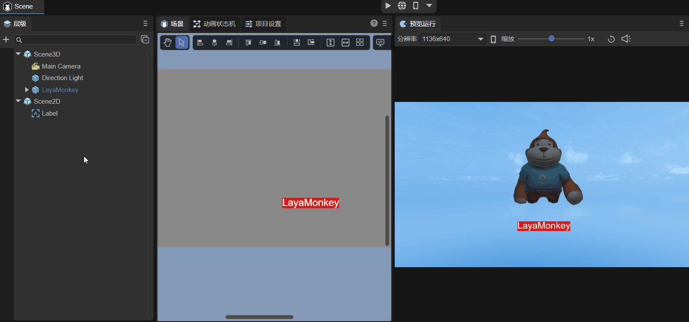
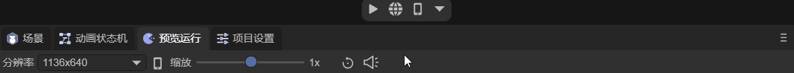

# Preview run panel description

## 1. Project preview

### 1.1 Preview run

Project preview is used to view the running effect of the project in different environments. Project preview is divided into three modes, namely in-IDE preview, browser preview, and mobile preview. As shown in Figure 1-1.

(Picture 1-1)

> For preview-related shortcut keys, please refer to Section 1.5 of ["Comprehensive Collection of IDE Shortcut Keys and Mouse Interaction Operations"] (../../../basics/IDE/shortcutKeyCombinations/readme.md).

After opening the preview in the IDE, two buttons will appear, namely `Restart` and `Open Developer Tools`:

Restart, as the name suggests, restarts the current preview running scene, as shown in Figure 1-2.

(Figure 1-2)

Clicking to open the developer tools will bring up the Developer Tools, which is convenient for developers to debug. You can also open the developer tools through the `Ctrl + Alt + I` shortcut key.

(Figure 1-3)

### 1.2 Entrance to preview operation

After the startup scene is released online in [Build Release](../../../released/web/readme.md), it is undoubtedly the first to be loaded and displayed as the entrance to the project. As shown in Figure 1-4, set the startup scenario in the build release.

(Figure 1-4)

However, when debugging the project in preview and run, sometimes you do not want to display the startup scene first, which will make the debugging process very long. Therefore, by clicking the drop-down arrow in the red circle in Figure 1-5, you can click the check box to use `Start Scene` or `Current Scene` as the **entry** for preview running.

(Figure 1-5)

> The current scene refers to the scene currently open for editing in the IDE.

## 2. The role of IDE preview run panel

### 2.1 Not running

First [Customize the interface layout](../../../basics/IDE/layouts/readme.md) and drag the preview running window as shown in Figure 2-1 to facilitate observation of the effect.

(Animation 2-1)

The advantage of this layout is that it can facilitate developers to perform UI layout and typesetting. This is also a function of the preview running window when it is not running. As shown in the animation 2-2, in the scene panel, the 2D and 3D interfaces cannot be displayed at the same time. If I want to display a label under the model and need to align their positions, then I need to preview the run window Observe the effect.

(Animation 2-2)

In fact, before clicking the run button, the preview run window only does not execute the script, and other effects will be displayed. For example, the particle effect is shown in the animation 2-3. However, for the sake of efficiency, the particle effect is not displayed in real time in the preview running window. It is refreshed every once in a while.

(Animation 2-3)

### 2.2 Runtime

After clicking Run, the script will also be run. As shown in the animation 2-4, clicking the run button will automatically jump to the preview run interface. Here, a script is added to the Main Camera to control the camera through the mouse and keyboard (refer to the document ["Using 3D Elf"] (.. /../../3D/Sprite3D/readme.md) Section 6), if you do not click to run, then this script will not be executed.

(Animation 2-4)

## 3. Preview the function of running panel

### 3.1 Resolution

When not running, as shown in animation 3-1, the resolution at which the preview runs is the resolution in the project settings.

(Animation 3-1)

If it is running, there are many options to choose from for resolution, as shown in the animated picture 3-2. You can also create your own options. Dimensions is the name of the option. After clicking the check mark, you can set the required resolution value.

(Animation 3-2)

### 3.2 Horizontal and vertical screens

When running, click the icon as shown in Figure 3-3 to switch between horizontal and vertical screen display.

(Animation 3-3)

### 3.3 Zoom, restore 1X

The preview run panel supports scaling and can be quickly restored to 1x the size. The operation is as shown in the animation 3-4.

(Animation 3-4)

### 3.4 Mute

If there is audio in the project, click the icon as shown in Figure 3-5 to mute the demo while the preview is running.

(Animation 3-5)

