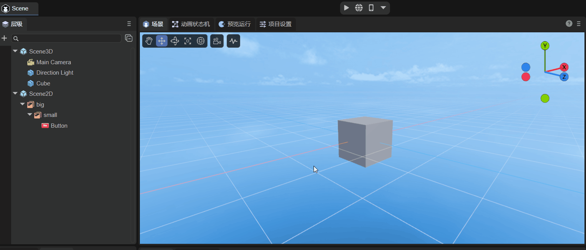
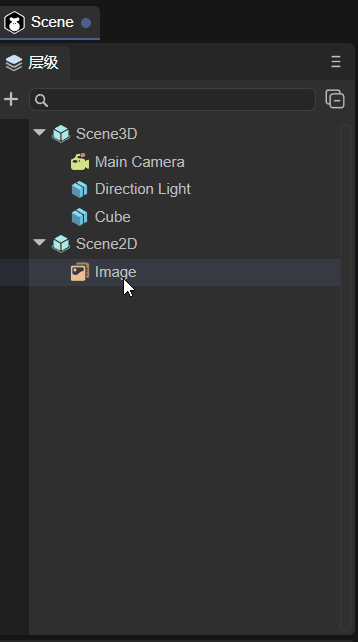

# Hierarchy panel description

## 1. The function of the hierarchical panel

The hierarchical management panel provides visual operations of nodes and facilitates management between nodes. It mainly includes 2D nodes and 3D nodes. If it is a purely 2D project, it can also only include 2D nodes. The panel is shown in Figure 1-1.

(Picture 1-1)

The hierarchical relationship represents the relationship between parent and child nodes. Child nodes will be affected by the parent node. For example, if the parent node changes its position or rotates its angle, the child nodes will also change synchronously.

The root node of 3D nodes is Scene3D, and the root node of 2D nodes is Scene2D. 2D and 3D nodes cannot be mixed to form a parent-child hierarchical relationship.

## 2. Common operations of hierarchical panels

### 2.1 Create node

The 3D nodes that can be created are:

- Sprite3D (this is an empty node);
- Basic 3D nodes (Cube, Sphere, Cylinder, Capsule, Cone, Plane);
- Special effects (Particle3D, PixelLine, Trail);
- Lights (DirectionLight, PointLight, SpotLight, AreaLight);
- camera.

The 2D nodes that can be created are:

- Basic 2D nodes (Sprite, Animation, Text, SoundNode, VideoNode);
- UI组件（Box、HBox、VBox、Image、Clip、Button、CheckBox、Radio、RadioGroup、ComboBox、Label、TextInput、TextArea、FontClip、ProgressBar、HSilder、VSlider、List、Panel、Tree、Tab、ViewStack、HScrollBar、VScrollBar、ColorPicker、View、Dialog、OpenDataContextView）；
- 2D skeletal animation (Spine, Skeleton).

The above lists the node types that can be created. The following is an introduction to the ways to create nodes. There are two main ways: one is to create a separate node without a parent relationship, that is, 3D nodes are under Scene3D, and 2D nodes are under Scene2D; The other is to create it under a certain node as its child node.

As shown in Figure 1-1, Sprite is a separate node, and Sphere is a child node of Cube.

#### 2.2.1 Single node

If a certain node is not selected, as shown in the animation 2-1, assuming it is selected, you can click on the blank space to deselect it. At this time, click `+` to create the node. The node created at this time is a separate node.

(Animation 2-1)

As shown in the animation 2-2, when the node is not selected, right-click on the blank space to create it. At this time, a separate node is created.

(Animation 2-2)

Careful developers may find that there are two places to create Sprites in the created menu bar, as shown in Figure 2-3. One is to directly select `Create Sprite`, and the other is to select `2D Node->Sprite` Create it below. The sprites created in these two ways are the same. Method 1 is for the convenience of operation, and method 2 is because Sprites are basic display sprites and are classified as basic 2D nodes.

(Figure 2-3)

> Note: For the shortcut keys for creating empty nodes, please refer to section 1.3.1 of the document ["Comprehensive Collection of IDE Shortcut Keys and Mouse Interaction Operations"] (../shortcutKeyCombinations/readme.md).

#### 2.2.2 Parent-child nodes

As shown in the animation 2-4, if you select a node to create, whether you click `+` to create or right-click to create, the child nodes of the selected node will be created.

(Animation 2-4)

### 2.2 Search nodes

In the search bar, you can search for the created nodes based on the node name, as shown in the following animation to search for Sphere nodes:

(Animation 2-5)

You can also combine it with the project resource panel. For example, there is a picture LayaAir.png in the project resource panel, and set the skin of the Image component in the scene to this picture. At this time, you can right-click the picture and choose to find references in the scene, such as moving As shown in Figure 2-6, you can search for components that reference this resource.

(Animation 2-6)

### 2.3 Hidden nodes

As shown in Figure 2-7, the node can be hidden. However, the hiding effect at this time is only in the `Scene` panel, and the node still exists when `Preview is running`.

(Animation 2-7)

If it is a parent-child node and hiding the child node, only the node itself will be hidden. If the parent node is hidden, the child node will also be hidden. The effect is as shown in Figure 2-8.

(Animation 2-8)

### 2.4 Lock node

As shown in Figure 2-9, you can lock the node. After locking the node, the node will be in the scene panel and will not be operated. For example, in the animation, the Cube can be selected for movement before locking, but the Cube cannot be selected after locking.

(Animation 2-9)

If it is a parent-child node, as shown in Figure 2-10, locking the child node will not affect the parent node. If the parent node is locked, the child nodes will also be locked.

(Animation 2-10)

> It should be noted here that locking a node only prevents the mouse from selecting it in the scene panel, but it can still be operated on in the attribute settings panel. This function is often used for background images. After setting the background image, you can lock the background image first to prevent mistaken selection.

### 2.5 Contraction and expansion of nodes

The IDE provides a shrink all button, as shown in animation 2-11. After clicking, all child nodes can be shrunk.

(Animation 2-11)

> Note: For the shortcut keys to expand all sub-nodes, please refer to section 1.3.2 of the document *[IDE Shortcut Keys and Mouse Interaction Collection](../shortcutKeyCombinations/readme.md)*.

### 2.6 Node sorting

3D nodes are in the three-dimensional coordinate system, and their occlusion relationship is related to their coordinates and the position of the camera. But for 2D nodes, if they are added in order, they will increase downward one by one in the hierarchy panel, as shown in the animation 2-12, then the ones added first will be overwritten by those added later. At this time, if you want to modify their occlusion relationship, you can change the [ZOrder](../../../2D/displayObject/Sprite/readme.md) attribute.

(Animation 2-12)

Of course, in addition to modifying the ZOrder attribute, you can also change the occlusion relationship by dragging the target node. There are three main types:

- Drag and drop to be the subordinate node of the target node;
- After dragging to be the sibling of the target node;
- Before dragging as a sibling of the target node.

> Note: For a demonstration of dragging the target node, please refer to section 1.3.3 of the document *[Complete Collection of IDE Shortcut Keys and Mouse Interaction Operations](../shortcutKeyCombinations/readme.md)*.

### 2.7 Common functions of right-click menu

In addition to the function of creating nodes in 2.1, the right-click menu also has some common functions:

`Copy`, `Paste`: As shown in the animation 2-13, select the node to copy (you can also select multiple nodes), and then paste. If there are nodes with the same name after pasting, the IDE will automatically rename them.

(Animation 2-13)

> 2D nodes can only be pasted under Scene2D, and 3D nodes can only be pasted under Scene3D.

`Rename`: As shown in the animation 2-14, the selected node can be renamed.

(Animation 2-14)

`Generate copy`: As shown in the animation 2-15, you can generate a copy of the selected node, which retains the attributes of the original node (position, size, unique attributes, etc.).

(Animation 2-15)

`Delete`: As shown in the animation 2-16, you can delete the selected node, delete the parent node, and the child nodes will be deleted accordingly.

(Animation 2-16)

>Note: For the shortcut keys for the above operations, please refer to section 1.2 of the document *[Complete Collection of IDE Shortcut Keys and Mouse Interaction Operations](../shortcutKeyCombinations/readme.md)*.

### 2.8 Node tree

When running, the hierarchy panel displays the node tree in the running state. As shown in animation 2-17, whichever scene is switched to, the node tree of that scene will be displayed.

(Animation 2-17)

> The example in the animation is "2D Getting Started Example".

## 3. 3D scene node operation

### 3.1 Deletion and creation of 3D scene root node

As mentioned at the beginning of this article, if it is a purely 2D project, it can only include 2D nodes. In other words, 3D nodes can be deleted, including the 3D root node Scene3D. As shown in animation 3-1, the root node Scene3D is deleted. After deletion, it becomes a pure 2D scene.

(Animation 3-1)

If you create a pure 2D project and want to add a 3D scene, you only need to add the required 3D nodes, as shown in animation 3-2, and the node will be automatically created under Scene3D.

(Animation 3-2)

### 3.2 3D basic nodes

The 3D nodes that can be created have been listed in Section 2.1. This section will outline their functions and provide detailed links to the documents corresponding to the nodes.

- Sprite3D

  This is an empty node, which is the most basic 3D node and contains many basic functional attributes of 3D sprites. After creation, you can assign attributes such as Mesh to it to display effects. For detailed purposes and usage, please refer to the document [*Using 3D Sprites*](../../../3D/Sprite3D/readme.md).

- Basic 3D nodes

  Contains: Cube, Sphere, Cylinder, Capsule, Cone, Plane. They are basic 3D display objects and can be used as auxiliary tools in 3D development. For example, beginners can quickly learn the 3D development process and skilled developers can simulate and test. For detailed usage, please refer to the document *[3D Basic Display Object](../../../3D/displayObject/readme.md)*.

- Special effects

  Nodes related to special effects include: Particle3D, PixelLine, and Trail;

  Particle3D is a 3D particle system that can be used to simulate non-fixed natural phenomena such as smoke, fog, water, fire, rain, snow, and streamers. For detailed instructions, please refer to the document *[3D Particle Editing Module](../../../IDE/particleEditor/readme.md)*.

  PixelLine is a pixel line, which draws 3D sprites by rendering a set of colored lines. For detailed introduction, please refer to the document *[Pixel Line](../../../IDE/Component/PixelLine/readme.md)*.

  Trail is a trail. The trail renderer can create a trail effect behind an object, such as the air column generated by a bullet passing through. For detailed information, please refer to the document *[Trail](../../../IDE/Component/Trail/readme.md)*.

- lighting

  There are four types of light nodes in total, namely DirectionLight (directional light), PointLight (point light source), SpotLight (spotlight), and AreaLight (area light). They determine the color and atmosphere of the environment, and different light sources will present different effects. For detailed setting methods, please refer to the document *[3D Light and Shadow](../../../3D/Light/readme.md)*.

- camera

  The camera node is equivalent to the eye, and all scenes are rendered through it. For detailed description, please refer to the document *[Using 3D Camera](../../../3D/Camera/readme.md)*.

### 3.3 Create 3D rendering nodes

Rendering nodes refer to nodes that need to be rendered, such as MeshSprite3D (static mesh sprite), SkinnedMeshSprite3D (skinned animated mesh sprite), etc. As shown in Figure 3-3, just drag it directly from the resource panel to the hierarchy panel.

(Figure 3-3)

## 4. 2D scene node operation

The 2D nodes that can be created have been listed in Section 2.1. This section will outline their functions and provide detailed links to the documents corresponding to the nodes. Developers need to note that Scene2D nodes are different from Scene3D nodes and cannot be deleted.

### 4.1 2D basic nodes

[Sprite](../../../2D/displayObject/Sprite/readme.md) is a 2D sprite, a display object that can be controlled on the screen.

[Animation](../../../2D/displayObject/Animation/readme.md) is a node animation that can easily create atlas animations and multi-frame animations.

[Text](../../../2D/displayObject/Text/readme.md) is the basic component of static text.

[SoundNode](../../../2D/displayObject/SoundNode/readme.md) is a component that plays sound.

[VideoNode](../../../2D/displayObject/VideoNode/readme.md) is the component that displays video.

### 4.2 UI node

[Box](../../../IDE/uiEditor/uiComponent/Box/readme.md) is the base class of container components and is used to load components of other display objects.

[HBox](../../../IDE/uiEditor/uiComponent/HBox/readme.md) is a container component commonly used for horizontal layout.

[VBox](../../../IDE/uiEditor/uiComponent/VBox/readme.md) is a container component commonly used for vertical layout.

[Image](../../../IDE/uiEditor/uiComponent/Image/readme.md) is the most common component that displays images in the UI and is used to display bitmap images.

[Clip](../../../IDE/uiEditor/uiComponent/Clip/readme.md) component can be used to display bitmap slice animation.

[Button](../../../IDE/uiEditor/uiComponent/Button/readme.md) is a button component that can display text labels, icons, or both at the same time.

[CheckBox](../../../IDE/uiEditor/uiComponent/CheckBox/readme.md) is a multi-select box component.

[Radio](../../../IDE/uiEditor/uiComponent/Radio/readme.md) is a radio button component.

[RadioGroup](../../../IDE/uiEditor/uiComponent/RadioGroup/readme.md) is a radio button group.

[ComboBox](../../../IDE/uiEditor/uiComponent/ComboBox/readme.md) is a drop-down list option box component.

[Label](../../../IDE/uiEditor/uiComponent/Label/readme.md) is used to display a piece of text.

[TextInput](../../../IDE/uiEditor/uiComponent/TextInput/readme.md) is a text input box, which can be used whenever input is required.

[TextArea](../../../IDE/uiEditor/uiComponent/TextArea/readme.md) is a text area, inherited from TextInput.

[FontClip](../../../IDE/uiEditor/uiComponent/FontClip/readme.md) cuts the bitmap proportionally from the direction.

[ProgressBar](../../../IDE/uiEditor/uiComponent/ProgressBar/readme.md) is used to display progress.

[HSilder](../../../IDE/uiEditor/uiComponent/HSlider/readme.md) is a horizontal slider that allows you to select values ​​by moving the slider between slider tracks.

[VSlider](../../../IDE/uiEditor/uiComponent/VSlider/readme.md) is a vertical slider.

[List](../../../IDE/uiEditor/uiComponent/List/readme.md) displays the project list.

[Panel](../../../IDE/uiEditor/uiComponent/Panel/readme.md) is a panel container class with cropping function, which is commonly used to set the display area of ​​elements.

[Tree](../../../IDE/uiEditor/uiComponent/Tree/readme.md) component is used to display the tree structure.

The [Tab](../../../IDE/uiEditor/uiComponent/Tab/readme.md) component is used to define a tab button group.

[ViewStack](../../../IDE/uiEditor/uiComponent/ViewStack/readme.md) is mainly used for multi-page view switching.

[HScrollBar](../../../IDE/uiEditor/uiComponent/HScrollBar/readme.md) is a horizontal scroll bar component

[VScrollBar](../../../IDE/uiEditor/uiComponent/VScrollBar/readme.md) is a vertical scroll bar component.

[ColorPicker](../../../IDE/uiEditor/uiComponent/ColorPicker/readme.md) displays a list containing multiple color samples.

[Dialog](../../../IDE/uiEditor/View/Dialog/readme.md) is mainly used for pop-up panels.

[OpenDataContextView](../../../IDE/uiEditor/uiComponent/OpenDataContextView/readme.md) is a component used in the open data domain.

### 4.3 Bone nodes

[Spine](../../../IDE/uiEditor/uiComponent/skeleton/spine/readme.md) implements animation by binding pictures to bones and then controlling the bones.

[Skeleton](../../../IDE/uiEditor/uiComponent/skeleton/sk/readme.md) can convert some commonly used skeletal animation formats into skeletal animation formats supported by the LayaAir engine.

