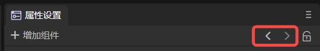
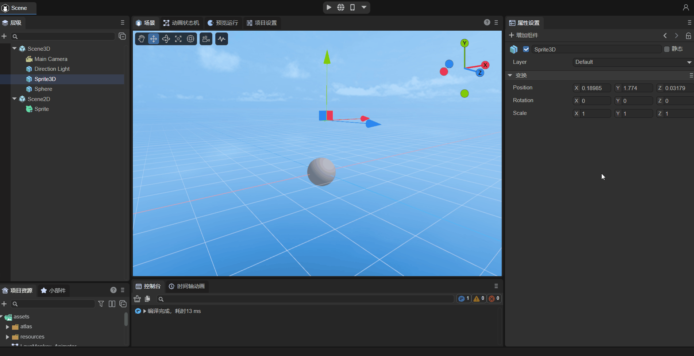
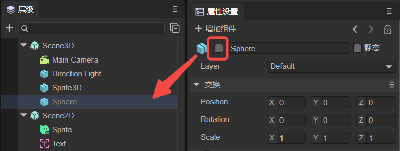
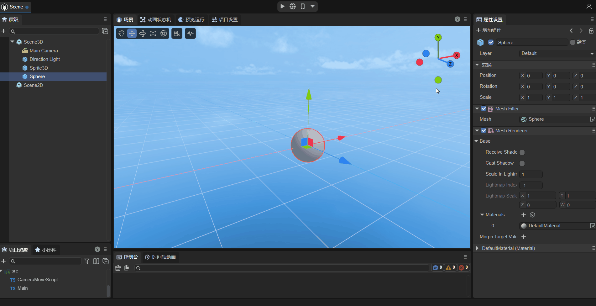
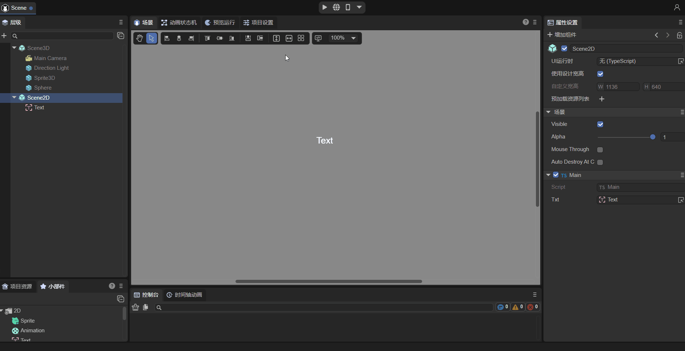
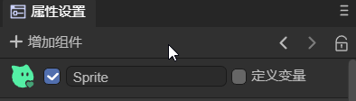
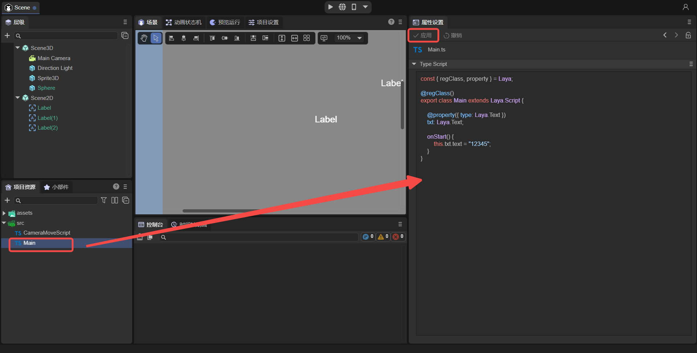

# Property setting panel description

## 1. General functions

### 1.1 Add components

In the property settings panel, you can click `Add Component` to add corresponding components to the node, as shown in Figure 1-1.

(Picture 1-1)

- Components that can be added to 3D nodes include: animation ([Timeline Animation](../../../IDE/animationEditor/timelineGUI/readme.md), [Animation State Machine](../../. ./IDE/animationEditor/aniController/readme.md)), [3D Physics](../../../IDE/physicsEditor/physics3D/readme.md), [Grid](../../ ../IDE/Component/Mesh/readme.md), special effects ([particle](../../../IDE/particleEditor/readme.md), [tailing](../../. ./IDE/Component/Trail/readme.md), [Pixel Line](../../../IDE/Component/PixelLine/readme.md)), [Light](../../. ./3D/Light/readme.md), rendering ([UI3D](../../../IDE/uiEditor/3DUI/readme.md), [Reflection Probe](../../. ./IDE/Component/ReflectionProbe/readme.md), [Volume Global Illumination](../../../IDE/Component/VolumetricGI/readme.md), [Static Batch](../.. /../IDE/Component/StaticBatchVolume/readme.md), [LOD group](../../../IDE/Component/LOD/readme.md)), [Custom component script](.. /../../basics/IDE/entry/readme.md), [New component script](../../../basics/common/Component/readme.md).
- Components that can be added to 2D nodes include: animation ([Timeline Animation](../../../IDE/animationEditor/timelineGUI/readme.md), [Animation State Machine](../../. ./IDE/animationEditor/aniController/readme.md)), [2D Physics](../../../IDE/physicsEditor/physics2D/readme.md), [Custom Component Script](../. ./../basics/IDE/entry/readme.md), [New component script](../../../basics/common/Component/readme.md).

> "Custom component script" is to add an existing script file; "New component script" is to create a new script file.

### 1.2 Previous, next

As shown in Figure 1-2, click `<` to return to the previous node you viewed, and click `>` to view the node you saw before switching.

(Figure 1-2)

### 1.3 Lock

As shown in the animated picture 1-3, click Lock to lock the property panel, and the property setting panel will not switch when switching nodes.

(Animation 1-3)

## 2. Application scenarios

### 2.1 Node attribute settings

#### 2.1.1 General attribute settings

**1,`activate`**

Both 2D nodes and 3D nodes have activation functions. When the option shown in Figure 2-1 is unchecked, the node will turn gray in the hierarchy panel, and if the parent node is not activated, the child nodes will be deactivated.

(Figure 2-1)

After deactivation, the 3D nodes will not be displayed, even when running, as shown in animation 2-2.

(Animation 2-2)

However, for 2D nodes, deactivation does not affect the node itself, but only deactivates the node's script. For example, as shown in the animation in Figure 2-3, use a script to change the displayed text. The text will not be changed if it is not activated.

(Animation 2-3)

2, `Double naming`

Nodes can be renamed as shown in Figure 2-4.

(Animation 2-4)

#### 2.1.2 3D nodes

`static`:

In the game scene, each Sprite3D has two states: static or dynamic. When an object is marked as static, it ensures that the object is a static and non-moving object in the game scene, and then during the running process of the game Let the game have a smoother running experience. For detailed introduction, please refer to Section 2.3 of ["Using 3D Sprites"] (../../../3D/Sprite3D/readme.md).

`Layer`：

Mask layer, the rendering camera can control the visible mask layer according to the mask layer, and control whether the sprite is rendered or not. For detailed introduction, please refer to Section 2.4 of ["Using 3D Sprites"] (../../../3D/Sprite3D/readme.md).

> Scene3D has no Layer property.

#### 2.1.3 2D nodes

**1, define variables**

After checking, save the scene and you can manage the nodes in `UI runtime`. For detailed instructions, please refer to Section 2.3 of ["UI Runtime"](../../../IDE/uiEditor/runtime/readme.md).

> There are no variable properties defined in Scene2D.

**2, Scene2D unique properties**

- UI runtime: Runtime entry, for details, please refer to ["UI Runtime"](../../../IDE/uiEditor/runtime/readme.md).
- Use design width and height: If checked, the width and height set in the `Project Settings' panel will be used; if not checked, the width and height can be customized.
- Preload resource list: You can add some resources that need to be preloaded.

#### 2.1.4 Prefab

When the node is a prefab, it will have the following properties:

- Edit: Enter the editing page of the prefab.

- Position: Position the prefab resource file in the project resource panel.

- Overwrite properties: modifications can be overwritten into prefabs.

> For details about prefabs, please refer to ["Prefab Module"](../../../IDE/prefab/readme.md).

### 2.2 Resource attribute settings

In the `Resource Panel`, click on the files of the following resource types to set the corresponding properties in the `Property Settings` panel.

- Picture: You can set the imported picture attributes. For details, please refer to Section 1.4 of [Project Resource Panel Instructions](../../../basics/IDE/assets/readme.md).
- Bitmap font: Bitmap font can be customized. For details, please refer to Section 2.2 of [Advanced Text Use](../../../2D/advanced/useText/readme.md).
- Automatic atlas: An atlas can be automatically generated after publishing. For details, please refer to Section 3.3.1 of [Web Publishing](../../../released/web/readme.md).
- Material: Custom materials can be created. For details, please refer to [Material Editing Module](../../../IDE/materialEditor/readme.md).
- Animation: There are 2D animation files and 3D animation files. For details, please refer to [Detailed Explanation of Timeline Animation Editing](../../../IDE/animationEditor/timelineGUI/readme.md).
- Light map baking: You can set lighting attributes. For details, please refer to Section 6 of [3D Scene Environment Settings](../../../IDE/sceneEditor/environment/readme.md).
- Third-party JS files: Provides the function of separate import. For details, please refer to Section 2 of [Referencing Third-Party JS Modules](../../../basics/IDE/importJsLibrary/readme.md).
- Model: Supported model files with model suffixes of fbx and gltf. For details, please refer to [Import and Use of Models and Animations](../../../3D/useModel/readme.md).
- RenderTexture: You can modify the properties of the rendering texture. For details, please refer to the second section of [Mixed Use of 3D](../../../IDE/uiEditor/use3D/readme.md).
- AvatarMask: Developers can use it to set action masks. For details, please refer to Section 3.5.1 of [Animation State Machine Detailed Explanation](../../../IDE/animationEditor/aniController/readme.md).

### 2.3 Code preview

As shown in Figure 2-5, select the script file in the src folder to preview the code. Developers can use a code editor (VS Code is recommended) to make modifications. If it is [referencing third-party JS files](../../../basics/IDE/importJsLibrary/readme.md), you can set up separate imports.

(Figure 2-5)

