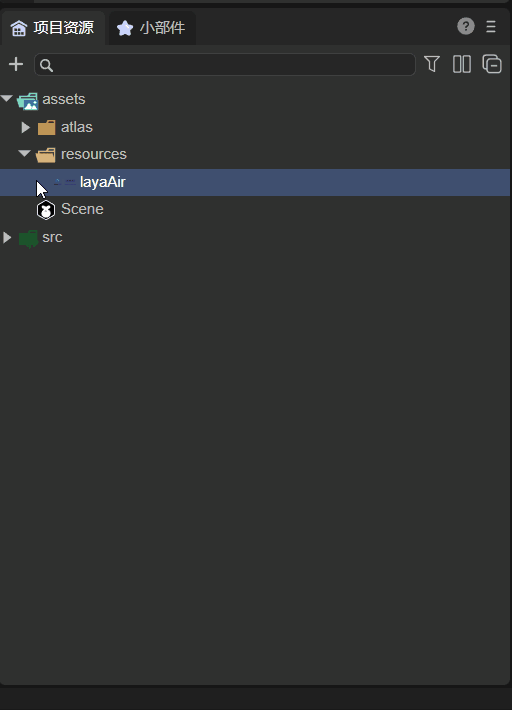
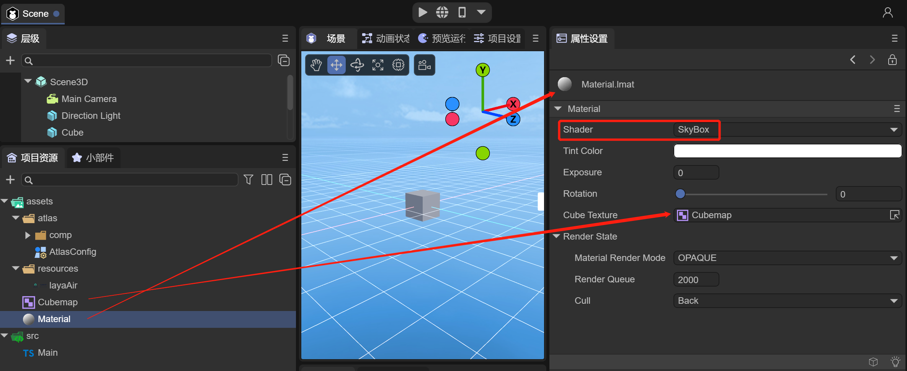
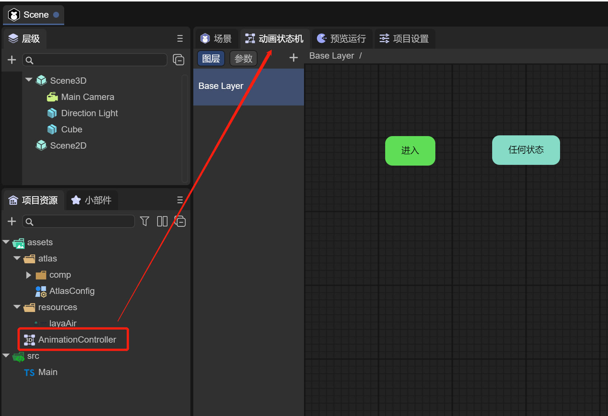
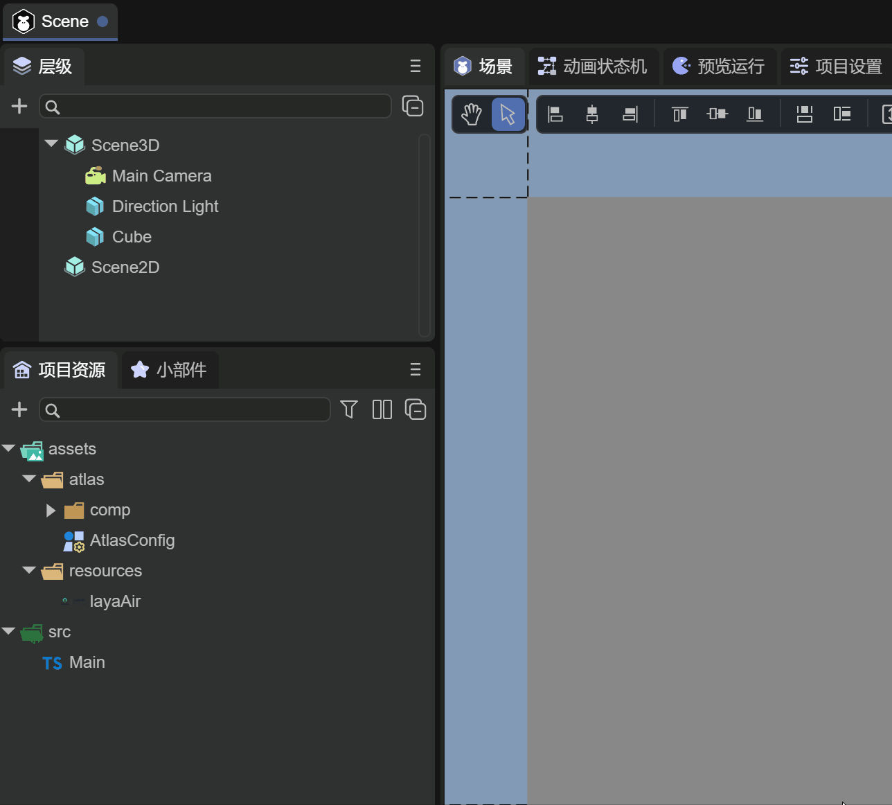

# Project resource panel description

## 1. Resource directory

After opening the project in LayaAir IDE, it consists of five parts. The effect is shown in Figure 1-1.

(Picture 1-1)

- Project resource directory
- Project source code directory
- `+` quick creation
- Search panel
- Catalog setting button

First, we can briefly understand the project resource directory and project source code directory, and then give a detailed introduction to the other three functions.

## 1.1 Project resource directory assets

The assets directory is a relatively important project directory. All our scenes and resources are in the assets directory. The IDE's management of project resources comes from this directory.

The effect is shown in Figure 1-2:

(Figure 1-2)

This catalog is closely linked to the final release,

For example, resources introduced in assets in the scene will be automatically copied to the publishing directory.

The resources referenced in the code must be placed in the resources directory before they will be copied to the release directory.

## 1.2 Project source code directory src

The source code directory in src is shown in Figure 1-3.

(Figure 1-3)

The source code directory is relatively easy to understand. Usually after installing the code editor, you can double-click the source code to open the code editor.

## 1.3 Right-click menu

By right-clicking any directory or file, you can open the menu, as shown in Figure 1-4

 

(Figure 1-4)

By clicking "Create", a "Lightmap Baking Settings" file is created in the assets directory in animation 1-5.

  

(Animation 1-5)

In the second section, we will explain the types that can be created in the menu. Next, we will introduce other options:

**Open in File Manager**: You can quickly open the file manager to view the file.

**Find references in the scene**: You can search for components that reference this resource. You can view the document ["Hierarchy Panel Description"] (../../../basics/IDE/Hierarchy/readme.md) Section 2.2.

**Rename, delete, copy, paste**: basic operations on files, no need to go into details.

**Generate Copy**: You can generate a copy that retains the attributes of the original file.

**Reimport**: Usually used when the import fails, or some external dependencies have changed. For example, there is a material in the model, and the material refers to an external texture, but the texture was not put in at first, but later it was put in. You can use this function .

**Open project in code editor**: You can directly open the code editor to view file information.

## 1.4 Edit 2D pictures into sprite textures

2D image resources, in the assets directory, will be used as the texture format of the 3D model by default. In 2D interface development, it usually needs to be changed to a 2D image format, which needs to be edited by the developer.

As shown in Figure 1-6, this is a png picture with a transparent channel

(Figure 1-6)

Click on the picture to see the property settings, as shown in Figure 1-7

(Figure 1-7)

`Default value`: By default, the image is used as the Texture map file of the 3D model and can only be used on the material ball.

`Sprite texture`: The picture is a picture texture format of a 2D Sprite object, usually used in 2D development. This attribute is automatically used as the sprite texture when the image resource is named according to the official naming rules. Otherwise, it is the default value, which will cause the resource to display abnormally.

Without changing the image type, use and run this image as a 2D image in the Image component. The page background is blue, as shown in Figure 1-8.

(Figure 1-8)

You can see that there are white burrs in the green area in the picture, so the settings need to be changed, as shown in Figure 1-9

(Figure 1-9)

Let’s take a look at the running effect, as shown in Figure 1-10

(Figure 1-10)

The image also has some other property settings:

`Tiling mode`: Select the way the texture is tiled. The default option is repeat.

`Filter Mode`: Select how the texture is filtered when stretched by 3D transformations. The default is bilinear filtering.

`Texture Flip`: Flip the image.

`Texture rotation`: Rotate the image.

`Non-power of 2 scaling`: When the texture is not a power of 2, the operation mode is scaled to the power of 2.

`Readable and writable`: When enabled, texture pixels can be dynamically read using scripts.

Skin related settings:

`Nine Gongge`: Nine Gongge information.

`Button skin state`: The number of states of the button skin.

For the texture format, please refer to the document ["Texture Compression"](../../../IDE/uiEditor/textureCompress/readme.md).

## 2. Quickly create files

There are two quick ways to create files quickly

- **Click `+` to create quickly**
- **Click on the blank space to quickly create**

1. Quick creation is a way for developers to quickly create special types of files, as shown in animation 2-1

(Animation 2-1)

2. Click on the blank space in the project resource panel and select Create. You can also create it quickly, as shown in animation 2-2.

(Animation 2-2)

3. The files quickly created here will only be in the assets directory. If you want to put them in a certain directory, you can drag the files and put them in, as shown in the animation 2-3.

(Animation 2-3)

## 2.1 Create folder

As shown in Figure 2-3, in the quick creation menu, click "Folder" to create a folder under assets, and you can modify the folder name.

(Figure 2-3)

## 2.2 Create prefab

In the quick creation menu, click "Prefab 2D" and "Prefab 3D" to create prefab files.

### 2.2.1 Prefab 2D

As shown in Figure 2-4, after creating the 2D prefab, click to open it. The prefab has only one Box root node, which is used for 2D development.

(Figure 2-4)

At the same time, we can also change the Box component to a Dialog component, as shown in animation 2-5

(Animation 2-5)

Dialog is a pop-up window panel that can be set to achieve a pop-up window effect.

### 2.2.2 Prefab 3D

As shown in Figure 2-6, after creating the 3D prefab, click to open it. The prefab only includes Sprite3D objects and is used for 3D object development.

(Figure 2-6)

Usually 3D prefabs are used to create 3D node objects that can be reused, such as the protagonist, enemies, etc. in the scene.

## 2.3 Create scene (scene)

As shown in Figure 2-7, in the quick creation menu, click "scene" to quickly create a scene under assets.

(Figure 2-7)

## 2.4 Create shader

### 2.4.1 Shaders

As shown in Figure 2-8, in the quick creation menu, clicking "Shader" will choose to create five types of shader files.

(Figure 2-8)

By creating a shader, developers can modify the shader to use a custom shader, as shown in Figure 2-9

(Figure 2-9)

### 2.4.2 Shader Blueprint

As shown in Figure 2-10, in the quick creation menu, click "Shader Blueprint" to quickly create a shader blueprint file under assets.

(Figure 2-10)

Double-click the blueprint file to edit it through the visual window

(Figure 2-11)

### 2.4.3 Shader Blueprint Function

As shown in Figure 2-12, in the quick creation menu, click "Shader Blueprint Function" to quickly create a shader blueprint function file under assets.

(Figure 2-12)

Double-click the blueprint function file to edit it through the visual window

(Figure 2-13)

## 2.5 Create materials and configurations

### 2.5.1 Material file

As shown in Figure 2-14, in the quick creation menu, clicking "Material" will choose to create eight types of material files.

(Figure 2-14)

By creating Material, developers can modify the material for easy and quick use.

### 2.5.2 Cube texture

As shown in Figure 2-15, in the quick creation menu, click "TextureCube" to quickly create a TextureCube file under assets.

(Figure 2-15)

Click on the Cubemap file to configure

  

(Figure 2-16)

Usually Cubemap file is used to configure the texture of the sky box, as shown in Figure 2-17

(Figure 2-17)

For specific instructions on how to use TextureCube, developers please refer to the detailed explanation of the skybox in ["3D Scene Environment Settings"] (../../../IDE/sceneEditor/environment/readme.md).

### 2.5.3 Rendering texture

As shown in Figure 2-18, in the quick creation menu, click "RenderTexture" to quickly create a RenderTexture file under assets.

(Figure 2-18)

RenderTexture rendering texture is used to render 3D scenes into 2D textures and is used in mixed 2D development, as shown in animation 2-19

(Figure 2-19)

For details on how to use RenderTexture, developers please refer to the detailed explanation in ["Mixed Use of 3D"](../../../IDE/uiEditor/use3D/readme.md)

### 2.5.4 Animation mask

As shown in Figure 2-20, in the quick creation menu, click "AvatarMask" to create an AvatarMask file.

(Figure 2-20)

By creating an AvatarMask, developers can use it to describe the animation layer mask. For details, please refer to Section 3.5.1 of ["Animation State Machine Detailed Explanation"] (../../../IDE/animationEditor/aniController/readme.md) .

## 2.6 Create image type

### 2.6.1 Lightmap baking settings

As shown in Figure 2-21, in the quick creation menu, click "Lightmap Baking Settings" to create a LightingSettings file.

(Figure 2-21)

By creating LightingSettings, developers can set lighting properties for baking light maps

(Figure 2-22)

For specific instructions on how to use lighting settings, developers please refer to ["3D Scene Environment Settings"](../../../IDE/sceneEditor/environment/readme.md) for detailed explanations on baking light maps

### 2.6.2 Automatic album setting

As shown in Figure 2-23, in the quick creation menu, click "Automatic Atlas Settings" to create the AtlasConfig file.

(Figure 2-23)

By creating an AtlasConfig, developers can use it to automatically package atlases

For details on how to use automatic packaging of atlases, developers please refer to ["Web Publishing"](../../../released/web/readme.md) for detailed explanations on atlas packaging.

## 2.7 Create animation state machine

In the quick creation menu, click "Animation State Machine 2D" and "Animation State Machine 3D" to create an animation state machine.

### 2.7.1 2D animation state machine

As shown in Figure 2-24, after creating the animation state machine 2D, click to open it

(Figure 2-24)

### 2.7.2 3D animation state machine

As shown in Figure 2-25, after creating the animation state machine 3D, click to open it

(Figure 2-25)

The animation state machine defines animation states and switching conditions between animation states to drive objects to play different animations and show different behaviors.

For specific instructions on how to use the animation state machine, developers please refer to the detailed explanation in ["Animation State Machine Detailed Explanation"] (../../../IDE/animationEditor/aniController/readme.md)

## 3. Search panel

Since there are many resources under assets, the most common way is to search through them.

### 3.1 Text search

By entering "button" in the search box, you can quickly retrieve the Button component and quickly drag it into the 2D scene, as shown in animation 3-1

(Animation 3-1)

### 3.2 Type search

By clicking the type search button and selecting the file type, for example, selecting "LightingSettings", you can quickly retrieve all lighting settings files, as shown in animation 3-2

(Animation 3-2)

## 4. Directory Settings Panel

### 4.1 Two-column display

During the development process, there are often too many files in the directory, and repeated browsing of the directory will be cumbersome. This can be solved by clicking the "Two Column Display" button, as shown in Figure 4-1.

(Animation 4-1)

### 4.2 Collapse all

If there are too many open directories, developers can click "Collapse All" to close all directories and restore only the assets and src directories, as shown in animation 4-2.

(Animation 4-2)

