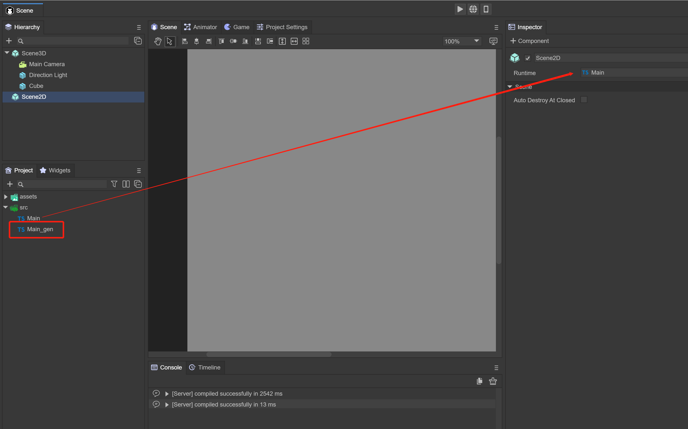

# Entrance


## Default entry

When using LayaAir2.0, you can only use the Main class as the entry point of the project, start it as follows, and set the parameter configuration:

In LayaAir3.0, the project entrance has been fundamentally changed. In the IDE, you can set the initialization parameters of the project in the Project Setting and start the default scene.


(figure 1)

## Set initial entry

After using LayaAir3.0 to create a project, a default scene will be created, located in Scene.ls under Assets, and a Main script will be created, located in the Src directory. Click the IDE's Project Setting to specify the initial scene Scene. Open the Scene scene, drag the Scene3D or Scene2D node in the scene into the Main script, and start the project.


(figure 2)


(image 3)

## Entry class

In LayaAir3.0, you can use LayaAir custom script or runTime as the entry class.

**Custom Script**: For custom script, please refer to the "Custom Script Component" document.


(Figure 4)

**Runtime**: All components under the resource panel in LayaAirIDE have the Runtime attribute. Runtime is the logical class of the component when it is run; the same component can use the same Runtime class to achieve the same function. For example, different pages need to Identical components implement the same function. It should be noted that if the component's Runtime logic class does not inherit the component itself and there is no attribute of the component in the inherited object, this attribute will be invalid. (Use in View and Dialog pages is not supported). Runtime scripts are similar to custom scripts, except that Runtime cannot add new properties to components.

**Use Runtime process:**



(Figure 5)

Click the Scene2D node and you can see the Runtime in the Inspector. Drag in a code Main.ts. After saving the scene, the Main_gen.ts file will be produced in the same directory. This file is the production class of the current node and cannot be modified.


(Figure 6)

Create an Image component under Scene2D, check Declare Var in the properties panel, change the name to img, and save the scene.


(Figure 7)

Main_gen.ts will be produced again with an additional img attribute. At this time, the img attribute can be used directly in the Main.ts code, as shown in Figure 8.


(Figure 8)


## Entry method

After specifying the entrance in the scene through a custom script or runtime, you can do the initialization code in the following method:

**Custom script:**

```
const { regClass, property } = Laya;

@regClass()
export class Main extends Laya.Script {

	@property()
	private img: Laya.Image; 	 

	onStart() {
    	console.log("Game start");
    	this.img.visible = false;
	}
}
```

> Note that to use custom scripts, you need to drag the attribute component you want to use into the editor.

**Runtime**：

```
import { MainBase } from "./Main_gen";
const { regClass, property } = Laya;

@regClass()
export class Main extends MainBase {

	onStart() {
    	console.log("Game start");
    	this.img.visible = false;
	}
}
```


