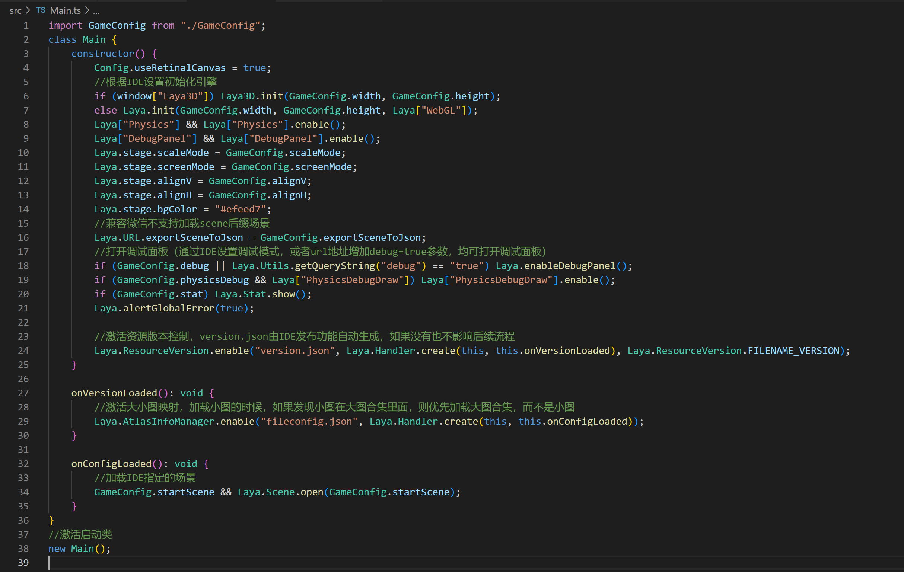
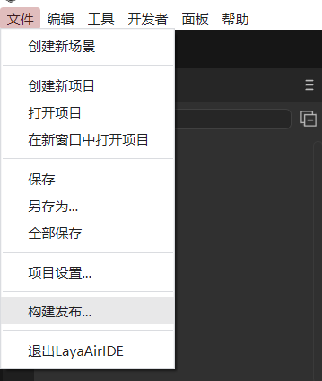
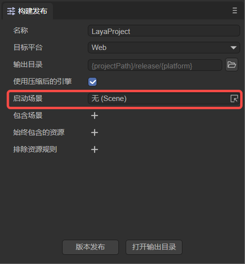
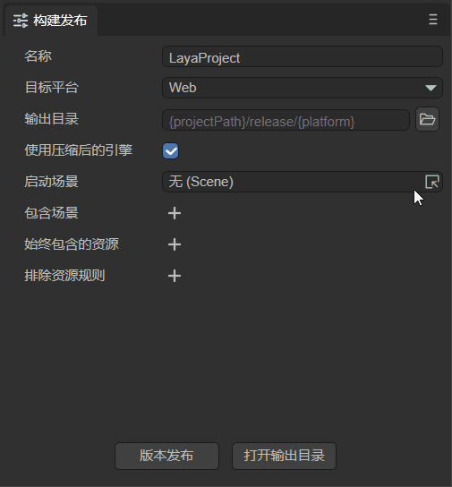
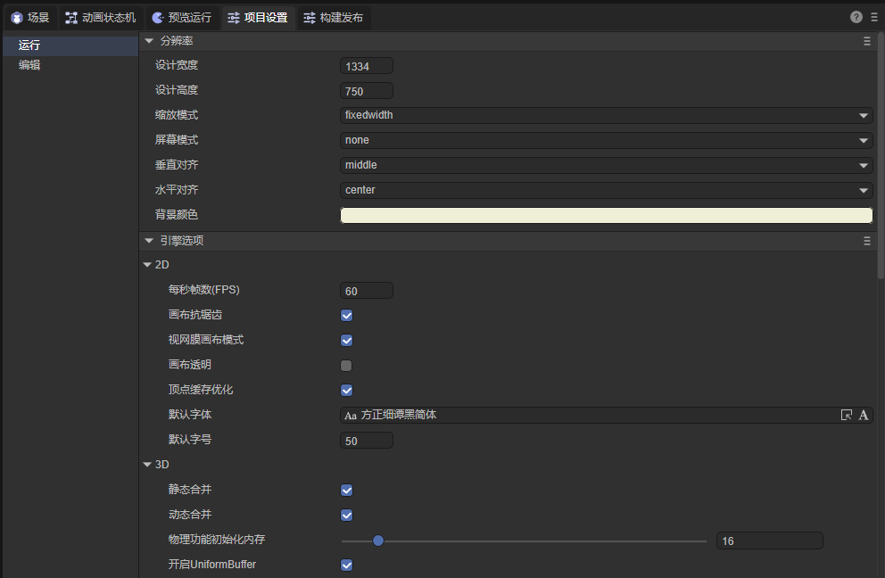
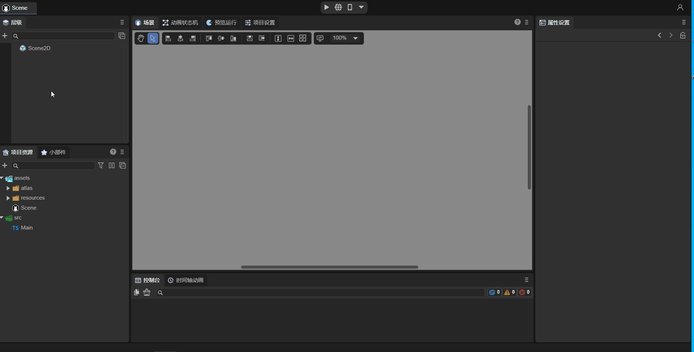
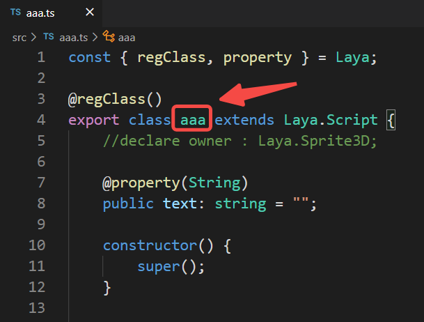
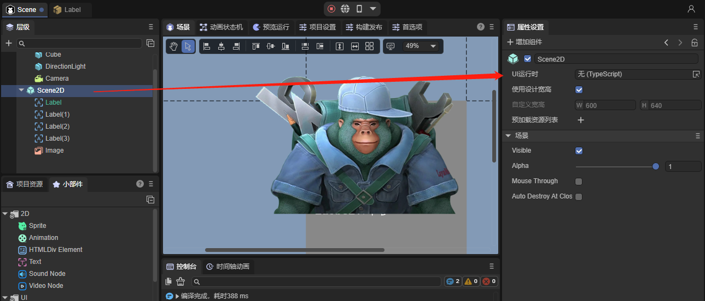
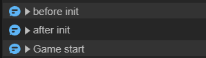

# Project entry description

> Author: Charley, Meng Xingyu
>

The project entry is the first place where the project is executed after the engine is initialized.

For large projects, it is usually the entry point for resource preloading and global initialization. For micro products that do not require preloading, it is usually the main interface and global entry logic.

## 1. Startup scene

### 1.1 A must-read for LayaAir2.0 users, the entrance has changed

In the LayaAir2.x engine, the Main class is used as the entry class of the project, so the initial configuration of some engines can only be set through code in the entry class (Figure 1-1).



(Picture 1-1)

However, in LayaAir 3.0, in order to simplify developers' understanding and process, the entrance to the project no longer appears in the form of an entrance class. The entrance to the project becomes the startup scene. The initial configuration of the engine only requires visual configuration in the IDE. More on this below.

> Old users of LayaAir 2.0, don’t look for the Main entry class anymore, it has been killed~

### 1.2 Set startup scene

For the LayaAir 3.0 engine, the startup scene can only be set in the IDE as the entry point of the project. If you need to initialize the engine global configuration, configure it directly in the IDE's project settings. If you need code logic, you can directly associate the script with the scene to execute the code logic.

In this section, we first introduce how to set up the startup scene.

We open the `Build Release` panel in the `File` navigation menu. As shown in Figure 1-2,

 

(Figure 1-2)

The `Startup Scene` of the `Build Release` panel is used to specify the startup scene of the project, as shown in Figure 1-3.

 

(Figure 1-3)

Developers can select a scene file in the pop-up panel and designate it as the startup scene. The operation is as shown in the animation 1-4.



(Animation 1-4)

### 1.3 Engine configuration items before project entry

Before executing the project entry, developers can also configure some engine initialization settings, as shown in Figure 1-5. We open the `Project Settings' panel and configure it directly in the engine options.



(Figure 1-5)

For specific parameter setting instructions, please refer to the document ["Project Settings Detailed Explanation"] (../projectSettings/readme.md).

### 1.4 Entry settings for preview operation

After the startup scene is released online in the build release, it is undoubtedly the first to be loaded and displayed as the entrance to the project.

However, when debugging the project in preview and run, we sometimes do not want to display the startup scene first, which will make the debugging process very long.

Therefore, click the drop-down arrow in the red circle in Figure 1-6, and click the check box to use `Start Scene` or `Current Scene` as the **entry** for preview running.


(Figure 1-6)

> The current scene refers to the scene currently open for editing in the IDE.


## 2. Entry logic script

Although this knowledge point is not exclusive to the project entrance, we still briefly talk about the process.

First of all, LayaAir 3.0 does not recommend developers to use custom scripts as the entry point for projects. Therefore, from a normal process, the logic of the code must follow the entrance scene, and the corresponding logic is executed through the life cycle methods of the entrance scene activation and adding to the stage and other engines.

For the 3D root node Scene3D of the scene, the only scripts that can be bound are custom component scripts. The 2D root node of the scene, Scene2D, can also bind UI component scripts in addition to custom component scripts.

> Regarding the difference and use of custom component scripts and UI component scripts, please refer to relevant documents. This article only introduces the core process of project entry.
>
> For customized component scripts (decorator exposed properties, event methods, life cycle methods, etc.), please refer to [*Entity Component System (ECS)*](../../common/Component/readme.md)
>
> UI component scripts (associated UI components, differences from custom component scripts, etc.) please refer to *[UI Inheritance Class](../../../IDE/uiEditor/runtime/readme.md)*


### 2.1 Basic usage process of custom component scripts

**Customized component script** inherits from the Laya.Script class and defines the component's event methods and its own life cycle methods.

Animation 2-1 demonstrates how to add custom component scripts to Scene2D nodes. In the `Property Settings` panel, click `Add Component`->`New Component Script`, then you can rename the script to be created (renamed to aaa in the picture), and finally click `Create and Add` to create it script.



(Animation 2-1)

 According to the custom component script aaa.ts added in the above animation, a script template class named aaa is generated, as shown in Figure 2-2. Just write the code directly in the script.



(Figure 2-2)

> [!Tip]
>
> For specific component script usage documentation, please refer to [*Entity Component System (ECS)*](../../common/Component/readme.md)


### 2.2 UI component script

In addition to custom component scripts, UI component scripts can also be used as the logic code for project entry.

> UI components are mainly used in 2D scenes when there are many nodes that need to be managed, and in application scenarios where parameters need to be passed to the scene when opening the scene (such as dynamic prompts for pop-up windows, etc.).
>
> UI components can be used independently or simultaneously with component scripts.

**UI component script** needs to be added at the `UI runtime (Runtime)` property entrance, as shown in Figure 2-3. And, only in the Scene2D node of the scene or the `Property Settings` panel of the 2D prefab



(Figure 2-3)

> 2D prefabs have the UI runtime (Runtime) attribute as long as they are root nodes.

The following takes the Scene2D node as an example to introduce how to create a UI component script. Double-click the mouse in the `UI Runtime` attribute input box. The IDE will pop up a window prompting you to create a UI component script file. The default is `RuntimeScript.ts`. Developers can rename it, such as GIF 2. -BBB shown in 5, click `Save` to create the script.


(Animation 2-5)

> It is recommended to first learn custom component scripts and their usage, and then learn the related content of UI component scripts.


## 3. Custom initialization

Because of the previous process, the engine was initialized first, and then the entry scene was loaded and started. However, in some special cases, developers may need to execute some logic before engine initialization, for example, they need to determine different operating environments in advance.

Then we also provide a customized code flow, using `Laya.LayaEnv.beforeInit` to define the logic to be executed before the engine is initialized, and using `Laya.LayaEnv.afterInit` to define the logic to be executed after the engine is initialized.

For example, when a developer creates a project, a `Main.ts` will be automatically generated and the following code will be added:

```typescript
Laya.LayaEnv.beforeInit = function(config: Laya.IStageConfig) {
	//This method will be called before Laya.init
	console.log("before init");
	//Here you can make customized modifications to config, Laya.Config, and Laya.Config3D.
}

Laya.LayaEnv.afterInit = function() {
	//This method will be called after Laya.init
	console.log("after init");
}

const { regClass, property } = Laya;
@regClass()
export class Main extends Laya.Script {

	onStart() {
    	console.log("Game start");
	}
}
```

It should be noted that you need to ensure that the script file where these codes are located is referenced in the scene, otherwise the unused code in the project will be eliminated when the version is released, and it will be invalid.

**Note: If there are no special needs, it is not recommended to use the method in this section to initialize the game. Developers should use the method of mounting component scripts for scenes. **

You can see the output when running, as shown in Figure 3-1:



(Figure 3-1)


