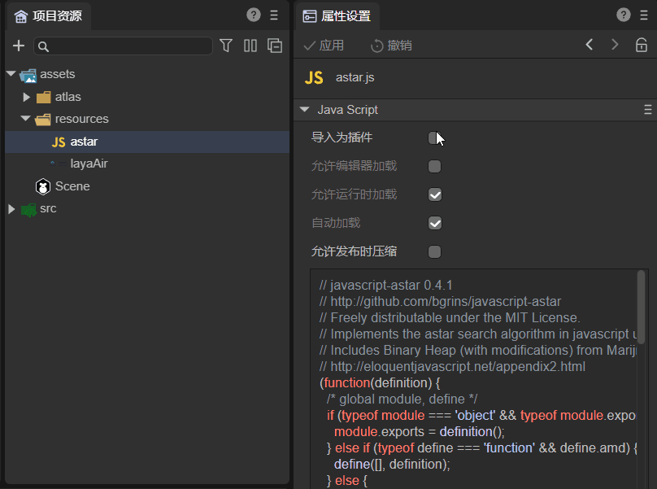
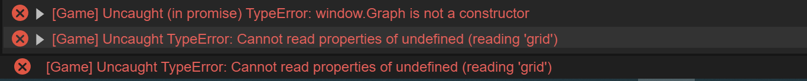
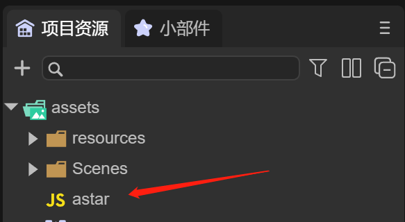
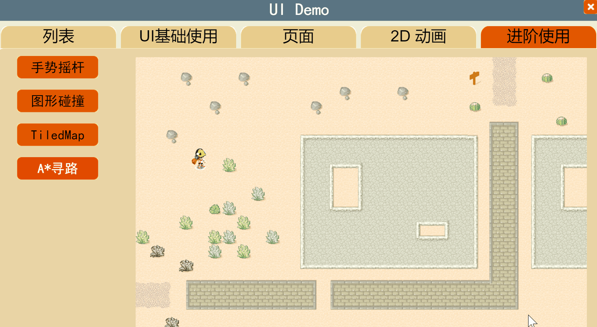

# Reference third-party JS module


The AStar pathfinding algorithm is used in the examples in this section, so I will write it in front and give a rough introduction. In the 2D entry example of LayaAir3.0 engine, as shown in Figure 1,


(figure 1)

There is an example of 2D A* pathfinding. Developers can first use this example to understand how to use it in 2D projects, as shown in animation 2.


(Animation 2)

The working principle of the A* algorithm will not be introduced here. Developers can search the Internet for the specific implementation of the algorithm. Simply put, it is a very commonly used path finding and graph traversal algorithm. It has better performance and accuracy.


## 1. Use commands to introduce third-party modules

### 1.1 Support method

During the development process, if you need to use some third-party libraries, the recommended solution is to use the module function of JS.

Proceed as follows:

1. Execute npm init in the project folder to initialize the project.
2. Use npm install xxx --save to install the xxx package.

Then use the import statement in the code to import it.


### 1.2 Usage examples

We use the third-party AStar module to explain:

#### 1.2.1 npm init

Using npm init during development will generate a pakeage.json file. This file is mainly used to record the detailed information of the project. It will record the packages we will use in project development, as well as the detailed information of the project. in this project.

Executing npm init needs to be executed in a DOS window. We can open the window with the windows+r key, then enter CMD to execute, and then the DOS window can be opened. After opening the window, enter the directory where your project is located in the DOS window. After entering the directory where the project is located, we can directly execute npm init. After executing npm init, we will be asked to fill in some configuration information. If we still don’t know how to fill it in, we can press Enter all the way.

package name: project name;

version: version number;

description: description of the project;

entry point: entry file of the project;

test command: What command should be used to execute the script file when starting the project;

git repository: If you want to upload the project to git, you need to fill in the git warehouse address (the address will not be written here);

keywirds: project keywords (not written here);

author: the author’s name (not written here);

license: the certificate required for the release project (not written here);

As shown in Figure 1-1,


(Picture 1-1)


#### 1.2.2 npm install xxx --save

Take npm installation of AStar as an example, as shown in Figure 1-2.


(Figure 1-2)

The astar package will be installed into the node_modules directory, and astar will be added under the dependencies attribute of package.json.

Take a look at the contents of package.json:

```json
{
  "name": "test",
  "version": "1.0.0",
  "description": "",
  "main": "index.js",
  "bin": {
	"test": "bin/bundle.js"
  },
  "scripts": {
	"test": "echo \"Error: no test specified\" && exit 1"
  },
  "author": "",
  "license": "ISC",
  "dependencies": {
	"astar-typescript": "^1.2.5"
  }
}
```

Next, we can use import AstarFinder in our code. The sample code is as follows:

```typescript
import { AStarFinder } from "../node_modules/astar-typescript/dist/astar";


const { regClass, property } = Laya;

@regClass()
export class Main extends Laya.Script {

	private aStarInstance: AStarFinder;

	onStart() {
    	console.log("Game start");

    	// 0 represents a path, 1 represents an obstacle
    	let myMatrix = [
        	[0, 0, 0, 0, 0, 0, 0, 0],
        	[0, 0, 0, 0, 0, 0, 0, 1],
        	[0, 0, 1, 1, 0, 1, 1, 0],
        	[0, 0, 1, 0, 0, 0, 1, 0],
        	[0, 0, 0, 0, 0, 0, 1, 0],
        	[1, 1, 1, 0, 1, 0, 1, 0],
        	[0, 0, 0, 0, 1, 0, 1, 0],
        	[0, 0, 1, 0, 0, 0, 0, 0]
      	];
     	 
    	this.aStarInstance = new AStarFinder({
        	grid: {
          	// column major matrix
          	matrix: myMatrix
        	}
      	});

    	let startPos = { x: 0, y: 0 };
    	let goalPos = { x: 7, y: 7 };

    	let myPathway = this.aStarInstance.findPath(startPos, goalPos);
    	console.log(myPathway);
	}
}
```

By running this script in the IDE, the shortest route from point 0,0 to point 7,7 can be obtained, as shown in Figure 1-3


(Figure 1-3)

So far, the third-party module has been successfully imported into the project, will be automatically loaded in the IDE, and can be previewed and run normally. Through debugging with developer tools, you can see that the introduced AStarFinder class has been successfully integrated into the published code, as shown in Figure 1-4


(Figure 1-4)


## 2. Use third-party JS files in LayaAir IDE

In some special cases, if you need to use some third-party JS files directly, the IDE also provides a separate import function.

### 2.1 Support methods

First place the JS file into the assets folder or src folder of the project:

**Import as plugin**

Check "Import as plug-in" in the property settings. As shown in animation 2-1,



(Animation 2-1)

After checking, **Allow runtime loading** and **Automatic loading** are checked by default, that is, this script will be automatically loaded at runtime.

**Allow editor to load**

If "Allow editor loading" is checked, the script will also be loaded in the editor environment.

> **Note that JS scripts should not modify the global environment, otherwise it will affect the stability of the editor. In addition, once the JS script is loaded, there is no unloading and refreshing functions. If the JS file is modified, the editor needs to be refreshed for it to take effect. If unchecked, this script will not be loaded until preview, run or publish. **

**Allow compression on publish**

Check "Allow compression when publishing". When building and publishing, if "Compress JS files" is set, this script will be compressed.

**Depends on others**

"Depend on others" can set up multiple scripts, and these scripts will be scheduled to be loaded first.


### 2.2 Usage examples

In the 2D entry example, if you run "A* Pathfinding" under "Advanced Usage" without importing astar.js, and click on any area, the character will not move at all, as shown in Figure 2-2


(Figure 2-2)

Since the IDE itself does not support the Astar class library and has not imported the Astar class library, an error will be reported during runtime, as shown in Figure 2-3.



(Figure 2-3)

Therefore, we need to introduce Astar.js to support the A* algorithm. Download [astar.js](https://github.com/bgrins/javascript-astar/ from the official website https://github.com/bgrins/javascript-astar/ blob/master/astar.js)

Put astar.js into the assets directory, or the src directory. Here we take assets as an example, as shown in Figure 2-4



(Figure 2-4)

Click astar.js, in the properties panel, check "Import as plug-in" and click "Apply", as shown in Figure 2-5


(Figure 2-5)

At this point, astar.js has been imported into the IDE as a plug-in and will be automatically loaded during preview and release.

Run the 2D example again to view the A* pathfinding example, as shown in animation 2-6



(Animation 2-6)

It is running normally. Next, let's test the release. As shown in Figure 2-7, in the web directory after release, astar.js has been released to the js directory.


(Figure 2-7)

And is introduced in release\web\index.html, as shown in Figure 2-8,


(Figure 2-8)

After running the released project, A* pathfinding still runs normally. Developers can also use "Allow editor loading" and "Depend on others".

> Run the released project reference [*Web Release*](../../../released/web/readme.md).


