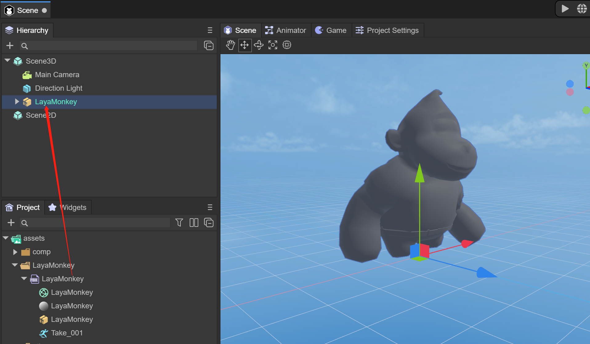
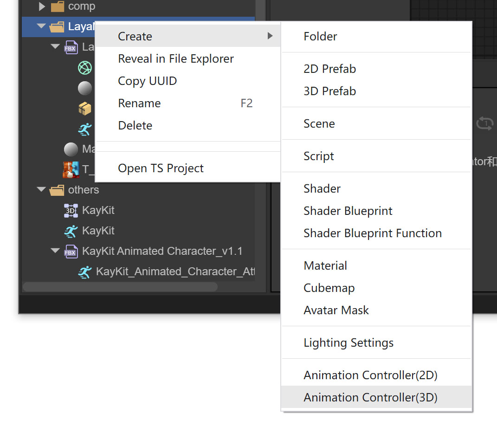
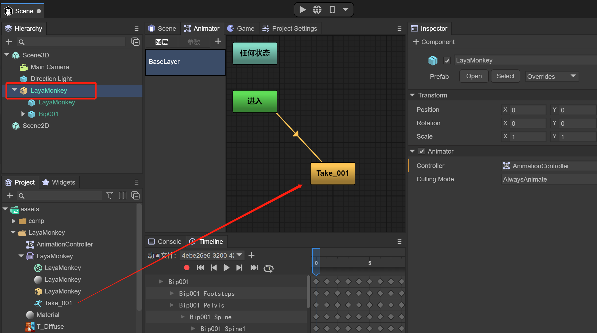
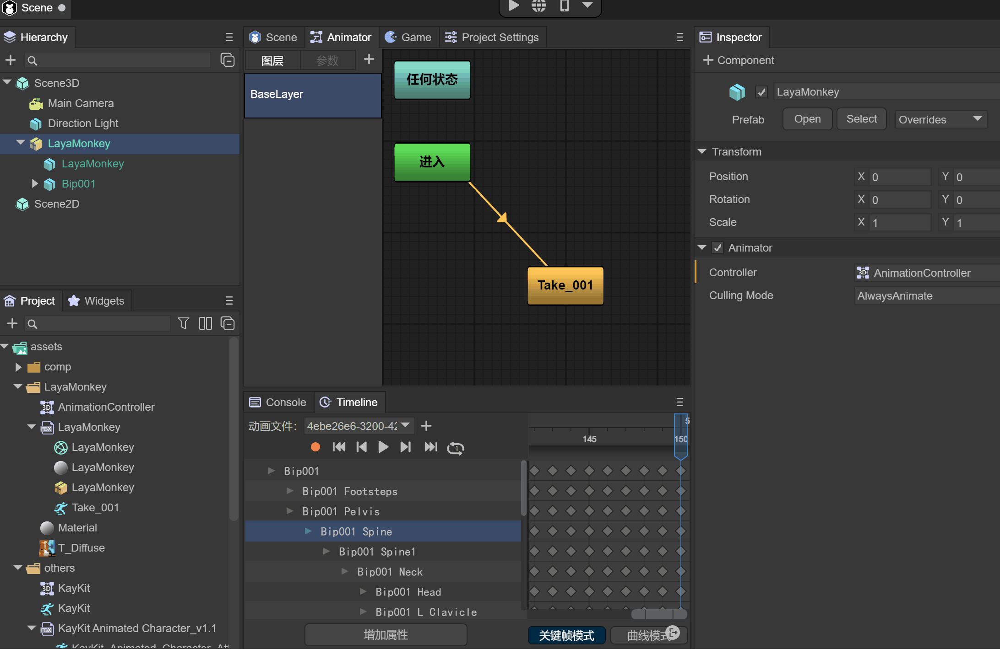
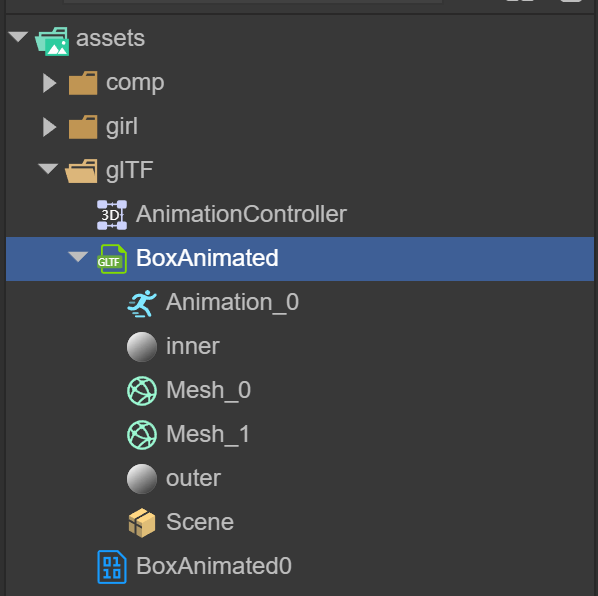
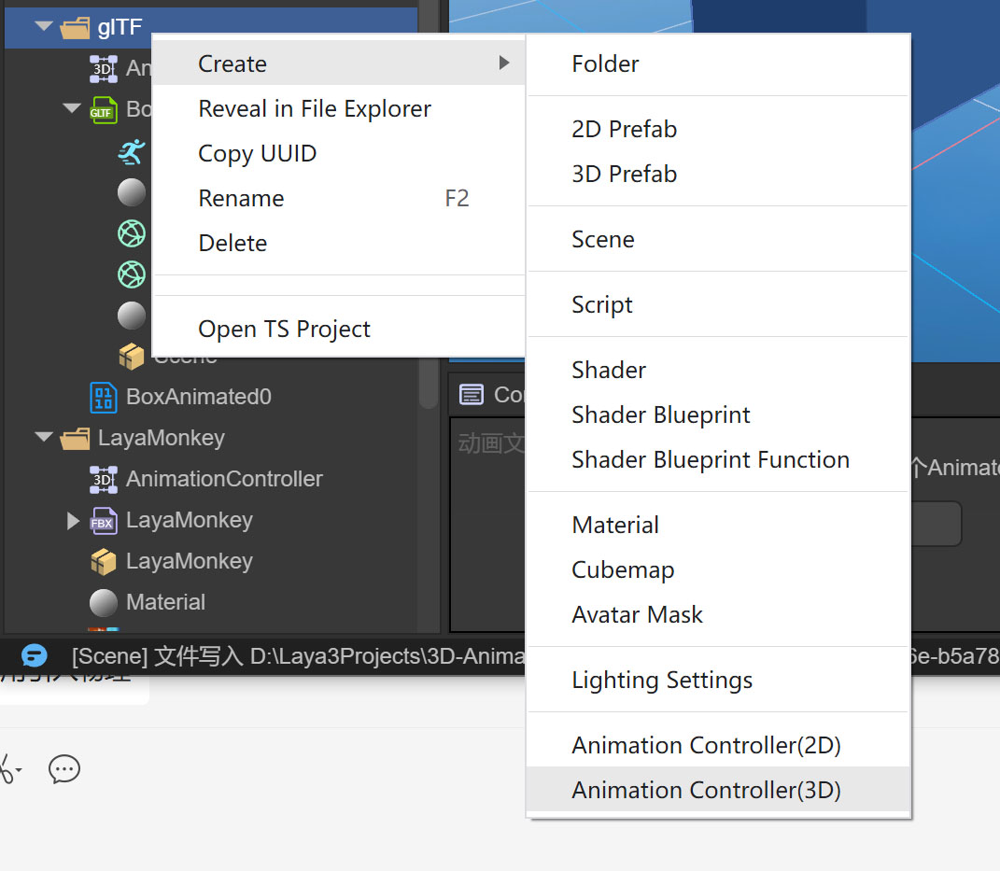

# Import and use of 3D animation


## LayaAir currently supports imported 3D animations

- ### **Skeleton Skin Animation**

- ### **Rigid body animation**

 

## 1. Skeleton skinning animation

Only relatively simple animations can be produced in LayaAir. If you want complex animations, such as animations of characters running, you must create them in external software and import them into LayaAir for use. Usually we need to use 3dMax software to make models and animations, and export them to Fbx format files. The following will introduce how to import 3D models and animations.

### 1. Import model files

Put Fbx into the Assets directory


(figure 1)

Open LayaAir IDE. The IDE will recognize the Fbx file and can expand the Fbx file. You will see the file information in Figure 2. Take_001 is the skeleton skin animation file that comes with Fbx and is also its own standby animation.

Drag Fbx into the Scene3D scene, you can see the model, but there are no textures and animations. Let’s first introduce how to add materials and textures to LayaMonkey.



(figure 2)


### 2. Texture setting association

Place the texture file under Assets


(image 3)

You need to create a material file to configure textures and other information for the model.


(Figure 4)

Click on the newly created Material file. You can see a lot of configuration information on the right. Here we only need to drag the texture file into the material file.


(Figure 5)

Drag the material file into the Materials of LayaMonkey's SkinnedMeshRenderer component


(Figure 6)

You can see that the model already has texture effects


(Figure 7)


### 3. Import and use of skeleton skin animation

Here's how to add animation to LayaMonkey

When the Fbx file is dragged into the Scene3D scene, the Animator component will be automatically added. If not, you can add the Animator component yourself and ensure the AlwaysAnimate mode.


(Figure 8)

At this point, we need to create an AnimationController file, which is the 3D animation state machine



(Figure 9)

Drag the newly created Animation Controller file into the Animator component


(Figure 10)

After double-clicking the AnimatorController, drag the Take_001 animation file into the Animator window



(Figure 11)

Click the Scene window again and click on the animation file preview below to see the animation effect.



(Figure 12)

When you run the IDE at this time, you can play LayaMonkey animations, or you can drag LayaMonkey into the Assets directory as a prefab for easy reuse or code implementation.


(Figure 13)


### 4. Use of multiple individual bone skinning animation files

In most cases, the Fbx file exported by a model containing animation will contain both mesh information and animation information, but there are also some cases where the Fbx file only needs to export animation information. For example, if there are many animations in the same model, only one mesh information is needed, and other animation information can be exported through separate model files (without mesh information). When making animations, you should consider the reuse of animations for similar models in the scene. For example, different humanoid characters might all use the same walking and running animations. Animations can be reused as long as the skeletal structure is kept consistent.

In Figure 14, taking girl as an example, we put the Fbx file without animation information and multiple Fbx files with only animation into Assets


(Figure 14)

After creating the AnimatorController, drag the standby and running animations into the Animator window to modify the animation name.


(Figure 15)

> Note: The idle animation is the default animation at this time

As shown in Figure 16, we can preview the standby and running animations separately, and set whether to loop.


(Figure 16)

Multiple individual bone skinning files are set successfully, and individual animations can also be set to other models for reuse.


### 5. Code running example

With the following code, we can load the girl prefab in any scene, add it to the scene, and click the screen with the mouse to switch animations

```
import { MainBase } from "./Main.generated";
import KeyBoardManager = Laya.InputManager;
import Keyboard = Laya.Keyboard;
const { regClass, property } = Laya;

@regClass()
export class Main extends MainBase {

	private _animator: Laya.Animator;
	private _isRun: boolean;
	onAwake() {
    	console.log("Game start");
    	//Load the specified model prefab and add it to the Scene3D scene
    	Laya.loader.load("girl/girl.lh").then(res => {
        	let girl : Laya.Sprite3D = res.create();
        	this.scene3D.addChild(girl);
        	//Get Animator
        	this._animator = girl.getComponent<Laya.Animator>(Laya.Animator);
    	}); 	 
    	this.on( Laya.Event.MOUSE_DOWN, this, this.switchAni );
	}

	switchAni(): void {
    	if (this._isRun) {
   		 //Play the corresponding animation
        	this._animator.play("idle");           	 
    	} else {
   		 this._animator.play("run");
    	}  
    	this._isRun = !this._isRun;
	}    
}
```


## 2. Rigid body animation


### 1. Import glTF or fbx files

Put glTF into the Assets directory and open LayaAir IDE. The IDE will recognize the glTF file and expand the glTF file. You will see the file information in Figure 17, where Animation_0 is the rigid body animation file that comes with glTF.

 

(Figure 17)

Drag glTF into the Scene3D scene, you can see the model, but there is no animation. Let’s first introduce how to use animation.


(Figure 18)

### 2. Import and use of animation

When the glTF file is dragged into the Scene3D scene, the Animator component will be automatically added. If not, you can add the Animator component yourself and ensure the AlwaysAnimate mode.


(Figure 19)

At this point, we need to create an AnimationController file, which is the 3D animation state machine



(Figure 20)

Drag the newly created Animation Controller file into the Animator component


(Figure 21)

After double-clicking the AnimatorController, drag the Take_001 animation file into the Animator window

 

(Figure 22)

When you run the IDE at this time, you can play rigid body animation, or you can drag BoxAnimated into the Assets directory as a prefabricated body for easy reuse or code implementation.


(Figure 23)


