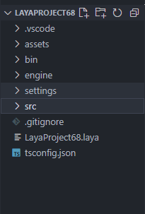
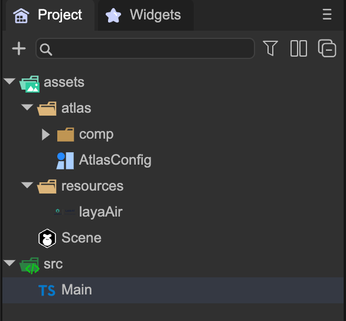
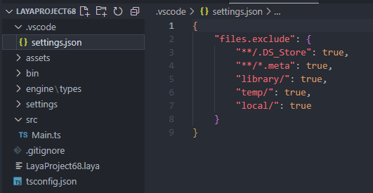
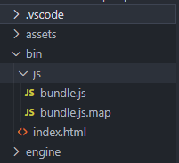

# Project engineering directory description

> Author：Charley

## 1. Overview of directory structure

The project created by LayaAir IDE consists of five visible directories and several root directory files. The effect is shown in Figure 1.

(figure 1)

### 1.1 Project files

The file with the `.laya` suffix is ​​the LayaAir engine project file and is used to identify whether it is a LayaAir engine project, version information, and projects with different names.

### 1.2 ts compilation configuration file

Since the LayaAir3.0 project only supports TS language development, a `tsconfig.json` is also created by default.

`tsconfig.json` is used to configure TS compilation options and is located in the root directory of the project.

If you want to know the details of this configuration, please go directly to the TS language documentation:

https://www.tslang.cn/docs/handbook/tsconfig-json.html

https://www.tslang.cn/docs/handbook/compiler-options.html

## 2. Directory of daily development

In the project directory structure of LayaAir 3.0, there are only two directories that developers really need to care about, the project resource directory assets and the project source code directory src. For other directories, everyone knows their functions.

### 2.1 Project resource directory assets

The assets directory is a relatively important project directory. All our scenes and resources are in the assets directory. The IDE's management of project resources comes from this directory.

The effect is shown in Figure 2-1:

(Figure 2-1)

This catalog is closely linked to the final release,

For example, resources introduced in assets in the scene will be automatically copied to the publishing directory.

The resources referenced in the code must be placed in the resources directory before they will be copied to the release directory.

### 2.2 Project source code directory src

The source code directory in src is as shown in Figure 2-2.

(Figure 2-2)

> [!Tip]
>
> The source code directory is easier to understand.
>
> For users of LayaAir 1.0 and 2.0, please note that Main.ts is no longer the entrance, it is just a sample script created by default.
>
> The entrance is the startup scene set in the IDE. The runtime class or script bound to the startup scene will run following the startup scene and serve as the entrance to the project.

## 3. Other directories

For other directories, developers only need to know their functions. In daily development, developers basically do not need to deal with them.

### 3.1 vscode configuration directory.vscode

Since the recommended coding environment for the LayaAir project is vscode, when creating the project, settings.json is created in .vscode, as shown in Figure 3-1:

  

(Figure 3-1)

Settings.json currently only configures some files that need to be hidden and displayed to make the project look more "neat".

`.DS_Store` are some system files generated under MacOS system, so there is no need to see them.

`.meta` is a file used by the IDE to identify and manage files, and developers do not need to pay attention to it.

The `Library, temp, local, and settingst` directories are only used by the IDE for system configuration and are not expected to be modified by developers, so they are also hidden.

### 3.2 Local running directory bin

Developers usually don't need to take care of the bin directory. During the development process, the assets directory can be used as the root directory for resource use.

The bin directory contains only the entrance to the index.html homepage of the test run and the IDE's built-in code entrance. As shown in Figure 3-2:

  

(Figure 3-2)

> [!Tip]
>
> Developers should try not to modify the entry here and store resources in the bin directory. This is very different from LayaAir 1.0 and 2.0.

### 3.3 Project library directory engine

The engine directory stores the declaration file of the engine library, as shown in Figure 3-3, and usually does not need to be moved.

(Figure 3-3)

If the developer refers to a third-party class library, the declaration file can also be placed here.

