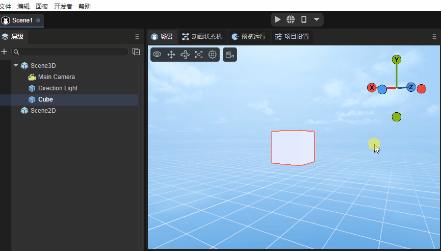
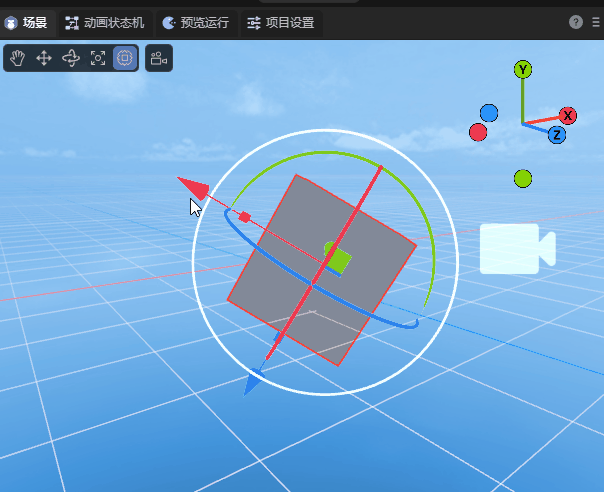

# IDE shortcut keys and mouse interactive operations encyclopedia

> Author: charley

The basic interaction of IDE is divided into keyboard input, shortcut keys, mouse interaction, and the function combination of mouse and keyboard.

This article will introduce the basic interaction of IDE, understand all function key combinations, give full play to the advantages of both hands, and improve development efficiency.

> The keys in the document are all based on the Windows system keyboard. The Command key on the Mac system keyboard corresponds to the Ctrl key and will not be explained separately.

## 1. Common basic interaction

The hierarchy panel, property panel, project panel, etc. are all places where almost every function can be used, so we first introduce these common basic interactions.

### 1.1 Switch panel display level

In the IDE's function panel, developers can drag and drop the layout at will. When they are in the same window, the display level will be determined based on the click switching of the panel label. As shown in Figure 1-1.

(Animation 1-1)

In addition to clicking on the panel label to switch, we can also use the following shortcut keys to switch to some commonly used panels:

| Function name	| Operation	|
| ------------------- | -------- |
| Scene panel Scene	| Ctrl + 1 |
| Run panel Game	| Ctrl + 2 |
| Property panel Inspector | Ctrl + 3 |
| Hierarchy panel | Ctrl + 4 |
| Project resource panel Project | Ctrl + 5 |
|Console panelConsole | Ctrl + 6 |
| Timeline panel Timeline | Ctrl + 7 |

### 1.2 Common operations on files and nodes

#### 1.2.1 Rename: F2

Whether it is the name of the node or the file or folder, use the shortcut key `F2` to enter the rename mode.

If it is a mouse operation, `click to select`, wait half a second and then `click` again, which is also equivalent to F2.

#### 1.2.2 Copy, paste, delete, select

Whether in the hierarchy panel, project panel, or scene panel, you can use the following shortcut keys to select a node object or file:

| Function name | Operation	|
| ---------- | --------------------- |
| copy	| Ctrl   +  C       	|
| Paste	| Ctrl   +  V       	|
| Delete	| Delete            	|
| Select all	| Ctrl   +   A      	|
| Select a single | Left click of the mouse	|
| Multiple selection	| Ctrl + left mouse click |
| Continuous multiple selection | Shift + left mouse click |

### 1.3 Common operations of the hierarchical panel

#### 1.3.1 Create empty node

In addition to creating nodes through the right-click menu of the mouse, you can also use the following shortcut keys to quickly create empty nodes.

| Function description	| Operation	|
| -------------------------------------------- | ------------------------ |
| Under the root node, create an empty child node	| Ctrl   +  shift   +   N  |
| Create an empty child node for the current selected node	| Everything	+   shift  +   N |
| Create an empty parent node for the current selected node (multiple selections possible) | Ctrl	+  shift  +   G  |

> The empty node of 2D is Sprite, and the empty node of 3D is Sprite3D.

#### 1.3.2 Expand all sub-nodes: Alt + left mouse click

In the case of forward expansion, click the triangular arrow in front of the node to expand a layer of child nodes.

When you use the `Alt + left mouse button click` combination function key, you can directly expand all hierarchical nodes below it, as shown in the animation 1-2.

(Animation 1-2)

#### 1.3.3 Sequence adjustment of hierarchical panels

##### 1. Drag and drop as a subordinate node of the target node

When selecting a node and holding down the left mouse button, drag the node to the target node. When the target node displays a green rectangular frame, release the left mouse button to become a child node of the target node. The effect is as shown in the animation 1. -3 shown.

(Animation 1-3)

##### 2. After dragging it to the same level of the target node

When a node is selected and the left mouse button is pressed, drag the node to the target node. When the green line is below the target node, release the left mouse button to change the position of the node to the same level behind the target node. The effect is shown in the animation 1-4.

(Animation 1-4)

##### 3. Drag and drop to the target node before sibling

When a node is selected and the left mouse button is pressed, drag the node to the target node. When the green line is above the target node, release the left mouse button to change the position of the node to the front of the target node at the same level. The effect is shown in the animation 1-5.

(Animation 1-5)

> It should be noted that 2D nodes can only be dragged arbitrarily under Scene2D, 3D nodes can only be dragged arbitrarily under Scene3D, and 2D and 3D nodes cannot be dragged under each other's nodes.

### 1.4 Common operations of levels and scenes

#### 1.4.1 Window focus of 3D nodes: F

Whether it is the hierarchy panel or the scene, after selecting a node, use the shortcut key `F` to focus the window camera on the node. The effect is shown in the animation 1-6.

(Animation 1-6)

> Double-click a 3D node with the left mouse button to focus the window camera on the node.

#### 1.4.2 Copy and paste nodes: Ctrl + D

Whether it is a 2D node or a 3D node, after selecting the node in the hierarchy panel or scene panel, you can copy and paste the node through the shortcut key `Ctrl + D`.

### 1.5 Run preview function

After the developer completes editing in the LayaAir IDE, three running preview methods are provided, namely running preview in the IDE, running preview in the browser, and running preview by scanning the QR code on the mobile phone. The buttons are shown in Figure 1-7.

(Figure 1-7)

In addition to mouse click operations, the above functions also provide the following shortcut keys:

| Function description	| Operation	|
| ---------------- | ----------------------- |
| Run preview in IDE	| Ctrl   +  P         	|
| Run preview in browser | Ctrl + Shift + P |
| Scan code with mobile phone to run preview | Ctrl + Shift + O |

### 1.6 Property panel operation

#### 1.6.1 Sliding input of attribute values

When the attribute value is a numeric type, and the mouse moves over the input box, the mouse style will be converted to a two-way arrow style.

At this time, you can slide in the direction of the arrow to change the value, or you can click on the direct input box to enter it through the keyboard.

#### 1.6.2 Attribute saving: Ctrl + S

Whether you change attributes in the attribute panel or operate in the scene, the attribute values ​​will change.

If you confirm the changes, you can save them with the shortcut key `Ctrl + S`.

> Saving is universal, and the subsequent functions will not be repeatedly introduced for saving.

## 2. 2D scene window interaction

When in a Scene2D node or 2D Prefab node, the 2D scene view window is launched. The following shortcut keys are currently supported:

| Function description	| Operation	|
| ---------------- | -------------------------- |
| Pan view stage	| Middle click and long press and drag, right click and long press and drag |
| Scroll window content up and down | Mouse wheel	|
| Zoom window content	| Ctrl + mouse wheel	|

The effect is shown in the animation 2-1:

(Animation 2-1)

## 3. 3D scene window interaction

In 3D scenes, there are mainly two types of basic operations.

First, changing the camera position and angle of the scene window allows developers to observe the 3D scene world just like their own eyes.

The second is to change the position and angle of the model and place the model in an appropriate position in the scene.

>For details on 3D scene window interaction, please view the document [Basic Interaction of 3D Scene Editing](../../../IDE/sceneEditor/basic/readme.md).

### 3.1 Operating the window camera

#### 3.1.1 Rotate window camera: right mouse button

In a 3D scene, just keep pressing the 'right mouse button' to enter the window camera rotation mode, and release the 'right mouse button' to exit the window camera rotation mode.

In this mode, by moving the mouse in the direction of the screen, you can change the angle of the window camera and observe the entire scene from any angle. The effect is as shown in animation 3-1.

(Animation 3-1)

#### 3.1.2 Spatial displacement window camera:

When you hold down the right mouse button + keyboard function keys, you can press the camera up, down, left, and back. The specific function keys are as follows:

| Function description	| Operation	|
| ---------------- | ------------- |
| Camera `up` displacement | Right mouse button + E |
| Camera `Down` displacement | Right mouse button + Q |
| Camera `left` displacement | Right mouse button + A |
| Camera `right` displacement | Right mouse button + D |
| Camera `forward` displacement | Right mouse button + W |
| Camera `backwards` displacement | Right mouse button + S |

The effect of shifting the window camera is shown in Figure 3-2.

(Animation 3-2)

> Up, down, front, left, right, is a relative direction. No matter it is rotated to any angle, it will be displaced in this relative direction.

**Displacement window camera acceleration:**

On the basis of the displacement window camera, hold down Shift to superimpose, and you can accelerate the movement based on the original function.

The operation keys are: right mouse button + shift + (E, Q, A, D, W, S)

#### 3.1.3 Displace the window camera in the screen: Q \ middle mouse button

In addition to using the right mouse button + keyboard function keys (E, Q, A, D) to move the window camera up, down, left, and right, you can also use the shortcut key Q or the middle mouse button to start the screen displacement in any direction.

When using the shortcut key Q, press the left mouse button and drag it to move the window camera in any direction on the screen. The effect is as shown in the animation 3-3.

(Animation 3-3)

To exit this mode, you need to use the shortcut keys of other modes, unless you need to continuously use this mode to move the window camera. Otherwise, it is recommended to use the middle mouse button to initiate screen displacement in any direction.

The middle mouse button mode will only enter this mode when pressed and dragged. Release the middle mouse button and it will automatically return to other modes.

#### 3.1.4 Window camera zoom: mouse wheel

Window camera zoom is essentially the front-to-back displacement of the window camera. Because during the displacement process, the object is observed based on the perspective principle of near and far, and there is an illusion of zooming, so it is called a zoom window camera. The effect is shown in the animation 3-4.

(Animation 3-4)

#### 3.1.5 Rotate the window camera around the focus center: Alt + left-click drag

When observing or operating a specific model, we may need to find a suitable angle that is not frontal. At this point, none of the methods introduced before are inconvenient. So any rotation around the target is the most suitable operation.

Before we can rotate the window camera, the first thing we need to do is focus and center the model on the window camera.

> The shortcut key for focus is F, which was introduced in 1.4.1 above.

After focusing, you can rotate around the focus center by dragging the left button to any angle through the combination of Alt + left button. The effect is as shown in the animation 3-5.

(Animation 3-5)

### 3.2 Operation model

There are four tools for operating models, namely displacement, rotation, scaling, and mixed use. Different tool modes can be started through the shortcut keys `W, E, R, T`.

| Shortcut key name | Button |
| ------------ | ---- |
| Model Displacement Tool | W	|
| Model Rotation Tool | E	|
| Model scaling tools | R	|
| Hybrid Edit Model | T	|

#### 3.2.1 Model displacement tool: W

After entering the model displacement tool mode through the shortcut key `W`, red, green and blue axes and pieces will appear on the model.

The three axes of red, green, and blue represent the three directions of X, Y, and Z respectively. The color of the axis corresponds to the coordinate axis in the upper right corner.

The direction pointed by the arrow is the positive direction. Dragging one of the axes will cause the model to move in the positive and negative directions of the axis. The effect is as shown in the animation in Figure 3-6.

(Animation 3-6)

> Pay attention to the attribute panel. If the model does not have any rotation (rotation is all 0), drag one of the axes, and only the attribute value of that axis will change. If there is rotation, it will affect other axis attribute values.

Three adjacent faces, blue is the XY face, green is the XZ face, and red is the YZ face.

By dragging one of the faces, the model can be displaced arbitrarily within the range of the face, as shown in the animation in Figure 3-7.

(Animation 3-7)

#### 3.2.2 Model rotation tool: E

After entering the model rotation tool mode through the shortcut key `E`, red, green and blue intersecting arcs and an outer white circle will appear on the model. When the mouse is drawn over the model, a translucent circle will also appear.

The red, green, and blue arcs represent the directions of the X, Y, and Z axes respectively, and the colors correspond to the coordinate axes in the upper right corner.

After selecting one of the arcs, it will turn into a complete circle, which means rotation along that axis. The effect is as shown in the animated picture 3-8.

(Animation 3-8)

The outer white circle is based on the vertical rotation of the screen, and the effect is shown in the animation 3-9.

(Animation 3-9)

If the mouse is dragged on the translucent circle, it can be rotated at any angle, as shown in the animation in Figure 3-10.

(Animation 3-10)

#### 3.2.3 Model scaling tool: R

After entering the model zoom tool mode through the shortcut key `R`, there are not only red, green and blue axes on the model, but also a central white block and an outer white circle.

The red, green, and blue axes represent the directions of the X, Y, and Z axes respectively. Pulling one of the axes will scale the mode on that axis. The effect is as shown in the animation 3-11.

(Animation 3-11)

The white block in the center and the white circle in the outer layer are both scaled on three axes at the same time. The only difference between the two is the difference in scaling rate. The effect is shown in the animation 3-12.

(Animation 3-12)

#### 3.2.4 Model tool collection: T

After entering the model tool collection through the shortcut key `T`, the model operation tools introduced above will be gathered together.

The only thing to note is that in blending mode, the scaling of the center block is no longer retained. It can only be scaled overall through the outer white circle, and scaled from a single axis by pulling the squares on each axis. The effect is shown in animation 3-13.

(Animation 3-13)

#### 3.2.5 Multiple selection of models

The multi-selection methods are box selection, Shift, and Ctrl.

The frame selection of the model is to use the mouse to pull up the rectangular area of ​​the screen. As long as it is within the rectangular area, it will be selected regardless of the distance.

In addition to box selection, you can also use Shift or Ctrl combined with mouse clicks to perform continuous multiple selections.

> Whether it is single selection or multiple selection, the selected model will have a red border.						 
>

## 4. Timeline animation editing shortcut keys

### 4.1 Shortcut keys for the timeline frame panel

| Function description	| Button	|
| ---------------------------------------------- | ---------- |
| Insert blank frame	| F5	|
| Delete blank frames	| Shift + F5 |
| Delete keyframes	| Delete 	|
| Copy keyframes	| Ctrl + C   |
| Paste keyframes	| Ctrl + V   |
| When the mouse is in the timeline frame panel operation, vertical scrolling display properties | Ctrl+wheel |

### 4.2 Shortcut keys for the timeline curve panel

| Function description	| Button	|
| ------------------------------------------------------------ | -------------- |
| Lock the frame scale panel (no scaling), centered on the mouse pointer, without limiting the precision of the scaling attribute scale panel. | Ctrl+Scroll Wheel	|
| Lock the attribute scale panel (no scaling), center the mouse pointer, and scale the precision of the frame scale panel without limit. (Unlimited zoom will cause the zoom to no longer be centered on the mouse pointer before zooming when the zoom is stretched to 0 frames visible). | Alt+scroll wheel	|
| Locks the attribute scale panel (without zooming), centered on the mouse pointer, and limits the accuracy of the scaled frame scale panel. (Always keep the mouse pointer as the center for zooming. When the zoom is stretched to 0 frames and visible, the scale precision is prohibited from being reduced and only the scale precision is allowed to be enlarged.) | Alt+Shift+Scroll Wheel |
| Keep holding down the Shift key to move keyframes and always maintain horizontal displacement. Both single and batch movements are valid. | Shift	|
| Keep holding down the Ctrl key to move keyframes and always maintain vertical displacement. Both single and batch movements are valid. | Ctrl	|

> Since there are detailed documentation related to timeline animation, I will not introduce it here. If you want to know more, please go to [Detailed Explanation of Timeline Animation Editing](../../../IDE/animationEditor/ timelineGUI/readme.md) document.

## 5. Blueprint Editor Shortcut Keys

### 5.1 Generate node shortcut keys

When you press and hold the shortcut key on the keyboard and click with the left mouse button, you can quickly generate different types of blueprint nodes.

| Function description	| Shortcut key combinations |
| --------------------- | ------------ |
| Quickly generate Float nodes	| 1 + left mouse button |
| Quickly generate Vector2 nodes | 2 + left mouse button |
| Quickly generate Vector3 nodes | 3 + left mouse button |
| Quickly generate Vector4 nodes | 4+ left mouse button |
| Quickly generate If nodes	| i + left mouse button |
| Quickly generate Boolean nodes | b + left mouse button |
| Quickly generate sampler2D nodes | t + left mouse button |

### 5.2 Blueprint mouse interaction

| Function description	| Button	|
| ---------------- | ----------------------- |
| Move the blueprint node as a whole | Middle mouse button\right button, press and drag |
| Overall zoom blueprint node | Mouse wheel	|

---

> Since there are detailed documentation related to the blueprint editor, I will not introduce it here. If you want to know more, please go to [Blueprint Editing Module](../../../IDE/ShaderBlueprint/readme. md) document.

