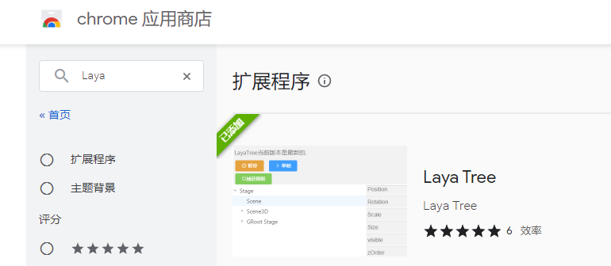
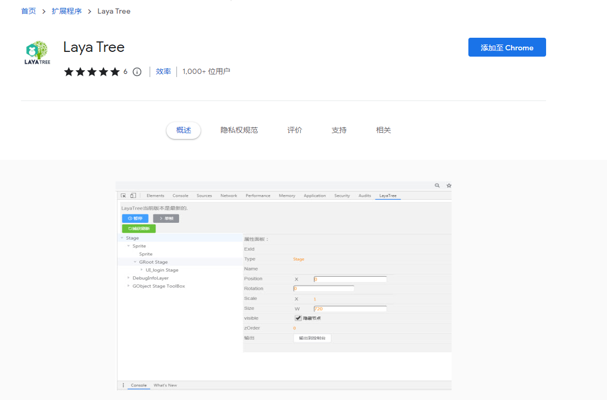

# LayaTree Debugging Tools

> Author: Li Er	 

> [!Note]
>
> LayaTree is a Chrome browser plug-in tool specially designed by Lear, the developer of LayaAir engine, for the majority of developers of LayaAir engine. This tool can debug and modify during the runtime phase of the project.

## 1. LayaTree installation

### 1.1 Add via Chrome App Store

> [!Tip|label:Tips]
>
> Add VPN through the Chrome App Store

 LayaTree has been put on the chrome browser online store, just search for laya. As shown below:

> Store address: https://chrome.google.com/webstore/

You can also directly enter the installation address in Chrome: https://chrome.google.com/webstore/detail/laya-tree/jnmdcbmpmfhnlchjdkcngihpjmgofajm?hl=zh-CN&authuser=0

As shown below:

### 1.2 Manual download and installation

You can also download it through the domestic zip package address (v1.0.5) provided by the author:

 LayaTree zip package: https://womenzhai.cn/LayaTree_V1.0.5.zip

**zip package installation method**

Open the Chrome browser and enter the **`chrome://extensions/` ** page

Turn on developer mode,

Just drag the decompressed crx file into this page and restart the browser after the installation is successful.

> [!Tip|label:Tips]
>
> One thing to note is: If the page that needs to be debugged is a file URL, you need to enable access to the file URL. Otherwise, the current laya engine cannot be recognized;

## 2. LayaTree usage

### 2.1 Entrance used

On the project page that needs to be debugged (the code needs to be unobfuscated), open the developer tools page (F12 or Ctrl+Shift+I)

Select the LayaTree tab, as shown below

### 2.2 Usage tips

#### 2.2.1 How to update the node tree list

The original design of LayaTree is to have as little impact on the game as possible and to be a quiet behind-the-scenes operator. Therefore, the node tree of the current page will not be updated in real time.
So you need to **manually click the `Capture Refresh` button to update the node tree list**. Or check the option to automatically refresh the node tree. As shown below:
 

After turning on the automatic refresh node tree function, you can see the changes in the scene level in real time, without the need to manually capture the refresh. When there are many scene levels, it will slightly affect the accuracy of performance debugging. If you are performing performance tuning, it is recommended not to enable it (it is disabled by default). Daily debugging and development have not been affected.

#### 2.2.2 Adjust parameters at runtime: operate the Camera node

Example: To operate the Camera node, you can operate the node's displacement, rotation and scaling by dragging and dropping with the mouse or entering numerical values.

Switch the camera's clearFlag via a convenient drop-down box. Turn HDR on or off.
In addition, the camera's FOV, far and near cropping area and ratio can be quickly and dynamically modified, which greatly facilitates lens adjustment.
Added orthographic camera switch orthographic.

#### 2.2.3 Adjusting parameters at runtime: setting click events and penetration control

When operating Sprite nodes, in addition to the displacement, rotation and scaling of conventional nodes, you can also dynamically set the hierarchical relationship zOrder, anchor point, and size.
In addition, there are also settings for click events and penetration control that are often used in development.

#### 2.2.4 Adjust parameters during runtime: edit text content directly

Operate text nodes and edit text content directly

Very easy to use color adjustment based on the color picker​

Use the drop-down boxes to select horizontal and vertical alignment of text

Font size, thickness, stroke, and overflow can be adjusted at will beyond the behavior.

#### 2.2.5 AOP-based pause and single-frame debugging operation

AOP-based pause and single-frame debugging operation can control the engine cycle without modifying the source code (it should be noted that the properties modified during pause will not be updated until the next frame, so when modifying data, click after the single frame Check)
Support TimeScale time scaling, support up to 50 times speed, enjoy the ghost and silky smoothness

#### 2.2.6 cacheAs optimization skills

cacheAs is "none" and no caching is done. When the value is "bitmap", caching the display object into a static image using renderTarget in webgl mode can greatly improve the rendering efficiency. However, the additionally created renderTarget object will increase the memory overhead. Through this Options allow you to easily switch modes and find optimization directions.

 

#### 2.2.7 Mark selected

Added mark selection function. After checking, a red box mark will be displayed when a 2d node is selected.

 

## 3. Tool services

LayaTreeQQ group: 200482074

