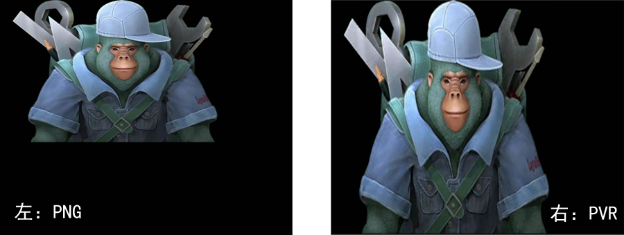
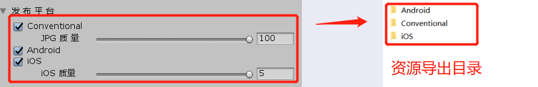
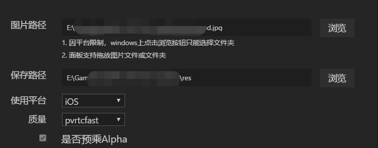
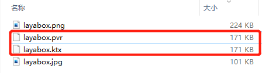

## Texture compression function introduction and usage instructions


### 1. First introduction to texture compression

Texture refers to the appearance effects such as the pattern and fineness of the surface of an object. In computer graphics, two-dimensional graphics are often used to describe surface patterns of three-dimensional models.

The image formats we see and use daily are mainly PNG and JPG. Although in some cases of three-dimensional and two-dimensional images, these images are also called textures, they are not texture formats and cannot be directly read by the GPU. and display. Therefore, these image files must first be decoded by the CPU into texture format and then transferred to the GPU for use.

The texture format is naturally a format that can be directly read and displayed by the GPU. Therefore, on the one hand, avoiding CPU decoding can reduce the performance pressure caused by calculations. On the other hand, reading and rendering directly can also avoid the overhead of decompressing the image into memory.

What are the texture formats? On the mobile side, the mainstream texture format on the Android platform is ETC (Ericsson Texture Compression), and the mainstream texture format on the iOS platform is PVRTC (PowerVR Texture Compression).

It should be noted that ETC1 does not support transparent channels, while PVRTC supports transparent channels. Although ETC2 supplements the transparent channels that ETC1 does not support, ETC2 needs to be in OpenGL ES 3.0 (corresponding to webGL 2.0). environment, and it is not yet fully popularized, so the LayaAir engine and tools only support ETC1 texture compression. In the future, when most mini game platforms support webGL 2.0, we will also follow up to support ETC2.

### 2. Several issues to pay attention to when using the texture compression function

Although the benefits of texture compression have been described in the previous article, we should be prepared if we are not fully aware of them. The desired effect may not be achieved.

#### 2.1. Source image width and height specifications for texture compression

Since different system platforms have different requirements for the width and height pixels of texture formats, the source images of texture compression (PNG\JPG) must also be designed accordingly according to the specifications, otherwise it may cause stretching and deformation.

Here, let’s look at an example of an error.

Figure 1 The left side is a PNG image with a width and height of `512*313`, and the right side is a PVRTC format image exported through the texture compression tool provided by the LayaAir engine.



(figure 1)

It's obvious after running that the texture compressed image is stretched. This is because under the iOS system, the texture compression format must have equal width and height and be a power of 2. Even if the Android system does not require the texture width and height to be equal, the width and height must be a power of 2, otherwise the tool will automatically forcibly stretch it. Therefore, at the beginning of the art design, it is necessary to communicate and confirm which ones require texture compression, and then adjust the source images that require texture compression according to the platform specifications.

#### 2.2. Differences between LayaAirIDE and LayaAir Unity plug-in

The texture compression tool in LayaAir IDE and the texture compression tool in LayaAir Unity plug-in are still different when used. You need to pay attention to them. They are introduced separately below.

##### 2.2.1 LayaAir Unity plug-in texture compression function

In the options of the LayaAir Unity plug-in and resource publishing platform, each option will correspond to an independent complete directory after exporting, as shown in Figure 2. Each directory contains complete export resources, except for the differences in texture resources and related path information.



(figure 2)

#### `Conventional`

The Conventional option in Figure 2 is a conventional export method. There will not be any texture compression file format in the export corresponding directory. The original one is JPG or JPG, PNG or PNG. Used to publish web version and debug effects on PC browser.

The JPG quality parameter setting refers to the compression ratio when exporting images in JPG format, with 100 being the highest. If the original image has been processed and you don’t want to change the quality, set it to 100.

#### `Android`

The Android option is texture compression for the Android platform. As long as it is a JPG image or a PNG image without a transparent channel, it will be converted into an ETC1 texture with the `.ktx` suffix. For PNG images with a transparent channel, the original PNG image will be exported directly without texture compression format conversion.

#### `iOS`

The iOS option is texture compression for the iOS platform. Whether it is JPG or PNG, it will be converted into a PVRTC texture with a `.pvr` suffix.

Some developers don't quite understand the usefulness and effects of iOS quality. There are 5 gears in total, and the values ​​are 1-5. The higher the number, the higher the picture quality, and the lower the number, the greater the loss of the compressed picture. In addition to the impact of picture quality, this quality number will also affect the length of texture compression conversion. The higher the number, the longer the texture compression conversion time.

However, it should be noted that no matter which picture quality level is selected, the video memory usage is the same. This quality value only affects the display effect and conversion time. Therefore, if a lower number can be used during the development stage, it is recommended to use free time to export it with high-quality values ​​before officially going online.

#### Please note

Finally, I would like to talk about some issues that everyone should pay attention to. In the texture compression function of the LayaAir Unity plug-in, whether it is the Android or iOS option, as long as the conversion conditions are met, all will be converted and exported. For example, a certain texture cannot be designed as a power of 2, but if it is not processed, it will After being converted and exported, it will also be stretched. Therefore, for textures that do not want to be converted and exported, their models should not be activated in the scene, so that they will not be converted and exported when the scene (Scene3D) is exported. This kind of texture needs to be exported separately using the preset (Sprite3D) and loaded separately for use.

#### 2.2.2 LayaAirIDE texture compression function

In LayaAirIDE, click Menu ->> Tools ->> Texture Image Conversion to open the interface shown in Figure 3.



(image 3)

Since the texture compression function in LayaAirIDE is for 2D, you can directly drag and drop a single texture image, or click Browse to select a directory that needs to be converted, then select the platform to be converted, and click OK to start the conversion.

#### `Use Platform`

The difference with the LayaAir Unity plug-in is that when the Android platform is selected, only JPG images will be converted. Even if PNG images do not have a transparent channel, the current tool will not convert them.

Select the iOS platform. Just like the function in the plug-in, all JPG and PNG in the directory will be converted.

#### `Quality`

The quality option is not required by Android, so it is grayed out and unselectable.

iOS is `pvrtcfastest\pvrtcfast\pvrtcnormal\pvrtchigh\pvrtcbest`, which is the same as the 1-5 quality in the LayaAir Unity plug-in. The quality is also related to the conversion time. pvrtcbest has the highest quality and requires the highest texture compression conversion time ( Use it when you have enough time, otherwise it will test your patience). The memory usage is the same.

#### Please note:

##### Problem with 2D atlas

For 2D atlases, since we do not recommend converting texture compression formats, the current version is not compatible with atlas conversion textures. However, considering recent feedback from developers that there is a need for atlas conversion, we decided to support it from the official version 2.8.0, but not support transparent atlases. Starting from the official version 2.12.2, transparent atlases are also supported. If you are a developer using an old version, you can contact the QQ group administrator or the official website business contact to ask for an upgrade patch for this function.

Although the engine and tools have decided to support texture conversion for atlases, there are still some issues to be aware of:

1. Texture compression is lossy compression. If the UI quality requirements are relatively high, it is recommended that the static 2D UI does not convert the texture compression format. 2D texture compression maps are often used in dynamic graphics, such as animations, or 3D textures.

2. Even if the quality loss after conversion can be accepted, it can only be used on the iOS platform. The current ETC1 texture compression format does not support atlases with transparent channels on Android.

3. The atlas is not generated by power by default. The iOS platform not only requires the power of the width and height, but also the power of a square with equal width and height. And the atlas generated by checking `Limit to powers of 2` in the atlas tool cannot guarantee that it will definitely be a square. Please pay attention to the size. If you must use it, if it is not enough, put some empty pictures to make up for it.

##### Transparent channel bug

Since texture compression files do not need to be pre-multiplied by Alpha in 3D, the 2D texture conversion tool misses this parameter, resulting in 2D textures with transparent channels losing the transparency channel on iOS. Therefore, in versions before the official version 2.8.0, you also need to contact the QQ group administrator or the official website business contact to ask for the upgrade patch for this function.

### 3. What is the optimization effect?

Since the texture compression format does not require CPU decoding, the instantaneous performance pressure caused by decoding is gone. However, if there is not a lot of processing, this process is not continuous, so it is not obvious.

The more significant optimization is still in the video memory. Let us still give an example to illustrate.

It is still the picture that came with the IDE before. After we change the width and height to `512*512`,

When there is nothing displayed on the stage, the initial video memory occupation is 2.31M. Using the texture compression format, only 170K is added, and the final size is 2.48M after adding the initial size. The original image increased by 1024K to 3.31M. As shown in Figure 4. Therefore, the effect of video memory optimization is still very obvious, with a reduction of about 83%.


(Figure 4)

Some developers still don't quite understand the relationship between video memory usage and files. Let me tell you a simple calculation basis here. If it is a non-texture compressed image, such as PNG and JPG, you directly use the `width*height*4` of the image pixels to determine the video memory usage.

Therefore, some games, in order to reduce the usage of video memory, make the width and height pixels of the picture smaller, and then use scaling to enlarge the display. However, in this way, although the memory usage is small, the quality loss is also large. Although texture compression is also lossy compression, it occupies less video memory for the same quality. Even when the quality is similar to the original image, it occupies less memory than stretching. Therefore, texture compression is a commonly used solution by developers to save video memory.

How to calculate the video memory usage of texture compression? In addition to the information on the statistics panel, there is also a relatively simple statistical solution. You can just check the size of the texture compressed file directly. For example, if the texture compressed file is 170k, then the video memory occupied is also 170k. For example, as shown in Figure 5.



### 4. Examples of using texture compression

Texture compression, except when using it, must distinguish resources. Some developers don't know much about the use and differences of 3D textures, 2D textures, and 2D atlases. Here are examples of each.

> This sample code uses TS language. If you use other languages, you need to convert the syntax by yourself.

#### 1. Use of 3D textures

3D png or jpg format texture loading uses `Laya.Texture2D.load()` to load texture resources. If you want to use texture compression format, you need to use `Laya.loader.load()` to load texture resources.

Sample code looks like this:

```typescript
//Detect Android platform
if (Laya.Browser.onAndroid) {
   	 //Pay attention to the loading here
    	Laya.loader.load("res/layabox.ktx", Laya.Handler.create(null, function (tex: Laya.Texture2D) {
            	material.albedoTexture = tex;
    	}));

} else {
   	 //Pay attention to the loading here
  		 Laya.Texture2D.load("res/layabox.jpg", Laya.Handler.create(null, function (tex: Laya.Texture2D) {
            	material.albedoTexture = tex;
    	}));
}
```

In addition, for iOS platforms that require a transparent channel, you also need to set a transparent blend `RENDERMODE_TRANSPARENT` on the material.

Sample code looks like this:

```typescript
//Detect iOS platform
if(Laya.Browser.onIOS){
    Laya.loader.load("res/layabox.pvr", Laya.Handler.create(null, function(tex:Laya.Texture2D) {
   	 material.albedoTexture = tex;
    	//Set transparent blending
    	material.renderMode = Laya.BlinnPhongMaterial.RENDERMODE_TRANSPARENT;
    }));
} else if (Laya.Browser.onAndroid) {//Detect Android platform	 
    	Laya.loader.load("res/layabox.ktx", Laya.Handler.create(null, function (tex: Laya.Texture2D) {
            	material.albedoTexture = tex;
    	}));
}else{
	Laya.Texture2D.load("res/layabox.png", Laya.Handler.create(null, function(tex:Laya.Texture2D) {
  	  material.albedoTexture = tex;
	}));
}
```

#### 2. Use of 2D textures

For 2D textures, the texture file needs to be preloaded first, and then it can be used directly.

Sample code looks like this:

```typescript
let textureFile: string = "";

if (Laya.Browser.onIOS) {
    textureFile = "res/layabox.pvr";
} else if (Laya.Browser.onAndroid) {
    textureFile = "res/layabox.ktx";
} else {
    textureFile = "res/layabox.png";
}
//Preload texture file
Laya.loader.load([textureFile], Laya.Handler.create(this, () => {
    this.aaa.skin = textureFile;
}));
```

#### 3. Use of 2D atlas

For the 2D atlas, just preload the atlas file. Since the texture compression file information will be automatically added to the atlas during texture compression conversion, the engine will detect whether the texture is included when loading the atlas. Compression conversion information, if included, will automatically identify the platform and load the corresponding texture compression format file, without the need for developers to determine the platform in the code.

> It should be noted that the pvr texture compressed file after the atlas conversion must be kept in the same directory as the atlas.

Sample code looks like this:

```typescript
Laya.loader.load(["res/atlas/comp.atlas"], Laya.Handler.create(this, () => {
    this.aaa.skin = "comp/image.png";
}));
```

Through the sample code, we can see that the texture compression code of the atlas is insensitive and exactly the same as the ordinary atlas.


