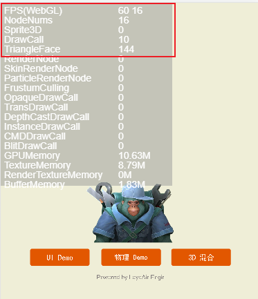
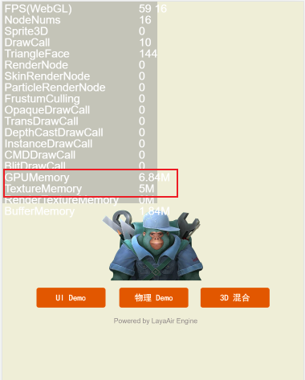
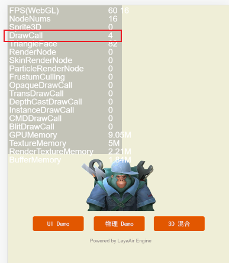
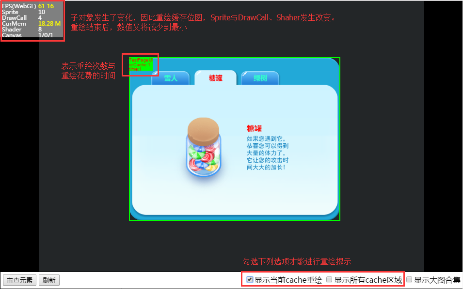

# CacheAs static cache optimization

Among other common properties in the property setter, we introduced the cacheAs cache optimization concept and functional role. It is also recommended that developers try to use it reasonably when making UI interfaces. Below we will use a UI example to demonstrate the use of cacheAs in the project. At the same time, we will analyze the data before and after the use of cacheAs for developers' reference.

 Let’s first look at the situation without using the CacheAs cache function, as shown in Figure 1. In the debugging mode of webgl, you can see that the number of DrawCall renderings is 10 (*this data can be used for performance optimization comparison after optimization*).

  
(figure 1)

## 1. cacheAs is normal cache optimization

When we use cacheAs and set cacheAs to "normal" mode, DrawCall remains unchanged, and GPUMemory and TextureMemory drop by more than 4M and 3M, as shown in Figure 2.

   (Picture 2)

**Tips**：

When the cacheAs attribute value is "normal", canvas caching is performed in Canvas mode, and command caching is performed in webgl mode. The performance optimization of this mode is moderate. It can reduce the number of nodes rendered per frame, but it will not reduce the number of DrawCalls.

## 2. cacheAs is optimized for bitmap caching

When we use cacheAs and set cacheAs to "bitmap" mode. DrawCall has been reduced to 4, and only one configuration has been modified. The performance is more than doubled compared to not using cacheAs. The effect is shown in Figure 3.

   (Picture 3)

**Tips**：

The canvas cache is still used under Canvas. In webgl mode, the renderTarget cache is used, which is equivalent to caching into a static bitmap and submitting it to the graphics card for rendering. It should be noted here that the renderTarget cache mode under webGL has a size limit of 2048. Exceeding 2048 will increase additional memory overhead. In addition, the overhead of continuous redrawing is relatively high, but drawcalls will be reduced and rendering performance will be the highest.

In this document, our sample UI is relatively simple. For some large-scale games, there are many UIs with more than 50 nodes. After using cacheAs caching technology, the rendering performance will be improved many times.

## 3. How to choose cache optimization

### 3.1 CPU considerations

#### CPU consumption of frequent refreshes

The most important thing to pay attention to is whether the UI will be refreshed frequently. If it is very frequent, the CPU consumption will be very large, because once the sub-object changes when caching the bitmap, the engine will automatically re-cache the bitmap, and the process of caching the bitmap will consume CPU.

So when choosing to use normal or bitmap mode of cacheAs, or not to use cacheAs, we need to consider the increase in memory and CPU consumption as key considerations.

### 3.2 Test whether to redraw frequently

The DebugPanel debugging tool provided by the LayaAir engine can help you view the game redraw area. Add the `DebugPanel.init();` method in the code. After compiling and running the project, a debugging window will appear in the browser, as shown in Figure 4.

   (Picture 4)

We check the "`Show current cache redraw`" option or "`Show all redraw areas`". If the UI is redrawn, a green frame will be displayed in the redraw area. The number of redraws and redraw time are displayed in the upper left corner of the green frame. Sprite, DrawCall, etc. of the performance statistics tools will also change.

In the absence of mouse operation, if the green wireframe appears frequently, it means that the UI is being redrawn frequently, so it is best not to use bitmap cache mode. Normal mode can be considered as appropriate. Of course, you can also manage the UI in layers, with frequently updated layers (not using cacheAs) and infrequently updated layers (using cacheAs). This method can also improve performance.

### 3.3 Configuration factors of low-end models

When we work on game projects, we usually take mobile phone configurations into consideration. In most cases, the more models the game can adapt to, the better. Game testers will also use mobile phones with high, medium and low-end configurations to test and then provide optimization suggestions. Then when using cacheAs, you also need to refer to the memory and CPU size of the phone.

For some low-end machines, the CPU and memory are not high. If cacheAs is used to improve rendering performance, problems may occur.

At this time, developers need to make a choice, choose performance or breadth of game models, or choose the middle. If you choose to adapt to more low-end models, you need to repeatedly test whether to use cacheAs, and compare which normal and bitmap modes are more suitable, and try to reduce CPU and memory losses while optimizing performance.

## 4. Under what circumstances cacheAs cannot be used?

### 4.1 Cannot be used when the object is very simple

When the object is very simple, such as a word or a picture, setting cacheAs will not only not improve performance, but will also cause performance loss.

### 4.2 Frequently changing content cannot be used

There are frequently changing contents in the container, such as an animation or countdown in the container. If cacheAs is set for this container, performance will be lost.

We can check the first value of Canvas statistics in the performance statistics panel. If it keeps changing, it means that it is being redrawn. In this case, cacheAs cannot be used.
