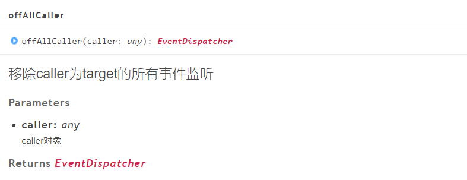

## Use and optimization of mouse interaction

> Author: charley       	Data:  2022-04-14

Whether it is mouse interaction on the PC or touch interaction on the mobile terminal, we generally refer to it as mouse interaction for the time being. This is the basis for game engines to realize human-computer interaction. This article starts from the basic use of LayaAir engine mouse interaction (including 2D and 3D), to the advanced use, and provides a comprehensive introduction. I hope it will be helpful to new and old friends who use LayaAir.

[TOC]

### 1. Basic use of mouse interaction

> Non-novice developers can skip this section

#### 1.1 Types of mouse events

Mouse events are one of the foundations of mouse interaction. For example, click, press, leave, scroll, etc. With these mouse events, we can listen for these events, and then make corresponding logical feedback when these events are triggered. Let's first understand the commonly used mouse event types:

##### 1.1.1 Basic mouse event types on PC

| Event type	| Event type corresponding to the engine	| Event type description	|
| -------------- | ---------------------------- | -------------------------- |
| mousedown  	| Laya.Event. MOUSE_DOWN   	| Left mouse button pressed	|
| mouseup    	| Laya.Event. MOUSE_UP     	| Lift the left mouse button	|
| mousemove  	| Laya.Event. MOUSE_MOVE   	|Mouse movement	|
| mouseover	| Laya.Event. MOUSE_OVER   	| Mouse move in (triggered when moving from one display node to another) |
| mouseout	| Laya.Event. MOUSE_OUT    	| Mouse out (triggered when moving out from the currently displayed node)	|
| click      	| Laya.Event. CLICK        	| Left mouse button click (triggered after pressing down and then lifting up)	|
| doubleclick	| Laya.Event. DOUBLE_CLICK 	| Double-click the left mouse button (connect 2 points)	|
| rightclick 	| Laya.Event. RIGHT_CLICK  	| Right click of mouse (triggered after pressing down and then lifting up)	|
| rightmousedown | Laya.Event. RIGHT_MOUSE_DOWN | Right mouse button down	|
| rightmouseup | Laya.Event. RIGHT_MOUSE_UP | Right mouse button raised	|
| mousewheel 	| Laya.Event.  MOUSE_WHEEL 	| Mouse wheel scrolling	|

##### 1.1.2 Basic touch events on mobile terminals

The touch events on the mobile side are much simpler than those on the PC side, such as click, press, lift, and move. These mouse events on the PC side are universal on the mobile side.

| Event type	| Event type corresponding to the engine	| Event type description	|
| ----------- | ------------------------ | -------------------------- |
| mousedown | Laya.Event. MOUSE_DOWN | Touch down	|
| mouseup 	| Laya.Event. MOUSE_UP 	| Touch to lift	|
| mousemove | Laya.Event. MOUSE_MOVE | Touch move	|
| mouseover | Laya.Event. MOUSE_OVER | Touch move in (triggered when moving from one display node to another) |
| mouseout	| Laya.Event. MOUSE_OUT	| Touch out (triggered when moving out from the currently displayed node)	|
| click   	| Laya.Event. CLICK    	| Touch click (triggered after touch is pressed and then lifted)	|
| doubleclick | Laya.Event. DOUBLE_CLICK | Touch double click (connect 2 clicks)	|

##### 1.1.3 Other commonly used mouse interaction types

In addition to the above basic mouse interaction types, there are many other event types. Here we only list some commonly used mouse interaction events. For more event types, you can view the Event class of the engine source code, or the API documentation of the official website, [ https://layaair2.ldc2.layabox.com/api2/Chinese/index.html?type=Core&category=Event&class=laya.events.Event](https://layaair2.ldc2.layabox.com/api2/Chinese/index .html?type=Core&category=Event&class=laya.events.Event)

| Event type | Event type corresponding to the engine	| Event type description |
| ----- | ----------------- | ------- |
| blur | Laya.Event. BLUR | Mouse loses focus |
| focus | Laya.Event. FOCUS | The mouse gets focus |
| input | Laya.Event. INPUT | Form input value changes |

##### 1.1.4 Custom event types

If developers want to dispatch events themselves under certain circumstances and then listen to their own defined event types, the LayaAir engine provides the event method. The API is shown in Figure 1:

    

(figure 1)

The sample code is as follows:

```typescript
onEnable(): void {
    //You need to listen to the custom test event first
      this.xxx.on("test", this, () => {
   	 console.log("test event received");
	  });
}

onMouseDown(): void {
    //The logic for dispatching custom events should be placed behind the listening logic.
	this.xxx.event("test");
}
```

In the above example, we can see that dispatching custom events must be behind the listening logic. In addition, it should be noted that the dispatched node must correspond to the listening node, otherwise it will result in failure to listen successfully (equivalent to (because the signals are not on the same channel).

#### 1.2 How to use mouse events

The usage principle of mouse events is basically the same as the example above, which consists of two parts: event listening and event dispatching. However, events other than custom events are dispatched by the engine under certain conditions. After developers are familiar with each mouse event, they can use the listener provided by the engine to listen for the corresponding mouse event under the corresponding conditions. Can.

##### 1.2.1 Event Listener

There are two event listeners, one is the on method that continuously listens, and the other is the once method that only listens once (automatically removed).

```typescript
	/**
 	* Use the EventDispatcher object to register an event listener object of a specified type so that the listener can receive event notifications.
 	* @param type   	 Type of event.
 	* @param caller The execution domain of the event listening function.
 	* @param listener event listening function.
 	* @param args   	 (Optional) Callback parameters for the event listening function.
 	* @return this EventDispatcher object.
 	*/
	on(type: string, caller: any, listener: Function, args: any[] = null): EventDispatcher {
    	return this._createListener(type, caller, listener, args, false);
	}

	/**
 	* Use the EventDispatcher object to register an event listener object of a specified type so that the listener can receive event notifications. This listening event will be automatically removed after responding once.
 	* @param type   	 Type of event.
 	* @param caller The execution domain of the event listening function.
 	* @param listener event listening function.
 	* @param args   	 (Optional) Callback parameters for the event listening function.
 	* @return this EventDispatcher object.
 	*/
	once(type: string, caller: any, listener: Function, args: any[] = null): EventDispatcher {
    	return this._createListener(type, caller, listener, args, true);
	}
```

The use of on and once are basically the same, except that if on does not want to continue listening, it needs to be removed manually, while once does not need to be removed manually.

The sample code is as follows:

```typescript
//Continuously listen for click events
this.xxx.on(Laya.Event.CLICK, this, () => {
    //Logic code after listening to the event...
});

//Listen to a close event
this.xxx.once(Laya.Event.CLOSE, this, this.onClosed);

onClosed(): void {
    //Logic code after listening to the event...
}
```

##### 1.2.2 Removal of event listening

If you want to remove event listening, the LayaAir engine provides three methods: off, offAll, and offAllCaller. Below we introduce them separately.

##### off: Delete a specified listener


(figure 2)

As shown in Figure 2, deleting the parameters of the listener is similar to using the listener. Just pass in the event type of the listener, the execution domain of the listening function, and the listening function.

The sample code is as follows:

```typescript
//Continuously listen to the click event of the xxx object
this.xxx.on(Laya.Event.CLICK, this, this.xxxOnClicked);

xxxOnClicked():void{
  //Logic code after listening to the event...
}

//Delete the click event listener of the xxx object
this.xxx.off(Laya.Event.CLICK, this, this.xxxOnClicked);
```

##### offAll: Delete all listeners of the specified event type in the object


(image 3)

As shown in Figure 3, as long as the specified event type is passed in, all listeners of the event type of the target object can be deleted.

Sample code looks like this:

```typescript
//Delete all listeners of the click event type under the xxx object
this.xxx.offAll(Laya.Event.CLICK);
```

##### offAllCaller: Delete all listeners in the specified execution domain

  

(Figure 4)

As shown in Figure 4, by passing in the execution domain, all event listeners under the execution domain can be deleted.

The sample code is as follows:

```typescript
//Delete all listeners of this execution domain under the xxx object
this.xxx.offAllCaller(this);
```

##### 1.2.3 Mouse event life cycle in script

In addition to manually listening to use mouse events, if developers adopt component development (inheriting the Laya.Script script class), they can also directly use the mouse life cycle method of the script component.

> This section does not consider the situation of 3D scripts for the time being. There will be some differences between 2D and 3D usage. 3D mouse interaction will be introduced in the subsequent 3D chapter.

The life cycle methods related to mouse events in script components are as follows:

```typescript
export default class Script2DTest extends Laya.Script {
	constructor() { super(); }

	onClick(e: Laya.Event): void {
    	console.log("Triggered when the node object to which the script belongs is clicked");
	}

	onDoubleClick(e: Laya.Event): void {
    	console.log("Triggered when the node object to which the script belongs is double-clicked");
	}

	onMouseDown(e: Laya.Event): void {
    	console.log("Triggered when the mouse is pressed on the node object to which the script belongs");
	}

	onMouseUp(e: Laya.Event): void {
    	console.log("Triggered when the mouse is raised on the node object to which the script belongs");
	}

	onMouseMove(e: Laya.Event): void {
    	console.log("Triggered when the mouse moves on the node object to which the script belongs");
	}

	onMouseOver(e: Laya.Event): void {
    	console.log("Triggered when the mouse enters the node object to which the script belongs");
	}

	onMouseOut(e: Laya.Event): void {
    	console.log("Triggered when the mouse leaves the node object to which the script belongs");
	}

	onStageMouseDown(e: Laya.Event): void {
    	console.log("Triggered when the mouse is pressed on the stage");
	}

	onStageMouseUp(e: Laya.Event): void {
    	console.log("Triggered when the mouse is raised on the stage");
	}

	onStageClick(e: Laya.Event): void {
    	console.log("Triggered when the mouse is clicked on the stage");
	}

	onStageMouseMove(e: Laya.Event): void {
    	console.log("Triggered when the mouse moves on the stage");
	}
}
```

As can be seen from the above sample code, in the mouse event life cycle of the script, you can use it directly as needed without listening (because the engine has already done the listening, these event life cycle methods are the listening of the corresponding mouse events. callback method).

#### 1.3 Turning off and turning on mouse events: mouseEnabled

There is a prerequisite for listening to mouse events, that is, the node object must be allowed to receive mouse events.

The attribute parameter that controls whether the object receives mouse events is mouseEnabled. We can set it in the code or in the property panel in the IDE, as shown in Figure 5:


(Figure 5)

The sample code set in the code is as follows:

```typescript
//true allows receiving mouse events, false prohibits receiving mouse events
this.xxx.mouseEnabled = true;
```

Usually, we don't need to set it. The engine will decide whether to enable it based on the usage characteristics of the component.

For example, images (Sprite, Image), text (Text, Label), etc. do not need to listen to mouse events in most cases, so they are turned off by default. Buttons, labels, HTML text (HTMLDivElement), etc., components that must be interacted with through click operations, definitely need to receive mouse events, so they are turned on by default.

At this time, some novice students may ask, I have not set it up, why is there no problem in listening to the mouse event of the image frame by frame?

That's because when using on or once to listen for mouse events, the default value is used to turn off mouse events, and the engine will automatically turn on again. So, in most cases we don’t need to set it up.

However, it should be noted that

If it is manually set not to accept mouse events (mouseEnabled is false), the engine will not be turned on during event listening.

In addition, on and once listening only open the listening object itself and the parent object. If the child node object of the object is not set, it will not be opened automatically. The default value is off, and it will still be off, unable to receive mouse events.

Therefore, when our child node object cannot be clicked, we must first check whether the object can receive mouse events.

> After receiving mouse events, mouse collision detection will consume performance. In principle, it is not an object that must accept mouse events. Try not to manually set it on.

#### 1.4 Obtain stage coordinates and local coordinate conversion

In mouse interaction, in addition to event listening and response, it is more commonly used to obtain stage coordinates or local coordinates of node objects.

##### 1.4.1 Get the stage coordinates where the mouse is located

- The X coordinate of the mouse on the stage can be obtained through `Laya.stage.mouseX`.
- The Y coordinate of the mouse on the stage can be obtained through `Laya.stage.mouseY`.

##### 1.4.2 Convert stage coordinates to local coordinates

Stage coordinates can be converted into local coordinates through the object's `globalToLocal()` method.

The sample code is as follows:

```typescript
//Convert the stage coordinates to the local coordinates of the XXX object
let point: Laya.Point = this.XXX.globalToLocal(new Laya.Point(Laya.stage.mouseX, Laya.stage.mouseY));
console.log("Print local coordinates x,y", point.x, point.y);
```

#### 1.5 Common examples of use

The usage examples of click events are relatively simple and are also reflected above. In this section, we take mouse wheel zooming on the PC and two-finger gesture zooming on the mobile side as examples to facilitate novice developers to understand the practical application of mouse interaction events.

##### 1.5.1 Mouse wheel zoom example on PC

In the following example, the position of the mouse point is used as the zoom center of the image, and zooming is performed through the interaction of the mouse wheel.

```typescript
export default class XX extends Laya.Script {
    private _owner: Laya.Image;
 
  onEnable(): void {
	this._owner = this.owner as Laya.Image;
	this.onMouseWheel();
  }
 
  /** The frame listens to the scroll wheel event and handles scrolling */
  onMouseWheel(): void {
	//Handle frame listening for wheel events
	this.owner.on(Laya.Event.MOUSE_WHEEL, this, (e: Laya.Event) => {
  	//Convert stage coordinates to local coordinates
  	let point: Laya.Point = this._owner.globalToLocal(new Laya.Point(Laya.stage.mouseX, Laya.stage.mouseY));

  	if (e.delta > 0) { //When the pulley scrolls up, increase the xy scaling value
    	this._owner.scaleX += 0.1;
    	this._owner.scaleY += 0.1;
  	}
  	if (e.delta < 0) { //When the pulley scrolls down, reduce the xy scaling value
    	this._owner.scaleX -= 0.1;
    	this._owner.scaleY -= 0.1;
    	//Set the xy minimum scaling value
    	(this._owner.scaleX < 0.8) && (this._owner.scaleX = 0.8);
    	(this._owner.scaleY < 0.8) && (this._owner.scaleY = 0.8);
  	}

  	//Mouse position after scaling
  	let point2: Laya.Point = this._owner.globalToLocal(new Laya.Point(Laya.stage.mouseX, Laya.stage.mouseY));

  	//Calculate the xy offset value caused by scaling
  	let _offsetX = (point2.x - point.x) * this._owner.scaleX;
  	let _offsetY = (point2.y - point.y) * this._owner.scaleY;

  	//Correct coordinate position
  	this._owner.x += _offsetX;
  	this._owner.y += _offsetY;
	});
  }
}
```

##### 1.5.2 Two-finger gesture zoom example on mobile terminal

The following example implements two-finger gesture zooming using the two-finger center as the image zoom center.

```typescript
export default class XX extends Laya.Script {
    private _owner: Laya.Image;
	/** Center point coordinate information before scaling */
	private lastPivot: Laya.Point;
      /** Last distance value */
	private lastDistance: number = 0;
 
   onEnable(): void {
        this._owner = this.owner as Laya.Image;
  }
 
  //Script life cycle method that automatically triggers execution when the mouse is pressed on the object
  onMouseDown(e: Laya.Event): void {
	//When the touch object array of the touch operation exists and is greater than 1 touch point, it is considered a zoom operation.
	if (e.touches && e.touches.length > 1) {
  	//The initial touch coordinate position is recorded as the initial two-finger distance through the square root operation.
  	this.lastDistance = this.getDistance(e.touches);
  	//Record the coordinates of the finger center point before zooming
  	this.lastPivot = this.setPivot(e.touches);
  	//When multiple fingers are pressed, listen to the gesture movement event and process the logic
  	this._owner.on(Laya.Event.MOUSE_MOVE, this, this.mouseMove);
	}
  }
 
  onMouseUp(e: Laya.Event): void {
	//After the mouse or gesture is raised, remove the listener
	this._owner.off(Laya.Event.MOUSE_MOVE, this, this.mouseMove);
  }
 
  /** Event listening method triggered when the mouse (or gesture) moves on the object */
  mouseMove(e: Laya.Event): void {
	/**Current distance between two fingers*/
	let distance: number = this.getDistance(e.touches);

	//Set zoom
	this._owner.scaleX += (distance - this.lastDistance) * 0.01;
	this._owner.scaleY += (distance - this.lastDistance) * 0.01;
	//Set scaling value restrictions
	(this._owner.scaleX < 0.8) && (this._owner.scaleX = 0.8);
	(this._owner.scaleY < 0.8) && (this._owner.scaleY = 0.8);
	(this._owner.scaleX > 5) && (this._owner.scaleX = 5);
	(this._owner.scaleY > 5) && (this._owner.scaleY = 5);

	//The zoomed gesture center point position (local position)
	let nowPivot = this.setPivot(e.touches);

	//Calculate the xy offset value caused by scaling
	let _offsetX = (nowPivot.x - this.lastPivot.x) * this._owner.scaleX;
	let _offsetY = (nowPivot.y - this.lastPivot.y) * this._owner.scaleY;
    
	//Correct coordinate position
	this._owner.x += _offsetX;
	this._owner.y += _offsetY;

	//Save the current value for next calculation
	this.lastDistance = distance;
  }
 
  /**
 	* Calculate and set the center point coordinates of multiple fingers
 	* @param touches gesture information array
 	*/
  setPivot(touches: Array<any>): Laya.Point {
	let Point0: Laya.Point = this._owner.globalToLocal(new Laya.Point(touches[0].stageX, touches[0].stageY));
	let Point1: Laya.Point = this._owner.globalToLocal(new Laya.Point(touches[1].stageX, touches[1].stageY));
	return new Laya.Point((Point0.x + Point1.x) / 2, (Point0.y + Point1.y) / 2);
  }
 
  /** Calculate the distance between the coordinates of two touch points */
  getDistance(touches: Array<any>): number {
	//Initial value is 0
	var distance: number = 0;
	if (touches && touches.length > 1) {
  	//Calculate distance
  	let dx: number = touches[0].stageX - touches[1].stageX;
  	let dy: number = touches[0].stageY - touches[1].stageY;
  	distance = Math.sqrt(dx * dx + dy * dy);
	}
	return distance;
  }
}
```

### 2. Penetration and mouse collision area

> The reason why penetration is introduced in a separate section is because this area is more likely to cause misunderstandings among developers and is a common pitfall for novices.
>

The API for penetration is mouseThrough, which can be set through code or intuitively in the IDE property panel, as shown in Figure 6.


(Figure 6)

The sample code set in the code is as follows:

```typescript
//trues is penetrable, false is not penetrable (default value)
this.xxx.mouseThrough = true;
```

#### 2.1 Understand the difference between penetrating and not receiving events

If the mouse can penetrate the currently displayed object, the listening object does not listen to the event. For example, if a button is penetrable, there will be no feedback when clicking the button.

On the surface, the effect of penetration (mouseThrough is true) is the same as the mouse event shutdown (mouseEnabled is false) introduced before.

But the underlying logic is different.

When the mouse event is turned off for an object, even if the object is listened to and a mouse collision is detected on the object, the recursive detection will be directly interrupted, resulting in the object and sub-object being unable to receive mouse events.

When setting penetration, it is determined as a miss only when it detects that the display area of ​​the drawn graphics has not collided, and then continues to recursively detect its sub-objects.

Therefore, if there is no need to continue to detect mouse events, direct interrupt detection has higher performance.

#### 2.2 Detailed explanation of non-penetration: mouseThrough is false

The default value of mouseThrough is false. When it is false, it can be understood as no penetration. This is a characteristic shown in most cases. However, in some cases, penetration will also occur. This is why some novice developers will be confused before they fully understand the setting of this property. Let’s understand it thoroughly together.

##### 2.2.1 Determination conditions for non-penetration

When mouseThrough is false, the mouse collision area will be calculated based on the width and height (width, height) of the current object. The area within the width and height range is impenetrable.

##### 2.2.2 Customize mouse collision area (impenetrable area)

The mouse collision area introduced before, whether automatically calculated or manually set, is a rectangular area formed based on the starting coordinates and width and height.

If we want to implement custom collision zones such as circles and polygons, how should we implement it?

The engine can also draw graphics through graphics to implement custom mouse collision areas. As shown in Figure 9, if you want to draw graphics through Graphics, you first need to create a sprite. To use Graphics in the sprite attribute, we add a circular graphics drawing area to the Sprite node.

  

(Figure 9)

Then, we also need to set the rendering type (Hit Area) of this circular drawing area to the collision area (hit), as shown in animation 10. In this way, even if it is an empty node, the collision area drawn will be an impenetrable area.


(Animation 10)

If it is not an empty node, there would already be a rectangular impenetrable area with width and height as the collision area. Then the priority of the drawn collision area is higher than that of the width and height collision area. After the drawn collision area is detected, the width and height collision area will no longer be detected. Equivalently, after the collision area is drawn, the width and height collision areas are invalid.

#### 2.3 Detailed explanation of penetration: mouseThrough is true

After setting to penetration, not all components are in penetration state. Instead, it is decided whether to penetrate or not to penetrate based on the drawing conditions, so we must thoroughly understand it in order to use penetration correctly.

##### 2.3.1 Judgment conditions for penetration

When mouseThrough is true, the penetration condition will have nothing to do with the width and height of the object, but will be related to the graphics drawing display area on the object.

The drawing display area is the mouse collision area. If there is no drawing display area or is outside the drawing display area, it is judged that the mouse collision detection misses, and the listening feedback cannot be performed, which is the effect of penetration. **

There are three forms of using the graphics drawing area, namely: creation through the IDE, creation through the engine API, and implementation by inheriting the engine Graphics class.

> Note: When mouseThrough is true, if there is a graphics drawing area, there will be no penetration in the area.

##### Create Graphics graphics through IDE,

As shown in Figure 11:


(Figure 11)

The difference from mouseThrough is false is that the Graphics graphics created when it is true can not modify the rendering type (Hit Area). If not modified, the graphics drawn by graphics will be in the display state. If it is modified to hit, the graphics drawn will be pure mouse collision. area, the drawn graphics are not visible.

##### Create Graphics graphics through the engine API,

The sample code is as follows:

```typescript
//According to the width and height of the sp object, use graphics to draw a rectangular shape with a color value of #fff000.
this.sp.graphics.drawRect(0,0,this.sp.width,this.sp.height,"#fff000");
```

##### Inherits the graphics drawing implemented by the engine Graphics class,

For example, the engine implements AutoBitmap for UI components that displays images.

##### 2.3.2 Components with invalid penetration settings

As introduced earlier, adding graphics to objects through IDE or code makes the penetration settings invalid and easier to understand.

This section focuses on the situation where the engine's own UI component settings are invalid.

##### Image UI component

Some image UI components of LayaAir implement image drawing through AutoBitmap inherited from Graphics. Therefore, when mouseThrough of these components is true, if there is an image resource (skin is an image with a valid path), there will be a graphics drawing area, thus causing penetration. Invalid setting.

The components with invalid penetration settings are: Image, Button, CheckBox, Radio, Clip, FontClip, ComboBox, VScrollBar, HScrollBar, TextInput, and TextArea.

> If these components do not have skin resources and only have width and height, the penetration settings are still valid. As introduced before, when it is true, the width and height of the object are not recognized, and the area where the graphics is drawn is the mouse collision (non-penetration) area.

##### Container component

In addition to these skin-based image display components, when bgColor is set for Box containers and container class components inherited from Box containers, the background color is also a rectangular area drawn using graphics. So in this case, mouseThrough is true, and there will be no penetration effect within the background color range.

##### 2.3.3 How to make components with invalid penetration penetrable

For example, Image display components such as Image, when mouseThrough is true, their drawing width and height can be detected and cannot penetrate. When mouseThrough is false, the width and height can be obtained automatically, but it cannot penetrate.

Although in most cases, displaying images does not require penetration, what should be done if penetration is required in special circumstances?

When mouseThrough is false (non-penetration setting), add arbitrary drawing graphics to these image UI component objects, and then set the graphics rendering type Hit Area of ​​the object to unHit, as shown in Figure 12. Then the component is in a penetrating state.


(Figure 12)

#### 2.4 Summary of application of penetration and non-penetration

Penetration setting (mouseThrough is true) is mainly applied to container components (Sprite is also a container), and it will be invalid if the image UI component is set.

If you must set the image UI component to be penetrable, you can set it to not penetrate (mouseThrough is false) and then add the unHit type to draw the graphics.

Non-penetration (mouseThrough is false) is the default setting. Although mouseThrough is true, non-penetration can also be achieved by drawing the area, but do not use it this way, because penetration uses getGraphicBounds to obtain the drawing area (mouse collision area), which consumes CPU and is frequent. Use may cause lag.

Non-penetration mainly sets the collision area based on width and height, and the image UI component will automatically obtain the width and height. Container components must be set manually or automatically obtained based on child nodes. If the rectangular collision area cannot be satisfied, graphics can be used to draw graphics and serve as the collision area (set Hit Area to hit). When there is a mouse collision area drawn by graphics, the width and height are no longer used as the mouse collision area.

### 3. Optimization of mouse interaction

#### 3.1 Stop event stream from bubbling: stopPropagation

The mouse event flow includes the capture phase, the target phase, and the bubbling phase.

- Capture phase: In this phase, the engine will recursively detect the stage and its sub-objects starting from the stage, and whether the mouse coordinates are in the collision area of ​​the object, until it finds the target object that hits (the mouse coordinates are in the collision area) or no object is hit;


- Target stage: find the hit target object;
- Bubble stage: The process in which the event leaves the target object and is notified layer by layer upwards according to the node level until it reaches the stage.

Next, let’s understand it through the event flow diagram in Figure 13.


(Figure 13)

From the schematic diagram, we can see that in the capture phase (detecting whether the object has a mouse collision), it is divided into two dimensions. One is a chain structure starting from the Stage, to the child node, and then to the grandchild node. Another dimension is that sibling nodes are captured in reverse order of the node array.

> Since the larger the order of the display node is, the higher it is displayed, so the detection is also based on the principle of display first, detection first, and capture in reverse order.

The order of bubbling is that the one detected last bubbles first, and will return along the original node link path from the child node to the parent node, all the way back to the Stage.

The engine provides the stopPropagation() method in the event class to prevent subsequent event streams from bubbling. After use, it can not only save performance, but also avoid multiple event responses that are listened at the same time in the parent-child node chain.

For example, if we use stopPropagation for grandchild node A in Figure 13, then child node 0 and Stage node will no longer generate listening feedback.

It should be noted that if both grandchild nodes are child nodes of a certain node, and one grandchild node uses stopPropagation, it will not affect the bubbling path of the other grandchild node. The bubbling process is shown in Figure 14.


(Figure 14)

An example of code to prevent bubbling is:

```typescript
onEnable(): void {
  //Use stopPropagation during manual frame listening
  this.XXX.on(Laya.Event.MOUSE_DOWN, this, (e: Laya.Event) => {
	//Using stopPropagation will interrupt the bubbling loop of subsequent events and improve performance.
    //This method prevents processing of all event listeners in nodes subsequent to the current node in the event stream.
	//This method does not affect any event listeners in the current node (currentTarget).
	e.stopPropagation();
  });
}

//Use stopPropagation in the life cycle method
onMouseDown(e: Laya.Event): void {
  e.stopPropagation();
}
```

#### 3.2 Mouse collision detection priority: hitTestPrior

When there is event listening, several recursive detections will occur every time the mouse moves, and each detection, if not interrupted in advance, will start from the stage until all child node objects are recursively detected. Therefore, when the hierarchy is complex and there are many interactive listeners, it will also have an impact on performance. The principle of optimization here is to interrupt and detect recursion as early as possible. The hitTestPrior attribute provides an optimized detection mode.

##### 3.2.1 Prioritize detection of sub-objects (false)

When hitTestPrior is false, child objects will be detected first. This object will not be detected until all nodes on the stage have been recursively detected and the target object is still not found.

##### 3.2.2 Detect this object first (true)

When hitTestPrior is true and does not penetrate (mouseThrough is false), this object will be detected first.

If the mouse capture misses this object (the mouse is not within the mouse collision area of ​​this object), the detection of this object and its child node objects will be directly interrupted.

> If this object is given priority and penetration is allowed, detection will be interrupted directly within the penetration range, and child node objects cannot be detected, and penetration will lose value.
>
> Therefore, it must be used in conjunction with non-penetration to interrupt mouse collision detection outside the object area.

If the mouse hits this object, it will continue to recursively detect child node objects. Until all its child node objects are detected, or the target object is found and the detection is interrupted.

##### 3.2.3 Differences in detection priority settings and application scenarios

Prioritizing detection of this object (true) is an optimization mode. When this object is missed, interrupting detection in advance can reduce the consumption caused by recursive detection of child nodes. However, because of this, the child node object is outside the collision area of ​​this object and cannot be detected.


(Figure 15)

For example, in the red box in Figure 15, if it is the width and height range of this object, when we only listen to this object, the close button outside the red box, and the part of the body outside the red box, will not be able to respond to mouse events.

Therefore, when using priority detection of this object, the child node needs to be within the mouse collision area of ​​this object, or the child node object is outside the collision area, and there is no need for event listening feedback.

Otherwise, the only option is to use the setting that preferentially detects sub-objects (false).

##### Default value for priority detection

In most cases, the default value is to detect child objects first (hitTestPrior is false). But there are also some situations where this object is given priority by default.

The first is the stage, the default value is true. Because under normal circumstances, child nodes do not need to exceed the stage, unless in some cases of full-screen adaptation, the display width and height may exceed the stage width and height due to scaling. In this case, the part beyond the stage cannot respond to events. . If you need to respond to events, developers can ensure that the stage width and height are consistent with the display width and height through relative layout and other methods.

The other is the scene component (Scene, View, Dialog). Under normal circumstances, the child nodes of the scene should not exceed the scene size, so by default, as long as the scene width is greater than 0, the hitTestPrior of the scene component will be automatically set to true. If the developer manually sets the scene to penetration (mouseThrough is true), the engine will not automatically modify it, and the default value will still be false.

#### 3.3 Event optimization tips

##### 3.3.1 Proper use of closing mouse events

When mouse events are turned off (mouseEnabled is false), mouse collision detection will not be performed on this node and child nodes. Therefore, the performance consumption caused by child node recursion can be saved.

As mentioned before, the mouse events of Sprite, Image and other components are turned off (false) by default, but after on or once listening, the object and the parent node of the object will be automatically set to true by default (manually turned off cannot be turned on) ).

Therefore, we try our best to separate the nodes that need to be listened to from the node chains with deeper levels, to avoid the node objects that need to be listened to interspersed among the node objects that do not need to be listened to (especially those with higher node levels), and to separate the nodes that do not need to be listened to. The listening node keeps the mouse event turned off, so that unnecessary recursive consumption of the node can be reduced to the greatest extent possible.

##### 3.3.2 Try to avoid turning on penetration for drawing graphics

Penetration is a commonly used attribute function. For example, in Figure 16, we have enabled penetration for both the background (rightBG) and the role (role). Then when listening to the background, only the button (btn2) will trigger the mouse event. Otherwise, mouse events will be triggered anywhere on the background.


(Figure 16)

It should be noted that penetration is mainly used for container components such as Sprite and Box. When no graphics are drawn, the collision zone calculation of the width and height of the graphics will not be triggered.

In penetration mode (mouseThrough is true), once there is drawing graphics, not only the penetration function becomes the non-penetration area with the drawing graphics area, but also more performance consumption will be caused by obtaining the width and height collision area of ​​the graphics. Frequently obtaining the width and height of graphics may even cause lag.

For example, the background (rightBG) in Figure 16 uses a Box node object. If it is replaced by an Image object, then when mouseThrough is true, not only will the penetration effect not be achieved, but it will also cause unnecessary performance consumption.

> If you must use the Image object to achieve penetration, you can first set it to non-penetration, and then set the rendering type of the drawn graphics to unHit (see section 2.3.3 for details).

### 4. 3D mouse interaction

#### 4.1 The difference between 2D mouse interaction and 3D mouse interaction

2D mouse interaction uses collision detection between the mouse coordinate points (pixels) on the screen and the 2D screen space area of ​​the node object to implement mouse collision feedback logic.

In the world of three-dimensional space, it is obviously impossible to detect whether the three-dimensional model has generated mouse interactions such as clicks, presses, and lifts through pixel collisions on the 2D screen.

Especially in three-dimensional space, display objects have complex relationships such as vertical and horizontal, stacking, cropping, parent-child relationships in the space, and they are constantly changing.

3D mouse interaction uses a 3D physics engine. It first emits a ray in 3D space based on the 2D screen space coordinates of the mouse, and then detects whether the 3D collider of the mouse ray collides with an object in 3D space.

#### 4.2 3D mouse event interaction

For the interaction of 3D mouse events, the mouse events listened to are the same as those of 2D, but 3D needs to listen to the stage.

Then there is collision detection, which must be introduced into the 3D physics engine library, as shown in Figure 17.


(Figure 17)

After that, the ray is emitted through the mouse coordinate point on the screen to detect the physical collision of the ray, and information such as the detection status and result is returned.

If no 3D object is encountered, the collision object (collider.owner) returned by the detection is null.

If a 3D object is encountered, the 3D object encountered for the first time is returned.

The code example is as follows:

```typescript
export class MouseInteraction {
  private _scene: Laya.Scene3D;
  private _camera: Laya.Camera;  
  /** Output the target object encountered by ray detection */
  private _outHitResult: Laya.HitResult = new Laya.HitResult();
  private _ray: Laya.Ray;
  private point: Laya.Vector2 = new Laya.Vector2();
  onEnable(): void {
	//Create 3D scene
	this._scene = (<Laya.Scene3D>Laya.stage.addChild(new Laya.Scene3D()));
	//Add 3D camera
	this._camera = (<Laya.Camera>(this._scene.addChild(new Laya.Camera(0, 0.1, 100))));
    
	/** Omit some code */
    
	//Ray initialization (must be initialized)
	this._ray = new Ray(new Vecntetor3(0, 0, 0), new Vector3(0, 0, 0));
	//Listen to mouse events on the stage
	Laya.stage.on(Laya.Event.MOUSE_DOWN, this, this.onMouseDown);    
  }
 
  /** Logical processing when mouse is pressed */
  onMouseDown(): void {
	this.point.x = Laya.stage.mouseX;
	this.point.y = Laya.stage.mouseY;
	//Use the mouse coordinates on the stage to generate a 3D space ray
	this._camera.viewportPointToRay(this.point, this._ray);
	//Use the ray detection method of the physics engine to detect whether a collision has occurred
	this._scene.physicsSimulation.rayCast(this._ray, this._outHitResult);
	//Judge based on the status of the detection result. If the collision is successful, process the logic after the collision.
	if (this._outHitResult.succeeded) {
  	//Output the name of the first 3D object knocked down
  	console.log("Collision with object: " + this._outHitResult.collider.owner.name);
	}
  }
}
```

#### 4.3 3D mouse penetration

Sometimes, 3D objects may overlap and cross, and there is a need for penetration clicks and other events. We can also set penetration of mouse interaction for 3D space objects.

Since the collision detection of 3D mouse events is based on the physics engine, penetration is also based on physics-based collision control.

The 3D object object does not set physics or has physical collision turned off. Penetration naturally occurs.

If a 3D object requires physical collision, it only needs to form a penetrating response to mouse events. That can also be controlled through ray detection of all methods and collision grouping.

##### 4.3.1 Penetration: Detect all colliding objects

The `rayCast()` method introduced in the example in the previous section will return the detection result when it collides with the first 3D object. This is also a common requirement in most cases and consumes less performance. If we want to detect multiple 3D objects penetratingly, we need to use the `rayCastAll()` method.

The code example is as follows:

```typescript
export class MouseInteraction {
  private _scene: Laya.Scene3D;
  private _camera: Laya.Camera;  
  /** Output all target objects encountered by ray detection */
  private _outs: Array<any> = [];
  private _ray: Laya.Ray;
  private point: Laya.Vector2 = new Laya.Vector2();
  onEnable(): void {
	//Create 3D scene
	this._scene = (<Laya.Scene3D>Laya.stage.addChild(new Laya.Scene3D()));
	//Add 3D camera
	this._camera = (<Laya.Camera>(this._scene.addChild(new Laya.Camera(0, 0.1, 100))));
    
	/** Omit some code */
    
	//Ray initialization (must be initialized)
	this._ray = new Ray(new Vecntetor3(0, 0, 0), new Vector3(0, 0, 0));
	//Listen to mouse events on the stage
	Laya.stage.on(Laya.Event.MOUSE_DOWN, this, this.onMouseDown);    
  }
 
  /** Logical processing when mouse is pressed */
  onMouseDown(): void {
	this.point.x = Laya.stage.mouseX;
	this.point.y = Laya.stage.mouseY;
	//Use the mouse coordinates on the stage to generate a 3D space ray
	this._camera.viewportPointToRay(this.point, this._ray);
    
	//Use the ray detection method of the physics engine to detect multiple penetrations
	this._scene.physicsSimulation.rayCastAll(this._ray, this._outs);
	if (this._outs.length > 0) {
  	for (let i = 0; i < this._outs.length; i++) {
    	console.log("Collision into object(" + i + "): " + this._outs[i].collider.owner.name);
  	}
	}
  }
}
```

##### 4.3.2 Penetration control: collision grouping and filtering

During the penetration detection process, some may need to be detected by collision, and some may not want to be detected. At this time, it can be processed through collision grouping and filtering collision grouping.

The API for collision grouping is collisionGroup, and the API for filtering collision groups is canCollideWith. These are described in [Documents used by the physics engine](https://ldc2.layabox.com/doc/?nav=zh-ts-4-16-0) There are very detailed instructions. We won’t go into details here. We will directly use sample code to show the instructions.

```typescript
export class MouseInteraction {
  private _scene: Laya.Scene3D;
  private _camera: Laya.Camera;  
  /** Output all target objects encountered by ray detection */
  private _outs: Array<any> = [];
  private _ray: Laya.Ray;
  private point: Laya.Vector2 = new Laya.Vector2();
  onEnable(): void {
	//Create 3D scene
	this._scene = (<Laya.Scene3D>Laya.stage.addChild(new Laya.Scene3D()));
	//Add 3D camera
	this._camera = (<Laya.Camera>(this._scene.addChild(new Laya.Camera(0, 0.1, 100))));
    
	/** Omit some codes, refer to the official website 3D mouse interaction example for details */
	var meshCollider2 = layaMonkey_clone2.addComponent(PhysicsCollider);
	var meshShape2 = new MeshColliderShape();
	meshShape2.mesh = layaMonkey_clone2.meshFilter.sharedMesh;
	meshCollider2.colliderShape = meshShape2;
	//Set the collision group for the collider of the object that does not need to collide, which is COLLISIONFILTERGROUP_CUSTOMFILTER2
	meshCollider2.collisionGroup = Physics3DUtils.COLLISIONFILTERGROUP_CUSTOMFILTER2;
    
	//Ray initialization (must be initialized)
	this._ray = new Ray(new Vecntetor3(0, 0, 0), new Vector3(0, 0, 0));
	//Listen to mouse events on the stage
	Laya.stage.on(Laya.Event.MOUSE_DOWN, this, this.onMouseDown);    
  }
 
  /** Logical processing when mouse is pressed */
  onMouseDown(): void {
	this.point.x = Laya.stage.mouseX;
	this.point.y = Laya.stage.mouseY;
	//Use the mouse coordinates on the stage to generate a 3D space ray
	this._camera.viewportPointToRay(this.point, this._ray);
    
	/** Filter conditions: Non-collisive 3D objects are, except COLLISIONFILTERGROUP_CUSTOMFILTER2, all can collide */
	let canCollideWith = Physics3DUtils.COLLISIONFILTERGROUP_ALLFILTER ^ Physics3DUtils.COLLISIONFILTERGROUP_CUSTOMFILTER2;
	//Use the ray detection method of the physics engine to detect multiple penetrations, but exclude COLLISIONFILTERGROUP_CUSTOMFILTER2
	this._scene.physicsSimulation.rayCastAll(this._ray, this._outs, 2147483647, Physics3DUtils.COLLISIONFILTERGROUP_ALLFILTER, canCollideWith);
	if (this._outs.length > 0) {
  	for (let i = 0; i < this._outs.length; i++) {
    	console.log("Collision into object(" + i + "): " + this._outs[i].collider.owner.name);
  	}
	}
  }
}
```

From the above code, we can see that compared to the example code that penetrates and collides all objects, there are two main changes. One is to set collision grouping for the collider of objects that do not need to participate in the collision, and the other is during ray detection. The filter conditions for collision detection are set to avoid the previously set collision grouping objects.

> 3D physics document with detailed introduction to collision grouping: https://ldc2.layabox.com/doc/?nav=zh-ts-4-16-0

#### 4.4 Life cycle methods of 3D mouse events

Like 2D scripts, 3D scripts also have mouse event lifecycle methods. Our script inherits `Laya.Script3D` and can be used.

However, developers need to note that since 3D mouse interaction is based on the physics engine, the prerequisite for us to use these mouse event life cycle methods normally is to introduce the physics engine library and add physics to the 3D object to which the script belongs. Components and set colliders. In addition, the number and name of the mouse event life cycle are different between 2D and 3D.

The sample code is as follows (modified based on the 3D example created by the IDE):

```typescript
export default class GameUI extends ui.test.TestSceneUI {
	constructor() {
    	super();
   	 
    	//Add 3D scene
    	var scene: Laya.Scene3D = Laya.stage.addChild(new Laya.Scene3D()) as Laya.Scene3D;

    	//Add camera
    	var camera: Laya.Camera = (scene.addChild(new Laya.Camera(0, 0.1, 100))) as Laya.Camera;
    	camera.transform.translate(new Laya.Vector3(0, 3, 3));
    	camera.transform.rotate(new Laya.Vector3(-30, 0, 0), true, false);

    	//Add directional light
    	var directionLight: Laya.DirectionLight = scene.addChild(new Laya.DirectionLight()) as Laya.DirectionLight;
    	directionLight.color = new Laya.Vector3(0.6, 0.6, 0.6);
    	directionLight.transform.worldMatrix.setForward(new Laya.Vector3(1, -1, 0));

    	//Add custom model
    	var box: Laya.MeshSprite3D = scene.addChild(new Laya.MeshSprite3D(Laya.PrimitiveMesh.createBox(1, 1, 1))) as Laya.MeshSprite3D;
    	box.transform.rotate(new Laya.Vector3(0, 45, 0), false, false);
    	var material: Laya.BlinnPhongMaterial = new Laya.BlinnPhongMaterial();
   	 Laya.Texture2D.load("res/layabox.png", Laya.Handler.create(null, function(tex:Laya.Texture2D) {
   			 material.albedoTexture = tex;
   	 }));
    	box.meshRenderer.material = material;

    	//Add 3D script component to box model node
    	box.addComponent(Script3DTest);
    	//Add physical components to the box model node
    	let _PhysicsCollider =  box.addComponent(Laya.PhysicsCollider);
    	//Set the collider
    	_PhysicsCollider.colliderShape = new Laya.BoxColliderShape();
	}
}
```

There are a total of 7 mouse event life cycle methods in the script component. The sample code is as follows:

```typescript
export default class Script3DTest extends Laya.Script3D {

	onMouseEnter(): void {
    	console.log("onMouseEnter: When the mouse moves, it is triggered when the mouse enters the 3D object to which the script belongs. It is only triggered once when it first enters");
	}

	onMouseOver(): void {
    	console.log("onMouseOver: Triggered when the mouse is on the 3D object to which the script belongs. It is triggered every frame");
	}

	onMouseDown(): void {
    	console.log("onMouseDown: Triggered when the mouse is pressed on the 3D object to which the script belongs");
	}

	onMouseClick(): void {
    	console.log("onMouseClick: Triggered when the mouse clicks on the 3D object to which the script belongs");
	}

	onMouseUp(): void {
    	console.log("onMouseUp: Triggered when the mouse is raised on the 3D object to which the script belongs");
	}

	onMouseDrag(): void {
    	console.log("onMouseDrag: Triggered when the mouse drags the object. When the mouse is on the 3D object to which the script belongs, press and hold any mouse button. It is triggered every frame");
	}

	onMouseOut(): void {
    	console.log("onMouseOut: triggered when the mouse moves and leaves the 3D object to which the script belongs");
	}
}
```

Finally, we changed the previous example of manually listening to mouse events to the life cycle method of script mode.

The sample code is as follows:

```typescript
export class MouseInteraction {
  private _scene: Laya.Scene3D;
  private _camera: Laya.Camera;
  onEnable(): void {
	//Create 3D scene
	this._scene = (<Laya.Scene3D>Laya.stage.addChild(new Laya.Scene3D()));
	//Add 3D camera
	this._camera = (<Laya.Camera>(this._scene.addChild(new Laya.Camera(0, 0.1, 100))));
    
	/** Omit some code */
    
	 //You need to add a detection script for each 3D node object that requires mouse event feedback.
	staticLayaMonkey.addComponent(MouseEventScript);
	layaMonkey_clone1.addComponent(MouseEventScript);
	layaMonkey_clone2.addComponent(MouseEventScript);
	layaMonkey_clone3.addComponent(MouseEventScript);
  }
}

/** Mouse event detection script*/
class SceneScript extends Script3D {
  onAwake() {
	//Get text object
	this.text = Laya.stage.getChildByName("text");
  }

  /**Event life cycle method triggered when the mouse is pressed on the object to which the script belongs*/
  onMouseDown() {
	//When the mouse is pressed on the object, display the text
	this.text.text = "Collision:" + this.owner.name;
  }
}
```

#### 4.5 Multi-touch on mobile terminal

Since mobile devices are mainly mobile phones, on small-screen devices, the space that multi-touch can actually operate is very limited. It is usually the contraction or expansion of two or more fingers to handle the whole or a specific object. of zoom.

Therefore, multi-touch usually does not require the use of 3D physical detection, so we can use 3D scripts or 2D scripts. Here we introduce based on 3D script and 3D API.

The method to obtain the number of touch points in the Input3D class is `touchCount()`, and the method to obtain the touch points is `getTouch()`.

The sample code is as follows:

```typescript
/** Omit some codes, please refer to the official website example */
onUpdate(): void {
  //Get the number of touch points
  var touchCount: number = this._scene.input.touchCount();
  if (touchCount>1) {
	//Get the first two touch point data
	var touch: Touch = this._scene.input.getTouch(0);
	var touch2: Touch = this._scene.input.getTouch(1);
	//Whether it is the first touch when just pressed
	if (this.twoFirst) {
  	//Get the location of the touch point
  	this.disVector1.x = touch.position.x - touch2.position.x;
  	this.disVector1.y = touch.position.y - touch2.position.y;
  	this.distance = Vector2.scalarLength(this.disVector1);
  	this.twoFirst = false;
	} else {
  	this.disVector2.x = touch.position.x - touch2.position.x;
  	this.disVector2.y = touch.position.y - touch2.position.y;
  	var distance2: number = Vector2.scalarLength(this.disVector2);
  	//According to the distance of the gesture expansion movement, set the transformation of the z-axis to create a near-large and far-small perspective effect.
  	let zValue = -0.01 * (distance2 - this.distance);
  	if ((zValue < 0 && this._camera.transform.position.z > 0.6) || (zValue > 0 && this._camera.transform.position.z < 6)) {
    	this.tmpVector.setValue(0, 0, -0.01 * (distance2 - this.distance));
    	this._camera.transform.translate(this.tmpVector);
  	}
  	this.distance = distance2;
	}
  }
}
```


------

At this point, the content about mouse interaction is introduced here. If you have any questions, you are welcome to communicate in the Layabox developer community, https://ask.layabox.com/


