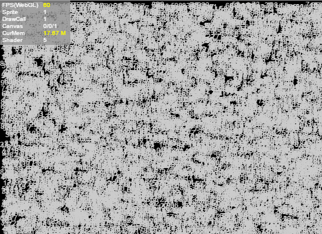

# Graphics rendering performance

### **1. Optimize Sprite**

1. Try to reduce unnecessary levels of nesting and reduce the number of Sprites.

2. Try to remove objects in non-visible areas from the display list or set visible=false.

3. For containers with a large amount of static content or content that does not change frequently (such as buttons), you can set the cacheAs attribute for the entire container, which can greatly reduce the number of Sprites and significantly improve performance. If there is dynamic content, it is best to separate it from the static content so that only the static content is cached.

4. In the Panel, direct sub-objects outside the panel area (the sub-objects of the sub-objects cannot be judged) will not be rendered. Sub-objects beyond the panel area will not be consumed.

   

### **2. Optimize DrawCall**

1. Setting cacheAs for complex static content can greatly reduce DrawCall. Making good use of cacheAs is the key to game optimization.

2. Try to ensure that the rendering order of pictures in the same atlas is next to each other. If different atlases are cross-rendered, the number of DrawCalls will increase.

3. Try to ensure that all resources in the same panel use one atlas, which can reduce submission batches.

   

### **3. Optimize Canvas**

 When optimizing Canvas, we need to pay attention not to use cacheAs in the following situations:

1. The object is very simple, such as a word or a picture. Setting cacheAs="bitmap" will not only not improve performance, but will also cause performance loss.
2. There are frequently changing contents in the container, such as an animation or countdown in the container. If cacheAs="bitmap" is set to this container, performance will be lost.

You can determine whether the Canvas cache is being refreshed by looking at the first value of the Canvas statistics.

### **4. About cacheAs**

Setting cacheAs can cache the display object as a static image. When cacheAs is used, if the sub-object changes, it will be automatically re-cached. At the same time, the reCache method can also be manually called to update the cache. It is recommended to cache complex content that does not change frequently as static images, which can greatly improve rendering performance. cacheAs has three optional values: "none", "normal" and "bitmap".

1. The default is "none", no caching is done.
2. When the value is "normal", canvas caching is performed in Canvas mode, and command caching is performed in webgl mode.
3. When the value is "bitmap", canvas caching is still used in Canvas mode, and renderTarget caching is used in webGL mode. It should be noted here that the renderTarget cache mode under webGL has a size limit of 2048. Exceeding 2048 will increase additional memory overhead. In addition, the overhead of continuous redrawing is relatively high, but drawcalls will be reduced and rendering performance will be the highest. The command cache mode under webGL will only reduce node traversal and command organization, but will not reduce drawcalls, and the performance is medium.

After setting cacheAs, you can also set staticCache=true to prevent automatic updating of the cache, and you can manually call the reCache method to update the cache.

 cacheAs mainly improves performance in two ways. One is to reduce node traversal and vertex calculation; the other is to reduce drawCall. Making good use of cacheAs will be a powerful tool for engine optimization performance.

 The following example draws 10,000 texts (depending on computer performance, this example is 10,000):

```typescript
class Test {
 	private text:Laya.Text;
	constructor() {
    	Laya.init(550,400,Laya.WebGL);
    	Laya.Stat.show();
    	var textBox=new Laya.Sprite();

    	for(var i=0;i<10000;i++)
    	{
        	this.text=new Laya.Text();
        	this.text.text=(Math.random()*100).toFixed(0);
        	this.text.color="#CCCCCC";
        	this.text.x=Math.random()*550;
        	this.text.y=Math.random()*400;
        	textBox.addChild(this.text);
    	}
    	Laya.stage.addChild(textBox);
	}
}
```

The following is a screenshot of the runtime on the author's computer. The FPS is stable at around 52.

</br>

(figure 1)

 When we set the container where the text is located to cacheAs, as shown in the example below, the performance is greatly improved, and the FPS reaches 60 frames.

```typescript
 //...Omit other code
   var textBox=new Laya.Sprite();
   textBox.cacheAs="bitmap";
//...Omit other code
```

</br>

 (figure 2)

### **5. Text Stroke**

At runtime, text with a stroke calls the drawing command one more time than text without a stroke. At this time, the CPU usage of text is proportional to the number of texts. Therefore, try to use alternatives to accomplish the same needs.

· For text content that hardly changes, you can use cacheAs to reduce performance consumption. See "Graphics Rendering Performance - About cacheAs".

· For text fields whose content changes frequently but uses a small number of characters, you can choose to use bitmap fonts.

### **6. Skip text formatting and render directly**

In most cases, a lot of text does not require complex typesetting and simply displays a line of text. In order to cater to this demand, Text provides a method called changeText that can directly skip typesetting.

```typescript
this.text.text="text";
Laya.stage.addChild(this.text);
//The text content is only updated later. Using changeText can improve performance.
this.text.changeText("text changed.");
```

Text.changeText will directly modify the last instruction for drawing the text in the drawing instruction. This behavior of the previous drawing instruction still existing will cause changeText to be used only in the following situations:

· The text is always one line.

· The style of the text is always the same (color, weight, italics, alignment, etc.).

 Even so, such needs are still often used in actual programming.

