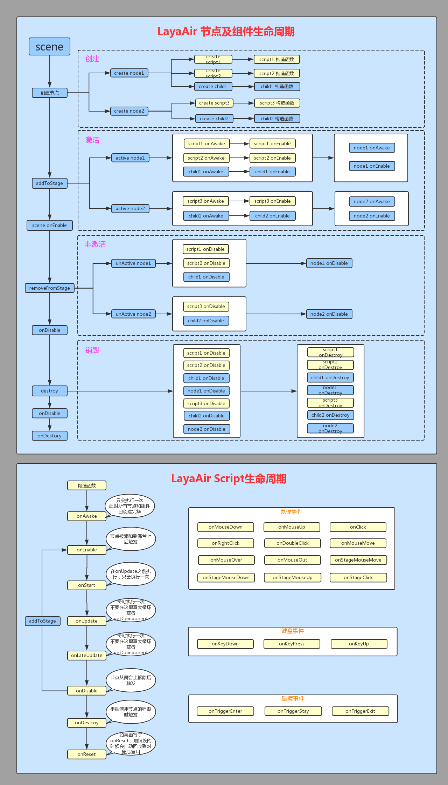
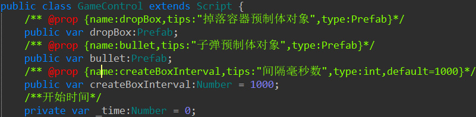
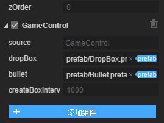
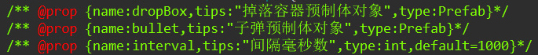
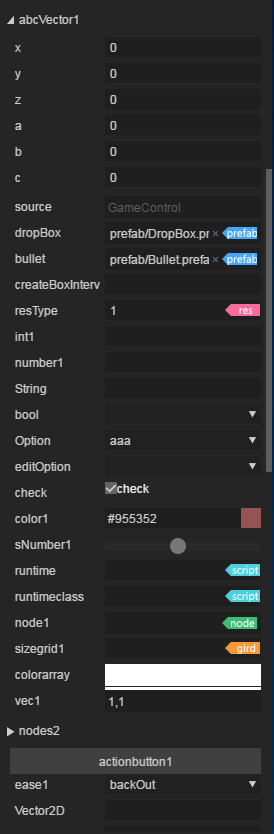

# LayaAir script parameter description

It is recommended to read the video tutorial, which provides a comprehensive explanation and practical introduction to the system of LayaAir script and runtime development.

Script component course link: [https://ke.qq.com/course/427324](https://ke.qq.com/course/427324)

Collection course link for UI and scene editing, component development, screen adaptation and anti-aliasing: [https://ke.qq.com/course/417469](https://ke.qq.com/course/417469)

----------

Starting from LayaAir 2.0, it supports custom scripts in the editor to facilitate the expansion of existing component functions.



If you want to display script-defined properties in the editor, you can do so through special comments.

For example, the following script class:



The display in the IDE is as follows:



In this way, you can design display parameters in the script, enter the parameters in the IDE, and then use them in the script.

This kind of markup supports AS, JS, and TS languages ​​at the same time. It can even be used as a write-only markup. The script itself has no specific implementation (it will be used when inheriting properties).




A complete label mainly consists of the following parts:

- type 		IDE attribute type, this type refers to the IDE attribute type, not the real attribute type, but in most cases it is the same

- name  	Property names displayed in the IDE

- tips      	After the mouse passes over the property name in the IDE, the mouse prompt is displayed. If not, use name (optional).

- default	The default value displayed in the input box (optional)

 


The IDE provides many types by default for scripts to use. The main parameter types are as follows:

| attribute name	| Description	|
| :---------- | :--------------------------------------- |
| name    	| Attribute display name, must be consistent with variable name	|
| tips    	| Display label when mouse passes over	|
| type    	| 类型：Int,Number,sNumber,String,Bool,Option,editOption,Check,Color,ColorArray,Node,Nodes,Prefab,SizeGrid,Vec,Vector,Ease |
| accept  	| The associated attribute of String, accept:res is the receiving resource address	|
| acceptTypes | The associated attributes of Node and accept, the received type, such as using RevoluteJoint, PrismaticJoint, RigidBody with node; using jpg, png, txt restriction suffix with accept:res |
| option  	| Associated attributes of Option and editOption option: selectable list, such as aaa, bbb, ccc |
| min     	| Minimum value of Number and sNumber	|
| max     	| Maximum value of Number and sNumber	|
| label   	| The associated attributes of Nodes, the displayed attribute name (optional). If there is, the length will be determined based on labels. If not, the length input box will be displayed |
| types   	| Nodes’ associated attributes, the type of each element (optional)	|
| xCount  	| Associated attributes of Nodes, how many are displayed in the horizontal direction	|
| sType	| Nodes associated attributes, the type of a single element	|
| default 	|Default value	|

```
    	/** @prop {name: resType, tips:"abc",type:string,accept:res} */
    
    	resType:String ="";

    	/** @prop {name:int1,tips:"11",type:Int} */
    
    	number1:Number;

    	/** @prop {name:String,tips:"abc",type:String} */
   
    	string1:String;

    	/** @prop {name:bool,tips:"1,0",type:Bool}*/
   	 bool1:Boolean;

   	 /** @prop {name:Option,tips:"opt",type:Option,option:"aaa,bbb,ccc"}*/
   	 //return string
    	opt:String;

   	 /** @prop {name:editOption,tips:"editopt",type:EditOption,option:"aaa,bbb,ccc"}*/
   	 //return string
   	 editopt:String;

   			 /** @prop {name:check,tips:"ch11eck",type:Check}*/
   	 //return bool
   	 check:Boolean;

   	 /** @prop {name:color1,tips:"opt",type:Color}*/
   	 //return color value
   	 color1:any;

   	 /** @prop {name:snumber1,type:sNumber,min:10,max:100}*/
   	 
   	 snumber1:Number = 11;

   	 /** @prop {name:node1,type:Node}*/

   	 node1:Node;

    	/** @prop {name:sizegrid1,type:SizeGrid}*/
   	 sizegrid1:any;

   	 /** @prop {name:colorarray,type:ColorArray}*/
   	 colorarray:any;

   	 /** @prop {name:vec1,type:Vec}*/   
   	 vec1:any;

   	 /** @prop {name:vector1,type:Vector,labes:abc,types:"Node,String,Number,Boolean",xCount:2,sType:Number}*/
   	 vector1:any;

    	/** @prop {name:nodes2,type:Nodes}*/ This item must be selected to assign value to the component to be valid. It will be invalid in the scene selection.
   	 // public var nodes2:*;

   	 /** @prop {name:ease1,type:Ease}*/
   	 sase1:any;
   
```

Part of the display effect is as follows:



