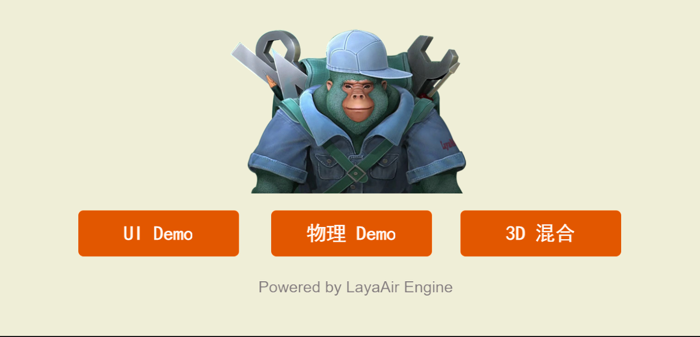

# Event management

## 1. Understanding the event

### 1.1 What is an event?

Events refer to actions that are preset by the system and can be recognized and responded to by the object. Events refer to the object's response to external actions. When an event occurs on the other party, the code corresponding to the event will be executed. For example, if you press the mouse on an object, the object is preset to recognize the mouse press event, and the corresponding code will be executed.

### 1.2 Classification of events

1. Engine built-in events

2. Customized events

The events we use can be built-in events in the engine or custom events. Using custom types of events is called custom events.

## 2. Engine built-in events

Events in the LayaAir3.0 engine mainly include three parts:

`Laya.Event` event type, event interface, different event types must implement this interface.
`Laya.EventDispatcher` event dispatch, each passed event will be distributed to a specific handler.
`Laya.Handler` event handling, different processors need to implement this interface.

### 2.1 Event type `Laya.Event`

`Laya.Event` is a collection of event types. When an event occurs, the `Laya.Event` object will be passed as a parameter to the event listener. As shown in Figure 2-1, for event types, please refer to [API](https://layaair.com/3.x/api/Chinese/index.html?version=3.0.0&type=Core&category=Event&class=laya.events.Event) document.


(Figure 2-1)

For example `Laya.Event.CLICK:string = "click"`. The `CLICK` static attribute is used to define the `type` type attribute value of the event object as a click event. This event is an event dispatched by the system after being triggered by a mouse click. Developers can also call the event() method to dispatch these events. How to dispatch events will be covered in the following content.



(Figure 2-2)

Click any one of the three buttons in Figure 2-2 to enter the corresponding function. Let's take a look at how the code uses `CLICK` (the following code is from the "2D Getting Started Example"):

```typescript
onEnable(): void {

    	console.log("IndexRT onEnable")
    	//Listen to ui button click event
    	this.uiBtn.on(Laya.Event.CLICK, this, () => {
        	//After clicking, open the UI scene example
        	console.log("uiBtn");
        	Laya.Scene.open("scenes/UiMain.ls");
    	});

    	//Listen to physical button click events
    	this.phyBtn.on(Laya.Event.CLICK, this, () => {
        	//After clicking, open the physics game example
        	console.log("phyBtn");
        	Laya.Scene.open("scenes/PhysicsGameMain.ls");
    	});

    	//Listen to the 3D blend button click event
    	this.d3Btn.on(Laya.Event.CLICK, this, () => {
        	//After clicking, open the 3D mixed scene example
        	console.log("d3Btn");
        	Laya.Scene.open("scenes/D3Main.ls");
    	});   	 
}
```


### 2.2 Event dispatch `Laya.EventDispatcher`

The event dispatching `Laya.EventDispatcher` mode is an extension of the listening mode and is driven by events. Whenever an event occurs, the event dispatcher `Laya.EventDispatcher` distributes it to a specific event handler `Laya.Handler` Handle the event. `Laya.EventDispatcher` represents event sender, event capture delivery and distribution.

`Laya.EventDispatcher` event dispatcher is the base class of schedulable event classes. For example, the Node class as a basic node inherits from the `Laya.EventDispatcher` class. As long as you inherit this class, you can act as an event sender to send events to its detectors. listener. For example, the Button in the above example code inherits from `Laya.EventDispatcher`, and you can use the `.on` method to listen to the CLICK` event.

`Laya.EventDispatcher` has the following functions:

#### 2.2.1 Event dispatch `event`

```typescript
    /**
 	* Dispatch events.
 	* @param type event type.
 	* @param data (optional) callback data. <b>Note:</b> If you need to pass multiple parameters p1, p2, p3,... you can use an array structure such as: [p1, p2, p3,...]; if you need to call back a single parameter p, And p is an array, you need to use a structure such as: [p]. For other single parameters p, you can directly pass in the parameter p.
 	* @return Whether this event type has a listener, if there is a listener, the value is true, otherwise the value is false.
 	*/
	event(type: string, data: any = null)
```

Used to dispatch events. For example, we can dispatch a `CLICK` event in code:

```typescript
//Listen to ui button click event
this.uiBtn.on(Laya.Event.CLICK, this, () => {
    //After clicking, open the UI scene example
    console.log("uiBtn");
    Laya.Scene.open("scenes/UiMain.ls");
});

//uiBtn dispatches a click event by itself. Since there is a listener on it, the uiMain scene will be opened immediately.
this.uiBtn.event(Laya.Event.CLICK);
```

#### 2.2.2 Continuous event listening `on`

```typescript
    /**
 	* Use the EventDispatcher object to register an event listener object of a specified type so that the listener can receive event notifications.
 	* @param type   	 Type of event.
 	* @param caller The execution domain of the event listening function.
 	* @param listener event listening function.
 	* @param args   	 (Optional) Callback parameters for the event listening function.
 	* @return this EventDispatcher object.
 	*/
	on(type: string, caller: any, listener: Function, args: any[] = null)
```

Used to register event listeners of specified types with the event dispatcher so that the event listeners can receive event notifications. When an event is listened to, the callback method `listener` of the scope `caller` will be called.

In the above example of 2.2.1, `this.uiBtn.on` uses continuous listening.

#### 2.2.3 Single event listening `once`

```typescript
    /**
 	* Use the EventDispatcher object to register an event listener object of a specified type so that the listener can receive event notifications. This listening event will be automatically removed after responding once.
 	* @param type   	 Type of event.
 	* @param caller 	 The execution domain of the event listening function.
 	* @param listener    event listening function.
 	* @param args   	 (Optional) Callback parameters for the event listening function.
 	* @return this EventDispatcher object.
 	*/
	once(type: string, caller: any, listener: Function, args: any[] = null)
```

Used to register event listeners of specified types with the event dispatcher so that the event listeners can receive event notifications. The event listeners will be automatically removed after responding once. For example, the listening method of the button in the above 2.2.1 example can also be changed to single event listening:

```typescript
//Listen to a UI button click event
this.uiBtn.once(Laya.Event.CLICK, this, () => {
    //After clicking, open the UI scene example
    console.log("uiBtn");
    Laya.Scene.open("scenes/UiMain.ls");
});
```

#### 2.2.4 Delete the specified listener `off`

```typescript
    /**
 	* Remove the listener from the EventDispatcher object.
 	* @param type   	 Type of event.
 	* @param caller 	 The execution domain of the event listening function.
 	* @param listener 	 Event listening function.
 	* @return this EventDispatcher object.
 	*/
	off(type: string, caller: any, listener: Function, onceOnly: boolean = false)
```

Used to remove a listener from an event dispatcher object:

```typescript
onDestroy(): void {
    //Delete the listener for the ui button
    this.uiBtn.off(Laya.Event.CLICK, this);	 
}
```

When this scene is deleted and destroyed, it is best to delete the button's event listener to ensure that all references are released.

#### 2.2.5 Delete all listeners of the specified event type `offAll`

```typescript
    /**
 	* Removes all listeners for the specified event type from the EventDispatcher object.
 	* @param type (optional) event type, if the value is null, remove all types of listeners from this object.
 	* @return this EventDispatcher object.
 	*/
	offAll(type: string = null)
```

Used to remove all listeners for the specified event type from the event dispatcher object. For example, the uiBtn button has registered multiple event listeners. You can use the `offAll` method to delete all click event listeners at once:

```typescript
onDestroy(): void {
    //Delete the listener for the ui button
    this.uiBtn.offAll(Laya.Event.CLICK);    
}
```

#### 2.2.6 Delete all listeners in the specified scope `offAllCaller`

```typescript
    /**
 	* Remove all event listeners with caller as target
 	* @param caller caller object
 	*/
	offAllCaller(caller: any)
```

Used to remove all listeners of the specified scope from the event dispatcher object. For example, the uiBtn button has registered listeners for multiple events. You can use the `offAllCaller` method to delete all listeners on this scope at once:

```typescript
onDestroy(): void {
    //Delete the listening of this scope
    this.uiBtn.offAllCaller(this);
}
```

#### 2.2.7 Check whether the listener `hasListener` has been registered

Used to determine whether the event dispatcher object has a listener registered for a specific type of event.

```typescript
	/**
 	* Check if the EventDispatcher object has any listeners registered for a specific event type.
 	* @param type The type of event.
 	* @return true if a listener of the specified type is registered; false otherwise.
 	*/
	hasListener(type: string)
```

 For example:

```typescript
if( this.uiBtn.hasListener( Laya.Event.CLICK ) )
    console.log("uiBtn has click event listening");
```


### 2.3 Event handling `Laya.Handler`

When an event is listened to, the handler used to process the event

- Processor properties include:

  1. `caller: Object | null;` execution domain

  2. `method: Function | null` execution method

  3. `args: any[] | null` parameter

  4. `once = false` indicates whether to execute only once. If true, recover() is executed after the callback to recycle, and it will be reused after recycling. The default is false.

- Processor methods include:

  1. `create()` creates a Handler from the object pool

`Laya.Handler` event handler, it is recommended to use the `Laya.Handler.create()` method to create it from the object pool to reduce object creation consumption. When the created `Handler` object is no longer used, you can use `Laya.Handler.recover()` to recycle it to the object pool. Do not use this object again after recycling, otherwise it will cause unpredictable errors. It should be noted that since mouse events also use the object pool, incorrect recycling and calling may affect the execution of the event.

```typescript
onAwake(): void {
    console.log("Game Start");
    this.Tab.selectHandler = Laya.Handler.create(this,(index:number)=>{
   	 console.log(index);
    })
}
```

`Tab` will listen for the user to click on a certain tab and create a handler from the object pool.

2. `clear(): Handler` clears object references

```typescript
this.Tab.selectHandler.clear();  
```

 3. `recover(): void` is cleaned and recycled into the Handler object pool

```typescript
this.Tab.selectHandler.recover();
```

4. `run(): any` execution processor

```typescript
this.Tab.selectHandler.run(); //You can call run() yourself
```

5. `runWith(data: any): any` executes the processor and carries additional data

```typescript
this.Tab.selectHandler.runWith(1); //You can call runWith() yourself and pass in parameter 1
```

 6. `setTo(caller: any, method: Function | null, args: any[] | null, once = false): Handler ` Set the specified attribute value of this object.

```typescript
onAwake(): void {
    console.log("Game Start");
    this.Tab.selectHandler = Laya.Handler.create(this,(index:number)=>{
   	 // console.log(index);
    })
    this.Tab.selectHandler.setTo(this,(index:number)=>{
   	 console.log(index);
    },[],false);
}
```

You can change the specified attributes yourself


## 3. Customized events

In most cases, developers use the engine's built-in events, and sometimes they need to use custom events. Here's an example to illustrate dispatching a custom event.

In LayaAir IDE, create a new 2D empty project, create a custom component script under Scene2D, and add the following code:

```typescript
onAwake(): void {
    //Listen to the custom event "Click"
    this.owner.on("Click",this,()=>{
   	 console.log("Listened to the custom "Click" event");
    })
}

//Execute after mouse click and send Click event.
onMouseClick(evt: Laya.Event): void {
    //custom event
    this.owner.event("Click");
}
```

This.owner in the example is Scene2D. When the mouse clicks on the scene, the custom event "Click" will be dispatched. This "Click" is the custom event. When "Click" is listened to, the log of "Customized "Click" event listened to" will be printed.


