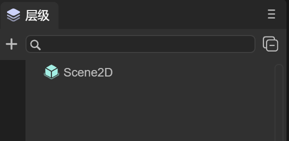
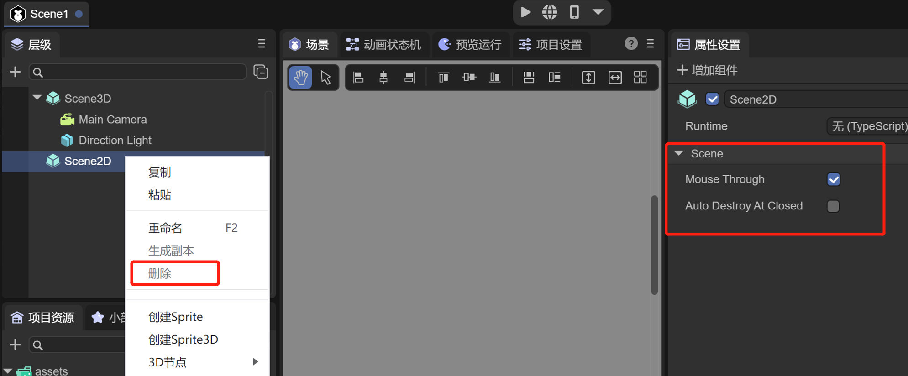
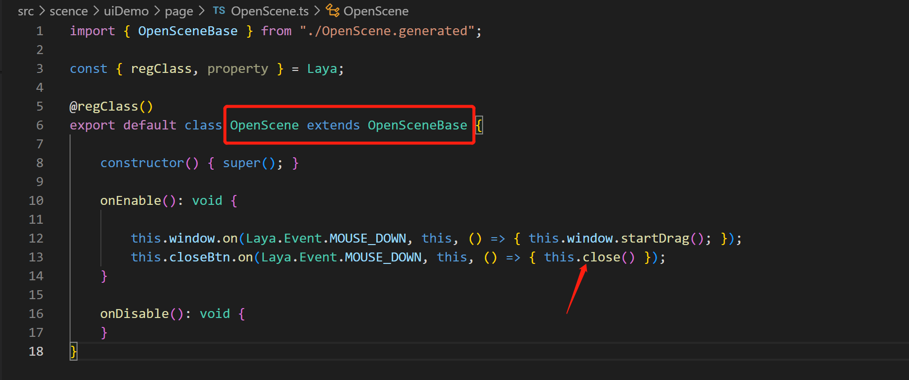

# Scene management

LayaAir 3.0 continues to use the 2.0 development ideas for componentization, scripting, and scene management development. The project uses Scene management to manage scenes. LayaAir has made a series of solutions for Scene, so that developers do not need to consider scenes, levels, and pages. For resource and memory management, you only need to simply call the interface and manage the scene, and leave the rest to the engine. You only need to focus on game logic development.

In the 2.0 project development, whether you are creating a scene Scene, page View, dialog box Dialog, or 3D scene scene3d, the file type and suffix are all scene. However, the division of scenes in 3.0 is different, and it is no longer a unified suffix scene method.


## 1. Scenarios in IDE

### 1.1 Create a new scene

Use the IDE to create a new 3D project, create a scene in the IDE, and save it. By default, it will be saved as Scene1.ls in the assets directory. As shown in the animation 1-1

  

(Animation 1-1)

Open the assets directory through the resource manager, and you can see that the suffix of Scene1 is the ls file. The difference between this scene ls file and 2.0 is that it includes the Scene3D scene and the Scene2D scene. As shown in Figure 1-2


(Figure 1-2)

`Scene3D`: To edit the root node of a 3D scene, you can refer to the ["Basic Interaction of 3D Scene Editing"] (../../../IDE/sceneEditor/basic/readme.md) document and ["3D Scene Environment Settings》](../../../IDE/sceneEditor/environment/readme.md) document to learn more about the operation and use of 3D scenes, as shown in Figure 1-3


(Figure 1-3)

`Scene2D`: To edit the root node of a 2D scene, you can refer to the ["UI Editor Basic Interaction"] (../../../IDE/uiEditor/basic/readme.md) document and ["UI Runtime" ](../../../IDE/uiEditor/runtime/readme.md) document to learn more about the operation and code usage of 2D scenes, as shown in Figure 1-4


(Figure 1-4)

**But the important point is that in the scene created by the same IDE, editing of 3D scenes and 2D scenes can be supported**


### 1.2 Scene division

What if the developer only needs a 3D scene or a 2D scene for a certain scene?

- When you only need a 2D scene, you can click Scene3D, right-click and select Delete, then the remaining scene will be a simple Scene2D scene, as shown in Figure 1-5

                                                                                                                                                                                                                                                                                                                                                                                                                                                                                                                                                                                   	 

(Figure 1-5)

- When you only need 3D scenes, you can find that Scene2D cannot be deleted, as shown in Figure 1-6



(Figure 1-6)

The reason why it cannot be deleted is because Scene2D has a very important property `Auto Destroy At Closed`

As long as Scene2D is not edited, Scene2D is just a Sprite node with attributes and will not have any impact on the 3D scene.


### 1.3 autoDestroyAtClosed attribute

```typescript
/**After the scene is closed, whether to automatically destroy (destroy nodes and used resources), the default is false*/
autoDestroyAtClosed: boolean = false;
```

When `Auto Destroy At Closed` is checked, the scene's Destroy() method will be automatically called when it is closed.


### 1.4 mouseThrough attribute

Another attribute is `Mouse Through`, which is checked by default.

Since both 2D scenes and 3D scenes can receive mouse events, there may be conflicts at this time.

If `Mouse Through` is checked, script events such as onMouseClick under Scene2D will not respond and will be passed to Scene3D.

If `Mouse Through` is not checked, script events such as onMouseClick under Scene2D will respond


## 2. Used in code

### 2.1 Scene class

```typescript
/**
 * Scene class, responsible for scene creation, loading, destruction and other functions
 * After the scene is removed from the node, it will not be recycled by the automatic garbage mechanism. If you want to recycle, please call the destroy interface. You can view the list of scenes that have not been destroyed through the unDestroyedScenes attribute.
 */
export class Scene extends Sprite {
	/**After creation, the list of scenes that have not been destroyed is convenient for viewing the list of scenes that have not been destroyed and memory management. This attribute is read-only, please do not modify it directly*/
	static readonly unDestroyedScenes: Set<Scene> = new Set();

	/**After the scene is closed, whether to automatically destroy (destroy nodes and used resources), the default is false*/
	autoDestroyAtClosed: boolean = false;
	_scene3D: any;
```

The scene class first inherits from Sprite, which is itself a Scene2D node. Editing the 2D interface actually means adding 2D sub-node components under it. The attribute _scene3D is used to manage Scene3D, which is associated with the corresponding Scene2D and Scene3D in the IDE.


### 2.2 Open the scene

#### 1. Basic use

First, let’s take a look at the most basic usage of the scene class, opening a scene

```typescript
	/**
 	* Load and open the scene
 	* @param url		 	scene address
 	* @param closeOther 	Whether to close other scenes, the default is true (optional), [Note] If autoDestroyAtClosed=true is not set for the closed scene, the resources may not be recycled and need to be recycled manually.
 	* @param param	 		The parameters for opening the page will be passed to the onOpened method (optional)
 	* @param complete 		Open the completion callback and return the scene instance (optional)
 	* @param progress 		Loading progress callback (optional)
 	*/
	static open(url: string, closeOther: boolean = true, param: any = null, complete: Handler = null, progress: Handler = null): Promise<Scene> {
    	Scene.showLoadingPage();
    	return Scene.load(url, Handler.create(null, this._onSceneLoaded, [closeOther, complete, param]), progress);
	}
```

   	 

(Figure 2-1)

For example, create a scene named OpenScene and save it in the assets path uiDemo/page/OpenScene.ls. You can open the scene like this in the code without closing other scenes.

```typescript
Laya.Scene.open("uiDemo/page/OpenScene.ls", false);
```

You can also open a UI implemented by a prefab, such as code

```typescript
Laya.Scene.open("dailog.lh");
```

The running effect is shown in the animation 2-2


(Animation 2-2)


#### 2. Pass and receive parameters

There are two scenes, Scene.ls and Msg.ls, in the project. You can pass parameters to the Msg scene through `Laya.Scene.open` in the Scene scene. The code is as follows:

```typescript
const { regClass, property } = Laya;

@regClass()
export class NewScript extends Laya.Script {

	@property({ type: Laya.Button })
	public uiBtn: Laya.Button;

	constructor() {
    	super();
	}

	/**
 	* Executed after the component is activated. At this time, all nodes and components have been created. This method is only executed once.
 	*/
	onAwake(): void {

    	this.uiBtn.on(Laya.Event.CLICK, this, () => {
        	//After clicking, open the Msg scene
        	Laya.Scene.open("Msg.ls", false, { "text": "Click successful!" });
    	});
	}

}
```

Among them, the Scene scene has a Button component, which needs to be dragged into the property entrance exposed by @property in the IDE.

The parameter data passed by the Scene scene is `{ "text": "Click successfully!" }`. In the Runtime of the Msg scene, the `onOpened` method will accept the passed parameters, and the value of `param.text` is the text "click" Success!", the code is as follows:

```typescript
const { regClass } = Laya;
import { MsgRTBase } from "./MsgRT.generated";

@regClass()
export class MsgRT extends MsgRTBase {
    
	onOpened(param: any): void {
    	console.log(param.text);
	}
}
```

In this way, when you click the Button in the Scene scene, the log "Click successful!" will be printed, and the effect is as shown in the animation 2-3:


(Animation 2-3)


### 2.3 Close scene

#### 1. Close the specified scene

```typescript
/**
 * Close the scene (including dialog box) according to the address
 * @param url	 	scene address
 * @param name 		If name is not empty, name must be the same to close
 * @return 			Returns whether the shutdown is successful. If the url cannot be found, it will be unsuccessful.
*/
static close(url: string, name?: string): boolean {
```

For example, you can close a scene by passing in the specified address parameter.

```typescript
Laya.Scene.close("uiDemo/page/OpenScene.ls");
```


#### 2. Close the current scene

`this.close()`



(Figure 2-4)

Using Runtime, you can easily use `this.close()` to close the scene


#### 3. Close all scenes (excluding dialog)

```typescript
/**
 * Close all scenes, excluding dialog boxes. If you close the dialog box, please use Dialog.closeAll()
 * [Note] In a closed scene, if autoDestroyAtRemoved=true is not set, the resources may not be recycled and need to be recycled manually.
*/
static closeAll(): void {
```


#### 4. Life cycle method called after closing

```typescript
/**
 * After the shutdown is completed, call this method (if there is a shutdown animation, it will be executed after the animation is completed)
 * @param type If it is triggered by clicking the default close button, pass in the name of the close button, otherwise it is null.
 */
onClosed(type: string = null): void {
}
```

 The Runtime class of the scene will be called the `onClosed()` method when the scene is closed, and various resources can be released within the method.


### 2.4 Scene loading page

 `Load.Scene.setLoadingPage(loadPage: Sprite)`

Set the loading interface. The engine will delay opening the loading interface after calling the open method, and close the loading interface after the page is added to the stage.

 `Laya.Scene.showLoadingPage(param: any = null, delay: number = 500)`

Display the loading interface and open the parameters. If it is a scene, it will be passed to the `onOpened` method. Delay opening time, default 500 milliseconds

 `Laya.Scene.hideLoadingPage(delay: number = 500)`

Hide the loading interface and delay the closing time, the default is 500 milliseconds.


For example, if you want to open a new scene and use the loading page, first define a script code and add the Laya.Prefab attribute that may be dragged into the loading scene. The code is as follows:

```typescript
const { regClass, property } = Laya;

@regClass()
export class NewScript extends Laya.Script {
	//declare owner : Laya.Sprite3D;

	@property({ type: Laya.Prefab })
	private loadingScenePrefab: Laya.Prefab;

	private loadingScene: Laya.Node;

	constructor() {
    	super();
	}

	/**
 	* Executed before executing update for the first time, it will only be executed once
 	*/
	onStart(): void {
    	//Create Loading scene
    	this.loadingScene = this.loadingScenePrefab.create();
    	//Set the Loading scene
    	Laya.Scene.setLoadingPage(this.loadingScene as Laya.Sprite);
    	//Manual call to display Loading scene
    	Laya.Scene.showLoadingPage(this.loadingScene);
    	Laya.timer.once(3000,this,()=>{
        	//Jump to Game scene after 3 seconds
        	Laya.Scene.open("Game.ls");
    	})
	}

}
```

Under the open scene Scene.ls, hang up the script and drag in Loading.lh as the scene.


(Figure 2-5)

In this way, the Loading scene can be used as the loading scene.


### 2.5 Destruction and garbage collection

```typescript
/**
 * Destroy the scene (including dialog box) according to the address
 * @param url	 	scene address
 * @param name 		If name is not empty, name must be the same to close
 * @return 			Returns whether the destruction is successful. If the url cannot be found, it will not be successful.
*/
static destroy(url: string, name?: string): boolean {
```

```typescript
/**
 * Destroy resources that are not currently being used. This function will ignore resources with lock=true.
*/
static gc(): void {
	Resource.destroyUnusedResources();
}
```

The code is used as follows:

```
Laya.Scene.destroy("scene.ls");
Laya.Scene.gc();
```


