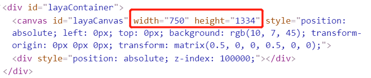
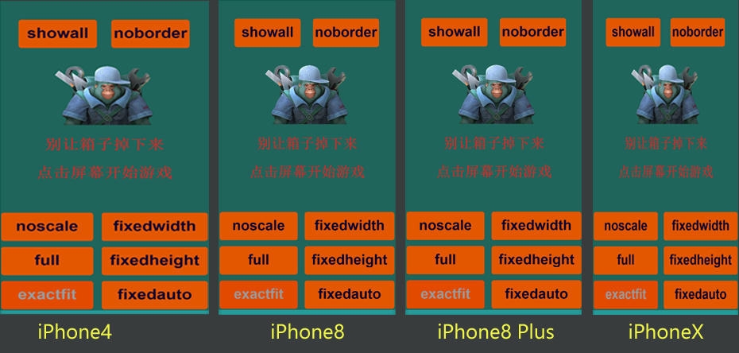
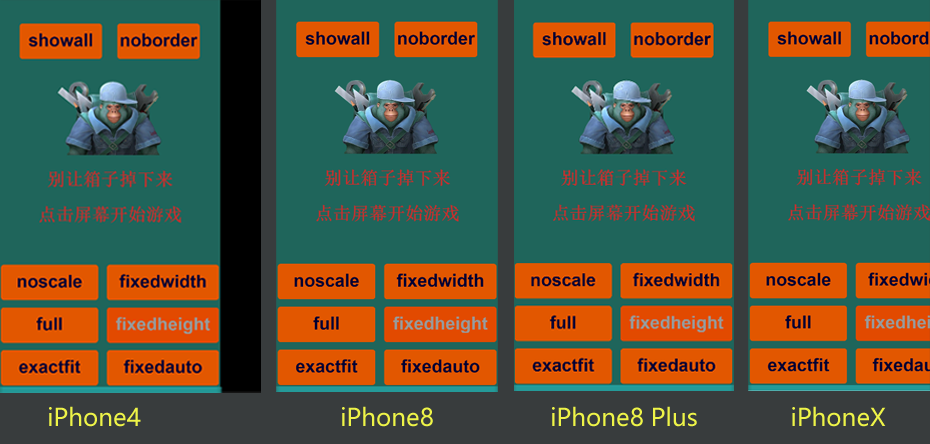
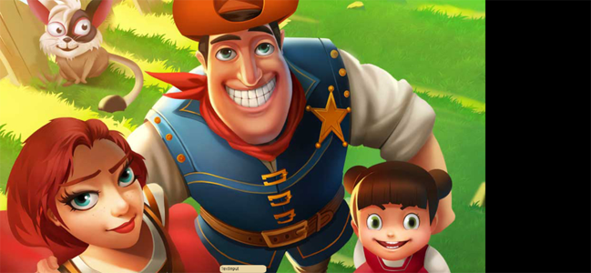

## LayaAir screen adaptation and effective anti-aliasing

> Author: Charley  

Sometimes I see some 3D games that have very obvious aliasing. After communicating with some developers, I found that many people don’t know how to remove the obvious aliasing. This is not a problem only encountered by new developers. Developers with experience in game development, even developers who have developed many games using the LayaAir engine, may not be clear about it. In addition, I have recently encountered developers who want to know how to adapt Liu Haiping, so I will give a comprehensive introduction through this article.

In order to allow novice developers to understand this matter, this article starts from the basic concepts and introduces in detail the various screen adaptation scaling modes of the LayaAir engine, the notch adaptation ideas, and how to effectively anti-alias.

## 1. Basic concepts

The following basic concepts are very important and will affect the understanding of the engine adaptation principles later. Please read them carefully.

### 1.1 Physical resolution

The simple understanding of physical resolution is the resolution supported by the hardware, in pixels (px), so we call each pixel on this hardware a physical pixel, also called a device pixel. The actual pixels on the screen are expressed in a mathematical expression such as the number of rows × the number of columns, which is the physical resolution.

The LayaAir engine runs on a browser or other running environment. When performing screen adaptation, the physical resolution actually refers to the screen resolution on the browser or running environment. It is expressed as the number of pixels in the screen width × the number of pixels in the screen height. Therefore, the physical resolution width and height obtained by horizontal screen and vertical screen will be different.

For example: In the default portrait screen state of iPhone8, the physical resolution width and height are expressed as `750 × 1334`. In landscape mode, the physical resolution width and height are expressed as `1334 × 750`.

### 1.2 Scaling factor and logical resolution

#### 1.2.1 Scaling factor Origin

iOS draws graphics in point (pt) as the unit. In the early days, `1 point=1 pixel`. The iPhone 4 launched in 2010 began to adopt Retina screen display technology, and the physical resolution was increased by 4 times. At this time, if the iPhone 4 still uses the `1pt=1px` solution, it will result in a display effect as shown below.

 (Picture 1)

In Figure 1, the full-screen design is based on the 320 × 480 of the iPhone 3GS. The display effect under the iPhone 4 is as shown on the left side of Figure 1. The original full-screen content only occupies a quarter, and the rest is left blank. If the full-screen design is based on the iPhone 4 resolution of `640 × 960`, the display effect on the iPhone 3GS screen will be as shown on the right side of Figure 1, with a large amount of content beyond the displayable area.

Obviously, Apple will not let what happens in Figure 1 happen. In fact, the scaling factor of iPhone4 is [@2X](https://github.com/2X), that is, on this model, a point is represented by a `2×2` pixel matrix, as shown in Figure 2 The effect is shown, perfectly solving the problems that may occur in Figure 1.


(figure 2)

With the development of the times, the physical resolution of subsequent models is getting higher and higher, and one point occupies more and more physical pixels, as shown in the figure below.


(image 3)

> The concept of scaling factors also applies to Android models

#### 1.2.2 Logical resolution

The simple understanding of logical resolution is the resolution used by the software. Our design adaptation depends entirely on it, and it is also reflected in the mathematical expression of multiplication. In order to better understand this concept, let's first look at a set of data tables.


(Figure 4)

From the data in Figure 4, we can see that with the update of mobile phone devices, the physical resolution has become higher and higher. If we perform screen adaptation according to the physical resolution, not counting Android, iPhone models alone will It's very fragmented. Fortunately, under the influence of the scaling factor, we see that the logical resolution basically does not change much, so the engine adaptation we will talk about later is mainly adapted to the logical resolution.

### 1.3 Device pixel ratio

When we develop based on browsers, the scaling factor concept introduced previously corresponds to **DPR** (Device Pixel Ratio), which is called device pixel ratio in Chinese. The DPR value of the browser can be obtained through `Laya.Browser.pixelRatio` in the LayaAir engine.

Let me expand on a few words here. In the browser, the zoom is controlled by the user by default. For example, when we expand the mobile browser with two fingers, we find that the web page will be enlarged, but the clarity will not be reduced. This is caused by the user's own scaling, and the scaling is not determined by the DPR value. If we want to adapt through logical resolution like APP development, let the browser determine how many physical pixels a CSS pixel occupies based on the DPR of the device. That requires relevant configuration using viewport in the meta tag of the entry HTML page. code show as below:

```
 <meta name='viewport' content='width=device-width,initial-scale=1.0,minimum-scale=1.0,maximum-scale=1.0,user-scalable=no'/>
```

> The above code is added by default in the LayaAir engine, and it is mandatory to add it and cannot be deleted.

Through the above viewport configuration, the page will not only prohibit the user from manual scaling, but will also automatically scale according to the DPR of the device.

### 1.4 Logical width and height

The logical width and height refers to the width and height of the logical resolution. In the browser, the logical resolution pixels that can be scaled are CSS pixels. When the viewport is set, the browser will determine how many pixels a CSS occupies based on the DPR value. For example, when the DPR is 3, one CSS pixel will occupy `3×3` physical pixels.

In the LayaAir engine, you can obtain the width of the logical resolution through `Laya.Browser.clientWidth` and the height of the logical resolution through `Laya.Browser.clientHeight`.

In the portrait mode of mobile devices such as mobile phones, the narrow side is width and the long side is height. If the screen is flipped to landscape mode, the long side is the width and the narrow side is the height.

In PC browsers, it is the visible width and height of the browser window obtained.

### 1.5 Physical width and height (screen width and height)

Physical width and height correspond to the concept of physical resolution introduced previously, also known as screen width and height. Developers can obtain the width and height values ​​through the interface encapsulated by the engine. Through `Laya.Browser.width`, they can get the number of pixels on the screen width, and through `Laya.Browser.height`, they can get the number of pixels on the screen height.

> The screen width and height are the hardware screen width and height only in full screen mode. Developers need to understand that the screen width and height actually refers to the width and height of the running environment window. For example, when running on a browser, it is the width and height of the browser display window.

The physical width and height in the LayaAir engine are calculated by `logical width and height*DPR`. The weird iPhone 6/7/8 Plus models have a logical resolution of `736×414` and a DPR value of 3. The multiplied result is obviously the same as the real physical resolution of each Plus model `1920×1080`. incompatible.

At this point, developers only need to understand that this is the case, and do not need to worry about adaptation errors. Since the LayaAir engine has made relevant configurations using viewport in the meta tag of the portal page, it will automatically scale according to DPR, and will eventually automatically Scaled to correspond to actual physical resolution.

> As for why the Plus model has such strange settings, I won’t go into details here. Interested students can search for answers on Baidu.

### 1.6 Design width and height

Design width and height are the width and height used by developers when designing products. Faced with many models, some novice developers are a little confused about which one to choose as the design width and height. Here are a few words.


(Figure 5)

When designing width and height, the first thing to consider is to prioritize compatibility with most commonly used screen ratios. From the table in Figure 5 above, we can see that excluding outdated models, mobile phone screens are basically divided into two categories, one is a non-full-screen mobile phone with an aspect ratio of about `1:1.78`, and the other is a mobile phone with an aspect ratio of about `1:1.78`. The ratio is about `1:2.17` for a full-screen mobile phone. Most of the screen ratios of Android models of various brands are also these two or close to these two.

Based on the principle of giving priority to performance, developers usually choose a smaller resolution as the main effect design, and then adapt it to other screen ratios. For example: the common `width 750 height 1334` or `width 720 height 1280`.

> The above description of width and height refers to the design of portrait mode, and the reverse is required for horizontal screen.

Open the `Project Settings` panel of the LayaAir 3.0 IDE and you can set it directly. The effect is shown in Figure 6.


(Figure 6)

### 1.7 Canvas width and height

As we all know, `<canvas>` is the canvas in HTML5, and its `width and height` attributes are the width and height of the canvas.

The canvas width and height will directly adopt the design width and height value in the noscale, exactfit, and noborder LayaAir engine adaptation modes. In other adaptation modes, it will change according to the adaptation rules. The value of the canvas width and height will have an impact on the final clarity and performance of the image. Even jagged edges or blurry images are related to the canvas width and height value here.

We run any page in the IDE. After using F12 to enter debugging mode in chrome, we find the canvas tag with the ID of `layaCanvas` in the entry page. Remember this position. The red circle marked in Figure 7 is the initial width and height of the canvas. You can pay more attention to this when understanding the screen adaptation mode later.



(Figure 7)

### 1.8 Adapted width and height

Since Canvas draws based on bitmap pixels, the width and height of the canvas have an impact on the picture quality and performance, or there may be issues such as the special resolution of plus. Therefore, it cannot be adapted by directly changing the width and height of the canvas, otherwise there will be some adaptation problems. In the LayaAir engine, the scaling ratio required to adapt to width and height is calculated based on different adaptation mode rules, and then the canvas is scaled to the logical resolution range through the transform matrix (matrix), and then scaled through the viewport and DPR mechanisms. reduction.

Based on the above, we need to understand that the **adapted width and height are the final effect width and height** processed by the LayaAir engine adaptation rules, which will directly affect the final effect after restoration through DPR.

When you understand each adaptation mode, you can observe the canvas width and height and the matrix scaling effect of transform in the HTML entry page to compare the differences between different modes. For example, as shown in the red circle in Figure 8, the adapted width and height are 249.99975 and 444.666222 respectively. After restoring to the physical resolution size, although there is a slight loss in accuracy, it is difficult to see.


(Figure 8)

### 1.9 Stage width and height

The stage width and height refers to the stage width and height of the LayaAir engine. The node objects of the engine are added and controlled on the stage. Within the scope of the stage, you can control the display, event monitoring, collision detection, etc., so the stage width and height Adaptation is still very important.

In the DevTools console, we can view the stage width and height through the engine API (`Laya.stage.width` and `Laya.stage.height`).

By default, the stage width and height are directly equal to the design width and height. In the adaptation modes of full, fixedwidth, fixedheight, and fixedauto, the stage width and height will change according to the adaptation rules. The third section of this article will introduce it in detail.


## 2. Introduction to anti-aliasing

### 2.1 Causes of sawtooth generation

The pixels of our screen are composed of a matrix sequence of rows and columns. In other words, there are no slashes on the screen. If you draw horizontal and vertical straight lines on a canvas based on pixel drawing, it will definitely be quite smooth. But what about drawing curves and diagonal lines? It can only be composed of two adjacent pixels that are continuously extended. If this sentence is difficult to understand, let's imagine a staircase and look at it from the side. It probably looks like this. The schematic effect is shown in Figure 9-1.


(Figure 9-1)

In addition, the basic composition of a 3D model is a polygonal grid composed of triangular faces. Drawing a model composed of 3D polygons is the same as our vector drawing of diagonal lines, curves, and circles. Therefore, it is normal for non-rectangular vector graphics and 3D models to produce aliasing.

### 2.2 Engine built-in anti-aliasing

The LayaAir engine has built-in anti-aliasing methods,

3D anti-aliasing can be set in Camera. LayaAir provides a high-precision MSAA anti-aliasing solution and a high-performance FXAA anti-aliasing solution, as shown in Figure 9-2.


(Figure 9-2)

> To learn more about the differences in 3D anti-aliasing parameters, you can read the ["Using 3D Camera"](../../../3D/Camera/readme.md) document.

2D anti-aliasing, if you want to turn it on, you can set it in Project Settings, as shown in Figure 9-3.

  

(Figure 9-3)

After turning on anti-aliasing, the jagged edges will become smooth and blurred. The schematic effect is shown in Figure 9-4.


(Figure 9-4)

The blurred aliasing will be relatively smooth and difficult to see with the naked eye on a screen with a relatively high pixel density. In order to achieve the goal of eliminating the jagged feeling.

### 2.3 Turn on anti-aliasing, why does it still feel jagged?

Some developers have discovered that when the anti-aliasing function is turned on, why do they still feel jagged?

There are two reasons,

The first is the problem of anti-aliasing solutions. For example, there are some small differences in accuracy between 3D anti-aliasing MSAA and FXAA.

Second, no matter how high-precision anti-aliasing is, it is impossible to really remove aliasing. It can only make the edge transition smoother through some algorithms. Thereby reducing the aliasing phenomenon. On some screens with a relatively large pixel density, making it difficult for the naked eye to recognize does not really make the aliasing disappear.

Therefore, if developers want to further reduce the aliasing, they should keep the canvas in sync with the physical resolution. Otherwise, the solution of stretching and scaling the canvas for full-screen adaptation may cause the anti-aliasing effect to be weakened.

### 2.4 Let the canvas use physical resolution

In the adaptation mode of the LayaAir engine, there is only the full mode, which allows the canvas to use the physical resolution by default.

>In addition to keeping the physical resolution of the canvas, full mode is equivalent to no adaptation plan. For UI layout, the adaptation threshold is high, and it is only suitable for pure 3D games or 3D games with very simple UI layout.

Therefore, we recommend another solution, by turning on the retina canvas mode `useRetinalCanvas` configuration, so that all adaptation modes use the physical resolution as the size of the canvas.

We can set these two solutions through the IDE's project settings panel, and the effect is shown in Figure 10.


(Figure 10)

#### 2.5.1 Dynamically enable retina canvas mode

If you want to dynamically control the opening and closing of retina canvas mode, you can also add configuration code in the project code. code show as below:

```typescript
if(condition){
	Laya.stage.useRetinalCanvas = false;
}else{    
	Laya.stage.useRetinalCanvas = true;
}
Laya.stage.alignH = "left";
```

What needs to be reminded here is that any one of the scaleMode, width, height, alignH, and alignV of the Stage needs to be set synchronously so that the modification will take effect.

Because setting the above properties will adjust the engine adaptation method, thereby modifying the canvas and other related adaptation data.

#### 2.5.2 Pros and cons of turning on retina canvas mode

Theoretically speaking, turning on retina canvas mode will cause more performance consumption on models that exceed the designed width and height. Because the more pixels on the canvas, the greater the performance consumption. Therefore, many 2D games will use a relatively smaller resolution as the game design width and height.

But from a practical perspective, the performance pressure brought by physical width and height is not that risky. You know, some small game platforms require physical resolution. Therefore, LayaAirIDE will forcibly turn on the retina canvas mode (useRetinalCanvas) when exporting some small game platform versions.

In addition, turning on retina canvas mode can not only solve problems in some small game platforms and reduce aliasing, but also make adaptation easier. Because the retina canvas mode is not used and the aliasing phenomenon is avoided, the mobile terminal can only use the full mode. In addition to allowing the canvas and stage to adopt the physical resolution, the full mode does not make any adaptations, so for the 2D UI, all It requires manual adaptation by developers.

Therefore, it is recommended to turn on retina canvas mode, especially for 3D games. If the performance pressure of certain models is taken into consideration, developers can dynamically turn on or off the retina canvas mode through logical control on the models with pressure or functions with performance pressure.

## 3. Detailed explanation of LayaAir screen adaptation mode

There are 8 adaptation modes of the LayaAir engine. In order to let everyone truly understand the adaptation strategies of each adaptation mode, so as to better adapt the screen. This section takes the 2D sample project created by LayaAirIDE as an example. The design width and height are adjusted to `750×1334` for a vertical screen interface, and each adaptation mode is compared with different models.

In terms of model selection for adaptation and comparison, the `640 × 960` of iPhone 4 represents the old model with an aspect ratio of 1.5, just for comparison of the adaptation effect. The `750 × 1334` of iPhone8 is the model we selected for the width and height design. The aspect ratio is about 1.78. No matter which mode it is, it is a perfect 1:1 adaptation. iPhone8 Plus represents the same ratio model with the same aspect ratio of approximately 1.78, but the physical resolution and DPR are different from iPhone8. iPhoneX represents various full-screen models with an aspect ratio greater than 2.

### 3.1 The easiest to understand adaptation mode

#### 3.1.1 The default non-scaling mode noscale

Noscale mode is the default mode of the engine. In this mode, the original physical resolution of the design will always be maintained on any screen, which is equivalent to attaching the unscaled design width and height canvas directly to the screen. A screen whose physical width and height are equal to the design width and height will be displayed in full screen. If the physical width and height are lower than the design width and height, the display will be incomplete. If the physical width and height exceed the design width and height, the screen background will leak out (white screen).

This mode is usually not used, and is only used by a few developers who do not use engine adaptation solutions and have custom adaptation rules.

In noscale mode, the comparison effects of different models are shown in Figure 11-1.


(Figure 11-1)

#### 3.1.2 Physical resolution canvas mode full

The full mode means that the canvas width and height and the stage width and height must be in a complete full-screen state, but like the noscale mode, the design width and height are not scaled. In full mode, the canvas size directly takes the physical resolution. The canvas will be as large as the physical width and height. In this mode, the setting of the design width and height parameters is meaningless. Just set `0,0` directly.

This mode still requires you to define your own adaptation rules, and is mostly used in 3D games. If you have a UI interface and don't want to define your own adaptation rules, a better 3D adaptation solution will be introduced later.

In full mode, the comparison effects of different models are shown in Figure 11-2.


(Figure 11-2)

In particular, if the background screen color is black, it is the canvas background color, not the stage background color. The default canvas background color can be changed through Project Settings.


(Figure 11)

The white screen background in noscale mode is the browser's default, which means that the canvas is only that big, and the area not covered by the canvas is the white screen background.

If the retina canvas mode is turned on in noscale mode, the display effect will be the same as the full mode effect in Figure 11-2, but the difference is that the full mode stage (stage) width and height are also physical width and height, so the game screen coverage You can still respond to clicks and other events wherever you go. When noscale turns on the retina canvas mode, it only forcibly changes the canvas to the physical width and height, and does not change the stage width and height, so parts outside the game screen (design width and height) will not respond to clicks and other events.

#### 3.1.3 Forced stretching of full screen mode exactfit

Exactfit is a full-screen stretching adaptation mode with unequal ratios. The width and height of the canvas and the width and height of the stage will be equal to the game design width and height. Then it is forced to scale to the logical width and height without considering the proportion. So unless the design width and height are equal to the physical width and height, there will be some deformation caused by stretching. The greater the difference between the screen resolution aspect ratio and the design aspect ratio, the more obvious the distortion will be.

Stretch to the physical width and height of the full screen, so unless the design width and height are equal to the physical width and height, there will be some deformation due to the stretching industry. The greater the difference between the width and height ratios of different models, the more obvious the deformation will be.

This mode is the only adaptation mode among all adaptation modes that does not require developers to make additional adaptation adjustments. It can ensure full-screen display, no blank space, and no cropping on any model. It also has many disadvantages. Obviously, when the physical width-to-height ratio is different from the designed width-to-height ratio, stretching and deformation will occur, which is suitable for developers who do not have strict requirements for interface deformation.

In exactfit mode, the comparison effects of different models are shown in Figure 11-3.



(Figure 11-3)

### 3.2 Recommended adaptation mode for mobile terminals

On the mobile side, we usually need a full-screen adaptation solution that maintains the design's aspect-to-height ratio scaling. The following modes are the adaptation modes that we recommend developers to adopt first. If it is a 3D game, it is recommended to turn on the retina canvas (useRetinalCanvas) mode.

#### 3.2.1 Width-preserving adaptation mode fixedwidth

The fixedwidth mode is a proportional scaling mode that ensures that content with a designed width must be displayed in full screen. This mode is recommended for vertical screen games.

In this mode, the canvas width and stage width will be equal to the design width. However, the canvas height and stage height will be scaled and changed based on the ratio of the physical width to the design width, and will not use the design height we configured. Therefore, when the changed canvas and stage height are higher than the original design height, the canvas background color will be exposed at the bottom. If the changed canvas and stage height are lower than the original design height, the excess portion will be cropped.

Fixedwidth mode, comparison of different models, as shown in Figure 12-1.


(Figure 12-1)

When you see the black background color in Figure 12-1, some developers may think when they see this, what I need is full-screen adaptation, and this is not suitable. In fact, don't worry, this is to let everyone understand the adaptation rules of fixedwidth, and it is not dealt with on purpose. Since in this mode, the width and height of the stage have been scaled to fill the full screen, so. Developers can use the relative layout attributes (top and bottom) to drag the background to full screen and the buttons to a relative position on the screen. Achieve perfect full-screen adaptation on all screens.

#### 3.2.2 Fixedheight adaptation mode

The fixedheight mode is a proportional scaling mode that ensures that high-design content must be displayed in full screen. This mode is recommended for horizontal screen games.

In this mode, the canvas height and stage height will be equal to the design height. However, the canvas width and stage width will be scaled and changed according to the ratio of physical height to design height, and will not use the design width we configured. Therefore, when the changed canvas and stage width are smaller than the original design width, the excess part will be cropped, as shown in Figure 12-2. If the changed canvas and stage width are larger than the original design width, the canvas background color will be exposed at the bottom, as shown in Figure 12-3.



(Figure 12-2)



(Figure 12-3)

Figures 12-2 and 12-3 are still deliberately left unprocessed. Through the relative layout attributes (left and right), the background is pulled to full screen and the buttons are pulled to a relative position on the screen. Achieve perfect full-screen adaptation on all screens.

#### 3.2.3 Automatically maintain width and height mode fixedauto

The fixedauto automatic width and height mode ensures that the content of the designed width and height must be displayed in full screen at the resolution of any model. This is a proportional scaling full-screen adaptation mode in which the design width and height will never be cropped, but the background color of the canvas may be left, as shown in Figure 12-4. Therefore, you still need to use relative layout attributes for full-screen adaptation. This mode is suitable for both horizontal screen and vertical screen games.


(Figure 12-4)

This mode actually uses fixedwidth or fixedheight, which is judged by comparing the physical aspect ratio and the design aspect ratio. If the physical aspect ratio is smaller than the design aspect ratio, fixedwidth mode is used, otherwise fixedheight is used.

### 3.3 Other adaptation modes

#### 3.3.1 Show all HD mode showall

The adaptation result of showall mode is very similar to fixedauto. It also ensures that the design width and height will be displayed on the screen. However, the difference and problem is that the canvas and stage of showall mode do not achieve full-screen adaptation at all resolutions. It takes the minimum ratio of (physical width/design width) and (physical height/design height), performs proportional scaling, and changes the stage and canvas sizes. Therefore, the blank part left is the part of the stage that cannot be controlled, which makes it truly impossible to adapt to the full screen on mobile phones with different aspect ratios from the design.

But it is not without its advantages. The advantage is that there is no need to use the relative layout for secondary adaptation. The design effect will be what it is, and it will definitely be displayed in full without deformation or cropping. And because the size of the canvas is changed, on screens with relatively large physical resolution differences, there will be no blur caused by the smaller design resolution, and it will still be high-definition. The disadvantage is that it cannot be adapted to the full screen of mobile phones, so this mode is usually not used for mobile phone adaptation. **This mode is recommended for horizontal screen web games running in PC browsers. **

showall mode, comparison of different models, as shown in Figure 13-1.


(Figure 13-1)

Showall mode is a high-definition adaptation mode because the width and height of the canvas have been scaled and changed. Therefore, this mode does not require the use of retina canvas mode (useRetinalCanvas). After using it, the canvas adopts the physical resolution, which is not good.

#### 3.3.2 The mode noboder that definitely does not leave a bottom edge

The adaptation rule of noboder is exactly the opposite of showall. It takes the maximum ratio of (physical width/design width) and (physical height/design height) for scaling. This will result in that when the resolution aspect ratio is different from the design aspect ratio on a screen, the design effect will definitely exceed the screen and be cropped. So there is no way to leave the bottom edge of the canvas or stage.

In addition, the width and height of the canvas and stage in this mode will remain the same as the designed width and height, so full-screen adaptation depends entirely on scaling the canvas. Without using retina mode, when the physical resolution far exceeds the design resolution, the screen will be stretched due to Stretch creates blur.

Noboder mode, comparison effects of different models, as shown in Figure 13-2.


(Figure 13-2)

Although this mode can also allow cropped buttons to return to the screen content through secondary adaptation of relative layout, the secondary adaptation method is more complicated. Therefore, this mode is not recommended.

### 3.4 Notch adaptation ideas

Since the launch of the iPhone Our adaptation creates trouble. But once you find the pattern, it’s actually not too complicated. Let’s share a common processing idea. You can adjust the adaptation specifically based on this adaptation idea.

#### 3.4.1 How to identify notch

Although the resolution of the current models on the market is seriously fragmented, if you carefully summarize it, you can find a rule, that is, the resolution has only a few aspect ratios. At least, for full-screen models, the aspect ratio must be greater than 2. So, we can get the width and height of the screen resolution and then calculate the aspect ratio. If the value is greater than 2, it will be treated as a notch screen for adaptation.

> As for the more detailed ones, you can continue to study them carefully. This section just introduces an idea.

#### 3.4.2 Relative layout

The UI component of LayaAirIDE provides relative layout attributes based on the parent container, such as top, bottom, left, and right. We can put all the buttons that need special processing into a container component, such as box. Then, we control the relative layout attributes of this container in the onAwake life cycle of the scene Runtime class, so that we can perform special position processing under the notch screen.

The sample code is as follows:

```typescript
onAwake():void{    
	//Aspect ratio greater than 2 means notch screen
	if((Browser.clientHeight/Browser.clientWidth)>2)
	{   	 
    	this.scaleGroup.top = 25; //Avoid top bangs sample code	 
    	this.scaleGroup.bottom = 50;//Avoid the bottom line sample code
	}
}
```

#### 3.4.3 How to debug

Since Chrome's debugging does not provide a virtual machine with bangs blocked, in addition to real machine debugging, simulation debugging can be performed in the WeChat mini game development tool.


### 3.5 Other adaptation-related learning

In addition to the adaptation mode, there are also other adaptation-related contents, such as horizontal and vertical screen adaptation, canvas alignment, etc.

You can go to the basic documentation of the IDE to view *[Detailed Explanation of Project Settings](../../IDE/projectSettings/readme.md)*.


