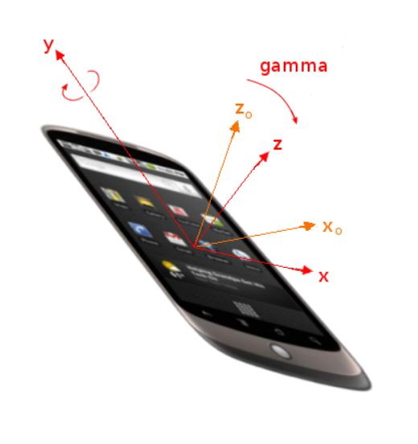

# laya.device.motion detailed explanation: gyroscope and accelerometer

There are four classes in laya.device.motion for developers to use, namely acceleration information AccelerationInfo, accelerator Accelerator, gyroscope, and saved rotation information RotationInfo. This section will describe the related content of laya.device.motion API in detail.

## 1. Gyroscope

 `Gyroscope` monitors device orientation changes through the `change` event. This event has two callback parameters:

- `absolute` - `true` if the orientation provided by the device is based on the difference between the device coordinate system and the earth coordinate system; `absolute` is `false` if the device cannot detect the earth coordinate system.
- `rotationInfo` - RotationInfo type, including `alpha`, `beta`, `gamma` three values, which will be discussed in detail below.

 The `alpha`, `beta`, and `gamma` properties must indicate the orientation of the device, expressed as a transformation from a coordinate system fixed on the earth to a coordinate system fixed on the device. The coordinate system must be adjusted as described below.

 The earth's coordinate system is an "east, north, and up" system located at the user's location. It has 3 axes, ground tangent to the user's location in the 1984 World Geodetic System spheriod.

- East (X) is on the ground, perpendicular to the north axis, and east is positive.

- North (Y) is on the ground, pointing towards the North Pole (pointing towards the North Pole).

- Up (Z) is perpendicular to the ground, upward is positive.

  For a mobile device, such as a phone or tablet, the device coordinate system is defined relative to the standard orientation of the screen. If the screen orientation changes when the device is rotated or the sliding keyboard is expanded, this does not affect the orientation of the coordinate system with respect to the device.

- x is positive on the screen or keyboard plane, the right side of the screen or keyboard.

- y is on the screen or keyboard screen, and above the screen or keyboard is positive.

-z is perpendicular to the screen or keyboard screen, and positive away from the screen or keyboard.

  Rotations must use the right-hand rule, that is, forward rotation along an axis is clockwise rotation when viewed from the direction of that axis. Starting from the coincidence of the two systems, the following rules apply for rotation:

1. #### Take the z-axis of the device coordinate system as the axis and rotate it by `alpha` degrees. The scope of `alpha` is [0, 360].

<br/>
(figure 1)

2. #### Take the x-axis of the device coordinate system as the axis and rotate it by `beta` degrees. The scope of `beta` is [-180, 180].

<br/>
(figure 2)

3. #### The y-axis of the device coordinate system is set as the axis and rotated by `gamma` degrees. The scope of `gamma` is [-90, 90].

<br/>
(image 3)
The following demonstrates obtaining rotation orientation information:

```typescript
class Gyroscope_Sample {
	private info: Laya.Text;
	constructor() {
    	Release.heat(550, 400);
    	this.info = new Laya.Text();
    	this.info.fontSize = 50;
    	this.info.color = "#FFFFFF";
    	this.info.size(Laya.stage.width, Laya.stage.height);
    	Laya.stage.addChild(this.info);

    	Laya.Gyroscope.instance.on(Laya.Event.CHANGE, this, this.onDeviceorientation);
	}
	private  onDeviceorientation(absolute: Boolean, rotationInfo: Laya.RotationInfo): void {
    	this.info.text =
        	"alpha:" + Math.floor(rotationInfo.alpha) + '\n' +
        	"beta :" + Math.floor(rotationInfo.beta) + '\n' +
        	"gamma:" + Math.floor(rotationInfo.gamma);
	}
}
new Gyroscope_Sample();
```


## 2. Accelerometer

The `Accelerator` class periodically sends activity detected by the device's motion sensor. This data represents the motion of the device in three dimensions. When the device moves, the sensor detects this movement and returns the device's accelerated coordinates. Even when stationary, acceleration coordinates including gravity can be obtained.

The callback function of the `change` event has one of the following parameters:

- `acceleration` - `AccelerationInfo` type. Provides the acceleration information of the host device relative to the earth coordinate system, which is expressed in the main coordinate system defined in the gyroscope chapter, and the unit is `m/s^2`.
- `accelerationIncludingGravity` - `AccelerationInfo` type. For implementations that cannot provide acceleration data that excludes the effects of gravity (e.g., lack a gyroscope), acceleration data that is affected by gravity can be provided as an alternative. This is not easy to use for many applications, but providing this information means providing maximum support. In this case, the `accelerationIncludingGravity` property provides the host device's acceleration information, plus an anti-gravity acceleration with equal and opposite acceleration. Its expression is the principal coordinate system defined in the gyroscope chapter. The unit of acceleration information is `m/s^2`.
- `rotationRate` - `RotationInfo` type. The property provides the rate at which the host device rotates in space. It is expressed in the angle change rate defined in the gyroscope chapter. The unit must be `deg/s`.
- `interval` - The interval for obtaining data from the hardware, in milliseconds.

### 2.1 Obtain the physical direction movement information of the device

 The accelerometer axis is the physical orientation of the device, which means that when you rotate the device, the accelerometer axis also rotates.

The following demonstrates obtaining device motion information:

```typescript
class Gyroscope_Sample {
	private info: Laya.Text;
	constructor() {
    	Release.heat(550, 400);
    	this.info = new Laya.Text();
    	this.info.fontSize = 50;
    	this.info.color = "#FFFFFF";
    	this.info.size(Laya.stage.width, Laya.stage.height);
    	Laya.stage.addChild(this.info);

    	Laya.Accelerator.instance.on(Laya.Event.CHANGE, this, this.onMotoin);
	}
	private onMotoin(acceleration: Laya.AccelerationInfo, accelerationIncludingGravity: Laya.AccelerationInfo, rotationRate: Laya.RotationInfo, interval: number): void {
    	this.info.text =
        	'acceleration:(' + acceleration.x.toFixed(3) + ', ' + acceleration.y.toFixed(3) + ', ' + acceleration.z.toFixed(3) + ')\n' +
        	'accelerationIncludingGravity:(' + accelerationIncludingGravity.x.toFixed(3) + ', ' + accelerationIncludingGravity.y.toFixed(3) + ', ' + accelerationIncludingGravity.z.toFixed(3) + ')\n' +
        	'rotationRate: alpha ' + Math.floor(rotationRate.alpha) + ', beta ' + Math.floor(rotationRate.beta) + ', gamma ' + Math.floor(rotationRate.gamma) + '\n' +
        	'interval: ' + interval;
	}
}
new Gyroscope_Sample();
```

### **2.2 Obtain device display direction movement information**

Since we may need to display running information in the direction, this means that even if the device is rotated, the accelerometer axis does not change. For example, the y-axis always remains vertical. Use `Accelerator.getTransformedAcceleration()` to get the running information in the display direction.

 In the `onMotion` function of the above example code, use `Accelerator.getTransformedAcceleration()` to convert the information before using `AccelerationInfo`:

```typescript
private onMotoin(acceleration: Laya.AccelerationInfo, accelerationIncludingGravity: Laya.AccelerationInfo, rotationRate: Laya.RotationInfo, interval: number): void {
    	acceleration = Laya.Accelerator.getTransformedAcceleration(acceleration);
    	accelerationIncludingGravity = Laya.Accelerator.getTransformedAcceleration(accelerationIncludingGravity);
    	......
	}
```

