# Universal release

## 1. Overview

After completing the development of the project in LayaAir, the project needs to be published. Publishing a project is an important step in getting a developer's game or application packaged and ready for deployment to a target platform, whether it's a web browser, mobile device, or other supported platform.

LayaAir3.1.x reconstructs the contract issuing process based on 3.0.x. The new version supports batch publishing, API calls, and plug-in extensions.


## 2. Publish in IDE

### 2.1 Build and release

To use the IDE to publish a project, developers first open the "Build and Release" option in the file menu, as shown in Figure 2-1:

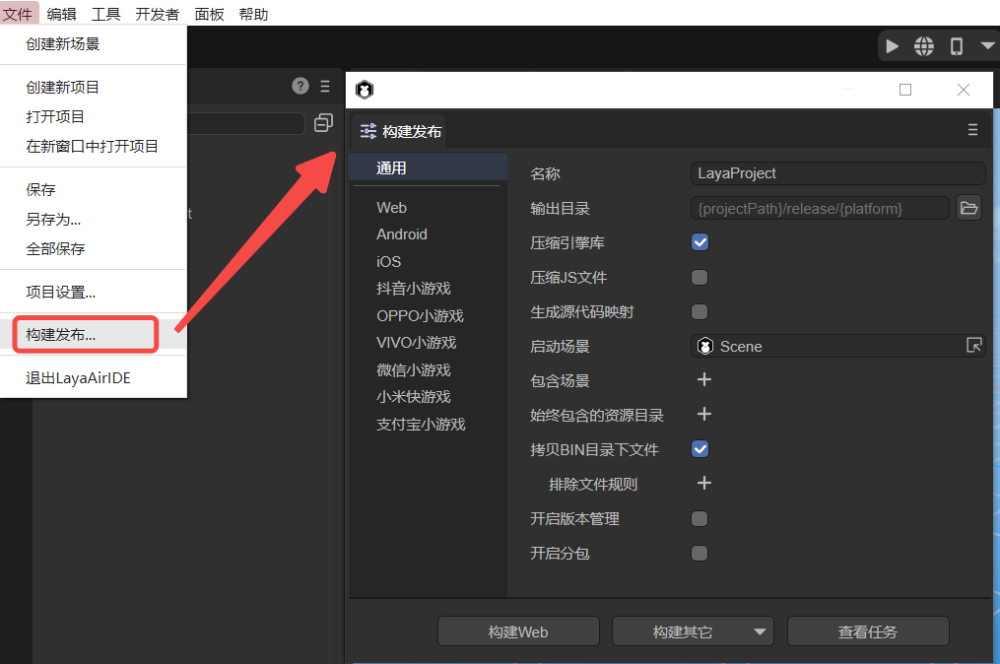

(Figure 2-1)


### 2.2 General options

After the build release option is turned on, you can see that there is a common option, which is consistent for each target platform:

`Name`: The name of the project (for web publishing, it is the title name in html).

`Output directory`: The output directory refers to the target directory to be published to. By default, it is in the release directory of the project. **It is not recommended to change it here**. Of course, if the developer needs to customize the output directory, it can be in the directory where the project is located, or it can be a directory unrelated to the project.

`Compression engine library`: It is generally recommended to check it. After checking, the compressed engine class library will be used, which can reduce the package size.

`Compress JS file`: It is generally recommended to check it. After checking, the compressed JS file will be used, which can reduce the package size.

`Generate source code mapping`: When checked, the output directory will package the ".js.map" file for source code mapping.

`Startup scene`: The first scene when starting the project runtime.

`Include scene`: In the included scene, the referenced resources will be copied to the output directory (refer to 2.5.1 for details).

`Always included resource directory`: Resources in the selected resource directory are always copied to the output directory (refer to 2.5.2 for details).

`Copy files in BIN directory`: When checked, the published output directory will include the files in the bin folder in the project directory (refer to Section 4 for details).

`Turn on version management`: When checked, a key value will be added to the published file name for version management mapping, which can effectively avoid the impact of incorrect loading caused by cache or CDN.

`Enable subcontracting`: After checking, the subcontracting function is enabled (refer to 2.6 and 2.7 for details).


### 2.3 Target platform

Currently, there are nine publishing options in the target platform, namely: Web, Android, iOS, Douyin mini games, OPPO mini games, VIVO mini games, WeChat mini games, Xiaomi Kuai Games, and Alipay mini games. As shown in Figure 2-2, after selecting the corresponding platform, click Build.


(Figure 2-2)

`Web` means published as [HTML5 version](../web/readme.md), running in the browser environment, webView, LayaNative APP environment.

`Android` means released as an Android platform and runs in the Android APP environment.

`iOS` refers to an APP released as an iOS platform and running in the iOS APP environment.

`Douyin Mini Game` refers to the project published as adapted [Douyin Mini Game](../miniGame/byteDance/readme.md).

`OPPO Mini Games` refers to projects published as adapted [OPPO Mini Games](../miniGame/OPPO/readme.md).

`VIVO mini-games' refer to projects published as adapted [VIVO mini-games](../miniGame/vivo/readme.md).

`WeChat Mini Games` refers to projects published as adapted [WeChat Mini Games](../miniGame/wechat/readme.md).

`Xiaomi Quick Game` refers to projects published as adapted to [Xiaomi Quick Game](../miniGame/xiaomi/readme.md).

`Alipay Mini Game` refers to a project published as an adapted [Alipay Mini Game](../miniGame/alipaygame/readme.md).

> This article mainly introduces the general publishing settings. You can click the above link to view the documentation for each publishing platform.

You can also click the "Build Other" option in Figure 2-2 to publish directly to the corresponding platform. After publishing, you can see the publishing results in "View Tasks".


### 2.4 Resources used by published code

Developers often use code references to use resources in their projects, so the IDE cannot recognize these resources. Therefore, the IDE specifies the `Resources` directory to meet this requirement for developers, as shown in Figure 2-3:


(Figure 2-3)

This is a sample project that uses code only. Note that there are two images image and c1 in the `resources` directory. Let’s take a look at the released directory.

Taking Web publishing as an example, click the "Build Web" button and wait until the publishing is successful, as shown in Figure 2-4.


(Figure 2-4)

You will see that under the web directory (if a mini-game is released, it corresponds to the mini-game directory), there will also be a `resources` directory, which includes image and c1. At the same time, there will be a "fileconfig.json" file in the web directory. In fact, the json file contains resource attribute information. The content of the file is as follows:

```json
{
  "sRGB": true,
  "wrapMode": 0,
  "filterMode": 1,
  "anisoLevel": 0,
  "readWrite": false,
  "mipmap": false,
  "pma": true,
  "hdrEncodeFormat": 0,
  "files": [
	{
  	"file": "",
  	"ext": "png",
  	"format": 1
	}
  ],
  "platforms": {
	"0": 0,
	"1": 0,
	"2": 0
  }
}
```

Any resources in the `resources` directory will be published to the output directory without additional action, so developers can use the `resources` directory as a directory for code to use resources.


### 2.5 Resources used in IDE

The above `resources` directory is mainly for using resources with code. Resources need to be stored in the `resources` directory. However, in our actual development process, resources are usually placed in the assets directory, including scenes and prefab files, etc., as shown in Figure 2-5.


(Figure 2-5)

With so many resource directories, changing them all to the resources directory would be a very huge modification work. Therefore, the IDE provides developers with two more convenient ways:


#### 2.5.1 Including scenes: resources referenced in the scene

As shown in Figure 2-6, scenes such as Game can be added to the included scene. The resources referenced by these scenes will be published to the output directory. After publishing, open the published directory.

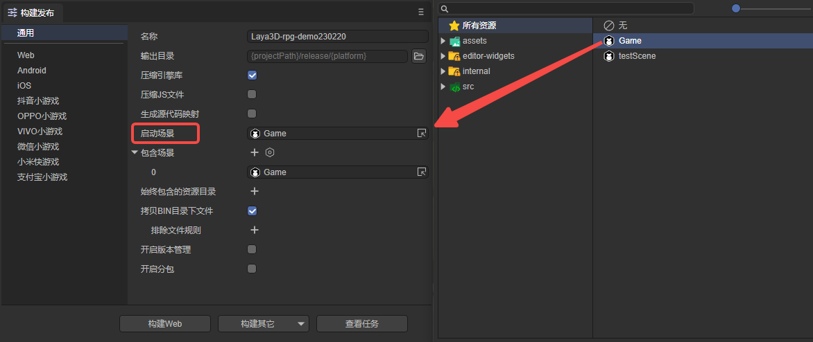

(Figure 2-6)

As shown in Figure 2-7, these directories have been successfully published to the output directory.


(Figure 2-7)

Next run it to see the effect, as shown in the animation 2-8:


(Animation 2-8)

The scene can be seen running normally, but no enemies are found, and there is no music. Turn on the debugging information, as shown in Figure 2-9. You can see that enemy.lh and bgm.mp3 are not in the output directory. This is because enemy.lh and bgm.mp3 are executed through code. The resources referenced in the code must be placed in the resources directory before they are copied to the release directory. If the resources referenced by the code are not in the resources directory and are not referenced in the scene, the directory where the resource is located needs to be set to Always Contains the resource directory.


(Figure 2-9)

At this time, we can use the second method


#### 2.5.2 Always include resource directories: resources referenced in the code

In the "Always Include Resource Directory" option, click `+` to select the folder where the enemy.lh and bgm.mp3 resources are located, as shown in Figure 2-10:


(Figure 2-10)

At this time, publish again. After the publishing is successful, check the output directory, as shown in Figure 2-11. It is found that the enemy.lh and bgm.mp3 files have been published to the prefab and music directories respectively.

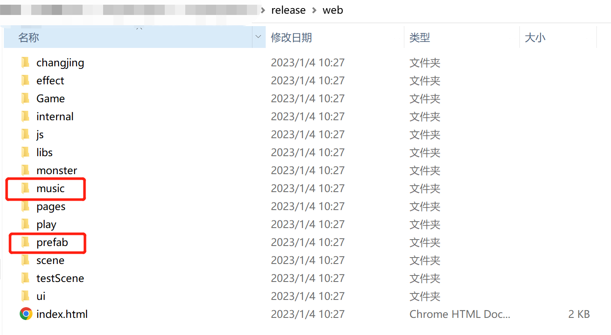

(Figure 2-11)

Run it at this time and see the effect. As shown in Figure 2-12, the enemy is running normally, indicating that the resource release has been included.

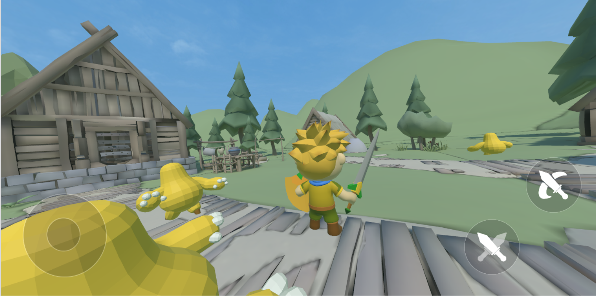

(Figure 2-12)

Finally, to summarize, as shown in Figure 2-13, through the resources directory, included scenes, and always included resource directories, all the resources used during the project running process can be successfully packaged into the output directory.

When the project requires fewer resources, they can be placed in the resources directory numbered 1 in the figure, so that resources referenced in the scene or in the code can be published to the output directory; when the project has more resources , it is inconvenient to manage in the resources directory, so when publishing, you need to set up the resource directory outside the resources directory. The scene should be added in the "Included Scenario" numbered 2, and the resources referenced in the code should be added in the "included scene" numbered 3. "Always included in the resource directory".


(Figure 2-13)

In the initial stage of project development, developers should try to plan the directory structure of project resources in advance to avoid repeated use of resources, or continuous modification of resource directories in the later stages of the project, resulting in resource reference errors in the scene.


### 2.6 Resource subcontracting

When `building and publishing`, you can `turn on subcontracting`. Resource subcontracting is to divide the selected resources into multiple small packages to facilitate users to load resources and avoid problems such as network instability and interruptions.

The following takes web publishing as an example to demonstrate how to enable resource subcontracting. As shown in the animation 2-14, after clicking `Open Subpackaging`, you can add one or more subpackages below. Two subpackages (resource folders) are added in the animation. Select the paths "sub1" and " sub2", all resources under these two paths will each become a subcontract after release. "sub1" has a prefab (Cube.lh), material (CubeMaterial.lmat), and texture map (layaAir.png); "sub2" has only one prefab (Sphere.lh).


(Animation 2-14)

When configuring resource subcontracting, you need to set the following parameters:

| Parameters	| Description	|
| -------------- | ------------------------------------------------------------ |
| Resource folder	| The contents in the resource folder are the resources to be subcontracted	|
| Entrance script	| Refer to code subcontracting in Section 2.7	|
| Whether the package is remote	| After checking, the resource folder (subpackage) will be released to the release\xxx-remote directory after `version release` |
| Automatically load at startup | If checked, the resource folder (subpackage) will be automatically loaded when running the published project |
| Remote package address	| If you check "Remote package or not" and "Automatically load at startup" at the same time, this parameter will be displayed and you will be asked to fill in the address of the remote package |

> The remote package file after Web publishing is in the web-remote folder. Mini games also support remote packages. **The remote package after release is located in the release directory**. For example, the remote package file after the WeChat mini game is released is located in the release\wxgame-remote folder. The same is true for other mini games.


#### 2.6.1 Remote package

Remote package means that these resources can be placed on CDN (content distribution network, readers who don't understand can first understand it as a kind of server) to provide high performance, scalability and low-cost network content to users. If the web platform does not use remote packages, there is little point in subcontracting them. Mini games use remote packages to reduce the package size.

For example, as shown in Figure 2-15, if the "sub1" and "sub2" directories are set as remote packages, after publishing, these two directories will be published to the "release\web-remote" directory.


(Animation 2-15)

Developers need to upload all the subdirectories under "web-remote" to the CDN by themselves (not the "web-remote" directory itself, but "sub1" and "sub2" under the directory). After the upload is completed, " Delete the web-remote" directory to prevent it from taking up space (you can also keep it). For the convenience of demonstration, **local server** is used to simulate instead of CDN.

Create a new folder on the desktop named "serve", which represents the folder in the local server. A new text file "This is a local server.txt" is created in it to test that the local server starts successfully. You can use Node.js anywhere to start a local server. As shown in the animation 2-16, open the command line cmd in the "serve" folder, enter `anywhere 2840`, and then click the Enter key on the keyboard to start a local server, where `2840` is the specified port number .

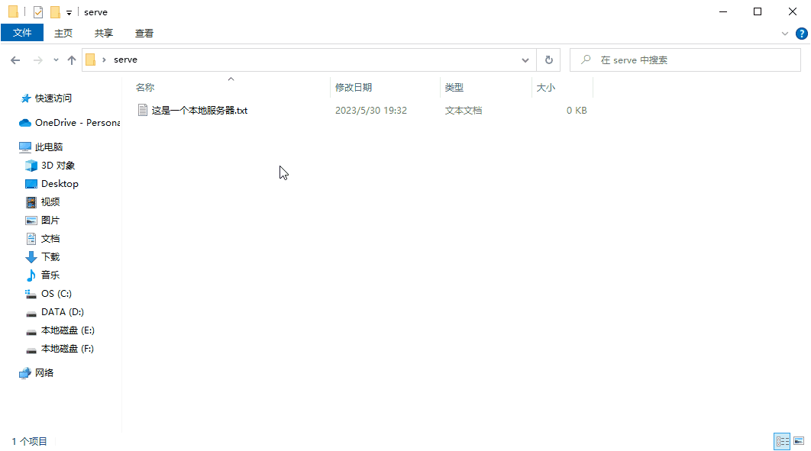

(Animation 2-16)

As you can see from the animation, the address of the local server is `http://192.168.56.1:2840/`. This address will be used in the subsequent demonstration. It should be noted here that when running the published project, the local server needs to be turned on.

The next step is to import the resources to the local server. When actually uploading to CDN, you can use tools to upload, but for the local server, directly upload the remote packages ("sub1" and "sub2") from the "web-remote" file Just cut or copy the folder to the "serve" folder.

After importing the remote package to the local server, there are two situations for loading the remote package, automatic loading in the IDE, and loading with code.


#### 2.6.2 Automatic loading in IDE

As shown in Figure 2-17, after referencing resources in the IDE (adding resources in the scene),


(Figure 2-17)

When building and publishing, check `Automatically load at startup`, and then fill in the remote package address, which is the address of the local server `http://192.168.56.1:2840/`, as shown in the following animation:


(Animation 2-18)

After clicking `Version Release`, you need to upload "sub1" and "sub2" to the "serve" folder of the local server again, as shown in animation 2-19:


(Animation 2-19)

Now you can run the published Web project, as shown in animation 2-20. The same method is used for local debugging. Open the command window in the published folder, enter `anywhere` and press Enter to start. When running the Web project, it is The default port number is `8000`. Be sure to keep the local server with the remote package address `http://192.168.56.1:2840/` open.

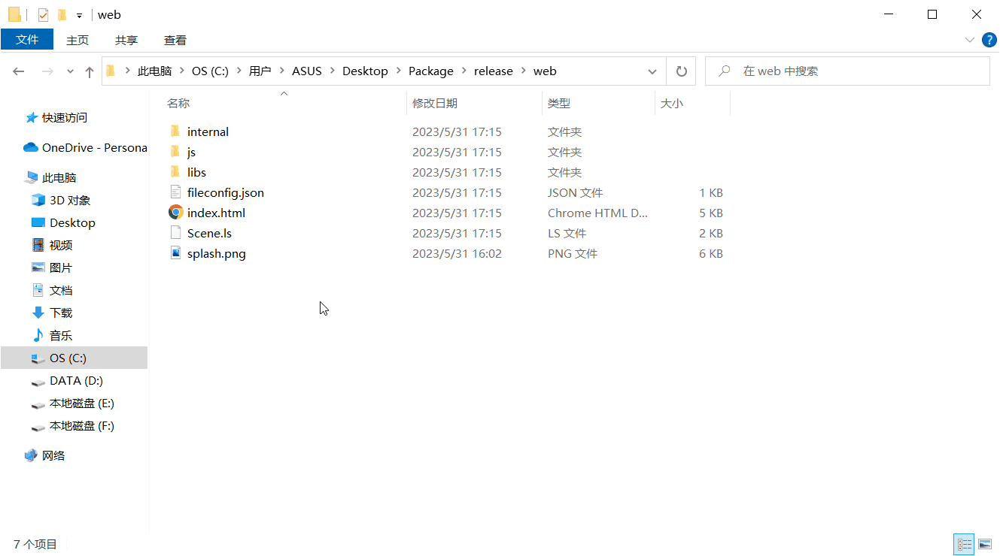

(Animation 2-20)

You can see that the resources are loaded. Open the developer tools, as shown in Figure 2-21. You can see that the resources are loaded from the remote package `http://192.168.56.1:2840/`.


(Figure 2-21)


#### 2.6.3 Resources referenced by the code

Sometimes, we don't want the game to load too many resources at the beginning. This will cause the load to be too large, and then manual code loading is required.

As shown in Figure 2-22, the resource to be subcontracted is not referenced in the scene. Add a custom component script in the attribute settings of the Scene2D node.


(Figure 2-22)

Then add the following code to the script:

```typescript
const { regClass, property } = Laya;

@regClass()
export class Script extends Laya.Script {
	//declare owner : Laya.Sprite3D;

	@property({ type: Laya.Scene3D })
	scene3d: Laya.Scene3D;

	constructor() {
    	super();
	}

	/**
 	* Executed after the component is activated. At this time, all nodes and components have been created. This method is only executed once.
 	*/
	onAwake(): void {
    	//Web platform uses remote package
    	Laya.loader.loadPackage("sub1","http://192.168.56.1:2840/",this.printProgress).then(()=>{
        	Laya.loader.load("sub1/cube.lh").then((res:Laya.PrefabImpl) =>{
            	let sp3:Laya.Sprite3D =res.create() as Laya.Sprite3D;
            	this.scene3d.addChild(sp3);
        	});
    	})

    	Laya.loader.loadPackage("sub2","http://192.168.56.1:2840/",this.printProgress).then(()=>{
        	Laya.loader.load("sub2/sphere.lh").then((res:Laya.PrefabImpl) =>{
            	let sp3:Laya.Sprite3D =res.create() as Laya.Sprite3D;
            	sp3.transform.localPositionX += 1.0; //Prevent the sphere and cube from overlapping at the initial position
            	this.scene3d.addChild(sp3);
        	});
    	})
	}

	printProgress(res: any) {
    	console.log("Loading Progress" + JSON.stringify(res)); //Convert the res object into a string in JSON format. The value printed here is 1. This code is mainly used to print loadTask to reflect the download progress after the mini-game is released.
	}

}
```

> Note: For resource loading, please refer to ["Resource Loading"](../../basics/common/Loader/readme.md).

When loading the exploit code, uncheck `Automatically load at startup`, but if the subpackaged resources are not in the resources directory ("sub1" and "sub2" in this example are not there), you must add the package to `Always include In the resource directory`, the configuration is as shown below:


(Figure 2-23)

After publishing, as with the previous operation, "sub1" and "sub2" need to be uploaded to the local server "serve" folder.

Next, you can run the Web project. Same as the previous operation, use `anywhere` to start. The effect is shown in Figure 2-24:


(Figure 2-24)

You can see that the resource is loaded. Open the developer tools, as shown in Figure 2-25. You can see that the resource is loaded from the remote package `http://192.168.56.1:2840/`.


(Figure 2-25)


### 2.7 Code subcontracting

#### 2.7.1 Method

In addition to resource subcontracting, code can also be subcontracted. Generally used for sub-packaging of mini-games, it can reduce the size of the first package (because mini-games limit the size of the package) and speed up loading.

Code subcontracting requires the use of `script set definition`, which can automatically package the scripts in the specified directory (under the src directory) into a separate js. It's also suitable for non-subcontracting purposes, such as simply wanting to split code. As shown in Figure 2-26, a script set definition can be created in the project resource panel.

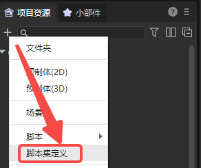

(Figure 2-26)

> Usually, the script files you write will be concentrated in the bundle.js file in the project directory "bin\js\bundles".
>
> If a certain part of the code is split, this part of the code will be transferred to the "script set definition.js" file in the project directory "bin\js\bundles".

As shown in Figure 2-27, after creation, you can configure it in its property settings panel.


(Figure 2-27)

`Activate`: Generally needs to be checked. When checked, code subcontracting is activated.

`Global name`: generally does not need to be set. Used for module naming, such as module1, then other modules can access the classes and functions exported by this module through "module1.xxx".

`Allow editor loading`: Generally needs to be checked. When checked, the script will also be loaded in the editor environment.

`Allow runtime loading` and `Automatic loading`: generally need to be checked. When checked, the script will be loaded automatically at runtime.

`Allow compression when publishing`: When building a release, if "Compress JS files" is set, this script will be compressed.

`Entry file` and `Include all files`: control which TS scripts must be included. The subpackage definition is for the directory. In which directory it is located, the files in this directory will be included in this subpackage.

`Dependencies`: Like JS plug-ins, they manage the loading order. That is, you can set up multiple scripts, and these scripts will be loaded first.


After configuration, when publishing the project, you only need to place the script set definition in the `entry script`, and then select a non-main package folder in the `resource folder`. Note that the sub-package cannot be a remote package, as shown in Figure 2 -28 shown,

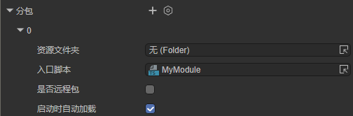

(Figure 2-28)


#### 2.7.2 Demonstration

Here we take "2D Getting Started Example" as an example to demonstrate the code subcontracting process.

After creating a new sample project, as shown in Figure 2-29, create a new `script set definition` MyModule.bundledef in the src folder, and then in its property settings panel, check Include all files. Here, all the codes in the src directory are split. Developers can split the codes according to their own needs.

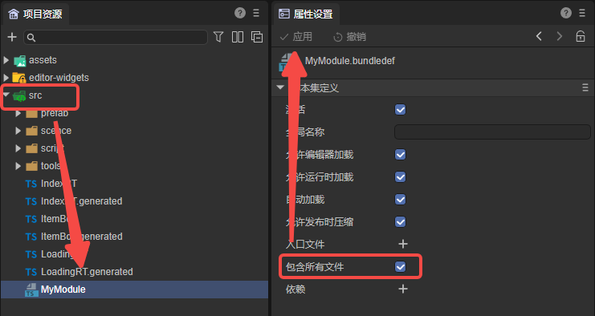

(Figure 2-29)

>When MyModule is activated, the bundle.js file in the project directory "bin\js\bundles" will become smaller in size, and there will be one more MyModule.js file.
>
>This means splitting the code in the src directory, and splitting the code in bundle.js into MyModule.js.

Then in the build release, as shown in Figure 2-30, place MyModule in the `Entry Script` and check `Automatically load at startup`. Among them, the script folder of the `resource folder` is a newly created empty folder in the assets directory, and the code subpackage after release will be located in this folder.


(Figure 2-30)

>After publishing, you can find that in the js folder of the publishing directory, the code in the original bundle.js is split into the subpackaged script folder.


## 3. Packaging Album

Atlas is a common art resource in game development. Multiple pictures are merged into one large picture through the IDE publishing process, and the original picture resource information is stored in the atlas format file.

Figure 3-1 is a png atlas resource packaged using LayaAirIDE.


(Figure 3-1)

### 3.1 Why use atlas resources?

Using atlas resources synthesized from multiple pictures as art resources in the game has the following advantages:

**1 Optimize memory**

When synthesizing the atlas, the blank area around each picture will be removed, and various optimization algorithms can be implemented as a whole. After the atlas is synthesized, the game package and memory usage can be greatly reduced.

**2 Reduce CPU operations**

If multiple `Sprite` are rendering images from the same atlas, these `Sprite` can be processed using the same rendering batch, which greatly reduces the CPU calculation time and improves operating efficiency.


### 3.2 Supported album packaging formats

LayaAirIDE supports packaging of two resource formats, PNG and JPG, into atlases. However, it is recommended to use PNG for the original resources packaged in the atlas, because the size of JPG will be larger.

> Tips：
>
> It should be noted that the bit depth of the original PNG resource cannot exceed 32, otherwise the packaged image will appear blurry. The Texttrue Type property of the resource entered into the atlas should be set to SpritetTextrue. In addition, PNG and JPG resources cannot be renamed from resources in other formats to PNG and JPG formats.


### 3.3 How to create an atlas using LayaAir IDE

There are two ways to create an atlas using LayaAir IDE. The first way is more detailed, and the second way is simpler and faster. Developers can choose by themselves.

#### 3.3.1 Automatic generation

Automatically packaging image resources is only possible when LayaAir IDE is released, but you need to add and set the album packaging configuration file. Here we explain it through an example, as shown in Figure 3-2:


(Figure 3-2)

1. All image resources are placed in the assets/resources directory. As mentioned above, since images may be used in code during project development, without specifying the "always included resource directory", they are placed in the The resources directory will be published directly to the output directory.

2. The atlas directory under the resources directory is used to store some scattered images and subfolders (there are also scattered images in it). The advantage of this is to classify and manage resources. There are often other resource directories under the resources directory. Try to put pictures Resources are stored separately from other resources.

3. In the atlas directory, there are two pictures (img_bg100-0.png and img_bg100-1.png) and sub-folders ui1 and ui2, which contain many scatter images respectively. At the same time, there is also a sub-folder in the ui1 directory.

If the atlas is not packaged, after publishing, the atlas directory under the output directory will be filled with scatter images. Let’s take a look at how to package an album:

**Step 1: Add configuration file**

As shown in Figure 3-3, add the configuration file in the atlas directory.


(Animation 3-3)

In the resources/atlas directory, right-click -> Create, select "Automatic Atlas Settings", and an AtlasConfig.atlascfg file will be created. The purpose of placing it under atlas is to package the pictures in the atlas directory and the pictures in sub-folders at the same time (supporting single atlas and multiple sub-folder atlases). Developers can rename this file.


**Step 2: Set file properties for the album**

Click on the AtlasConfig file, as shown in Figure 3-4:

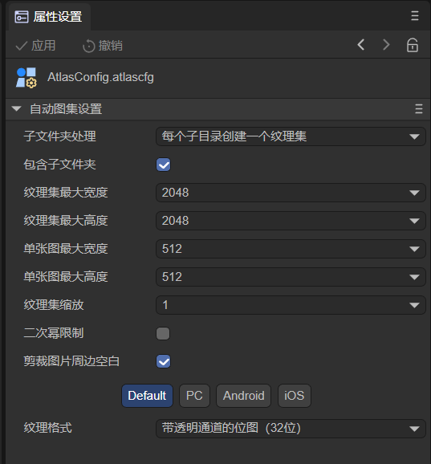

(Figure 3-4)

`Subfolder handling`:

Create one texture set per subdirectory: Pack one atlas per subfolder.

Share a texture set: All images in subfolders and sibling directories are packaged into one large atlas.

`Include subfolders`:

When checked, it supports packaging subfolders into atlases. When unchecked, only pictures in the same level directory are processed into packaged atlases.

`Maximum width\height of atlas`:

The default value is `2048×2048`, which determines the maximum size of a single atlas. If there are too many original pictures and exceed the maximum width and height of a single atlas, new atlas files (multiple atlases) will be generated during packaging.

`Maximum width\height of a single image`:

The default value is `512×512`. Single images exceeding this size will not be packaged into the album.

> Tips: It is not recommended to package a single image exceeding 512×512 into an atlas. This image can be preloaded separately. However, loading a single image cannot exceed 1024×1024, otherwise it will affect performance.

`Texture set scaling`:

Here you can reduce the size of the atlas by scaling, for example, to 0.5. The IDE will multiply the width and height of the original image by 0.5 to generate it into the atlas. When displayed, the size of the original image will be maintained by stretching. After this processing, although the atlas The size will become smaller, but the display effect will also be affected. It can be regarded as an alternative compression scheme for the atlas. If you want to maintain image accuracy during design, try not to adjust the default values.

`Power of Two Limits`:

If checked, the width and height of the generated atlas image will be a whole power of 2. Here, it is recommended that the artist design according to the whole power of 2 when designing, and use the atlas tool to forcibly maintain the whole power of 2, which will definitely cause the size of the atlas to become larger. Therefore, unless you are faced with some runtime environment that requires optimization by the whole power of 2, under normal circumstances, there is no need to check it. Try to ask the art designer to optimize it by the whole power of 2 such as 32, 64, 128, 256, etc. Design the width and height of the image.

`Crop the white space around the image`:

If checked, the generated atlas pictures will automatically crop out the blank areas in the original pictures. The default is checked, do not remove it.

`Texture format`:

png32 is the default format, this format supports transparency and more colors; png24, no transparency; texture compression reference document ["Texture Compression"] (../../IDE/uiEditor/textureCompress/readme.md).


**Step 3: Publish the generated atlas**

After setting up, publish in "Build Release" and wait for the release to be successful. Now let's take a look at the released directory, as shown in Figure 3-5:


(Figure 3-5)

1. Three atlases (AtlasConfig, ui1 and ui2) were generated. Since the `Create a texture set for each subdirectory` method was selected, ui1 and ui2 each generated an atlas (the atlas file name of the subfolder is According to the folder name), the map under atlas generates an atlas (the atlas file generated in the folder where AtlasConfig.atlascfg is located is named according to the AtlasConfig file name).

2. If there are pictures whose size exceeds 512x512, they will not be entered into the album (512×512 is the setting in Figure 3-4).

3. There is an a directory under the ui1 directory, and `Include subfolders` is checked, so the scatter images under the a folder are also entered in the album ui1. If you do not check `Include subfolders`, the ui1/a directory will be retained, and the scatter image will still be below.


#### 3.3.2 Tool production

The second method is faster and simpler, but it cannot achieve detailed attribute settings like the first method. This method is in ["Animation Node"](../../2D/displayObject/Animation/readme.md ) is also mentioned in, and I will demonstrate it for you below.

First click "Create Album" in the "Tools" menu.


(Figure 3-6)

Then drag the folder you want to package into the folder where the picture is located, and click `Make`.


(Figure 3-7)

You can also click the folder icon to select the path yourself, as shown in Figure 3-8.


(Figure 3-8)

After clicking Create, enter the file name and click Save, as shown in Figure 3-9.

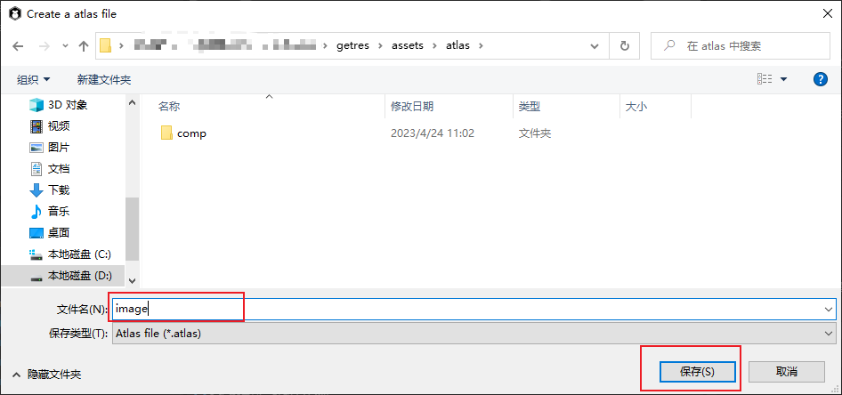

(Figure 3-9)

The atlas is now created.

When we add or delete pictures included in the atlas, we only need to repeat the above process, click on the .atlas file, and click Yes to successfully replace it, as shown in Figure 3-10.


(Figure 3-10)

> [!Tip]
>
> If the second atlas packaging method is used, the developer must ensure that this directory will be very stable, and no subsequent additions, deletions, or modifications of image resources will be made. If a stable directory cannot be guaranteed, it is best to use the first packaging method.


### 3.4 Introduction to packaged and generated atlas files

#### 3.4.1 Package the generated atlas file

After packaging the atlas, special resources for the atlas will be generated (the `.atlas` files and `.png` files with the same names respectively)

#### 3.4.2 atlas suffix file

`.atlas` is a unique atlas format of LayaAirIDE. It is only used for atlases, so there is no need to fill in the type when loading `.atlas`. It is the same as loading a normal single image, which is more convenient and is the recommended way to load atlases. . The sample code for loading the atlas using atlas is:

```typescript
//Example of using atlas method atlas
Laya.loader.load("resources/atlas/Atlas_ui.atlas").then(
    ()=>{}
);
```


### 3.5 How to use small pictures in the atlas in the project

If you use the resources in the atlas in your project, you need to preload the atlas resources first, and then set the skin (*skin*) attribute value of the image to "original thumbnail directory name/original thumbnail resource name.png".

For example: Now we display the original small picture `img_head2.png` and image.png in the comp directory in the project through the atlas in Figure 3-5. The sample code is as follows:

```typescript
    	let resArr: Array<any> = [

        	{ url: "resources/atlas/Atlas.atlas", type: Laya.Loader.ATLAS },
        	{ url: "resources/atlas/Atlas_ui.atlas", type: Laya.Loader.ATLAS },
        	{ url: "resources/atlas/Atlas_comp.atlas", type: Laya.Loader.ATLAS }];


    	Laya.loader.load(resArr).then( ()=>{
            	//Create Image1 instance
            	var img1 = new Laya.Image();
            	//Set the skin (the way to get the small picture in the picture collection is the original small picture directory name/original small picture resource name.png)
            	img1.skin = "resources/atlas/img_head2.png";
            	//Add to the stage for display
            	Laya.stage.addChild(img1);

            	//Create Image2 instance
            	var img2 = new Laya.Image();
            	//Set the skin (the way to get the small picture in the picture collection is the original small picture directory name/original small picture resource name.png)
            	img2.skin = "resources/atlas/comp/image.png";
            	//Add to the stage for display
            	Laya.stage.addChild(img2);
        	}
    	);
```

The running effect is shown in Figure 3-11:


(Figure 3-11)

At this point, the introduction to packaged atlases is complete. Developers need to plan the directory management of images in advance. They can be divided according to functions and create a sub-folder for each function. In this way, the size of the atlas can be controlled within a reasonable range as much as possible and divided according to functions. The advantage is also that it is easy to find. If developers encounter problems during use, please feel free to communicate with us at any time.


## 4. Release native resources

Native resources refer to resources that load DOM elements through native JS. They are usually used in project development. Therefore, some developers hope to write some JS code that implements DOM in index.html to load these images or video resources. When the preview is running, since index.html is in the bin directory, these resources can only be stored in the bin directory. As shown in Figure 4-1:

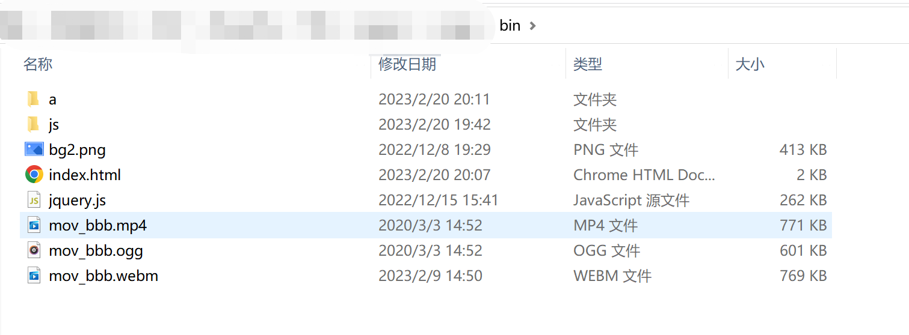

(Pic 4-1)

> Starting from LayaAir 3.0.0 beta5 version, it will support the function of publishing native resources in the bin directory.

After the project Web is published, by default, all resources in the bin directory will be published to the web directory, as shown in Figure 4-2:

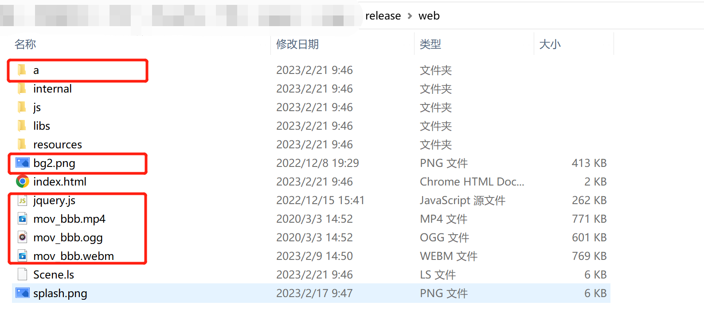

(Figure 4-2)


At the same time, LayaAir3.0 IDE also provides developers with exclusion resource rules. Adding rules here can instruct the packager to exclude some files or folders under the bin folder. For example, to exclude a folder, you can use 'abc/**', etc. , as shown in Figure 4-3


(Figure 4-3)


After clicking Publish, the native resources in the above bin folder have been excluded, as shown in Figure 4-4:

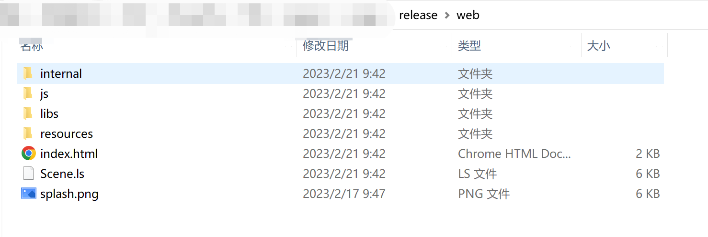

(Figure 4-4)


It is recommended to call native objects. Let’s talk about the benefits of using LayaAir to call native objects.

Let's take an example. Add an img tag to index.html in the bin directory to add some styles. The src is designated as bg2.png in the bin directory. At the same time, there is a function to hide the image by clicking on the image, as shown in Figure 4-5. Show. After publishing, this DOM code will also be published to index.html in the web directory.


(Figure 4-5)

There is no problem when we run index.html in the web directory, but bg2.png must be placed in the bin directory. This picture may also be used in the development of the project, which means that it will also be stored in the assets directory. Zhang bg2.png, then the developer needs to maintain the same picture in two places, causing certain trouble. Therefore, we recommend developers to use the method provided by LayaAir to call native objects. The code is as follows:

```typescript
//Create native img object
let img:any = Laya.Browser.document.createElement("img");
//Set style
img.style = "position:absolute;left:10;top:10;cursor:pointer;";
//Specify resource address
img.src = Laya.URL.postFormatURL(Laya.URL.formatURL("resources/bg2.png"));
//Set the attributes of the img element
img.setAttribute("onclick", "this.style.display=\'none\'");
//Add to page
Laya.Browser.document.body.appendChild(img);
```

We delete the DOM code in index.html in the bin directory, cut bg2.png to the resources directory of assets, and publish it again

In this case, index.html in the web directory does not have any DOM code, and there is only one copy of bg2.png in the resources directory, and the running effect is the same as before!

By using **Laya.URL.postFormatURL(Laya.URL.formatURL("resources/bg2.png"));** both during preview of the IDE and when running after publishing, the LayaAir engine will use resources/bg2.png as the native The image address of img's src, developers can try it themselves.

At this point, the method of calling native objects through LayaAir has been introduced. Developers can use it according to their own needs.

> Note: To import old projects before beta5, you need to manually delete index.html in the bin. A new template will be regenerated during preview.


