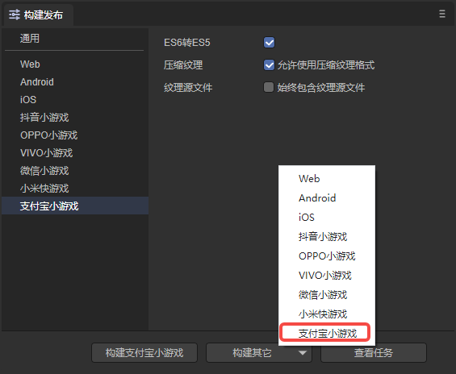
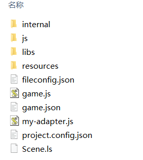
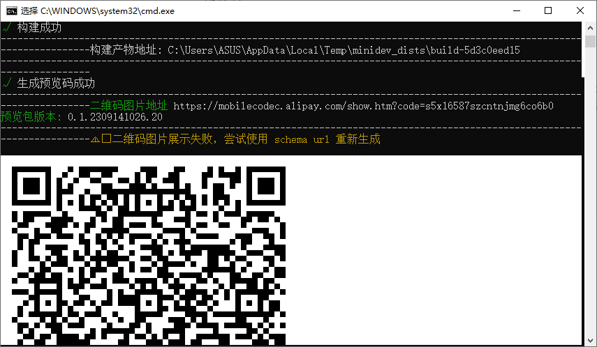

# Alipay mini game

## 1. Overview

Alipay mini-games do not require users to download and are a new type of game that can be played immediately.

Compared with APPs, mini-games have the characteristics of short development cycle and low development cost, which allow developers to participate in the development process more easily. Achieve rapid launch and rapid monetization.

It is recommended to read the [documents](https://www.yuque.com/zhifubaoxiaoyouxi-zromu/ts2ry9) of Alipay mini games, the first of which ["How to quickly launch a mini game"](https://www. yuque.com/zhifubaoxiaoyouxi-zromu/ts2ry9/cd5abg3aaneeoopq) can help developers quickly release online mini-game projects. The content of this article will also be used to install mini-game development tools. The documentation of the LayaAir engine is more engine-related, and of course also mixed with application introductions of some mini-games [interface](https://www.yuque.com/zhifubaoxiaoyouxi-zromu/ts2ry9/dzptpo).

>Before releasing the Alipay mini-game, you need to perform [General](../../generalSetting/readme.md) settings.


## 2. Build and publish as Alipay mini-game

### 2.1 Select target platform

In the build and release panel, select the target platform as Alipay Mini Game in the sidebar. As shown in Figure 2-1,



(Figure 2-1)

Click "Build Alipay Mini Game" or "Alipay Mini Game" in the "Build Other" option to publish the project as an Alipay Mini Game.

`ES6 to ES5`: If you need to use the "real machine debugging" function of Alipay's mini game development tools after the build is released, you need to check this option. It is generally recommended to check this box.

`Compressed texture`: Generally, you need to check "Allow the use of compressed texture format". If not checked, the compression format settings of all images will be ignored.

`Texture source file`: You can uncheck "Always include texture source file". If checked, the source file (png/jpg) will still be packaged even if the image uses a compressed format. The purpose is to fallback to the source file when encountering a system that does not support the compression format.


### 2.2 Introduction to the mini-game directory after release

The directory structure after publishing is shown in Figure 2-2:



(Figure 2-2)

**js directory and libs directory**:

Project code and engine libraries.

**resources resource directory and Scene.ls**:

resources resource directory and scene file Scene.ls. Due to the limitations of the initial package for small games, it is recommended to plan the contents of the initial package in advance. It is best to put them in a unified directory to facilitate the separation of the initial package.

**game.js**：

The entrance files of Alipay mini-games, the game project entrance JS files and the adaptation library JS are all introduced here. The IDE has already generated it when creating the project. Under normal circumstances, there is no need to touch it here.

**game.json**：

The configuration file of the mini game, developer tools and clients need to read this configuration to complete related interface rendering and property settings.

**project.config.json**：

The project configuration file of the mini game contains some information about the mini game project.

**my-adapter.js**：

Alipay mini game adaptation library file, used to adapt to Alipay mini games.


## 3. Use Alipay mini game development tools

To debug the Alipay mini game project after LayaAir builds and releases it, you need to install mini game development tools. Proceed as follows:

### 3.1 Apply for mini game application

Whether you are debugging or publishing Alipay mini games, you need an AppID. To obtain this AppID, you need to log in to the [developer official website](https://open.alipay.com/), log in to your developer account (Alipay account), and create a mini game. For specific operations, please refer to Alipay's [documentation](https ://www.yuque.com/zhifubaoxiaoyouxi-zromu/ts2ry9/cd5abg3aaneeoopq). After creating a mini-game, an AppID will be generated, which developers will use during debugging and publishing.


### 3.2 Install mini game development tools

Alipay mini game development tools need to be used through the command line. Developers can open the command line panel (run as administrator) and enter the following command to install:

```bash
npm and -g minidev@1.8.10
```

During the installation process, there may be delays due to network problems. It should be noted that the node.js version here cannot be too low, at least higher than 12.

> The 1.8.10 after the character @ indicates the version of the mini game development tool. Developers must choose the appropriate version according to their needs when installing.


### 3.3 Log in to Alipay developer account

After downloading the mini game development tools, you need to log in. Login is also through the command line.

Following the previous step, after executing the `minidev login` command, a QR code will appear. Developers can use Alipay to scan the code to log in to the developer account.

As shown in Figure 3-1, after successful login, the words "Authorization Completed" will be displayed.


(Figure 3-1)


### 3.4 Preview or real device debugging

After preparing the mini game development tools, it is time to debug the mini game project built and released by LayaAir. Alipay provides two methods of preview and real-device debugging, both of which need to be executed through the command line. Generally, after the LayaAir project is built and released as an Alipay mini-game, it is debugged using a real machine. Because real machine debugging will open the debugging panel on the PC browser, while the preview can only open the debugging panel on the mobile phone.

#### 3.4.1 Preview

Preview, the required version of the mini game development tool installed is `\>= @ali/minidev@1.2.10`.

Execute the command in the project directory: `minidev preview -a 2021xxx --ignore-http-domain-check`, where "2021xxx" is the AppID generated in Section 3.1. The effect is shown in Figure 3-2:


(Figure 3-2)

The result after execution is shown in Figure 3-3.



(Figure 3-3)

Use Alipay to scan the code to preview the effect, as shown in Figure 3-4. You can click the three dots in the upper right corner to open the debugging panel.


(Figure 3-4)

> In actual operation, it is not recommended to use preview. Developers who are interested can check the relevant details in Alipay [Documentation](https://www.yuque.com/zhifubaoxiaoyouxi-zromu/ts2ry9/cd5abg3aaneeoopq).

#### 3.4.2 Real machine debugging

Real machine debugging requires the installed mini game development tool version `\>= @ali/minidev@1.3.0`. Real machine debugging needs to be shown in Figure 2-1, that is, check ** when LayaAir is built and released as an Alipay mini game. ES6 to ES5**.

Execute the command in the project directory: `minidev remote-debug -a 2021xxx --ignore-http-domain-check`, where "2021xxx" is the AppID generated in Section 3.1. The effect is shown in Figure 3-5:


(Figure 3-5)

The result after execution is shown in Figure 3-6. An address will be generated for remote debugging, and a QR code will be generated. Developers can use Alipay to scan the code to view the effect.


(Figure 3-6)

At this time, open the remote address on the PC's browser, and the debugging panel will be displayed, as shown in Figure 3-7.


(Figure 3-7)

> For individual developers, real-device debugging may encounter problems such as not being able to see the corresponding mini-games, as summarized in Alipay's [Document](https://www.yuque.com/zhifubaoxiaoyouxi-zromu/ts2ry9/sorpbdvftm6tkcc6) some frequently asked questions.


### 3.5 Upload and publish

If you want to actually publish the debugged Alipay mini game online, you still need to upload and publish it.

To upload, the version of the mini game development tool required to be installed `\>=@ali/minidev@1.4.2` also needs to be executed using the command in the project directory: `minidev upload -a 2021xxx -v 0.0.1 --game`, Among them, "2021xxx" is the AppID generated in Section 3.1. After uploading, you can generate an experience code for the uploaded version on the open platform.

After publishing and passing the review, it will be published and launched on the [mini program official website](https://mini.open.alipay.com/channel/miniIndex.htm).

> For the specific parameter requirements of the upload command, please refer to Alipay [documentation](https://www.yuque.com/zhifubaoxiaoyouxi-zromu/ts2ry9/cd5abg3aaneeoopq).


## 4. Subpackage loading

The following introduces how LayaAir IDE subcontracts Alipay mini games. Developers can first look at the subcontracting settings set by [General](../../generalSetting/readme.md). You can perform subcontracting loading through the following steps, as shown in Figure 4-1. Check to enable subcontracting, and then select the folder to be subcontracted. Developers can also choose whether to enable remote packages.


(Pic 4-1)

>Alipay mini-game subcontracting restrictions:
>
>- The size of all main packages + sub-packages of the entire mini-game does not exceed 20M
>- The main package does not exceed 4M
>- There is no limit on the size of a single ordinary subpackage
>
>Please refer to Alipay Mini Game [Document](https://www.yuque.com/zhifubaoxiaoyouxi-zromu/ts2ry9/bsqy3cit5ztbxl1q).

The Alipay mini-game development tool used when debugging sub-package loading needs to be upgraded to `1.8.10` and above.

For the IDE to automatically load a subpackage, you need to check the "Automatically load at startup" option of the subpackage when publishing. If the resource is referenced by code, the method is slightly different from web publishing. An example of loading code is as follows:

```typescript
const { regClass, property } = Laya;

@regClass()
export class Script extends Laya.Script {

	@property({ type: Laya.Scene3D })
	scene3d: Laya.Scene3D;

	constructor() {
    	super();
	}

	// Executed after the component is activated. At this time, all nodes and components have been created. This method is only executed once.
	onAwake(): void {

    	//Alipay mini game
    	Laya.loader.loadPackage("sub1", this.printProgress).then(() => {
        	Laya.loader.load("sub1/Cube.lh").then((res: Laya.PrefabImpl) => {
            	let sp3: Laya.Sprite3D = res.create() as Laya.Sprite3D;
            	this.scene3d.addChild(sp3);
        	});
    	})

    	Laya.loader.loadPackage("sub2", this.printProgress).then(() => {
        	Laya.loader.load("sub2/Sphere.lh").then((res: any) => {
            	let sp3 = res.create();
            	this.scene3d.addChild(sp3);
        	});
    	})
   	 
	}

	printProgress(res: any) {
    	console.log("Loading Progress" + JSON.stringify(res));
	}

}
```

In the code, `printProgress` will print the loading progress log, and the effect is as follows:


(Figure 4-2)


