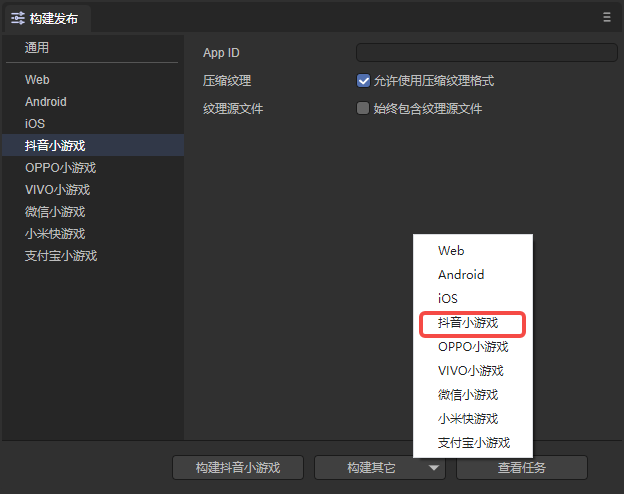
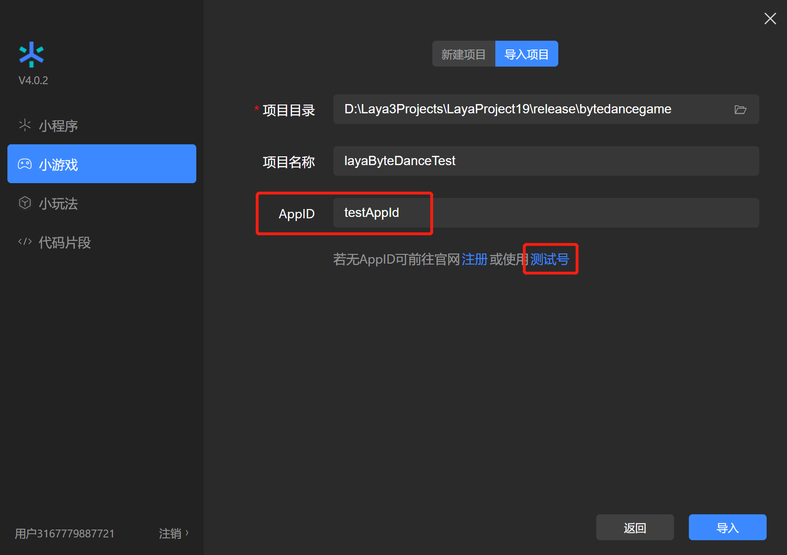
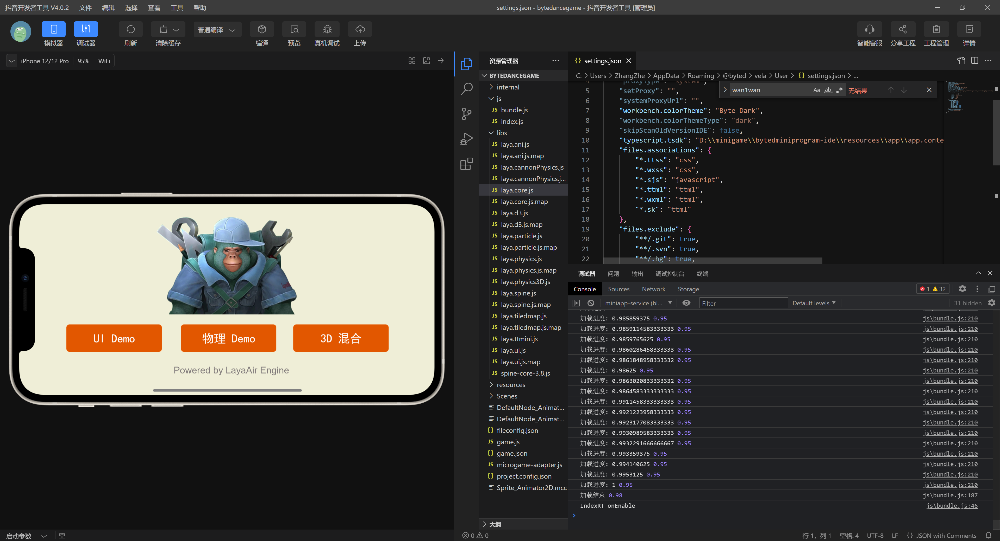

# Douyin mini games


## 1. Overview

Douyin mini-games do not require users to download and are a new type of game that can be played immediately.

Compared with APPs, mini-games have the characteristics of short development cycle and low development cost, which allow developers to participate in the development process more easily. Achieve rapid launch and rapid monetization.

Mini games require no downloading and are simple to play. They naturally match scenes such as graphics, texts, and videos. The full product matrix takes content distribution as the core, drives the distribution of mini-games through content, and uses content to drive volume and fission of mini-games.

It is recommended to take a look at the [official documentation](https://developer.open-douyin.com/docs/resource/zh-CN/mini-game/guide/minigame/introduction/) of Douyin Mini Game  and the LayaAir engine The documentation is more engine-related, and of course also mixed with some mini-games [interfaces](https://developer.open-douyin.com/docs/resource/zh-CN/mini-game/develop/api/overview ) application introduction, but it is definitely correct to take a closer look at the official documentation.

**Download and install mini game developer tools**

[Mini game development tool](https://developer.open-douyin.com/docs/resource/zh-CN/mini-game/develop/developer-instrument/developer-instrument-update-and-download) is mainly used for Preview and debugging of mini game products, real machine testing, upload and submission, etc. It is an essential tool for small game development.

> Before the Douyin mini game is released, you need to perform [General](../../generalSetting/readme.md) settings.


## 2. Publish as Douyin mini-game


### 2.1 Select target platform

In the build and release panel, select the target platform Douyin Mini Game in the sidebar. As shown in Figure 2-1,



(Figure 2-1)

Click "Build Douyin Mini Game" or "Douyin Mini Game" in the "Build Other" option to publish the project as Douyin Mini Game.

`Appid`: Users can directly fill in the AppID of the Douyin mini game when publishing.

`Compressed texture`: Generally, you need to check "Allow the use of compressed texture format". If not checked, the compression format settings of all images will be ignored.

`Texture source file`: You can uncheck "Always include texture source file". If checked, the source file (png/jpg) will still be packaged even if the image uses a compressed format. The purpose is to fallback to the source file when encountering a system that does not support the compression format.


### 2.2 Introduction to the mini-game directory after release

The directory structure after publishing is shown in Figure 2-2:


(Figure 2-2)

**js directory and libs directory**:

Project code and engine libraries.

**resources directory and Scene.ls**:

resources resource directory and scene file Scene.ls. Due to the limitations of the initial package for small games, it is recommended to plan the contents of the initial package. It is best to put them in a unified directory to facilitate the separation of the initial package.

**game.js**：

The entry files of Douyin mini-games, the game project entry JS files and the adaptation library JS are all introduced here. The IDE has already generated it when creating the project. Under normal circumstances, there is no need to touch it here.

**game.json**：

The configuration file of the mini game, developer tools and clients need to read this configuration to complete related interface rendering and property settings. For example, the horizontal and vertical screen orientation of the screen.

**projectconfig.json**：

The project configuration file of the mini game contains some information about the mini game project. If you want to modify the appid and other information, you can edit it directly here.

**microgame-adapter.js**：

Douyin mini game adaptation library file.


## 3. Use Douyin developer tools to create small game projects


### 3.1 Log in with a developer account and select the project type

For account creation and login on the Douyin development platform, as well as the creation of mini-game projects, use of tools, and product release, you can view Douyin’s mini-game developer [documentation](https://developer.open-douyin.com /docs/resource/zh-CN/mini-game/guide/minigame/sign). Open "Douyin Developer Tools" and use the "Douyin" APP to scan the QR code to log in. Then select **Mini Game**, click to enter the project settings, and select New, as shown in Figure 3-1.


(Figure 3-1)

### 3.2 Import mini-game projects

Select the import directory, which is the target directory after LayaAir IDE is released (usually release\bytedancegame in the project root directory)


(Figure 3-2)

After selecting the bytedancegame directory, as shown in Figure 3-3



(Figure 3-3)

`AppID` test account, you can click to register, you can develop and debug without entering it, you can use the test account, but the functions will be limited. So it’s better to enter `AppID`

### 3.3 Compilation of Douyin developer tools

After completing the creation of the mini-game project, you can preview the effects and debug within the tool. As shown in Figure 3-4



(Figure 3-4)

### 3.4 Real machine testing and debugging

Since the project effects can also be debugged in LayaAir IDE, unless it is an adaptation-related issue, there will basically be no inconsistency between the effects on both sides. So the most important thing here is to click on the **Preview** function, scan the code through Douyin, and conduct real-device testing and debugging in Douyin. As shown in Figure 3-5


(Figure 3-5)

## 4. Subpackage loading

The following is an introduction to how LayaAir IDE subcontracts Douyin mini-games. Developers can first look at the subcontracting settings set by [General](../../generalSetting/readme.md). You can perform subcontracting loading through the following steps, as shown in Figure 4-1. After clicking Build and Publish, check Enable subcontracting, and then select the folder to be subcontracted. Developers can also choose whether to enable remote packages.


(Pic 4-1)

> Douyin mini-game subcontracting restrictions:
>
> - The size of the entire mini gameplay package (main package + sub-package) does not exceed 20M
> - A single main package does not exceed 4M
> - Unlimited size of individual packets
>
> Please refer to Douyin Mini Game [Official Document](https://developer.open-douyin.com/docs/resource/zh-CN/interaction/develop/framework/subpackages/introduction/).

For the IDE to automatically load a subpackage, you need to check the "Automatically load at startup" option of the subpackage when publishing. If the resource is referenced by code, the method is slightly different from web publishing. An example of loading code is as follows:

```typescript
const { regClass, property } = Laya;

@regClass()
export class Script extends Laya.Script {
	//declare owner : Laya.Sprite3D;

	@property({ type: Laya.Scene3D })
	scene3d: Laya.Scene3D;

	constructor() {
    	super();
	}

	/**
 	* Executed after the component is activated. At this time, all nodes and components have been created. This method is only executed once.
 	*/
	onAwake(): void {
    	//Mini game loading subpackage
    	Laya.loader.loadPackage("sub1", this.printProgress).then(() => {
        	Laya.loader.load("sub1/Cube.lh").then((res: Laya.PrefabImpl) => {
            	let sp3: Laya.Sprite3D = res.create() as Laya.Sprite3D;
            	this.scene3d.addChild(sp3);
        	});
    	})

    	Laya.loader.loadPackage("sub2", this.printProgress).then(() => {
        	Laya.loader.load("sub2/Sphere.lh").then((res: any) => {
            	let sp3 = res.create();
            	this.scene3d.addChild(sp3);
        	});
    	})
	}

	printProgress(res: any) {
    	console.log("Loading Progress" + JSON.stringify(res));
	}
}
```

Here we mainly introduce the content printed by `printProgress`. After the Douyin developer tool opens and compiles our exported project, the following log will be printed:


(Figure 4-2)

[tt.loadSubpackage](https://developer.open-douyin.com/docs/resource/zh-CN/interaction/develop/api/loadSubpackage/tt-loadSubpackage) will return a [LoadSubpackageTask](https://developer .open-douyin.com/docs/resource/zh-CN/interaction/develop/api/loadSubpackage/LoadSubpackageTask), through which you can obtain the current download progress.

> Refer to Douyin Mini Game [Official Document](https://developer.open-douyin.com/docs/resource/zh-CN/interaction/develop/framework/subpackages/basic).

The meanings of the printed parameters are:

`name`: the name of the subcontract;

`progress`: Subpackage download progress percentage;

`totalBytesWritten`: length of downloaded data, unit Bytes;

`totalBytesExpectedToWrite`: The total length of data expected to be downloaded, in Bytes.

