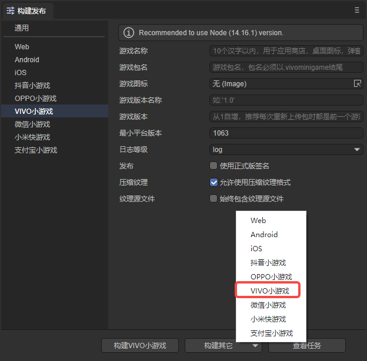
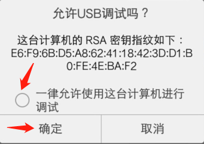

# VIVO minigames


## 1. Overview

It is recommended to take a look at the official [documentation](https://minigame.vivo.com.cn/documents/#/guide/) of vivo mini game . The documentation of LayaAir engine is more engine-related, and of course it will be mixed. There are some introductions to the application of small game interfaces, but it is definitely correct to take a closer look at vivo’s official documentation.

There are no visual development and debugging tools in vivo mini-games, so you can only configure the relevant parameters in LayaAir IDE, and then publish successfully (generate an rpk package) directly in LayaAir IDE with one click. As for the debugging method, you install an apk debugging environment ([vivo mini game debugger](https://minigame.vivo.com.cn/documents/#/download/debugger)) on your vivo phone and select it in the apk Open the rpk file, and then use Chrome to connect the phone to the PC with a data cable for debugging.

>Before the vivo mini-game is released, [General](../../generalSetting/readme.md) needs to be set first.


## 2. Published as vivo mini-game


### 2.1 Select target platform

In the build and release panel, select the target platform as vivo mini game in the sidebar. As shown in Figure 2-1,



(Figure 2-1)

Click "Build vivo mini-game" or "vivo mini-game" in the "Build other" option to publish the project as a vivo mini-game.

The following is an introduction to filling in these function parameters:

**1. Game name**

Generally, Chinese characters are filled in, but English is also acceptable. Used for game entrances such as app stores, desktop icons, pop-up windows, etc. A good name is an important factor in whether the game can attract traffic. Vivo requires that it must be within 6 Chinese characters.

**2. Game package name**

The format of the game package name is `com.company.module`. The first digit is com, the second digit is the company name, and the third digit is the project name. All must be written in English, for example: `com.layabox.demoGame`.

**3. Game icon**

The game icon is also an important game entrance logo. Like the game name, it is a very important element that attracts attention. If the game icon is well designed, the game name will be well chosen. The same position will get more clicks than other games. The game icon needs to provide a square size of `192*192`.

**4. Game version name**

The game version name is the actual version and is generally used to differentiate between functional versions. For example, I have a major version change. It was originally 1.0 and can be changed to 2.0. If it is just to correct the bug, then 1.0 can be changed to 1.1. By analogy, we recommend using floating point numbers for naming. For example, "0.1", "1.3", "5.0"...

**5. Game version**

The game version and the version name have different purposes. Here is the channel platform used to distinguish version updates. Every interrogation must be at least recursive +1, it doesn't matter if you test it yourself. However, the value here must be at least +1 compared to the value of the last arraignment. +N is also acceptable. It must not be equal to or less than the previous version value. It is recommended that the arraignment version number be recursively +1. It should be noted here that the game version must be a positive integer.

**6. Minimum platform number**

The minimum platform version number currently supported by vivo on the official website can be clicked [here](https://minigame.vivo.com.cn/documents/#/lesson/game/configuration?id=%e6%94%af%e6%8c %81%e7%9a%84%e6%9c%80%e5%b0%8f%e5%b9%b3%e5%8f%b0%e7%89%88%e6%9c%ac%e5%8f%b7 ) to check.

**7. Log level**

Seven log levels, from high to low, are OFF, ERROR, WARN, INFO, LOG, DEBUG, and TRACE. You can easily know the running status of the current program.

**8. Whether to use the official version signature**

If you are only debugging the test version, you do not need to check it here. It must be checked before it is officially released online (submit the version to the platform).

If checked, the official version signature will be enabled. About release signature:

① For companies, generally a company only uses one signature. If the company already has a signature, it is recommended to use the company’s signature. If not, publishing in the IDE integrates this function to facilitate developers to generate signatures.

②For individual developers, one official signature can be used on multiple projects. It only needs to be generated once.

If the release has been signed, place the signature file in the sign/release folder of the Laya project.

**9.Compress texture**

`Compressed texture`: Generally, you need to check "Allow the use of compressed texture format". If not checked, the compression format settings of all images will be ignored.

`Texture source file`: You can uncheck "Always include texture source file". If checked, the source file (png/jpg) will still be packaged even if the image uses a compressed format. The purpose is to fallback to the source file when encountering a system that does not support the compression format.


### 2.2 Introduction to the mini-game directory after release

Click version release. Since the rpk release environment (used to generate rpk packages) will be checked before release, if there is no release environment, the download will start.

The directory structure after publishing is shown in Figure 2-3. Figure 2-2 is the directory under the `build` folder.

 

(Figure 2-2)

 

(Figure 2-3)

`engine`：

The js project file and libs engine library directory are the project code and class library.

`resources`：

Resource directories and resource files. Due to the limitations of the initial package for small games, it is recommended that the contents of the initial package be planned well. It is best to put them in a unified directory to facilitate the stripping of the initial package.

`game.js`：

The entrance files of vivo mini-games, the game project entrance JS files and the adaptation library JS are all introduced here. The IDE has already generated it when creating the project. Under normal circumstances, there is no need to touch it here.

`manifest.json`：

The project configuration file of the mini game contains some information about the mini game project. If you want to modify it, you can edit it directly here.


## 3. Use vivo game debugger


### 3.1 Vivo mini game release and debugging environment preparation

1. Vivo brand mobile phones

2. Download and install vivo’s debugging APP, download page: https://minigame.vivo.com.cn/documents/#/download/debugger

After entering the page, click Download Now to download and install. As for how to install the vivo debugging APP, I won’t introduce it here.

3. Download vivo mini game engine

The current built-in vivo engine version of **Debug APP** is 1034. This version has known bugs. We must go to the vivo mini game official website to download the latest version of the mini game engine apk.

The download page is:

https://minigame.vivo.com.cn/documents/#/download/engine

The current recommended version is **`1090`**. After downloading and installing, we can see that the platform version number of the vivo quick app debugger is also displayed as 1090.

4. PC’s chrome browser and mobile phone data connection cable.

5. Install nodejs environment [node official website: https://nodejs.org/en/]

Just download and install it, it’s relatively simple and I won’t go into details. Being able to call the npm command in the command line is considered a success.

6. Install ADB

ADB can be used for authorization, publishing and push, etc. You can download and install it from the ADB official website.

[ADB official website download: http://adbshell.com/downloads]

> A brief reminder, download ADB Kits, it is recommended to decompress the downloaded compressed package into a directory with a simpler path (such as: `D:\adb`). Remember to add environment variables (if you don’t know how to add environment variables, you can Baidu yourself).


### 3.2 Complete process of vivo mini-game release and access

#### 3.2.1 Install and enter the quick application debugger

To start the chrome debugging environment on the PC, we must first install the vivo game debugging APP (quick application debugger), as shown in Figure 3-1. Then click to enter.


(Figure 3-1)

#### 3.2.2 Scan the code in the quick application debugger interface to install the rpk package of the vivo mini game

After entering the quick application debugger, we can see the APP operation interface as shown in Figure 3-2.


(Figure 3-2)

Transfer the rpk package in the /dist directory under the release directory to your mobile phone and install it by clicking the `Local Install` button.

#### 3.2.3 Maintain physical line connection and authorization

For developers with more relevant experience, make sure that the physical line of the USB mobile phone cable is connected, and there is no problem with USB debugging authorization, you can skip this step.

The relevant operations are as follows:

1. First use a mobile phone cable to physically connect the phone to the PC.

2. In the command line that was opened before, enter adb shell, as shown in Figure 3-3. It means the USB debugging mode authorization has not been obtained.


(Figure 3-3)

At this time, we need to pay attention to whether the prompt shown in Figure 3-4 appears on the mobile phone. If so, click OK to allow USB debugging.



(Figure 3-4)

3. Verify authorization again.

After the USB debugging mode authorization is successful, we enter adb shell again, as shown in Figure 3-5.


(Figure 3-5)

In short, in this link, we need to ensure that the PC has the authority to debug the mobile device.

#### 3.2.4 Start chrome debugging environment

After scanning the QR code to install, you will automatically enter the game or DEMO you just installed.

To start debugging, you must exit first.

Then, as shown in Figure 3-6, click **Start Debugging** to enter the debugging mode of the vivo mini game.


(Figure 3-6)

After the real machine enters debugging mode, we open the chrome browser on the PC.

At this time, don’t forget to connect the USB data cable to connect the mobile device to the PC. The issue of permissions has been mentioned above and will not be repeated.

We need to find the IP of the mobile phone on the mobile phone (I don’t know how to check it on Baidu) and remember it. It must be noted that the mobile phone network and the PC network must always be on the same LAN segment.

In the input field of the chrome browser, enter:

```
chrome-devtools://devtools/bundled/inspector.html?v8only=true&ws={IP}:5086/00010002-0003-4004-8005-000600070008
```

Just replace {IP} with the mobile phone IP address, as shown in Figure 3-7.


(Figure 3-7)

At this point, the complete process of vivo mini-games from publishing to starting chrome debugging has been introduced. If you want to know more about the access process and documentation of vivo mini games, remember this website:

[https://minigame.vivo.com.cn](https://minigame.vivo.com.cn/)


## 4. Vivo mini-game subcontracting

Developers can first look at the subpackaging set by [General](../../generalSetting/readme.md). Subpackaging can be loaded through the following steps, as shown in Figure 4-1. After clicking Build and Publish, check Enable subpackaging, and then select the folder to be subcontracted. The IDE automatically loads subpackaging and needs to be checked when publishing. Select the "Automatically load on startup" option of the subpackage.


(Pic 4-1)

After setting "sub1" and "sub2" as subcontracted resource folders, configuration information will be automatically generated in manifest.json. The ability to load subpackages first relies on compile-time tools, which package the project into multiple subpackages according to the subpackages rules configured by the developer in manifest.json. The size of these sub-packages is limited. Currently, the sub-package size of vivo mini-games has the following restrictions:

```json
<Subpackage size limit 20M: Main package limit 4m + subpackage size 16M>
com.application.demo.rpk overall compressed package (package name + .rpk)
------------- com.application.demo.rpk Original complete package (package name + .rpk) (original complete package compatible with older versions of the engine = subcontract main package + subcontract A + subcontract B)
------------- main.rpk sub-package main package (main+.rpk) (4M)
------------- pkgA.rpk pkgA subpackage (subpackage name+.rpk) (A+B 16M)
------------- pkgB.rpk pkgB subpackage (subpackage name + .rpk)
```

> Refer to vivo mini game [Subpackage loading](https://minigame.vivo.com.cn/documents/#/lesson/base/subpackage).

If the resource is referenced by code, the loading code example is as follows:

```json
const { regClass, property } = Laya;

@regClass()
export class Script extends Laya.Script {
	//declare owner : Laya.Sprite3D;

	@property({ type: Laya.Scene3D })
	scene3d: Laya.Scene3D;

	constructor() {
    	super();
	}

	/**
 	* Executed after the component is activated. At this time, all nodes and components have been created. This method is only executed once.
 	*/
	onAwake(): void {
    	//Mini game loading subpackage
    	Laya.loader.loadPackage("sub1", this.printProgress).then(() => {
        	Laya.loader.load("sub1/Cube.lh").then((res: Laya.PrefabImpl) => {
            	let sp3: Laya.Sprite3D = res.create() as Laya.Sprite3D;
            	this.scene3d.addChild(sp3);
        	});
    	})

    	Laya.loader.loadPackage("sub2", this.printProgress).then(() => {
        	Laya.loader.load("sub2/Sphere.lh").then((res: any) => {
            	let sp3 = res.create();
            	this.scene3d.addChild(sp3);
        	});
    	})
	}

	printProgress(res: any) {
    	console.log("Loading Progress" + JSON.stringify(res));
	}
}
```

Here is an introduction to the content printed by `printProgress`. After opening the project we exported on the mini game debugger platform, connecting to the debugging address provided by the vivo official website will print the following log:


(Figure 4-2)

Vivo Mini Games officially provides the `qg.loadSubpackage()` API to trigger the loading of subpackages. After the loading is completed, call `qg.loadSubpackage()` and notify the completion of the loading through the successful callback of `qg.loadSubpackage()`.

At the same time, `qg.loadSubpackage()` will return a LoadSubpackageTask, and the current download progress can be obtained through LoadSubpackageTask.


## 5. Frequently Asked Questions

**Particle rendering black screen problem**

Vivo mini-games sometimes encounter stuck and black screen problems when checking the box to use 3D particles. This is due to [issues](https://github.com/vivominigame/issues/issues/248) in vivo's support for instance extensions and vao extensions  caused.

It is recommended to directly configure vao to true to avoid the trouble of directly modifying the engine. You can configure vivo's [release template](../readme.md) in the project: configure vao in the manifest.json of the release template, and set the minimum platform The version is the minimum supported engine version (1102) or above.


