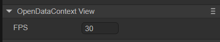

# WeChat mini game


## 1. Overview

The running environment of WeChat mini games is not the browser, nor can it be run in the browser, but the Runtime in the WeChat APP. Although the interface of WeChat mini games is compatible with most Canvas and Webgl, it has the HTML5 feature of click-and-play without downloading and installation. But from a strict definition, WeChat mini games are not standard HTML5 games.

It is highly recommended to take a look at the official [documentation](https://developers.weixin.qq.com/minigame/dev/index.html) of WeChat Mini Game . The documentation of the LayaAir engine is more engine-related, and of course It will be mixed with some application introductions of small game interfaces, but it is definitely correct to take a closer look at the official WeChat documentation.

**Download and install WeChat developer tools**

[WeChat Developer Tools](https://developers.weixin.qq.com/minigame/dev/devtools/download.html) is mainly used for preview and debugging of small game products, real machine testing, upload and submission, etc. It is an essential tool for small game development.

If you are developing using the official [API](https://developers.weixin.qq.com/minigame/dev/api/) of WeChat mini games , there are still some things to pay attention to, such as not supporting DOM and BOM, mini games There can only be one canvas, no support for Eval, no support for XML, etc...

However, for LayaAir engine developers, there is no need to deliberately understand the differences, and they can just develop according to the normal LayaAir engine development rules.

> Before the WeChat mini-game is released, [General](../../generalSetting/readme.md) needs to be set.


## 2. Publish as WeChat mini-game

### 2.1 Select target platform

In the build and release panel, select the target platform as WeChat Mini Game in the sidebar. As shown in Figure 2-1,


(Figure 2-1)

Click "Build WeChat Mini Game" or "WeChat Mini Game" in the "Build Other" option to publish the project as a WeChat Mini Game.

`Appid`: Users can directly fill in the AppID of the WeChat mini game when publishing.

`Generate open data domain project template`: Generally used to display friend rankings. After the release is completed, the openDataContext directory will be generated. (See Section 5 for details)

`Compressed texture`: Generally, you need to check "Allow the use of compressed texture format". If not checked, the compression format settings of all images will be ignored.

`Texture source file`: You can uncheck "Always include texture source file". If checked, the source file (png/jpg) will still be packaged even if the image uses a compressed format. The purpose is to fallback to the source file when encountering a system that does not support the compression format.


### 2.2 Introduction to the mini-game directory after release

The directory structure after publishing is shown in Figure 2-2.


(Figure 2-2)

**js directory and libs directory**:

Project code and engine libraries.

**resources directory and Scene.ls**:

resources resource directory and scene file Scene.ls. Due to the limitations of the initial package for small games, it is recommended to plan the contents of the initial package. It is best to put them in a unified directory to facilitate the separation of the initial package.

**game.js**：

The entry files of WeChat mini-games, the game project entry JS files and the adaptation library JS are all introduced here. The IDE has already generated it when creating the project. Under normal circumstances, there is no need to touch it here.

**game.json**：

The configuration file of the mini game, developer tools and clients need to read this configuration to complete related interface rendering and property settings. For example, the screen's horizontal and vertical orientation, status bar display, mini-game subcontracting, etc. are all configured here. For details on how to configure and use parameters, you can view [WeChat Mini Game Development Document](https://mp.weixin.qq.com/debug/wxagame/dev/index.html?t=2018115).

**fileconfig.json**：

The project configuration file of the mini game contains some information about the mini game project. If you want to modify the appid and other information, you can edit it directly here.

> The value of the project parameter libVersion must be game, and there is generally no error here. However, if the release in LayaAir IDE is normal and the adaptation library is referenced, and an error is still reported in the developer tools after publishing as a small game, you can check whether the value in libVersion is game. If not, change it to game.

**weapp-adapter.js**：

WeChat mini game adaptation library file.


## 3. Use WeChat developer tools to create small game projects

### 3.1 Log in with a developer account and select the project type

Open "WeChat Web Developer Tools" and scan the developer's WeChat code to log in. Then select **Mini Game** and click to enter the project settings and select Import, as shown in Figure 3-1.


(Figure 3-1)

### 3.2 Import mini-game projects

Select the project directory, which is the target directory after LayaAirIDE is released (usually release\wxgame in the project root directory)


(Figure 3-2)

After selecting the wxgame directory, as shown in Figure 3-3


(Figure 3-3)

`AppID` test account, you can click to register, you can develop and debug without entering it, you can use the test account, but the functions will be limited. So it’s better to enter `AppID`

### 3.3 Compilation of WeChat developer tools

After completing the creation of the mini-game project, you can preview the effects and debug within the tool. As shown in Figure 3-4


(Figure 3-4)

### 3.4 Real machine testing and debugging

Since the project effects can also be debugged in LayaAirIDE, unless it is an adaptation-related issue, there will basically be no inconsistency between the effects on both sides. So the most important thing here is to click on the **Preview** function, scan the QR code through WeChat on your mobile phone, and conduct real machine testing and debugging in WeChat. As shown in Figure 3-5


(Figure 3-5)

At this point, a complete mini-game development process is over. Mini game projects developed using LayaAir IDE are basically seamlessly used in WeChat mini game projects.


## 4. Subcontracting and dynamic resource loading

When loading resources in WeChat mini-games, if the local path is referenced, for example:

```typescript
Laya.loader.load("resources/layaair.png");
```

If the total size of the project directory does not exceed 4M, as long as local resources can be found, there is no problem in writing it.

However, the local package of WeChat mini games has a 4M limit. Once this limit is exceeded, uploading and real-device preview are not allowed.

So, if the ** project is larger than 4M, how to deal with it? **

### 4.1 Subcontracting

One option is to subcontract,

> WeChat mini-game subcontracting restrictions:
>
> - The size of all main packages + sub-packages of the entire mini-game does not exceed 20M
> - The main package does not exceed 4M
> - There is no limit on the size of a single ordinary subpackage
> - A single independent subcontract does not exceed 4M
>
> Please refer to WeChat Mini Game [Official Document](https://developers.weixin.qq.com/minigame/dev/guide/base-ability/subPackage/useSubPackage.html).

Next, we will introduce how LayaAir IDE subcontracts WeChat mini-games. Developers can first look at the subcontracting settings set by [General](../../generalSetting/readme.md).

As shown in Figure 4-1, in the build release, after turning on subcontracting, select the folder to be subcontracted to complete the subcontracting. Developers can also choose whether to use remote packages.


(Pic 4-1)

Different from web subcontracting, mini games subcontract resources referenced by code in different ways. In the web platform, there are three parameters for loading the package using the `loadPackage` method, and mini-game subpackage requires the use of two-parameter overloading. The two-parameter overloading method is not only used for WeChat mini-games, but also for other mini-games. The same goes for gaming platforms. The following is a sample code for loading subpackage:

```typescript
const { regClass, property } = Laya;

@regClass()
export class Script extends Laya.Script {
	//declare owner : Laya.Sprite3D;

	@property({ type: Laya.Scene3D })
	scene3d: Laya.Scene3D;

	constructor() {
    	super();
	}

	/**
 	* Executed after the component is activated. At this time, all nodes and components have been created. This method is only executed once.
 	*/
	onAwake(): void {
    	//Mini game loading subpackage
    	Laya.loader.loadPackage("sub1", this.printProgress).then(() => {
        	Laya.loader.load("sub1/Cube.lh").then((res: Laya.PrefabImpl) => {
            	let sp3: Laya.Sprite3D = res.create() as Laya.Sprite3D;
            	this.scene3d.addChild(sp3);
        	});
    	})

    	Laya.loader.loadPackage("sub2", this.printProgress).then(() => {
        	Laya.loader.load("sub2/Sphere.lh").then((res: any) => {
            	let sp3 = res.create();
            	this.scene3d.addChild(sp3);
        	});
    	})
	}

	printProgress(res: any) {
    	console.log("Loading Progress" + JSON.stringify(res));
	}

}
```

The following focuses on the content printed by `printProgress`. After the WeChat developer tool opens and compiles our exported project, the following log will be printed:


(Figure 4-2)

 [wx.loadSubpackage()](https://developers.weixin.qq.com/minigame/dev/api/base/subpackage/wx.loadSubpackage.html) returns a [LoadSubpackageTask](https://developers.weixin .qq.com/minigame/dev/api/base/subpackage/LoadSubpackageTask.html), through which you can obtain the current download progress.

> Refer to WeChat Mini Game [Official Document](https://developers.weixin.qq.com/minigame/dev/guide/base-ability/subPackage/useSubPackage.html).

The meanings of the printed parameters are:

`progress`: Download progress;

`totalBytesWritten`: length of downloaded data;

`totalBytesExpectedToWrite`: The total length of data expected to be downloaded.


### 4.2 Network dynamic loading

Another solution is dynamic loading over the network.

We are in the local package, and the JS code must be put in, because JS does not allow network loading to be dynamically created. So if the JS in the local package exceeds 4M, the first thing to consider is how to optimize the JS size, such as obfuscation and compression, and separation from the UI code. If it still doesn't work, it can only be solved through the subcontracting solution of small games. If the JS does not exceed 4M, you can also put some basic resources for preloading according to the situation.

So **how to deal with the path of network dynamic loading**. Use the `URL.basePath` method after the `load()` method of local loading.

For example:

```typescript
onAwake(): void {
    	//Network dynamic loading
    	Laya.URL.basePath = "https://XXXX";//Please replace XXX with your real URL;
    	//Under this, if you use load to load resources, the URL will be automatically added. Dynamically loaded from the network.
    	Laya.loader.load("resources/layaair.png").then((res: Laya.Texture) => {
        	let sprite:Laya.Sprite = new Laya.Sprite();
        	sprite.texture = res;
        	this.owner.addChild(sprite);
    	});
	}
```

After using the `URL.basePath` method, and then using load to load the local path, the URL in URL.basePath will be automatically added. This achieves a combination of local and network loading.

> [!Tip]
>
> When assigning a value to URL.basePath, developers must read the official documentation for [Network](https://developers.weixin.qq.com/miniprogram/dev/framework/ability/network.html). Only if it meets the requirements.

**Is this the end? not at all! **Here we will expand a local package whitelist mechanism.

According to the way just written, if `resources/layabox.png` has been uploaded to the local directory of the WeChat mini game, but if `res/layabox.png` is loaded again after using `URL.basePath`, it will not be loaded from the local directory. , but dynamically loaded from the network.

Therefore, the engine has implemented **special directory and file processing** for how to use local loading again after using `URL.basePath`, which is the local package whitelisting mechanism. As shown in the following example:

```json
MiniAdpter.nativefiles=[
	"layaNativeDir",
	"wxlocal",
	"resources/layaair.png"
]
```

> The code is located in the "laya.wxmini.js" file under "libs\min" in the release directory, and "resources/layaair.png" is a manually added directory.

**As long as the directory name or file exists in MiniAdpter.nativefiles, the engine will automatically treat the directory as a local directory**. Even if URL.basePath is used, directory names or files included in the nativefiles whitelist will not be processed. Will be loaded dynamically from the network and will only be loaded locally.


## 5. Generate open data domain project template

Open data fields are generally used to display friend rankings.

### 5.1 Open data domain

First, as shown in Figure 5-1, in the hierarchy panel, add an OpenDataContexView component to Scene2D to activate the display of the open data domain (there is no ranking effect display at this time, and it can only be seen after publishing). The size of the component is the size of the friends ranking panel.


(Figure 5-1)

After adding, you can see the FPS attribute in its property settings panel, as shown in Figure 5-2, which indicates the frame rate of the sharedCanvas update to the main domain.



(Figure 5-2)

Then when building and publishing, check the `Generate open data domain project template` shown in Figure 2-1. After the release is completed, as shown in Figure 5-3, the openDataContext directory will be generated. Developers can modify the content here according to their needs. When publishing next time, if the template directory is not built according to 5.2, then this directory will not be cleared or modified.


(Figure 5-3)

> Modify the generated project template (the file in the openDataContext directory). It is recommended to use a lightweight [third-party Canvas engine](https://github.com/wechat-miniprogram/minigame-canvas-engine) to solve this requirement. Developers can use this engine to create customized friend rankings, and then replace the code in the corresponding file in the openDataContext directory.

After release, debug in "WeChat Developer Tools". At this time, the default project template is used, and the effect is shown in Figure 5-4.


(Figure 5-4)

### 5.2 Build template directory

Developers can create `build-templates/platform name` in the project directory, for example: build-templates/wxgame, and the contents will be copied to the output directory when publishing. If it is a json file, it will also be merged. For example, if game.json is placed in build-templates/wxgame and the content is `{"showStatusBar": true }`, then this key value will be added to the final game.json file, and the game.json in the engine template Other key values ​​will be retained.

In the development of game friend rankings, the release directory after release is generally not added to version management. The openDataContext directory here may be inconvenient in collaborative development, so you can put the customized openDataContext directory into the build template directory, that is Place wxgame under build-templates in the project root directory shown in Figure 5-5, so that the 'Generate Open Data Domain Project Template' selected each time you publish is no longer the default of the IDE shown in Figure 5-4 template, and will be copied from the template directory `build-templates/wxgame`.


(Figure 5-5)


