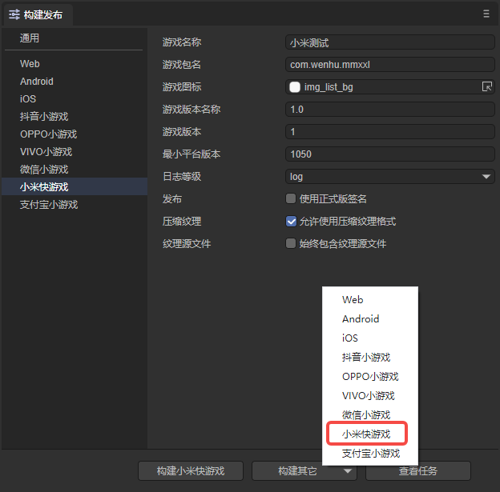
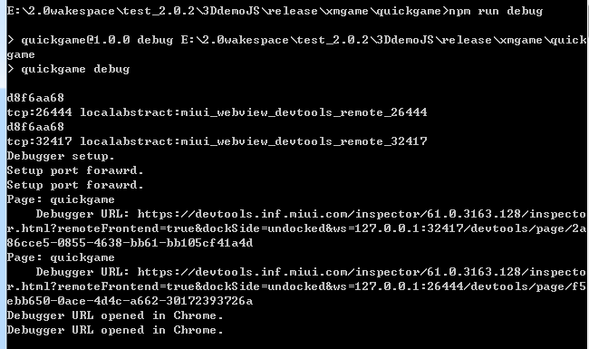

# Xiaomi Quick Game

## 1. Overview

It is recommended to take a look at the [official documentation](https://dev.mi.com/distribute/doc/details?pId=1450) of Xiaomi Kuai Game . The documentation of the LayaAir engine is more engine-related.

There is no visual development and debugging tool in Xiaomi Quick Game, so you can only configure the relevant parameters in LayaAir IDE, and then publish successfully (generate an rpk package) directly in LayaAir IDE with one click. As for the debugging method, you install an apk debugging environment on the Xiaomi phone, select the rpk file to open in the apk, and then connect the phone to the PC with a data cable through the Chrome browser for debugging.

>Before Xiaomi Quick Game is released, you need to perform [General](../../generalSetting/readme.md) settings first.

## 2. Published as Xiaomi Quick Game

### 2.1 Select target platform

In the build and release panel, select the target platform Xiaomi Quick Game in the sidebar. As shown in Figure 2-1,

(Figure 2-1)

Click "Build Xiaomi Quick Game" or "Xiaomi Quick Game" in the "Build Other" option to publish the project as Xiaomi Quick Game.

Let's introduce the filling in of these function parameters:

**1. Game name**

Generally, Chinese characters are filled in, but English is also acceptable. Used for game entrances such as app stores, desktop icons, pop-up windows, etc. A good name is an important factor in whether the game can attract traffic. Our suggestion is not to exceed 6 Chinese characters. There is no benefit if the game name is too long.

**2. Game package name**

The format of the game package name is `com.company.module`. The first digit is com, the second digit is the company name, and the third digit is the project name. All must be written in English, for example: `com.layabox.demoGame`.

**3. Game icon**

The game icon is also an important game entrance logo. Like the game name, it is a very important element that attracts attention. If the game icon is well designed, the game name will be well chosen. The same position will get more clicks than other games. The game icon needs to provide a square size of `192*192`.

**4. Game version name**

The game version name is the actual version and is generally used to differentiate between functional versions. For example, I have a major version change. It was originally 1.0 and can be changed to 2.0. If it is just to correct the bug, then 1.0 can be changed to 1.1. By analogy, we recommend using floating point numbers for naming. For example, "0.1", "1.3", "5.0"...

**5. Game version**

The game version and the version name have different purposes. Here is the channel platform used to distinguish version updates. Every interrogation must be at least recursive +1, it doesn't matter if you test it yourself. However, the value here must be at least +1 compared to the value of the last arraignment. +N is also acceptable. It must not be equal to or less than the previous version value. It is recommended that the arraignment version number be recursively +1. It should be noted here that the game version must be a positive integer.

**6. Minimum platform number**

Minimum platform number, just fill it in according to the platform version number displayed on the debugger.

**7. Log level**

There are seven log levels, from high to low, they are OFF, ERROR, WARN, INFO, DEBUG, TRACE, and ALL. You can easily know the running status of the current program.

**8. Whether to use the official version signature**

If you are only debugging the test version, you do not need to check it here. It must be checked before it is officially released online (submit the version to the platform).

If checked, the official version signature will be enabled. About release signature:

① For companies, generally a company only uses one signature. If the company already has a signature, it is recommended to use the company’s signature. If not, publishing in the IDE integrates this function to facilitate developers to generate signatures.

②For individual developers, one official signature can be used on multiple projects. It only needs to be generated once.

If the release has been signed, place the signature file in the sign/release folder of the Laya project.

**9. Compressed texture**

`Compressed texture`: Generally, you need to check "Allow the use of compressed texture format". If not checked, the compression format settings of all images will be ignored.

`Texture source file`: You can uncheck "Always include texture source file". If checked, the source file (png/jpg) will still be packaged even if the image uses a compressed format. The purpose is to fallback to the source file when encountering a system that does not support the compression format.

### 2.2 Introduction to the mini-game directory after release

Click version release. Since the rpk release environment (used to generate rpk packages) will be checked before release, if there is no release environment, the download will start.

The directory structure after publishing is shown in Figure 2-2:

(Figure 2-2)

**js directory and libs directory**:

Project code and engine libraries.

**resources directory and Scene.ls**:

resources resource directory and scene file Scene.ls. Due to the limitations of the initial package for small games, it is recommended to plan the contents of the initial package. It is best to put them in a unified directory to facilitate the separation of the initial package.

**main.js**：

The entry files of Xiaomi Kuai Game, the game project entry JS files and the adaptation library JS are all introduced here. The IDE has already generated it when creating the project. Under normal circumstances, there is no need to touch it here.

**manifest.json**：

The project configuration file of the mini game contains some information about the mini game project. If you want to modify it, you can edit it directly here.

## 3. Use Xiaomi Quick Game Debugger

### 3.1 Xiaomi Quick Game release and debugging environment preparation

1. Xiaomi brand mobile phone (note that it must be MIUI 8.5 or above).

2. Download and install Xiaomi’s test APP, enter the [Download Page](https://dev.mi.com/distribute/doc/details?pId=1100), find the third step, and download directly according to the prompts.

3. PC Chrome browser and mobile phone data connection cable.

4. Install the node.js environment. The detailed steps are introduced in ["Building a Basic Development Environment"](../../../basics/developmentEnvironment/download/readme.md).

5. Install ADB.

> It is recommended to install [ADB](https://adbshell.com/downloads), because sometimes, due to authorization or other inexplicable reasons. This will result in the Chrome telepresence machine debugging being unable to start normally. Therefore, installing ADB can verify the connection authorization between the mobile phone and the PC. If you make sure there are no USB debugging authorization issues, you don’t need to install it.
>
> A brief reminder, download ADB Kits, it is recommended to decompress the downloaded compressed package into a directory with a simple path (such as: `D:\adb`). Remember to add environment variables (if you don’t know how to add environment variables, you can Baidu yourself).

### 3.2 Xiaomi Quick Game release and access complete process

#### 3.2.1 Install and enter the quick application debugger

First install the debugging APP (Quick Application Debugger) of Xiaomi Quick Game on your mobile phone, as shown in Figure 3-1. Then click to enter.

(Figure 3-1)

#### 3.2.2 Scan the QR code in the quick application debugger interface to install the rpk package of Xiaomi Quick Game

After entering the quick application debugger, we can see the APP operation interface as shown in Figure 3-2.

(Figure 3-2)

You can scan the QR code to install, or connect a USB data cable to transfer the rpk package in the /dist directory under the release directory to your mobile phone, and install it by clicking the `Local Install` button.

#### 3.2.3 Maintain physical line connection and authorization

For developers with more relevant experience, make sure that the physical line of the USB mobile phone cable is connected, and there is no problem with USB debugging authorization, you can skip this step.

##### The relevant operations are as follows:

1. First use a mobile phone cable to physically connect the phone to the PC. Turn on the developer mode of your phone and turn on USB debugging.

At this time, we need to pay attention to whether the prompt shown in Figure 3-3 appears on the mobile phone. If so, click OK to allow debugging.

(Figure 3-3)

2. Verify authorization.

After the USB debugging mode authorization is successful, we open the cmd window on the PC and enter adb devices, as shown in Figure 3-4.

(Figure 3-4)

In short, in this link, we need to ensure that the PC has the authority to debug the mobile device.

#### 4.4 Start the chrome debugging environment

Xiaomi Quick Game has no tool development and debugging environment on the PC. It is connected to the mobile device through USB, and then in the PC command line mode, the Chrome debugger is launched through the `npm run debug` command (the prerequisite is to ensure that the PC has been installed Chrome browser) to jointly debug the rpk package of the real mobile phone environment, as shown in Figure 3-5. When we can see the prompt `Debugger URL opened in Chrome.`, it means that chrome has been successfully launched.

(Figure 3-5)

Or enter `chrome://inspect/#devices` in the Chrome browser, find the connected mobile phone option after entering, and click `inspect`, as shown in Figure 3-6:

(Figure 3-6)

After the operation is completed, as shown in Figure 3-7, you can debug the Xiaomi Quick Game project according to Chrome's debugging method.

(Figure 3-7)

At this point, the complete process of Xiaomi Quick Game from publishing to starting Chrome debugging has been introduced.

## 4. Xiaomi Quick Game Subcontracting

After the development is completed, the developer can subcontract the folders that need to be subcontracted, and other files in the project other than the subcontracted files are packaged into the main package.

> Xiaomi Quick Game Subpackage Loading Package Size Limitation
>
> - The total sum of all sub-packages of the entire mini-game does not exceed 10M;
> - The size of a single subpackage/basic package cannot exceed 5M;
> - The overall compressed package (including the original package and all sub-packages;) does not exceed 20M.

As shown in Figure 4-1, after clicking to enable subcontracting, select the folder to be subcontracted.

(Pic 4-1)

> For subpackage loading API, etc., please refer to [Xiaomi official documentation](https://dev.mi.com/distribute/doc/details?pId=1112).

