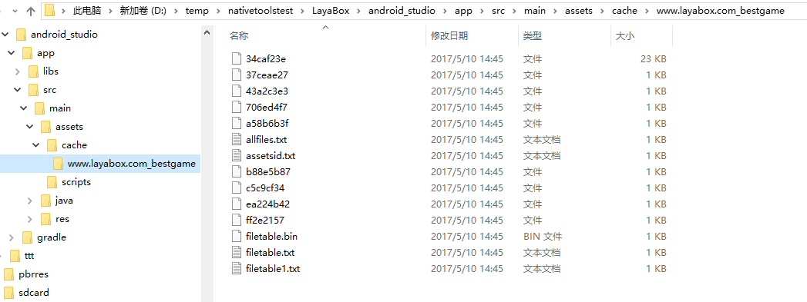
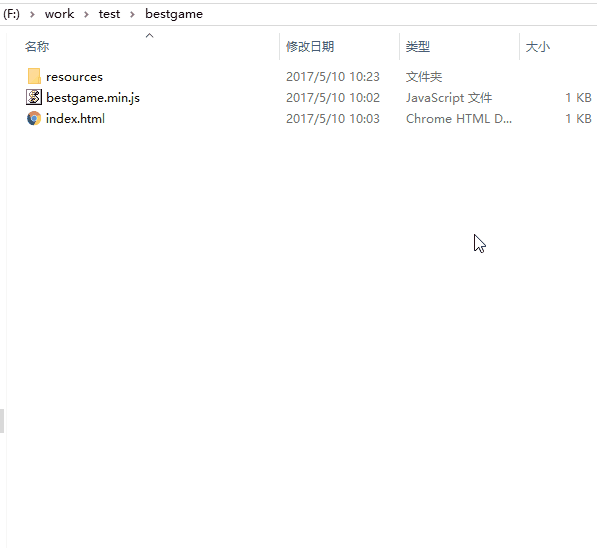
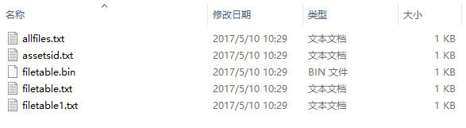

# LayaDCCTools

## Introduce
LayaDCC: Laya-Dynamic Content Check is a hot update solution provided by LayaPlayer. The advantage is that runtime differential updates can effectively reduce network traffic. His main data is the DCC file, which is used to describe the check values ​​of all files in the project. DCC files are generated using the tool layadcc.

layadcc will traverse all project files and generate a binary file filetable.bin containing the check values ​​of all files. When LayaPlayer starts, it will obtain this file from the server (if necessary) to determine what files need to be updated.

layadcc can also be used to generate resource packages and package resources into the App.

## Type of LayaPlayer resource package
There are currently three resource packaging solutions.
1. #### App networking package:

   The App itself does not carry any resources and is the smallest in size.
   When LayaPlayer is run for the first time, all resources used will be downloaded from the server and cached locally. When running for the second time and later, the dcc file will be obtained from the server first, and then when a certain file needs to be downloaded, it will check whether the local resources need to be updated. Only when they need to be updated will they be actually downloaded. Unupdated resources will be downloaded directly from Local cache reads.
   The local cache will gradually grow.

2. #### App networking package with resources:

   The App package itself contains some or all game resources, and the package size is large.
   The data can still be updated, that is, the dcc file will still be fetched from the server for verification every time it is run. If a file in the package is found to be old, a new file will be downloaded and cached locally. When running again in the future, as long as If the cached file has not been changed, the cached file will still be used.
   After multiple updates, most of the files in the App package may be invalid, and the local cache is taken every time. At this time, it is recommended to update the App package again and use new resources to package it.

3. #### App offline package (stand-alone package):

   All resources are packaged directly into the App, no network download is required, or even an Internet connection is required. The largest size.
   Because it is a stand-alone version and does not have a URL, it cannot dynamically update resources. If you want to update resources, you can only update the App.

## Install and use layadcc
layadcc is based on Node.js, so it requires Node.js environment.
### 1. Install Node.js
Go to nodejs[official website](https://nodejs.org/en/) to download.
node.js cannot be too old and does not support version 0.xx. You can use the command to check the node version.
For example:  
```bash
$ node -v
v4.2.0
```
This version will do.
### 2. Install layadcc
```bash
npm install -g layadcc
```
If the installation is completed successfully, you can execute layadcc directly in the command line.

### 3. How to use

```
layadcc resource directory [options]
options:
	-cache generates resource bundles.
	-lwr Convert all file paths to lowercase. (Generally not required)
	-url url If you want to package resources, the corresponding url.
	-cout outpath The output directory of packaged resources. If not set, it will be in the resource directory.
For example:
   layadcc d:/game/wow -cache -url www.game.com
```
### 4. Practical operation
#### 4.1 Operating environment
Make sure Node.js, npm, layadcc are installed correctly
Authentication method:  
  
figure 1  
As long as no error is reported when executing layadcc, it will be fine.

#### 4.2 html5 project environment
Suppose there is a game project placed in the F:/work/test/bestgame/ directory (the startup page index.html is in this directory). Its directory structure is:
  
figure 2   
The corresponding url address after this project is released is: `http://www.layabox.com/bestgame/index.html`
(If the stand-alone version does not require a url address)

#### 4.3 Packaging resources
Now we need to package this html5 project and put it into the App project.
```
 layadcc F:/work/test/bestgame -cache -url http://www.layabox.com/bestgame/index.html
```
If it is a stand-alone package, enter:
```
 layadcc F:/work/test/bestgame -cache -url http://stand.alone.version/index.html
```

As shown below:  
  
image 3  

After adding the `-cache` parameter, all resource files will be traversed and output to the directory specified by `-cout`. If there is no `-cout` parameter, a layadccout directory will be created in the working directory (as shown above). The cache directory under the output directory is the resource that needs to be used when packaging the App.
Then copy this directory to the corresponding directory of the built project, and you can compile and package it to generate the App.
In different development environments, they need to be placed in different directories (if you use LayaAirIDE or layabox command line tools, this step can be completed automatically).

**Android Eclipse:**  
 <br />
(Figure 4) The resource directory of android is the assets directory under the project

**Android Studio:**  
  
(Figure 5)  

**iOS XCode:**  
 <br />
(Figure 6) IOS is the resource directory

#### 4.4 Update server
This is the most common operation after the App is released. Whenever the content of the HTML5 project is updated and needs to be submitted to the server or local testing, a new DCC must be generated so that the client can be updated to the latest resources. The operation process is as follows:
  
Figure 7

You can see that after executing layadcc, an update directory will be generated under the specified directory (now the current path . ). Then copy the update directory to the same directory on the local or remote server.
**Tips:**   
For convenience and no errors, it is recommended to execute layadcc directly in the directory where the server is located.

**update directory introduction:**
  
Figure 8

allfiles.txt The relative paths of all resource files.
assetsid.txt The verification code of the entire resource package counted by this DCC.
filetable.bin dcc main file, which contains the check value of each file.
Filetable.txt text format dcc file, except for the first three lines, each line represents a file and the corresponding check value, which exactly corresponds to allfiles.txt, that is, the file corresponding to line 4 is the first line of allfiles.txt.
filetable1.txt This file is no longer used.

**Notice:**  
1. If there is no update directory in the directory on the web server, or there is no content in the update directory, the client's dcc update mechanism will be turned off, so that all resources will be downloaded again every time. This approach is recommended during development.
2. The above example is in the current directory. You can also specify other paths, either relative or absolute, for example:
   `layadcc d:/game/bin/h5` or `layadcc ../bin/h5`


#### 4.5 Test
1. Test of successful resource packaging
   Let’s talk about the situation where there are no resources in the package. In this case, all resources will be downloaded from the Internet. The log is as follows:
     
   Figure 9 You can see that there are many Downloads
   **Print information instructions:**
	The @127.0.0.1 followed by the url here is for debugging, indicating the server address corresponding to this file. s=0 means that this file has no dcc information, l=xxx means the length of the downloaded file.

	If a resource package is installed, that is, the contents in the cache directory are copied to the directory specified above. The most intuitive change at this time is that the package becomes larger. Then run the app, and there will be a printout of resources read from the resource package, as follows:
	    
	Figure 10
   **Print information instructions**
   Printing `found the file in the package:` means that the corresponding resources were obtained from the package and were not downloaded from the Internet. Seeing this log means that the resources were packaged successfully. If you are playing the stand-alone version, all resources should have this printout and there should not be any downloads.

2. Whether the service has DCC testing:
   Open the address in the browser: http://www.layabox.com/bestgame/update/filetable.txt
   Be careful to change it to your own address. If the file exists, it means that dcc has been typed. As shown below:  
     
   Figure 11

3. Test that the update mechanism works
   The intuitive test is that after the resources are updated, the App will produce corresponding changes, such as modified pictures, which can be seen on the App. Judging from the log, when retrieving resources, anything that has not changed is printed as `found the file in the package:`, and anything that has changed is printed as `download [ ] xxxurl `.
   **Notice**  
   
   1 Download is only executed once, and the second time you enter the app, if the resource has not been changed, it will be fetched directly from the cache.
   2 The mechanism of DCC is runtime update, so it will only be downloaded when the resource is needed during execution, instead of downloading all updates as soon as it is started.

**Summarize**  

* Whenever there is `download [ ] url `, it means downloading, which means there is no dcc or the resource has been updated.
* Whenever there is `found the file in the package:`, it means that the resource packaging is successful and dcc has worked.


**Notice:**  
* When layadcc is executed, the modification time of all files will be modified. The purpose is to prevent CDN from thinking that the files have not been modified when returning to the source.
* The above address is fictitious, there is no such address as http://www.layabox.com/bestgame/index.html.


## common problem
1. After packaging the resources, I don’t feel that the speed has become faster. I suspect that all the resources are still being downloaded.
	1. Determine whether it is really all downloading and see if the log contains the Download and find mentioned above. If there is both read cache and downloading, there is no problem, but the downloading is really slow.
	2. If everything is Download, there is no read cache
       	1. Did you forget to type dcc? Check the server through the browser to see if there is dcc information.
        2. Check whether the packaged resource path is correct.

2. After the App was released, some resources were modified, but they were not updated by the App.
	1. Did you forget to get DCC?
	2. I applied DCC, but forgot to submit it to the server (it is recommended to apply DCC on the server)?
	3. I have run DCC and submitted it to the server, but due to CDN, this change has not yet been distributed to your node.

3. I confirmed that the DCC process is correct, but a certain resource will be re-downloaded every time without going through the cache.
	1. Confirm whether this resource is in the packaged resources, that is, in the dcc list. You can search for this file in update/allfiles.txt.
	2. If in. Confirm whether the URL requesting this resource has a search part, that is? xxx. If it is added, the DCC process will not work.
	3. If there is no search, it is possible that the actual content of the file does not match the check value. DCC will think it is a wrong file and will not cache it. possible reason:
       	1. After typing dcc, someone changed the content of this file, causing the dcc check value to not match the actual file content. Solution: Re-enter DCC
        2. No one changed the content of the file, but the dcc was typed on the client. After the file was uploaded to the server, the content was modified by the uploading software. This situation usually occurs with text files. For example, some version management tools and ftp tools will change the carriage return and line feed under Windows into the carriage return on Unix. Solution: Use zip to transfer files, or type dcc on the server.
        3. There is no problem above, and the error is in the picture. The possible reason is that some systems intercept HTTP requests globally and cache a compressed image through their own server when requesting an image to achieve the so-called traffic saving. The check value of this compressed image is definitely different from that recorded by dcc. Solution: Turn off the data saving function.
        4. If traffic saving is not enabled. But if CDN is used, it may also be a CDN problem. For example, the dcc file is refreshed, but the corresponding resource file is not refreshed. Confirmation method: Download the resource file on this node through the curl command (see the appendix for the method), compare it with the resource file on the source site, and confirm if it is different. Solution: Force refresh the CDN node, or contact CDN customer service.

4. During development, it is too troublesome to type dcc for every update.
	Don't use layadcc to hit dcc. If you have already hit it,
	Delete the update directory and reinstall the app to remove the internal cache. In this way, the DCC mechanism will be turned off and each file will be re-downloaded with each request.
	If you hit dcc again and an update directory is generated on the server side, the cache will work again. If you want to turn it off, do the above operation again.

5. In order to reduce the size of the package, I hope to only package some resources. What is the correct posture?
	Whether it is the first installation or an app upgrade in the future, if you only use some resources, make sure that the DCC information in the resources is generated based on complete data. For example, there are 100 resources in total, and you only want to package 50 into the app. You need to run dcc in the complete resource state, save the generated dcc information (mainly filetable.txt), then delete 50 resources, and use layadcc to generate cache files. , at this time, the dcc information generated in the cache directory is incomplete, so it must be overwritten with the file generated in the previous step.
	Problems that will occur if incomplete dcc is used: When updating the app, native will give priority to using the dcc file cached in the app, resulting in the loss of part of the cache information. In this way, files not in filetable.txt will be considered to not need to be cached, thus Keep downloading until the next server dcc update.

## Appendix
1. LayaDCC process
     
   Figure 12
   The corresponding code is in index.js.

2. Download the file on a certain cdn node.
```sh
curl -H "Host:www.layabox.com" http://182.110.238.110/bestgame/index.html >a.html
```
It means downloading the file `http://www.layabox.com/bestgame/index.html` on the 182.110.238.110 node and saving it to a.html.
Among them, Host: the following content is changed to your own domain name, and the ip address after `http://` is changed to the address of the node server. How to obtain the node server address? In LayaPlayer, the node server usually does not change, so the address can be obtained by printing any Download, for example:
```
Downloaded http://www.layabox.com/bestgame/bestgame.min.js@182.110.238.110 s=44216b56 l=422
```
We know that the node address is 182.110.238.110.


