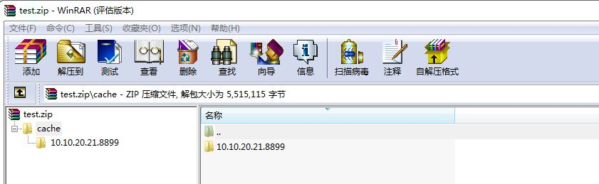

# Android file extension mechanism
LayaNative not only supports packaging resources in the assets directory, but also supports packaging resources into zip files and placing them in any file path. The LayaNative file system will first check whether the file exists in the assets directory. If it is not found, it will then search in the specified zip path. This zip mechanism can solve the problem of Google Play stipulating that the APK size exceeds 100MB and requiring the addition of expansion packs.

## 1. Detailed explanation of the mechanism
### 1. Generate DCC
Test project uses DCC tool to package resources

### 2. Compress files
Put the resource package into the extension file and compress the cache file. The file must be in zip format. The file structure must remain the same as that generated by the DCC tool, as shown below:

### 3. Copy the zip file to the device directory
Create the directory /storage/emulated/0/Android/test/com.layabox.conch6 on the Android phone and upload test.zip to this directory
### 4. Modify the expansion path in the code
Modify the `getExpansionMainPath` function in RuntimeProxy.java and set the correct zip path.
```   typescript
	public String getExpansionMainPath()
	{
    	return "/storage/emulated/0/Android/test/com.layabox.conch6/test.zip";
	}
	public String getExpansionPatchPath()
	{
    	return "";
	}
```
### 5. Enable external storage permissions
Machines with Android 6.0 or above may not be able to read external storage and need to actively request permission. Please add the following code or Google related solutions.
```typescript
	public static boolean isGrantExternalRW(Activity activity) {
    	if (Build.VERSION.SDK_INT >= Build.VERSION_CODES.M && activity.checkSelfPermission(
            	Manifest.permission.WRITE_EXTERNAL_STORAGE) != PackageManager.PERMISSION_GRANTED) {
        	activity.requestPermissions(new String[]{
                	Manifest.permission.READ_EXTERNAL_STORAGE,
                	Manifest.permission.WRITE_EXTERNAL_STORAGE
        	}, 1);
        	return false;
    	}
    	return true;
	}
```
**TIPS: LayaNative supports up to two zip files, and the second zip modification·getExpansionPatchPath·this function**

### 5. Run the test
Run the APP and see the following log indicating that the resource file was successfully read from the main expansion package.

## 2. Google Play APK expansion file mechanism
(https://developer.android.com/google/play/expansion-files.html)


