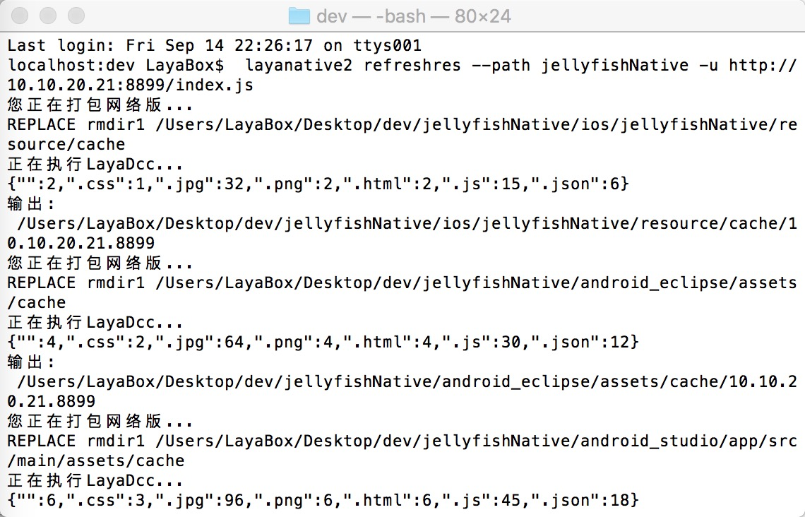

# LayaNative command line tool
The layanative command line tool is used to generate Android and iOS native projects, as well as the project's resource refresh function to facilitate resource updates during the project iteration process.

## 1. Detailed explanation of commands
### 1. Install layanative
windows
```   
$ npm install -g layanative3
```
mac
```   
$ sudo npm install -g layanative3
```
### 1. Check SDK version information
SDK is the template for native projects. The listversion command will list all currently available SDK version information. When creating a native project below, you can specify the required version through parameters.
```   
$ layanative3 listversions
```
### 2. Create native project
The createapp command is used to create native projects
You can first use the following command to view the help information of the command createapp
```
$ serviceative3 createapp --help
```
#### Usage:
	layanative3 createapp [-f res_path] [--path output_path] [-s sdk_path | -v version] [-p all|ios|android_studio] [-t 0|1|2] [-u url] [-n project_name] [-a app_name] [--package_name package_name]

#### Parameter Description:

| Keywords | Description
| ------------ | ------------
| `--folder,-f` |	Resource path: Package the game resources into the client to reduce network downloads. Select the local game directory. For example, start index under d:/game/index.js, then the resource path is d:/game. It is not necessary to fill in when t is 0.
| `--path` |   	native project output directory [default: "."]
| `--version，-v` |   	SDK version: Automatically use a specific version of the SDK. The system will download the SDK from the server and store it in a specific location. --version and --sdk conflict with each other and cannot be specified at the same time. If neither is specified, the latest version of the SDK will be used by default.
| `--platform, -p` |	Project platform [optional values: all, ios, android_studio][default value: all]
| `--type, -t` |   	Creation type [0: without resource pack 1: with resource pack 2: stand-alone version] [Default: 0]
| `--url, -u` |   	Game address [When t is 0 or 1, it must be filled in, when t is 2, it does not need to be filled in]
| `--name, -n` |   	Project name: the name of the native project [Default: LayaBox]
| `--app_name, -a` |  	Application name: The name displayed after the app is installed on the phone [Default: LayaBox]
| `--package_name` |   	Package name [Default: com.layabox.game]
| `--sdk,-s` |   	SDK local directory: customized SDK directory, optional parameters. When used when the network is disconnected, it is generally recommended to use the parameter --version.
When type is 1 or 2, the resource package will be added to the native project, and when type is 0, it will not be added. The bottom layer of packaged resources is actually the method of calling dcc. For packaged resource dcc, refer to [LayaDcc Tool](../LayaDcc_Tool/readme.md).
You can use the --path parameter to specify the output path of the project, and the default output is to the current path.

Use v2.0 version of the SDK according to -v
```
$ layanative3 createapp -f SnowBallH5 -t 1 -n SnowBallNative -u http://10.10.20.102:8899/index.js -v v2.0
```

Neither -v nor -s is specified, use the latest version of the SDK
```
$ layanative3 createapp -f SnowBallH5 -t 1 -n SnowBallNative -u http://10.10.20.102:8899/index.js
```
Specifying the version with --version or -v requires an online environment. If the network is disconnected, you can use --sdk or -s to specify the SDK directory. [SDK download address](https://ldc.layabox.com/layadownload/?type=layaairnative-LayaAir%20Native%20SDK%200.9.6)
```
$ layanative3 createapp -f SnowBallH5 -t 1 -n SnowBallNative -u http://10.10.20.102:8899/index.js -s D:/v2.0
```
### 3. Refresh the native project resource package
The refreshres command is used to refresh the resource package of the native project
During the project iteration process, the h5 project has been modified. You can use the refreshres command to repackage the refresh resources and code into the native project.
#### Usage:
	layanative3 refreshres [-p all|ios|android_studio] [--path path] [-u url]

#### Parameter Description:

| Keywords | Description
| ------------ | ------------
| `--platform, -p` |	Project platform [optional values: all, ios, android_studio][default value: all]
| `--path` |   	native project path [default: "."]
| `--url, -u` |   	Game address


If the created project is a stand-alone version, you do not need to enter the URL when refreshingres. If you enter the online version URL and get the online version resource package, you need to change the project code to become an online version project.
If the created project is an online version, the URL must be entered when refreshres. If you enter a new address, you must also change the code that sets the URL in the project to complete the URL replacement. If you enter the address of the stand-alone version and enter the resource package of the stand-alone version, you still need to change the project code to become a stand-alone version of the project.
For manual switching between the stand-alone version and the network version, please refer to [LayaBox Build Tool](../build_Tool/readme.md).

When creatingapp, the resource path is written in the native.json file in the generated native project directory. If the resource is later moved to another location, an error will be reported that the resource directory cannot be found. When createapp, if the -t parameter is specified as 0, no resources are entered, and the resource path parameter does not need to be specified. The resource path written in native.json is empty. When refreshingres of this kind of project, an error that the resource path is empty will be reported. In the above two cases, you can manually modify the native.json file and specify the correct resource path.
### 4. Delete the native project resource package
The removeres command is used to delete the resource package of the native project
#### Usage:
	layanative3 removeres [--path path]
#### Parameter Description:

| Keywords | Description
| ------------ | ------------
| `--path` |   	native project path [default: "."]

## 3. Application examples
1. First create the directory structure shown in the figure below. jellyfish is the html5 project directory


2. Check SDK version information

3.Create native project

4. Generate the directory structure shown in the figure below.

5. Refresh the resource package at any time
In the dev directory, specify the directory of the native project through --path
	 
Enter the native project directory, there is no need to specify the --path parameter.

5. If the resource package is not needed, delete it
In the dev directory, specify the directory of the native project through --path	 

Enter the native project directory, there is no need to specify the --path parameter.


