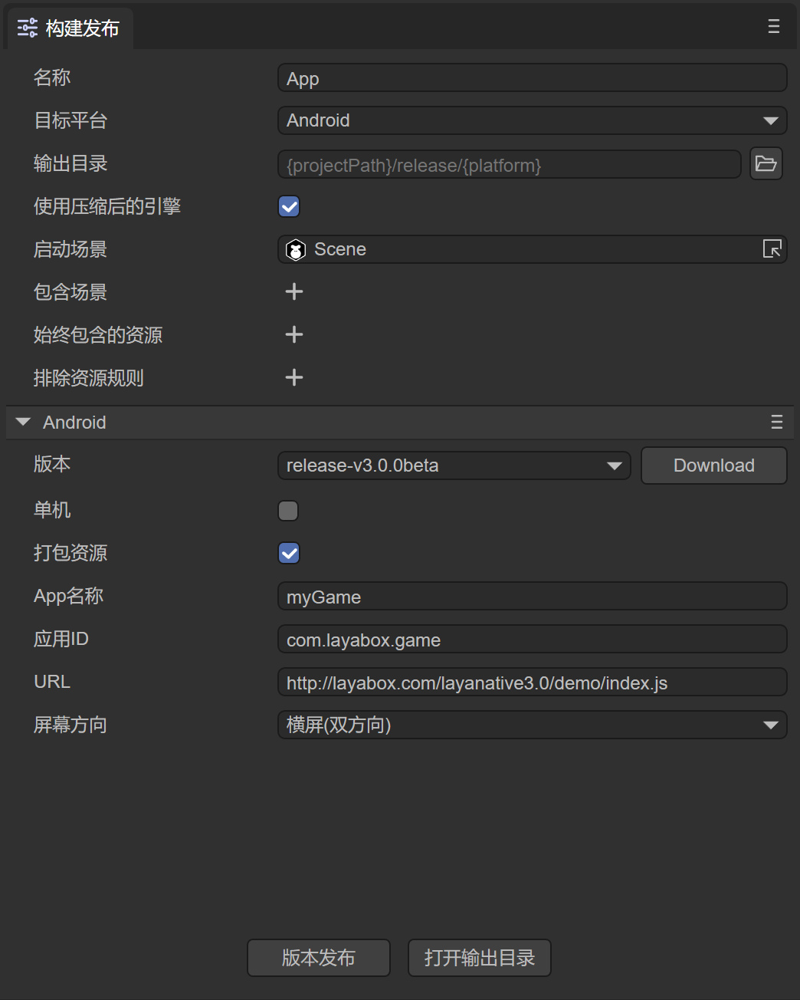

# LayaNative home page description


Important things need to be said three times:

##### LayaNative is not a browser!

##### LayaNative is not a browser!

##### LayaNative is not a browser!

### 1. LayaNative startup entrance

Since LayaNative is not a browser, it does not run HTML content by encapsulating controls such as browsers or webkit.

Therefore, LayaNative cannot start and run html page files.

The index.html in the bin directory of the engine project can be used as the entry point in the browser, but cannot be used as the startup entry point for LayaNative.

**LayaNative’s startup entry is by default**

Through the menu bar `Tools`--> `app build` of LayaAirIDE, in the opened build project window, just configure the URL. The configuration method is shown in Figure 1.

  

In Figure 1, the entry is index.js by default.

### 2. LayaNative startup file configuration instructions

The entry file mainly determines the screen orientation when the project is running and the information about the js files that need to be loaded.

If we use the project's index.js as the startup entry file of LayaNative, after clicking the version release

Examples are as follows:

```javascript
/**
 * Set the LayaNative screen orientation, you can set the following values
 * landscape       	Horizontal screen
 * portrait        	Vertical screen
 * sensor_landscape	Landscape (both directions)
 * sensor_portrait 	Portrait screen (both orientations)
 */
window.screenOrientation = "portrait"; // Set the screen to vertical screen
//-----Engine library starts-----
loadLib("libs/laya.core.js")
loadLib("libs/laya.ui.js")
loadLib("libs/laya.d3.js")
//-----End of engine library-------
loadLib("js/bundle.js");//project code js
```

**Note:** Please do not write any logic code in the index.js file, otherwise unknown errors may occur.

