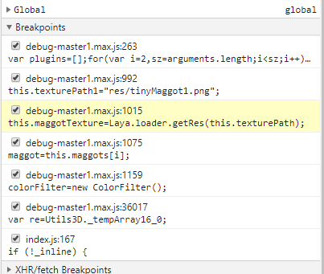
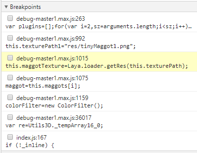

# Debug JavaScript code on real Android device

## 1. Principle of debugging

Debugging of JavaScript code is performed using the Chrome browser on the debugging machine. When LayaNative on the Android test machine is started, a WebSocket server will be started at the same time. The Chrome browser communicates with LayaNative through WebSocket, thereby enabling the debugging of the project's JavaScript using Chrome.

When debugging JavaScript code in a project, there are two debugging modes to choose from:

1. Debug/Normal mode

	In this mode, the project on the Android test machine can be started and run directly, and the Chrome browser can be connected for debugging after the project is run.

2. Debug/Wait mode

	In this mode, after the project on the Android test machine is started, it will wait for the connection of the Chrome browser. When Chrome connects successfully, the JavaScript script will continue to be executed.
   
	When you need to debug JavaScript scripts loaded at startup, please choose this mode first.

**Note: In the debugging project, please ensure that the debugging machine and the Android test machine are on the same network. **

## 2. Debugging the Android project built by layaAirIDE

### Step 1:

Use LayaAirIDE to build the project and generate the Android project.

<!-- TODO: Add link address. For details, please refer to "Building Projects Using IDE". -->

### Step 2: Modify debug mode

Use Android Studio to open the built project.

Open android_studio/app/src/main/assets/config.ini, modify the value of JSDebugMode, and set the required debugging mode. Figure 1:

figure 1

The values ​​and meanings of JSDebugMode are as follows:

|Value|Meaning|
|:--:|:--:|
|0|Turn off debugging|
|1|Debug/Normal mode|
|2|Debug/Wait mode|

**Tips：**

When the project is officially released, please set the value of JSDebugMode to 0, otherwise it will affect the performance of the project during runtime.

### Step 3: Compile and run the project

Use Android Studio to compile the project.

If you select Debug/Normal mode, wait for the Android test machine to successfully start and run the project.

Figure 2 Android test machine successfully starts and runs the project

If Debug/Wait mode is selected, wait for the Android test machine to successfully **start** the project.

Figure 3 Android test machine started successfully

### Step 4: Use Chrome to connect to the project

Open the Chrome browser on the debugging machine and enter the following URL:

>devtools://devtools/bundled/js_app.html?v8only=true&ws=10.10.82.142:5959/177987ab-1d16-4ea6-afcc-c11c0a1bb9e9

**Note:** 10.10.82.142 in ws=10.10.82.142:5959 is the IP address of the Android test machine, 5959 is the port number value set by JSDebugPort in the config.ini file in step 2. Please base it on the actual situation of your device and changes to requirements.

### Step 5: Debugging

After the connection is successful, you can use Chrome to debug the JavaScript in the project. as shown in picture 2:

Figure 4

## 4. Problems in the current version

**The following problems will be solved in future versions, please understand. **

During the debugging process, using breakpoints manually added by the debugger (non-debugger breakpoints) may cause debugging confusion.
If you encounter this situation, please follow these steps:

Step 1: Set breakpoints as follows

Figure 11

Step 2: Cancel all breakpoints

Figure 12

Step 3: Restart the project, and then use Chrome to connect to the project.

Figure 13

Step 4: Restore required breakpoints

Figure 14

