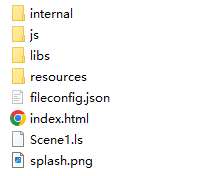
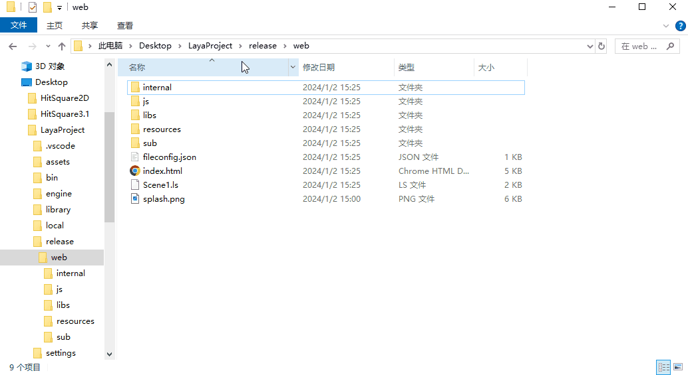

# WebPublish

## 1. Overview

The web publishing function is a very core function. It usually refers to publishing as an HTML5 version and running in the browser environment, webView, and LayaNative APP environment. The project release function is usually used when the project has completed development, or has completed development in stages and is ready to be submitted to the production environment for testing. Since the structure of LayaAir 3.1.x IDE has changed greatly compared with 3.0.x, developers need to pay more attention to panel changes when it comes to IDE Web publishing.

> Before publishing on the Web, you need to perform [General] (../generalSetting/readme.md) settings.

## 2. Publish as a Web game

### 2.1 Select target platform

In the Build and Release panel, select the target platform as Web in the sidebar. As shown in Figure 2-1,

(Figure 2-1)

Click "Build Web" or "Web" in the "Build Other" option to publish the project as a Web project.

`File extension`: When checked, use a safe file extension.

`Compressed texture`: Generally, you need to check "Allow the use of compressed texture format". If not checked, the compression format settings of all images will be ignored.

`Texture source file`: You can uncheck "Always include texture source file". If checked, the source file (png/jpg) will still be packaged even if the image uses a compressed format. The purpose is to fallback to the source file when encountering a system that does not support the compression format.

> Rules for texture formats:
>
> 1. The Web platform and the remote packages of various mini-game platforms will be released in the formats of PC/Android/iOS platforms at the same time;
>
> 2. The WeChat platform will release both Android/iOS formats at the same time;
>
> 3. Other mini game platforms only release Android format.
>
> 4. Special rules follow the two options shown in the picture above.

After publishing, click "View Tasks" to see the published tasks. As shown in Figure 2-2,

(Figure 2-2)

`Open folder`: In the resource file manager, open the file directory published by the project.

`View log`: View the log published by the project.

`Build Again`: Rebuild the web project.

`Run`: Run the published web project locally.

`View QR code`: Generate a QR code. You can connect your mobile phone and PC to the same LAN and scan the code to preview the published Web project.

`Delete Record`: Delete the published record, but the published items will not be deleted.

### 2.2 Directory after release

The directory structure after publishing is shown in Figure 2-3.

(Figure 2-3)

**js directory and libs directory**:

Project code and engine libraries.

**resources directory and Scene.ls**:

Resource file directory and scene files.

**fileconfig.json**：

The file contains some configuration information for the Web project.

## 3. Run the published Web project locally

1. To run the published Web project, you can directly click the run button in Figure 2-2 after publishing to run the published Web project in the browser.

2. If the developer accidentally deletes the release record, he can open the file directory of the project release. In the release directory, use Node.js anywhere to start a local server to run the web project. As shown in the animation 2-4, open the command line cmd in the "web" folder, enter `anywhere`, and then click the Enter key on the keyboard to start a local server.

(Animation 2-4)

